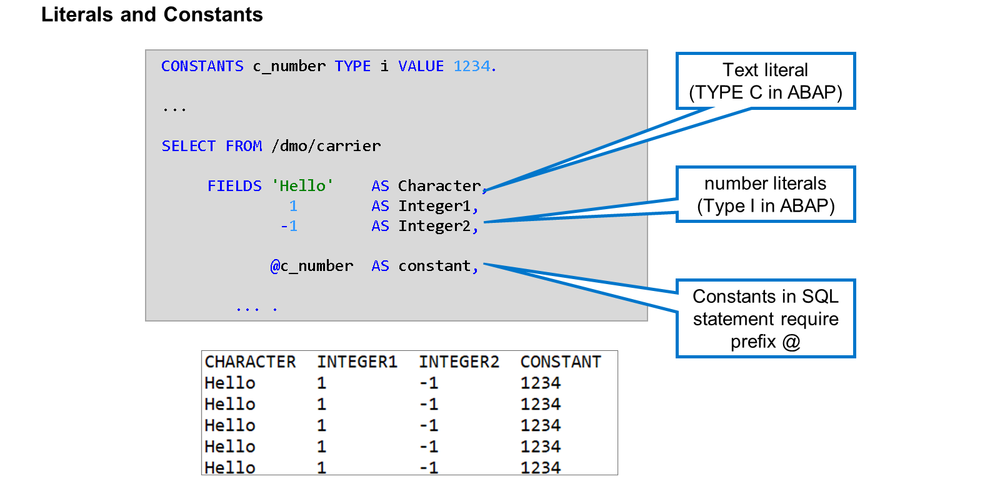
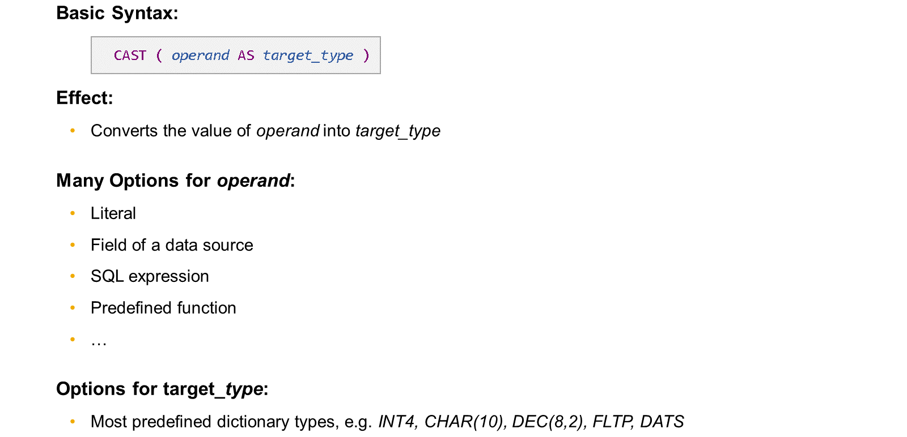
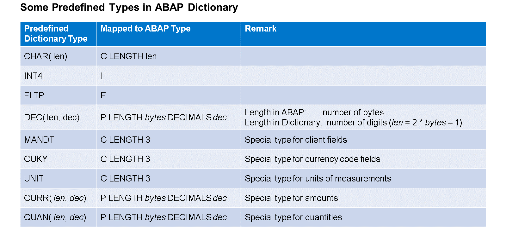
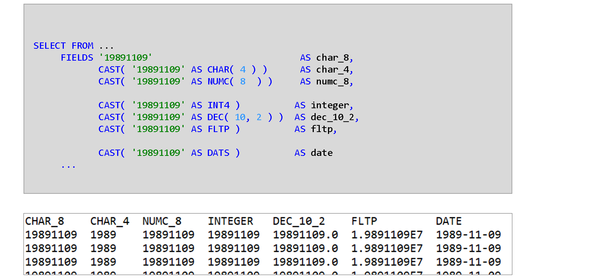
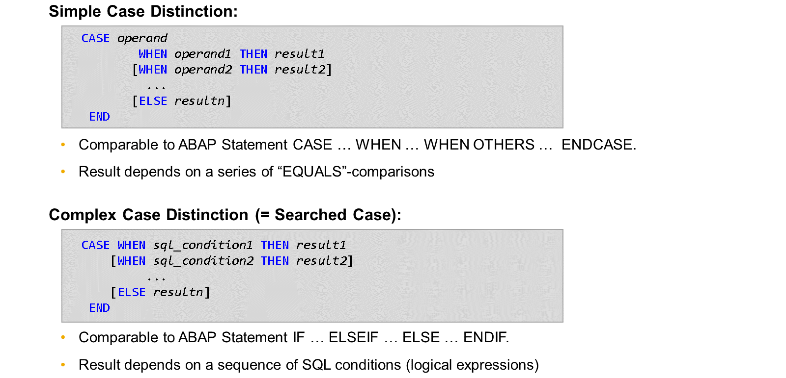
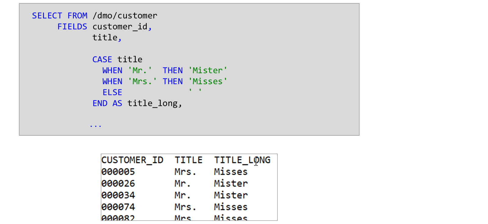

# 🌸 2 [WORKING WITH EXPRESSIONS IN ABAP SQL](https://learning.sap.com/learning-journeys/acquire-core-abap-skills/working-with-expressions-in-abap-sql_aeb5768f-325a-45d0-8f86-97e121d6efb6)

> 🌺 Objectifs
>
> - [ ] Vous serez capable d'utiliser quelques expressions simples dans ABAP SQL

## 🌸 LITERALS

### LITERALS AND CONSTANTS IN ABAPS SQL

Les expressions les plus simples sont des littéraux. Tout comme ABAP, ABAP SQL connaît deux types de littéraux : les littéraux texte, spécifiés entre guillemets, et les littéraux nombres, qui peuvent être des nombres entiers positifs ou négatifs. Le type de littéraux en ABAP SQL est le même qu'en ABAP : les littéraux texte sont de type C et les littéraux nombres de type I.

Dans l'exemple, le premier élément de la liste de champs est un littéral texte, tandis que les deuxième et troisième éléments sont des littéraux numériques, l'un avec une valeur positive et l'autre avec une valeur négative.

> #### 🍧 Note
>
> Les littéraux de chaîne, spécifiés entre guillemets inverses, ne sont pas disponibles en ABAP SQL.

Au lieu d'utiliser directement des littéraux, il est recommandé de définir des constantes et de les utiliser dans votre instruction ABAP SQL. Cela améliore la lisibilité et vous donne accès à davantage de types que `C` et `I`. Lorsque vous utilisez une constante dans une instruction ABAP SQL, le préfixe `@` est obligatoire.

Dans l'exemple, le quatrième élément de la liste est une constante nommée `C_NUMBER`, de type `I` et de valeur `1234`.

## 🌸 THE CAST EXPRESSION

Contrairement à ABAP lui-même, ABAP SQL ne reconnaît pas les conversions de type implicites. L'expression `CAST` de CDS permet d'implémenter explicitement les conversions de type.

L'opérande d'une conversion de type ne peut pas être uniquement un littéral ou un champ de la source de données. De nombreuses autres expressions sont possibles, comme des expressions arithmétiques, des fonctions prédéfinies, etc.

Vous pouvez spécifier la plupart des types de dictionnaires prédéfinis comme types cibles, par exemple `INT4`, `CHAR`, `DEC`, `FLTP`, `DATS`, etc. En ABAP SQL, il n'est pas possible d'utiliser des éléments de données de dictionnaire comme types cibles.

> #### 🍧 Note
>
> La combinaison des types source et cible est soumise à des restrictions. Certaines combinaisons ne sont pas prises en charge. D'autres fonctionnent avec des limitations et peuvent entraîner des erreurs d'exécution. Une matrice détaillée est disponible dans la documentation du langage ABAP.

### PREDEFINED TYPES IN ABAP DICTIONARY

Lors de la définition de types dans le dictionnaire ABAP, par exemple un élément de données, un ensemble spécifique de types prédéfinis est utilisé. Lorsqu'un tel type de dictionnaire est utilisé pour typer un objet de données en ABAP, il est mappé à un type ABAP prédéfini spécifique. Par exemple, le type de dictionnaire `CHAR` est mappé au type ABAP `C`, le type `INT` au type `I`, le type `FLTP` au type `F`, le type `DEC` au type `P`, etc.

Certains types de dictionnaires n'ont pas d'équivalent direct en ABAP. Le type de dictionnaire `MANDT`, par exemple, est techniquement identique au type `CHAR(3)`, mais possède une signification particulière lorsqu'il est utilisé pour les champs de table de base de données. En ABAP, lorsque cette signification particulière n'est pas requise, le type `MANDT` est mappé au type `C LENGTH 3`. De même, les types de dictionnaires `UNIT` et `CUKY` sont mappés au type ABAP `C`, et `QUAN` et `CURR` au type ABAP `P`.

La longueur des types de dictionnaires `DEC`, `QUAN` et `CURR` est spécifiée en nombre de chiffres. La longueur du type ABAP `P` est spécifiée en nombre d'octets. `n` octets correspondent à `2 *n - 1 chiffres`.

### EXAMPLE OF CAST EXPRESSIONS

Dans cet exemple, le même littéral de texte est converti vers différents types cibles compatibles. Veuillez noter les points suivants :

- La conversion vers les types numériques (`INT4`, `DEC`, `FLTP`) entraîne des erreurs d'exécution si le littéral source contient des caractères non numériques.

- La conversion vers le type `DATS` ne vérifie pas si les 8 chiffres constituent une date valide.

- Le type `CHAR(4)` est un type compatible, mais la conversion entraîne une perte d'informations.

> #### 🍧 Note
>
> L'affichage d'une seule décimale dans la colonne `DEC_10_2` est un artefact de l'interface utilisateur.

## 🌸 CASE DISTINCTIONS

ABAP SQL propose des distinctions de `CASE` utilisables dans la liste d'éléments d'une instruction SELECT et comme opérandes pour d'autres expressions.

Une distinction de `CASE` renvoie une seule valeur. Cette valeur dépend d'une série de conditions. Une distinction de `CASE` commence toujours par le mot clé `CASE` et se termine par le mot clé `END`. Le reste dépend du type de distinction.

Une `Simple Case Distinction` correspond à la structure de contrôle ABAP `CASE … ENDCASE`. Elle compare la valeur d'un opérande (opérande dans l'exemple) à une série d'autres opérandes. Vous pouvez utiliser n'importe quelle expression SQL comme opérande, par exemple des champs de table, des littéraux, des constantes, des variables ABAP, des expressions SQL, etc.

Une `Complex Case Distinction CASE`, également appelée cas recherché, correspond à la structure de contrôle ABAP `IF … ENDIF` avec ses parties facultatives `ELSEIF` et `ELSE`. Elle évalue les conditions SQL après les mots clés `WHEN` dans la séquence donnée. La première condition vérifiée détermine le résultat de l'expression `CASE`. Si aucune des conditions n'est vraie, le résultat est déterminé par l'addition `ELSE`.

#### 💮 **Simple Case Distinction** :

Le résultat dépend des valeurs de plusieurs opérandes. La distinction de `CASE` simple est comparable à l'instruction `CASE` en ABAP.

#### 💮 **Complex Case Distinction** :

Également appelée distinction de recherche. Le résultat dépend d'une séquence d'expressions logiques. La distinction de `CASE` complexe est comparable à l'instruction `IF` en ABAP.

Cet exemple, pour un cas simple, utilise le contenu du champ `TITLE` pour renvoyer un texte plus long sous la forme d'un champ `TITLE_LONG`. Lorsque `TITLE` contient la valeur `M.`, la colonne `TITLE_LONG` contient la valeur `Mister`. Lorsque `TITLE` contient `Mrs`, la colonne `TITLE_LONG` contient `Misses`. Pour toute autre valeur de `TITLE`, `TITLE_LONG` contient des espaces.

Cet exemple, pour un cas complexe, utilise une série de conditions SQL pour déterminer la valeur d'une nouvelle colonne `BOOKING_STATE`.

Si la valeur de la colonne `SEATS_OCCUPIED` est inférieure à celle de la colonne `SEATS_MAX`, la nouvelle colonne renvoie un texte indiquant que des places supplémentaires sont disponibles. Si ce n'est pas le cas, la condition suivante est vérifiée, et ainsi de suite. Si aucune des conditions n'est remplie, la colonne `BOOKING_STATE` contient la valeur spécifiée après le mot-clé `ELSE`.
