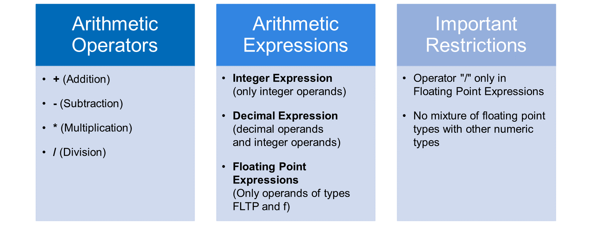
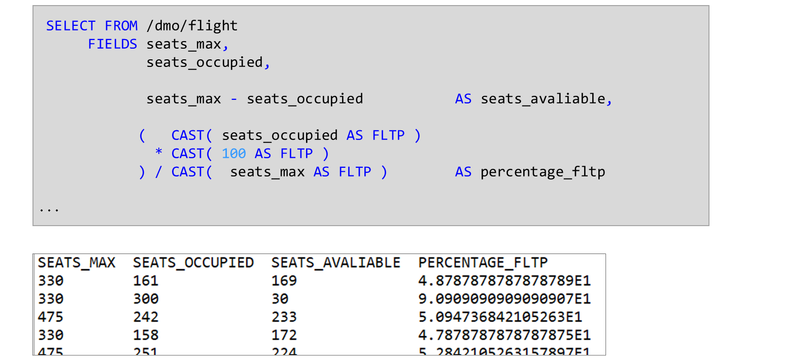
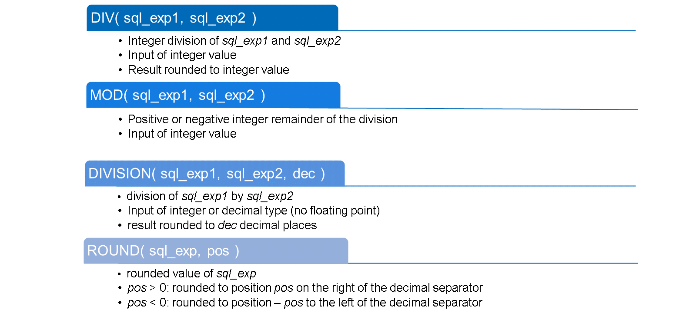
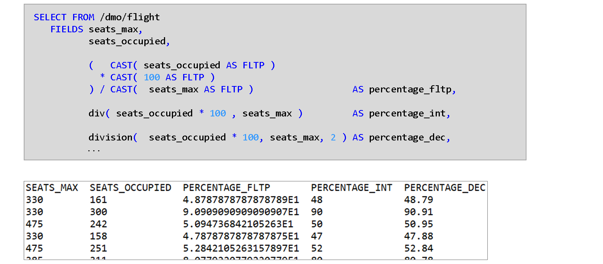
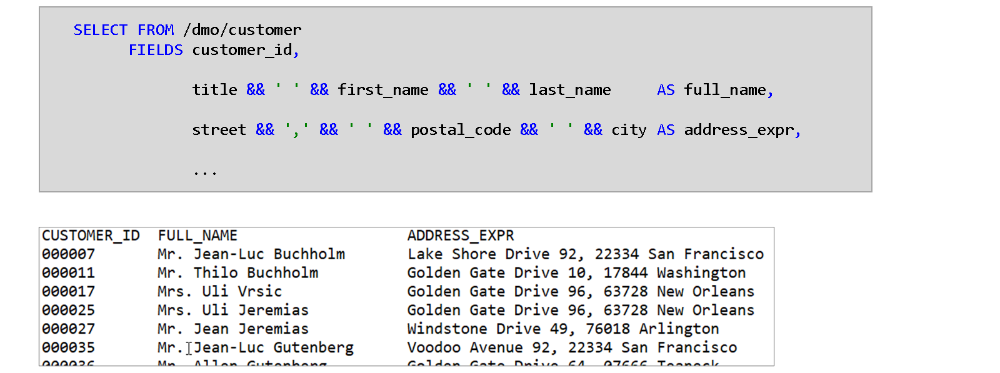
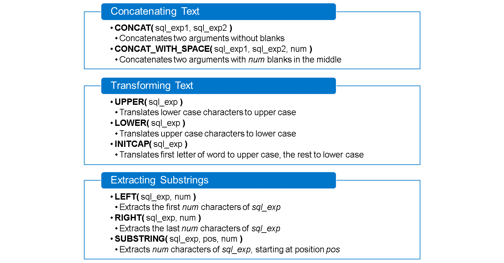
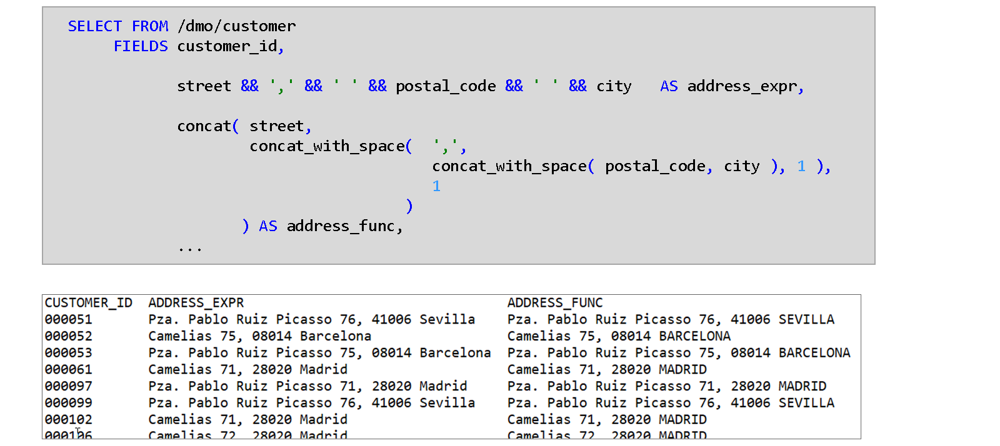
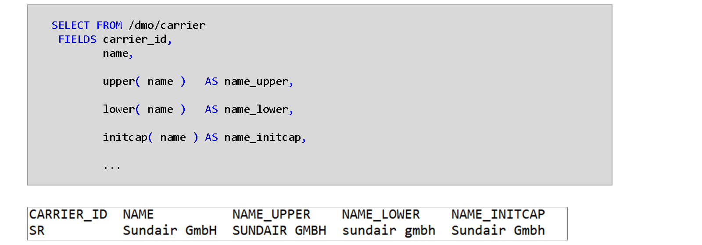
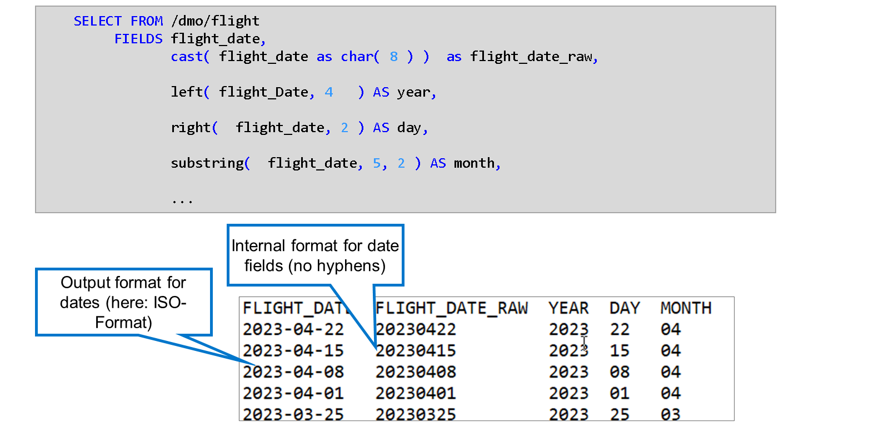

# 🌸 3 [PERFORMING CALCULATIONS AND STRING PROCESSING IN ABAP SQL](https://learning.sap.com/learning-journeys/acquire-core-abap-skills/performing-calculations-and-string-processing-in-abap-sql_a158cbc9-7ada-422d-8759-eadb13078a13)

> 🌺 Objectifs
>
> - [ ] Effectuer des calculs dans la base de données
>
> - [ ] Traitement de chaînes dans la base de données

## 🌸 ARITHMETIC EXPRESSIONS

En ABAP SQL, les expressions arithmétiques peuvent être utilisées comme éléments de la liste de champs.

ABAP SQL prend en charge les quatre opérateurs de base, les parenthèses et trois arithmétiques différentes (entier, décimal et virgule flottante). La plage de valeurs et la précision des résultats intermédiaires dépendent fortement de l'arithmétique utilisée. L'arithmétique est dérivée des opérandes utilisés dans l'expression.

L'arithmétique est dérivée des opérandes utilisés dans l'expression :

- Si l'expression ne contient que des opérandes entiers, elle est une expression entière et le résultat est également de type entier.

- Si l'expression contient un opérande de type décimal (types de dictionnaire DEC, QUAN, CURR, type ABAP p), le résultat de l'expression est de type DEC.

- Si tous les opérandes sont de type binaire à virgule flottante (type de dictionnaire FLTP, type ABAP f), l'expression est une expression à virgule flottante et le résultat est de type FLTP.

Les restrictions importantes suivantes s'appliquent :

- L'opérateur de division (/) n'est autorisé que dans les expressions à virgule flottante.

- Il est impossible d'utiliser des nombres à virgule flottante et d'autres types numériques dans la même expression.

> #### 🍧 Hint
>
> Vous pouvez utiliser n'importe quel opérande numérique dans une expression à virgule flottante en convertissant le type en FLTP à l'aide de CAST().

### EXAMPLE: SOME ARITHMETIC EXPRESSIONS IN ABAP SQL

Cet exemple montre deux exemples d'expressions arithmétiques dans la liste de champs d'une instruction ABAP SQL SELECT.

Le champ `SEATS_AVAILABLE` est calculé en soustrayant le nombre de sièges occupés (champ de table `SEATS_OCCUPIED`) du nombre total de sièges sur ce vol (champ de table `SEATS_MAX`). Les deux opérandes étant de type entier, le résultat de cette expression est également un entier.

Le champ `PERCENTAGE_FLTP` calcule le pourcentage de sièges occupés sous forme d'un nombre compris entre 0 et 100. Pour cela, il faut multiplier le nombre de sièges occupés par 100 et diviser le résultat par le nombre total de sièges. L'opérateur de division étant uniquement disponible dans les expressions à virgule flottante, tous les opérandes doivent être convertis en type `FLTP`. Par conséquent, le résultat est également de type `FLTP`, affiché en notation scientifique par défaut.

> #### 🍧 Note
>
> Le littéral numérique 100 est de type entier et doit donc également être converti en type FLTP. Vous pouvez également définir une constante de type f avec la valeur 100.0 et l'utiliser dans l'expression SQL.

## 🌸 NUMERIC FUNCTIONS

ABAP SQL propose diverses fonctions intégrées pour compléter les calculs par des expressions arithmétiques. La liste complète est disponible dans la documentation du langage ABAP.

Voici quelques fonctions SQL numériques importantes :

- La fonction `DIV( )` effectue une division entière (sans reste) et n'accepte que des valeurs entières en entrée.

- La fonction `MOD( )` renvoie le reste entier d'une telle division.

- La fonction `DIVISION( )` autorise toute saisie numérique, à l'exception des valeurs à virgule flottante. La précision du résultat décimal est spécifiée par le troisième paramètre de la fonction.

- La fonction `ROUND( )` permet d'arrondir explicitement une valeur numérique à une valeur donnée.

### EXAMPLE: USE OF NUMERIC FUNCTIONS IN ABAP SQL

Cet exemple illustre l'utilisation des fonctions numériques en ABAP SQL. La fonction `DIV( )` permet de calculer le pourcentage sous forme d'entier, tandis que la fonction `DIVISION( )` renvoie le résultat sous forme décimale.

Notez que `DIV( )` coupe le reste de sorte que 48,78787… devient 48. `DIVISION( )`, d'autre part, utilise l'arrondi commercial pour arrondir au nombre spécifié de décimales de sorte que 48,787878… devient 48,79 au lieu de 48,78.

## 🌸 STRING PROCESSING

En ABAP, l'opérateur `&&` permet de combiner des arguments de type char en une seule longue chaîne. Vous pouvez également utiliser cet opérateur en ABAP SQL pour effectuer les opérations de concaténation déjà présentes dans la base de données. Dans le premier exemple, le titre, le prénom et le nom d'un client sont combinés pour former son nom complet. Dans le second exemple, la rue, le code postal et le nom de la ville sont combinés pour former l'adresse du client. Comme `&&` n'ajoute aucun séparateur, les espaces doivent être ajoutés manuellement.

## 🌸 STRING PROCESSING FUNCTIONS

ABAP SQL propose également de nombreuses fonctions intégrées pour le traitement des chaînes de caractères. La liste complète est disponible dans la documentation du langage ABAP.

Voici quelques fonctions de chaîne importantes d'ABAP SQL :

- La fonction `CONCAT( )` concatène deux chaînes de caractères (sans espaces).

- La fonction `CONCAT_WITH_SPACE( )` effectue la même opération, mais insère un nombre spécifié d'espaces au milieu.

- Les fonctions `UPPER( )` et `LOWER( )` convertissent un argument en majuscules ou minuscules.

- La fonction `INITCAP( )` fonctionne comme `LOWER( )` mais convertit la première lettre de chaque mot en majuscule.

- La fonction `LEFT( )` extrait les n premiers caractères d'un argument donné. `RIGHT( )` effectue la même opération, mais commence par la droite.

- La fonction `SUBSTRING( )` extrait un nombre donné de caractères, à partir d'une position donnée.

L'exemple construit l'adresse d'un client en concaténant la rue, le code postal et la ville. Il le fait de deux manières : d'une part, avec l'opérateur de concaténation &&, et d'autre part, avec des fonctions SQL imbriquées.

> #### 🍧 Note
>
> L'opérateur && ignore les espaces de fin. Il ne conserve qu'un espace dans le littéral « ».

L'exemple construit l'adresse d'un client en concaténant la rue, le code postal et la ville. Il le fait de deux manières : d'une part, avec l'opérateur de concaténation `&&`, et d'autre part, avec des fonctions SQL imbriquées.

> #### 🍧 Note
>
> L'opérateur && ignore les espaces de fin. Il ne conserve qu'un espace dans le littéral « ».

Cet exemple illustre l'effet des fonctions `UPPER( )`, `LOWER( )` et `INITCAP( )`. Notez la différence de transformation de `GmbH` dans le nom de l'opérateur.

Cet exemple illustre l'utilisation de fonctions de traitement de chaînes pour extraire l'année, le mois et le jour d'un champ de date.

> #### 🍧 Note
>
> Gardez à l'esprit que le format interne des champs de date est AAAAMMJJ. Les tirets de la première colonne appartiennent au format de sortie des champs de date (format ISO). Ils ne sont pas présents dans le format interne. Ce dernier devient visible après conversion du champ de date en type CHAR(8). Vous pouvez le voir dans la deuxième colonne.
