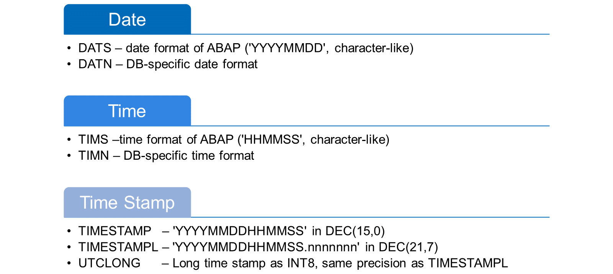
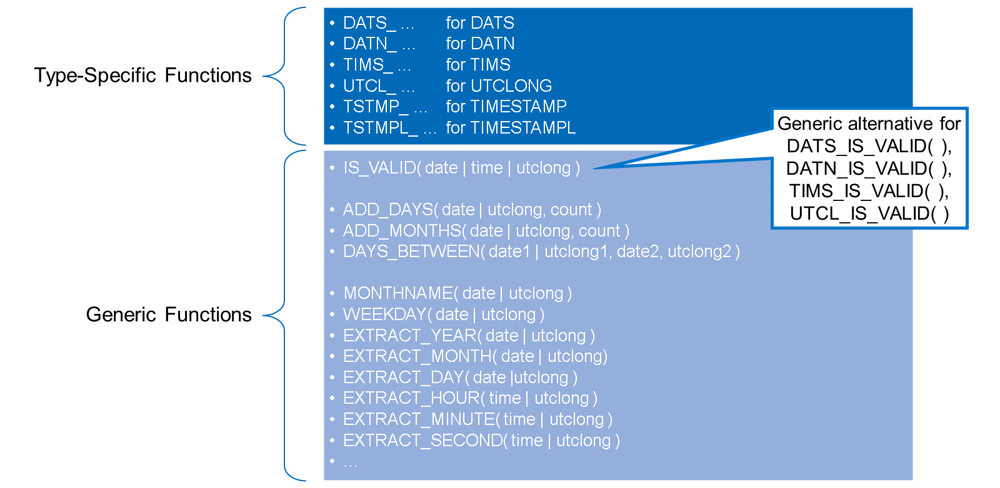
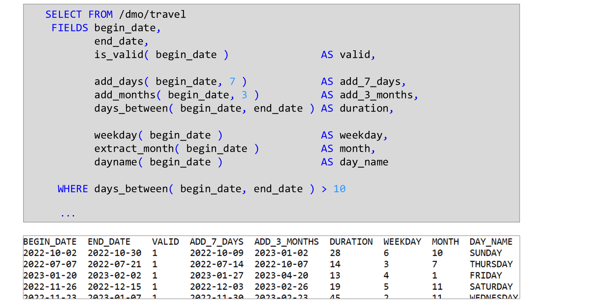
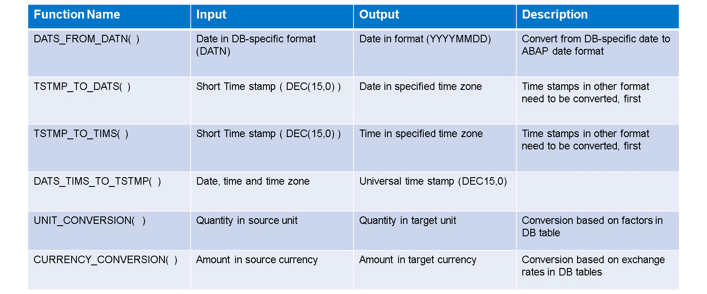
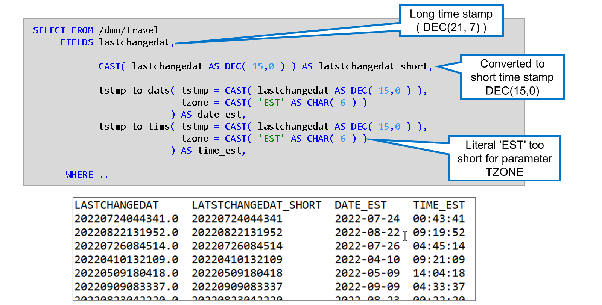
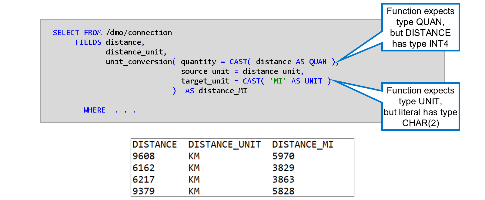
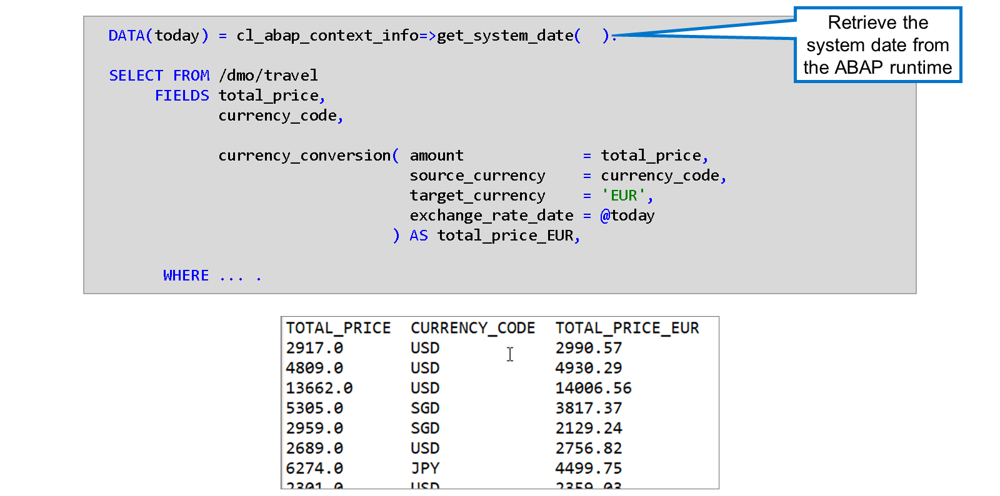

# 🌸 4 [USING SPECIAL BUILT-IN FUNCTIONS IN ABAP SQL](https://learning.sap.com/learning-journeys/acquire-core-abap-skills/using-special-built-in-functions-in-abap-sql_b9611c6a-756c-43b9-a2ff-0db681000e7d)

> 🌺 Objectifs
>
> - [ ] Traiter les dates, heures et horodatages dans la base de données
>
> - [ ] Utiliser les fonctions de conversion intégrées

## 🌸 FUNCTIONS FOR PROCESSING DATES TIMES AND TIMESTAMPS

Si vous souhaitez stocker des informations de date dans un champ de base de données, vous avez le choix entre deux types :

- `DATS` stocke la date telle qu'elle est traitée en ABAP. Cela signifie qu'elle est stockée sous forme de caractères de longueur 8 au format « AAAAMMJJ ».

- `DATN` stocke les informations dans le type de date de la base de données. Lors de la lecture des informations de la base de données avec ABAP SQL, elles sont automatiquement reconverties au format à 8 chiffres.

La même différence existe entre les types `TIMS` et `TIMN`.

Si vous souhaitez stocker des informations d'horodatage dans un champ de base de données, vous avez le choix entre trois types :

- `TIMESTAMP` stocke les informations sous forme de nombre sans décimales, où les chiffres représentent l'année, le mois, le jour, les heures, les minutes et les secondes.

- `TIMESTAMPL` est identique à `TIMESTAMP`, mais stocke en plus jusqu'à 7 décimales, ce qui correspond à une précision de 100 nanosecondes.

- `UTCLONG` a la même précision que `TIMESTAMPL` mais stocke les informations sous la forme d'un entier d'une longueur de 8 octets.

### SQL FUNCTIONS FOR DATE TIME AND TIMESTAMP

ABAP SQL offre une grande variété de fonctions intégrées pour les informations de date, d'heure et d'horodatage. Il existe des fonctions permettant de vérifier la validité du contenu d'un champ, des fonctions de calcul ou des fonctions permettant d'extraire certaines informations d'un argument d'entrée. Certaines de ces fonctions sont répertoriées ici. La liste complète est disponible dans la documentation ABAP.

Certaines fonctions sont spécifiques à un type. Leur nom commence par un préfixe identifiant le type d'entrée requis. Les fonctions commençant par `DATS_` nécessitent une entrée de type `DATS`, les fonctions commençant par `DATN_` nécessitent une entrée de type `DATN`, etc.

D'autres fonctions sont génériques. Elles peuvent gérer des entrées de différents types. La fonction `IS_VALID`, par exemple, permet de vérifier la validité d'une date, d'un point dans le temps ou d'un horodatage. Elle accepte les formats de date (`DATS` et `DATN`) et d'heure (`TIMS` et `TIMN`). Pour les horodatages, cependant, seul le type `UTCLONG` est pris en charge.

Dans certains cas, vous pouvez choisir entre une fonction spécifique à un type et une fonction générique. Pour un champ de type `DATS`, par exemple, vous pouvez utiliser `DATS_IS_VALID()` ou `IS_VALID()`. Privilégiez les fonctions génériques plus récentes.

> #### 🍧 Note
>
> Les fonctions génériques ne prennent pas en charge les horodatages de type TIMESTAMP et TIMESTAMPL pour le moment. Pour ces types, vous devez utiliser les fonctions spécifiques au type commençant par TSTMP\_.

Voici un exemple d'utilisation de fonctions génériques avec des informations de type date. Comme la plupart des expressions SQL, vous pouvez également utiliser les fonctions dans la clause WHERE. Ici, nous limitons la sélection aux voyages de plus de 10 jours.

> #### 🍧 Note
>
> La fonction IS_VALID( ) n'est pas une fonction booléenne. Elle renvoie la valeur entière 1 pour vrai et 0 pour faux.

## 🌸 CONVERSION FUNCTIONS

### SOME ABAP SQL CONVERSION FUNCTIONS

Toutes les conversions de types ne peuvent pas être gérées par l'expression `CAST`. Pour certaines conversions, ABAP SQL propose des fonctions de conversion spécifiques, comme illustré dans la figure ci-dessous.

La fonction SQL `DATS_FROM_DATN`, par exemple, convertit `DATN` (format de date spécifique à la base de données) en `DATS` (format de date char-like spécifique à ABAP). La fonction SQL `DATS_TO_DATN( )` effectue la conversion inverse.

Les fonctions `TMSTMP_TO_DATS( )` et `TMSTMP_TO_TIMS( )` convertissent respectivement un horodatage en champ de date et en champ d'heure. Notez que ces fonctions ne sont disponibles que pour les horodatages au format technique `DEC( 15, 0)`. Les autres formats d'horodatage doivent être convertis avant de pouvoir servir d'entrée à ces fonctions. La fonction `DATS_TIMS_TO_TMSTMP` combine une date et une heure en un seul horodatage.

Un groupe spécifique de fonctions de conversion permet d'effectuer des conversions entre différentes unités de mesure et devises. La fonction `UNIT_CONVERSION( )` convertit une quantité d'une unité source en une unité cible, par exemple une distance en kilomètres en miles. La fonction `CURRENCY_CONVERSION( )` convertit un montant d'une devise en un montant équivalent dans une autre devise à une date de reporting spécifique.

> #### 🍧 Note
>
> Pour que CURRENCY_CONVERSION( ) fonctionne correctement, les taux de change temporels doivent être disponibles dans la base de données de votre système. Consultez la documentation du système SAP pour plus de détails.

### EXAMPLE: SQL FUNCTION FOR TIMESTAMP CONVERSION

Cet exemple lit un horodatage de la table `/DMO/TRAVEL` (champ `LASTCHANGEDAT`) et le convertit en date et heure dans le fuseau horaire `EST`.

L'horodatage est stocké dans la table de base de données sous le type `TIMESTAMPL`, c'est-à-dire avec 7 décimales. Il doit donc être converti en un horodatage court sans décimales pour être compatible avec le paramètre d'entrée `TSTMP` des fonctions SQL. Le littéral `EST` doit également être converti pour être compatible avec le paramètre d'entrée `TZONE`.

> #### 🍧 Note
>
> Il existe un décalage horaire de 4 heures entre le temps universel et l'heure normale de l'Est.

### EXAMPLE: SQL FUNCTION FOR UNIT CONVERSION

Le champ de table `DISTANCE` étant défini avec le type `INT4` au lieu du type `QUAN`, il doit être converti pour correspondre au type du paramètre d'entrée `QUANTITY`.

Le littéral `MI` doit également être converti, car il est de type `CHAR(2)` et non de type `UNIT`.

> #### 🍧 Note
>
> L'exemple ne fournit que les trois paramètres obligatoires de UNIT_CONVERSION( ). La liste des paramètres facultatifs et leur signification sont disponibles dans la documentation ABAP.

Dans cet exemple, le prix total d'un voyage est converti en euro, la devise cible. La fonction `CURRENCY_CONVERSION` est fournie avec le montant (champ `TOTAL_PRICE`), la devise source (champ `CURRENCY_CODE`), la devise cible (littéralement `EUR`) et la date du taux de change (variable ABAP `TODAY`). Avant l'instruction `SELECT`, la variable `TODAY` est renseignée avec la date système lors d'un appel de méthode.

> #### 🍧 Note
>
> L'exemple ne fournit que les quatre paramètres obligatoires de CURRENCY_CONVERSION(). La liste des paramètres facultatifs et leur signification sont disponibles dans la documentation ABAP.
