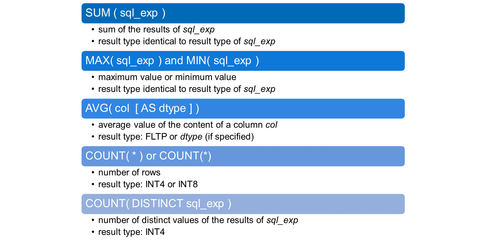
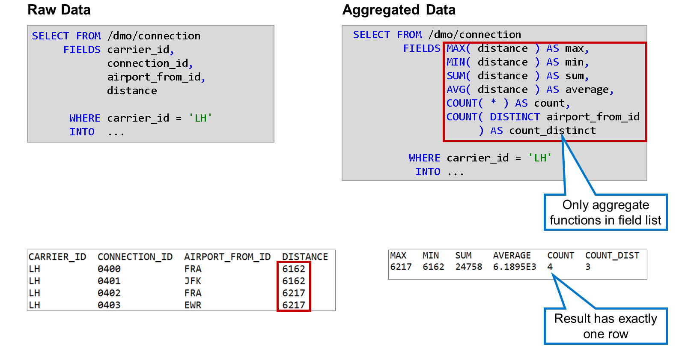
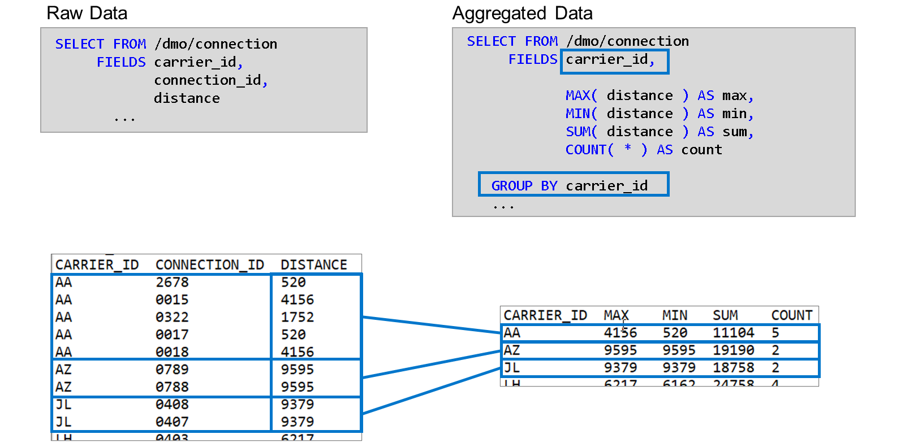

# 🌸 5 [SORTING AND CONDENSING DATA SETS IN ABAP SQL](https://learning.sap.com/learning-journeys/acquire-core-abap-skills/sorting-and-condensing-data-sets-in-abap-sql_cd074ff4-ebc9-4b68-8708-7fa6043bf34c)

> 🌺 Objectifs
>
> - [ ] Demander des ensembles de résultats triés à partir de la base de données
>
> - [ ] Récupérer des ensembles de données condensés et agrégés

## 🌸 SORTED RESULT SETS

Dans cette vidéo, vous verrez comment trier l'ensemble de résultats d'une instruction `SELECT`.

[Référence - Link Vidéo](https://learning.sap.com/learning-journeys/acquire-core-abap-skills/sorting-and-condensing-data-sets-in-abap-sql_cd074ff4-ebc9-4b68-8708-7fa6043bf34c)

## 🌸 UNIQUE RESULT SETS

L'ajout `DISTINCT` permet de supprimer les doublons du résultat d'une instruction `SELECT`. L'ajout doit être placé juste avant le premier élément de la liste de champs.

Regardez cette vidéo pour savoir comment procéder.

[Référence - Link Vidéo](https://learning.sap.com/learning-journeys/acquire-core-abap-skills/sorting-and-condensing-data-sets-in-abap-sql_cd074ff4-ebc9-4b68-8708-7fa6043bf34c)

## 🌸 AGGREGATE FUNCTIONS

Une expression d'agrégation calcule une valeur unique à partir d'une expression SQL (sql_exp) en appelant une fonction d'agrégation pour plusieurs lignes d'un ensemble de résultats.

Voici quelques fonctions d'agrégation importantes :

- `SUM( sql_exp )`

  Détermine la somme des résultats de l'expression SQL sql_exp dans un ensemble de lignes. Le type de données de l'ensemble de résultats correspond au type de l'expression SQL. Le type de résultat de l'expression SQL sql_exp doit être numérique.

- `MIN( sql_exp )` et `MAX( sql_exp )`

  Détermine la valeur maximale ou minimale des résultats de l'expression SQL sql_exp dans un ensemble de lignes. Le type de données du résultat correspond au type de résultat de l'expression SQL.

  Le résultat de l'expression SQL sql_exp doit être numérique. Si une seule colonne est spécifiée pour l'expression, celle-ci peut contenir n'importe quel type de données.

- `AVG( col [ AS dtype ] )`

  Détermine la valeur moyenne du contenu d'une colonne col dans un ensemble de lignes. Par défaut, le type de résultat est FLTP. L'option AS dtype permet de définir explicitement le type de résultat. Le type de données de la colonne doit être numérique.

- `COUNT( * )` ou `COUNT(*)`

  Les deux orthographes ont la même signification et produisent le nombre de lignes d'un ensemble de lignes. Dans la plupart des cas, le type de résultat est INT4. Le type de résultat est INT8 si `COUNT( * )` ou `COUNT(*)` est le seul élément de la liste de champs.

- `COUNT( DISTINCT sql_exp )`

Détermine le nombre de valeurs distinctes des résultats de l'expression SQL sql_exp dans un ensemble de lignes. Le type de données du résultat est INT4.

### ONLY AGGREGATE FUNCTIONS IN FIELD LIST

Si la liste de champs d'une instruction SELECT ne contient que des fonctions d'agrégation, le jeu de résultats est toujours constitué d'une seule ligne. Il en va de même si l'agrégation repose sur un jeu de données vide.

Dans notre exemple, l'instruction `SELECT` de gauche illustre l'ensemble de données sur lequel reposent les agrégations de l'instruction `SELECT` de droite.

Vous pouvez constater que la valeur maximale de la colonne `DISTANCE` est de 6 217, tandis que la valeur minimale est de 6 162. Le nombre total de lignes est de 4 et la colonne `AIRPORT_FROM_ID` contient 3 valeurs distinctes (la valeur « FRA » apparaît deux fois).

## 🌸 THE GROUP BY ADDITION

Si la liste de champs d'une instruction `SELECT` contient un mélange de fonctions d'agrégation et d'autres éléments, tels que des colonnes, des expressions, etc., la syntaxe SQL requiert une clause `GROUP BY`. Cette clause doit lister toutes les colonnes figurant dans la liste de champs hors agrégation.

Dans l'instruction `SELECT` de droite, deux colonnes sont utilisées : `CARRIER_ID` et `DISTANCE`. La colonne `DISTANCE` n'apparaît qu'en entrée pour les fonctions d'agrégation et n'est donc pas requise après `GROUP BY`. En revanche, la colonne `CARRIER_ID` est utilisée en dehors des fonctions d'agrégation et doit donc être listée après `GROUP BY`.

L'effet de `GROUP BY` est visible dans le résultat de l'instruction SELECT. L'ensemble de données sur lequel l'agrégation est effectuée est divisé en sous-ensembles (groupes) ayant les mêmes valeurs dans les champs `GROUP BY`. Le résultat final contient une ligne pour chaque groupe. Les expressions d'agrégation sont évaluées séparément pour chaque groupe.

Par exemple, la ligne avec `CARRIER_ID` = `'AA'` contient `COUNT` = `5` et `MAX` = `4156` car le sous-ensemble avec `CARRIER_ID` = `'AA'` contient 5 lignes et dans ce sous-ensemble, la valeur maximale pour la distance est 4156.
