# 🌸 1 [PROCESSING THE CONTENTS OF INTERNAL TABLES](https://learning.sap.com/learning-journeys/acquire-core-abap-skills/processing-the-contents-of-internal-tables_b69864af-3b88-4887-83c8-7ac6701add94?userlogin=true)

> 🌺 Objectifs
>
> - [ ] Vous pourrez traiter le contenu d'une table interne

## 🌸 THE SORT STATEMENT

Dans une table interne standard, le contenu n'est pas trié. Les nouvelles entrées ajoutées à la table à l'aide de l'instruction `APPEND` sont ajoutées à la fin de la table.

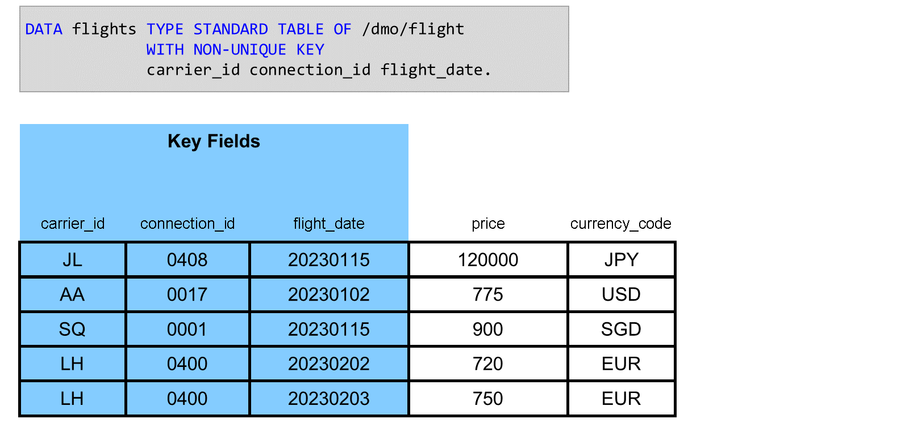

### SORTING A STANDARD INTERNAL TABLE

Dans cette vidéo, vous verrez comment trier une table par sa clé, par n'importe quel champ et dans un ordre croissant et décroissant.

[Référence - Link Vidéo](https://learning.sap.com/learning-journeys/acquire-core-abap-skills/processing-the-contents-of-internal-tables_b69864af-3b88-4887-83c8-7ac6701add94?userlogin=true)

### DELETION OF DUPLICATE RECORDS

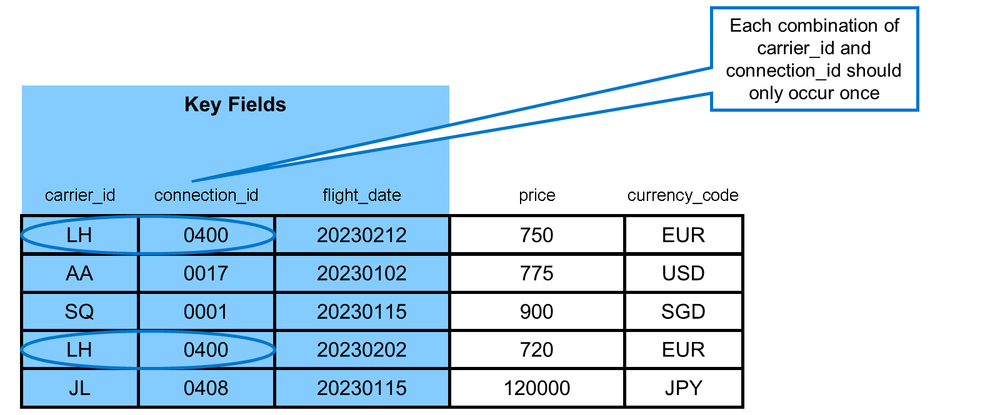

Il est parfois nécessaire de supprimer les doublons d'une table interne. Par exemple, dans cet exemple, chaque combinaison de `carrier_id` et `connection_id` ne doit apparaître qu'une seule fois dans la table.

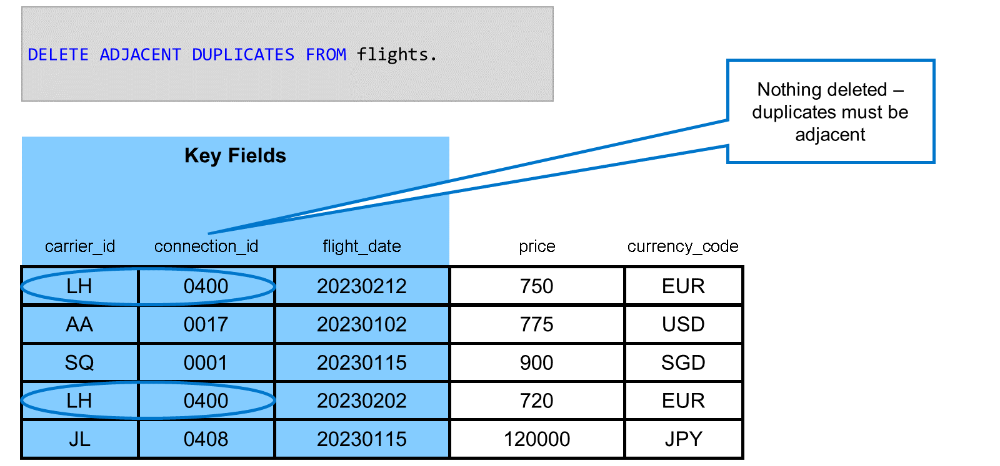

Vous pouvez utiliser l'instruction `DELETE ADJACENT DUPLICATES` pour supprimer les doublons d'une table interne. Cependant, cette instruction ne fonctionne que si les entrées sont adjacentes, c'est-à-dire les unes à côté des autres.

### SORT THE INTERNAL TABLE FIRST

Avant d'utiliser l'instruction `DELETE ADJACENT DUPLICATES`, vous devez trier la table interne en fonction des colonnes que vous souhaitez filtrer pour les valeurs en double, dans ce cas, `xz` `carrier_id` et `connection_id`.

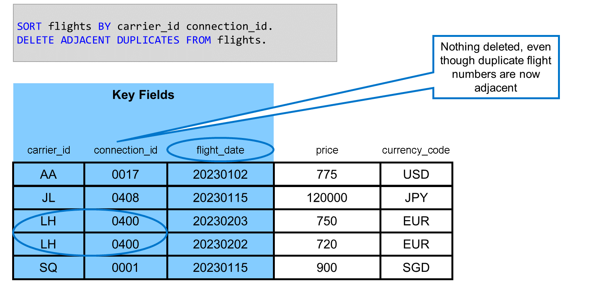

Cependant, même si les numéros de vol en double sont désormais côte à côte, l'instruction `DELETE ADJACENT FIELDS` sous cette forme ne supprime rien. En effet, dans sa forme de base, l'instruction prend en compte tous les champs clés de la table pour identifier les doublons. Or, comme les deux connexions `LH 0400` ont des valeurs de date de vol différentes, elles ne sont pas comptabilisées comme des doublons.

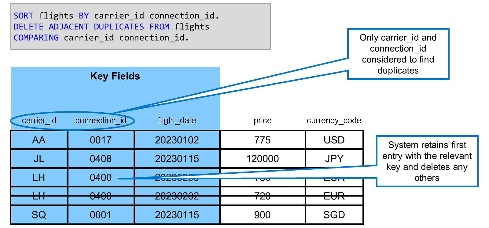

Pour supprimer des entrées ayant la même combinaison de champs `carrier_id` et `connection_id`, même si leurs valeurs `flight_date` sont différentes, vous devez utiliser l'option `COMPARING` de l'instruction `DELETE ADJACENT DUPLICATES`. En utilisant `COMPARING carrier_id` et `connection_id` dans l'instruction, vous indiquez au système de ne prendre en compte que ces champs lors de l'identification des doublons.

Vous pouvez spécifier n'importe quelle combinaison de champs clés et non clés dans l'option `COMPARING`, mais vous devez d'abord trier la table selon les mêmes champs.

Il existe également l'option `COMPARING ALL FIELDS`. Si vous l'utilisez, la ligne entière de la table de deux entrées doit être identique pour que le système puisse identifier un doublon.

### TABLE COMPREHENSIONS

Vous aurez souvent besoin de remplir une table interne avec des valeurs lues dans une autre table interne. Parfois, il s'agit simplement de copier des données d'une table vers une autre. D'autres fois, vous devrez lire des données de plusieurs tables sources pour remplir votre table cible et éventuellement utiliser des expressions pour calculer des valeurs.

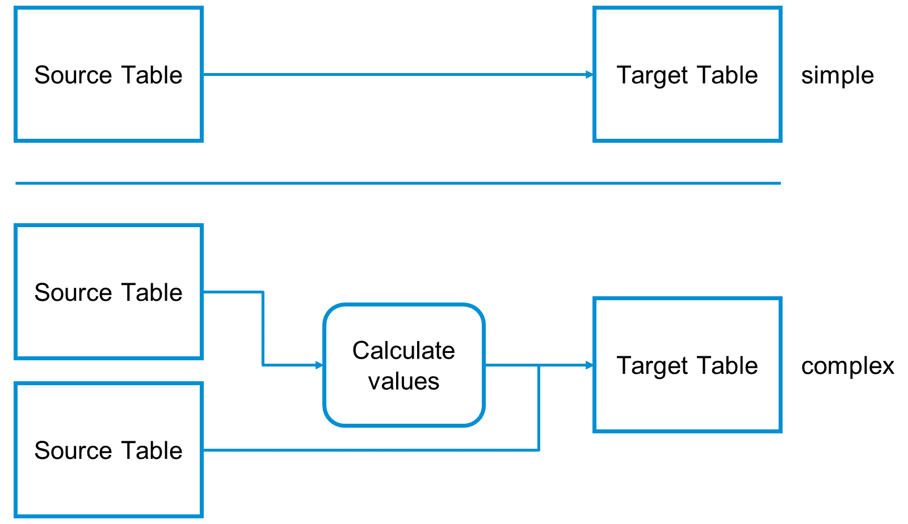

ABAP permet d'effectuer ces tâches. Pour copier simplement des données d'une table vers une autre, vous pouvez utiliser l'expression `CORRESPONDING #( )`. Pour des opérations plus complexes, vous pouvez utiliser une compréhension de table.

Pour copier des données entre des champs portant le même nom dans deux tables internes, utilisez l'opérateur `CORRESPONDING`. Son fonctionnement est similaire à celui de `CORRESPONDING` pour les structures : pour chaque ligne de la table interne source, le système crée une nouvelle ligne dans la table interne cible et copie les données entre les champs portant le même nom. Les champs source pour lesquels il n'existe aucun champ portant le même nom dans la table cible ne sont pas copiés. Les champs cibles pour lesquels il n'existe aucun champ portant le même nom dans la source sont renseignés avec des valeurs initiales spécifiques au type.

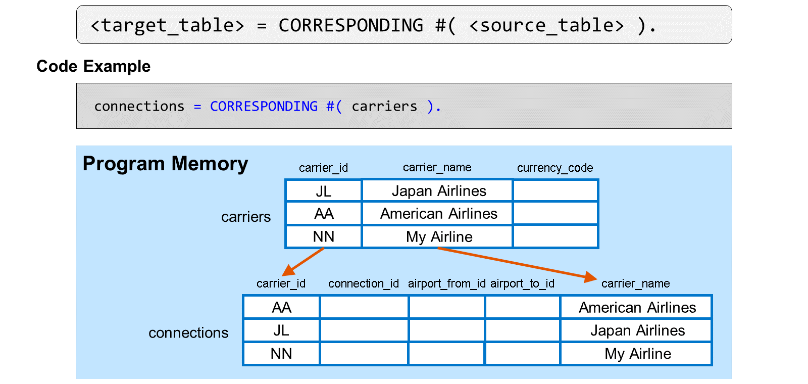

Dans l'exemple, la table interne source `carriers` contient trois lignes. Par conséquent, après l'affectation des valeurs, la table interne cible `connections` contient également trois lignes.

Les champs `carrier_id` et `carrier_name` existent dans les deux tables internes. Ils sont copiés de la source vers la cible. Le champ `devise_code` existe uniquement dans la source. Il n'est pas copié. Les champs `connexion_id`, `aéroport_de_départ` et `aéroport_de_destination` existent uniquement dans la cible. Ils sont renseignés avec leurs valeurs initiales.

> #### 🍧 Note
>
> Si la table interne cible contient des données avant l'affectation, le système les supprime.

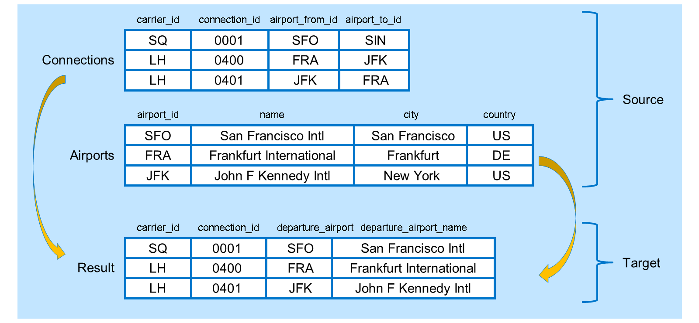

Prenons maintenant un exemple plus complexe. Dans un programme, vous disposez d'une table interne contenant les correspondances aériennes et d'une autre contenant les noms et emplacements des aéroports. Vous devez renseigner une troisième table interne avec les identifiants `carrier_id`, `connection_id` et `airport_from_id` de la table connections, ainsi que le nom de l'aéroport de la table airports. Pour ce faire, utilisez une compréhension de table.

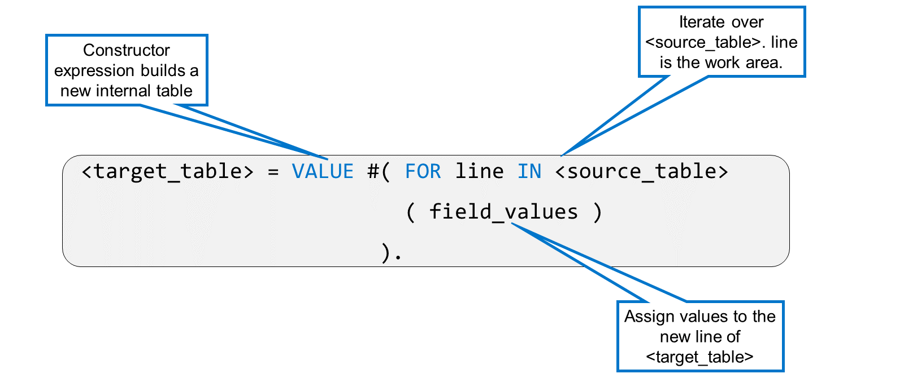

Pour remplir une table interne à partir d'une autre, vous pouvez utiliser l'opérateur `VALUE` avec une expression `FOR`. `FOR` implémente une boucle sur la table source et place chaque ligne séquentiellement dans la variable line. Entre parenthèses, vous attribuez ensuite des valeurs aux composants de la nouvelle ligne en utilisant la syntaxe `component = VALUE`. Cette syntaxe est identique à celle utilisée pour remplir une structure avec `VALUE #( )`.

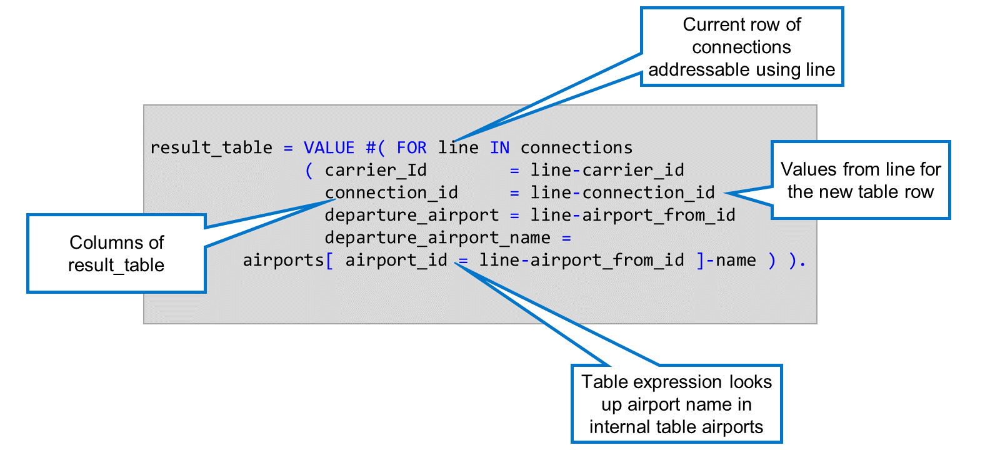

Voici le code de notre exemple. `FOR` line IN connections parcourt la table connections et place chaque ligne séquentiellement dans la variable line. Entre parenthèses, nous construisons chaque nouvelle ligne de la table `result_table`. À gauche des expressions se trouvent les colonnes de `result_table` et à droite, les valeurs que nous souhaitons leur attribuer. Les colonnes `carrier_id`, `connection_id` et departure_airport sont renseignées respectivement à l'aide des composants `carrier_id`, `connection_id` et `airport_from_id` de line. Pour renseigner la colonne `departure_airport_name`, nous utilisons une expression de table pour rechercher le nom de l'aéroport dans la table interne airports en utilisant le composant `airport_from_id` de line comme clé airport.

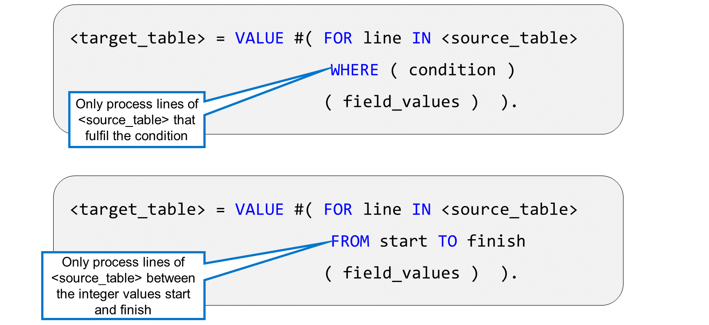

Vous pouvez restreindre l'itération sur la table source soit en utilisant `WHERE` et en spécifiant une condition logique (par exemple, uniquement les connexions pour une compagnie aérienne particulière), soit en spécifiant une plage de lignes à l'aide des ajouts `FROM` et `TO`.

### TABLE REDUCTIONS

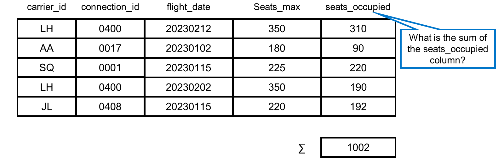

Parfois, lorsque vous parcourez une table interne, vous devez résumer les informations, par exemple pour produire une somme ou un nombre de lignes.

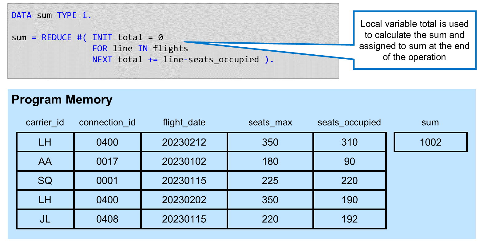

La forme la plus simple de réduction parcourt une table interne et renvoie une valeur élémentaire. La partie `INIT` de la réduction définit une variable total, dont le type doit être compatible avec celui de `sum`. `FOR line IN flights` est une itération sur la table interne `flights`, où chaque ligne est placée séquentiellement dans la zone de travail line. Dans l'expression `NEXT`, le contenu de `seats_occupied` de chaque ligne est ajouté à la variable total. À la fin de l'itération, le contenu de total est affecté à la variable `sum`.

> #### 🍧 Note
>
> The assignment total += line-seats_occupied is a calculation assignment. It is a short form for total = total + line-seats_occupied. Similar operators exist for the other basic arithmetic operations (-=, \*=, /= ).

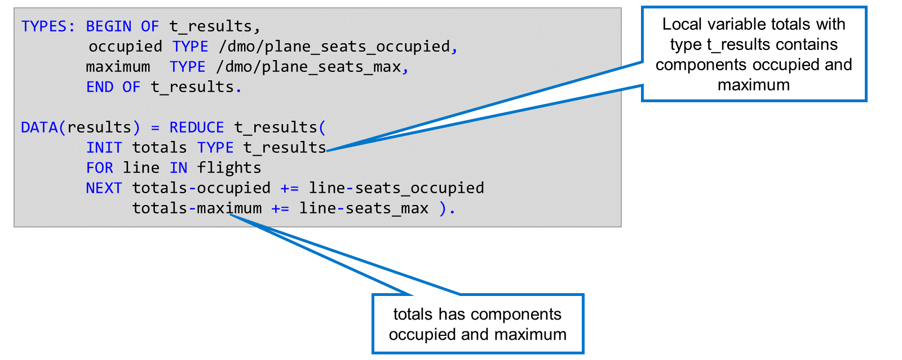

La valeur de retour d'une réduction peut également être de type structuré. Dans cet exemple, le type `t_results` est une structure contenant les composantes `occupé` et `maximum`. Dans la section `INIT` de la réduction, nous déclarons une variable `totals` de type `t_results`. Dans l'expression `NEXT`, nous traitons les composantes `occupé` et `maximum`, en compilant la somme de chacune sur l'ensemble de la table interne.

Le type de la variable cible et celui du résultat de l'expression `REDUCE` doivent être compatibles.

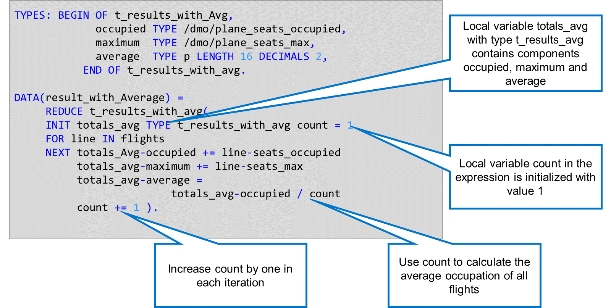

Outre sa valeur de retour, une expression `REDUCE` peut également utiliser des variables locales. Dans cet exemple, la section `INIT` de l'expression contient deux déclarations de données : `totals_avg`, qui sera la valeur de retour, et `count`. Comme `count` est déclaré avec la valeur entière 1, le système lui attribue le type `I`. Nous utilisons ensuite count dans la section `NEXT` de l'expression. À chaque itération, nous l'utilisons pour calculer l'occupation moyenne de tous les vols jusqu'à présent, en ajoutant 1 à la valeur à la fin de chaque itération.
