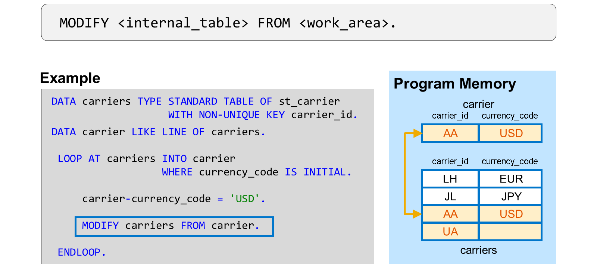
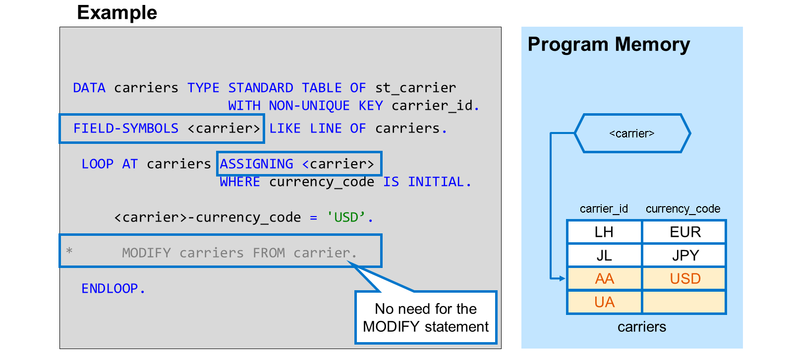
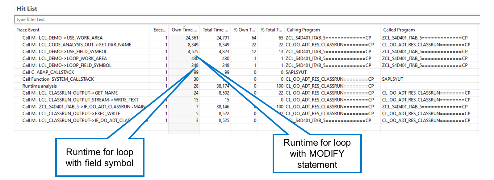

# 🌸 2 [USING FIELD SYMBOLS TO PROCESS INTERNAL TABLES](https://learning.sap.com/learning-journeys/acquire-core-abap-skills/using-field-symbols-to-process-internal-tables_f1855f41-00d3-4f8d-9a2c-663a321c6637)

> 🌺 Objectifs
>
> - [ ] Vous pourrez traiter des tables internes à l'aide de symboles de champ

## 🌸 FIELD SYMBOLS FOR ACCESS TO INTERNAL TABLES

Vous avez déjà appris à parcourir une table interne en utilisant une structure comme zone de travail. Cette technique consiste à copier les données de la table interne vers la zone de travail. Vous modifiez ensuite le contenu de la zone de travail avant de le recopier dans la table interne à l'aide de l'instruction `MODIFY`.

Si vous utilisez cette technique pour traiter une table interne volumineuse, vous risquez de rencontrer des problèmes de performances en raison des coûts liés à la copie des données. Vous pouvez réduire ces coûts en remplaçant la zone de travail par un symbole de champ.

### REPLACING A WORK AREA WITH A FIELD SYMBOL

Un symbole de champ est un pointeur. Un pointeur est un objet de données qui connaît l'adresse mémoire d'un autre objet et permet de le manipuler. Dans le cas des tables internes, le pointeur permet d'accéder à une ligne d'une table interne sans la copier au préalable dans une zone de travail. Comme vous travaillez directement avec la ligne de la table et non avec une zone de travail, vous n'avez pas besoin de recopier vos modifications dans la table interne.

Pour définir un symbole de champ, utilisez l'instruction `FIELD-SYMBOLS` et attribuez-lui un nom. Ce nom doit être inclus entre crochets angulaires. Vous lui attribuez également un type. Si vous souhaitez utiliser un symbole de champ pour traiter une table interne, définissez-le avec le type de ligne de la table interne, comme vous le feriez pour une zone de travail.

Pour utiliser le symbole de champ dans une boucle sur une table interne, utilisez l'instruction `ASSIGNING` dans l'instruction `LOOP`. À chaque passage de boucle, le pointeur pointe désormais sur la ligne correspondante de la table interne et vous pouvez modifier directement son contenu. Comme le symbole de champ possède le type de ligne de la table interne, vous pouvez le traiter comme une structure correspondante. Après le nom du symbole de champ, vous pouvez saisir un tiret, suivi du champ à modifier.

Comme vous travaillez directement avec la table interne et non avec une structure, l'instruction MODIFY est inutile. En évitant la copie de données, vous améliorez considérablement les performances de la boucle.

### RUNTIME EXECUTION

Vous pouvez voir ici le résultat d'une analyse d'exécution dans laquelle une table interne est mise à jour à l'aide d'une instruction `MODIFY` et une autre à l'aide d'un symbole de champ. Dans ce cas, le symbole de champ prend 40 % de temps en moins que l'instruction modify. En règle générale, vous pouvez espérer gagner 25 à 40 % de temps d'exécution en mettant à jour une table interne à l'aide d'un symbole de champ plutôt que d'une zone de travail. Le gain de performances pour les opérations de lecture est moindre.
