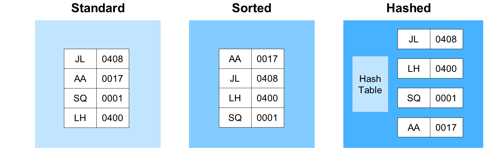
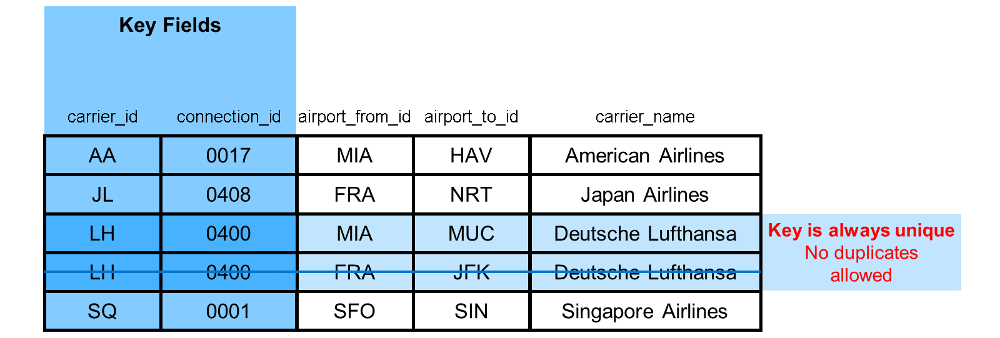
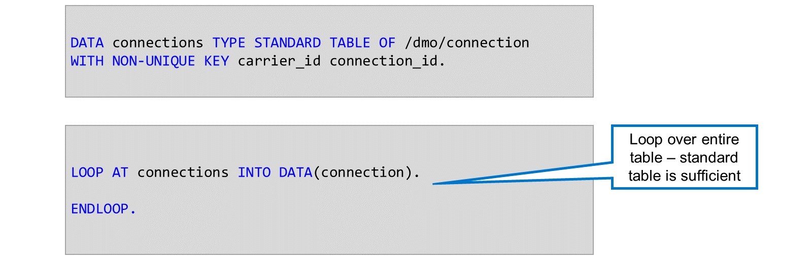
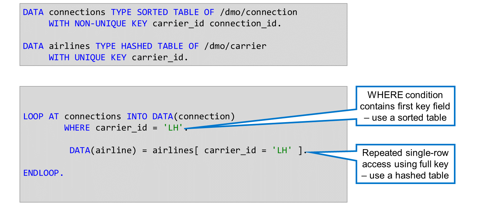
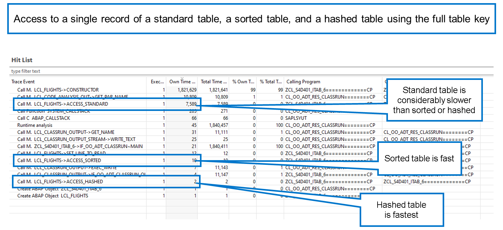
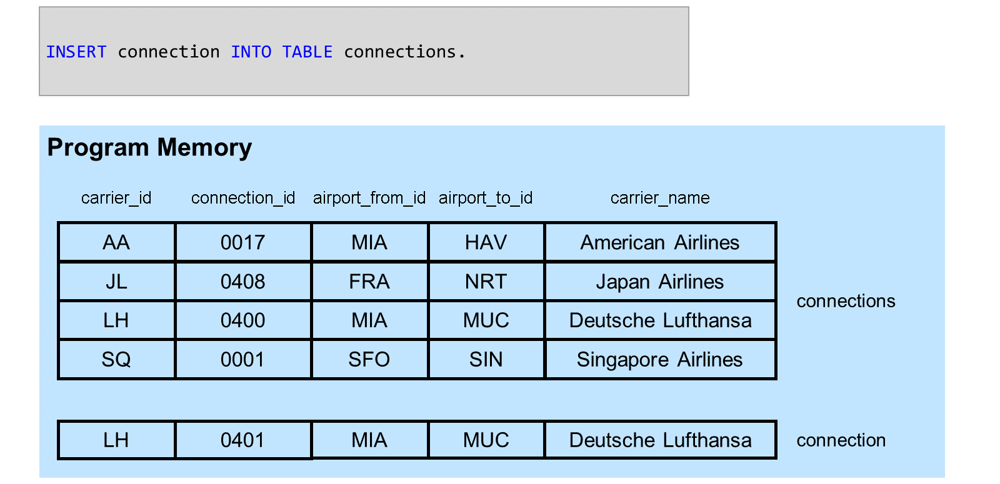

# 🌸 3 [WORKING WITH SORTED AND HASHED TABLES](https://learning.sap.com/learning-journeys/acquire-core-abap-skills/working-with-sorted-and-hashed-tables_de84be91-c7db-4166-95cf-2b036c8d5558)

> 🌺 Objectifs
>
> - [ ] Vous pourrez travailler avec des tableaux triés et hachés

## 🌸 SORTED AND HASHED TABLES

Jusqu'à présent, nous avons travaillé avec des tables internes standard. Les données d'une table standard ne sont pas triées selon un ordre particulier. Par conséquent, lors de la lecture des données d'une table, le système doit effectuer une recherche séquentielle jusqu'à trouver la ou les lignes nécessaires. Selon la taille de la table, cette opération peut prendre un certain temps.

Vous pouvez optimiser les performances des accès en lecture aux tables internes en utilisant des tables triées ou hachées.

Dans une table triée, le contenu est toujours trié selon les champs clés, par ordre croissant. Lorsqu'un nouvel enregistrement est inséré dans la table, le système s'assure qu'il est placé au bon endroit. Comme les données sont toujours triées, le système peut récupérer les enregistrements plus efficacement qu'avec une table standard (à condition de respecter certaines règles).

Les tables hachées sont gérées à l'aide d'un algorithme de hachage spécifique. Cela permet au système de récupérer les enregistrements très rapidement, même si la table est extrêmement volumineuse. Cependant, ce gain de performance n'est valable que dans des cas très particuliers.

### ACCESS TO A SORTED TABLE

[Référence - Link Vidéo](https://learning.sap.com/learning-journeys/acquire-core-abap-skills/working-with-sorted-and-hashed-tables_de84be91-c7db-4166-95cf-2b036c8d5558)

Lorsque vous déclarez une table hachée, vous devez la définir avec une clé unique ; les doublons ne sont jamais autorisés.

Regardez la vidéo pour savoir comment accéder à une table hachée.

[Référence - Link Vidéo](https://learning.sap.com/learning-journeys/acquire-core-abap-skills/working-with-sorted-and-hashed-tables_de84be91-c7db-4166-95cf-2b036c8d5558)

### WHEN TO USE STANDARD, SORTED AND HASHED TABLES

Si vous remplissez une table interne et implémentez ensuite une boucle sur l'ensemble de la table, vous pouvez utiliser une table standard. L'optimisation des performances des tables triées et hachées n'est pas pertinente, car la boucle ne contient aucun filtre.

Cet exemple illustre l'utilisation de tables triées et hachées. Il contient une boucle sur les connexions de table utilisant le premier champ clé de la clause where. Il s'agit d'un cas d'utilisation d'une table triée, car le système peut utiliser la technique de recherche binaire même si la clé n'est pas entièrement spécifiée.

Dans la boucle, le programme recherche les entrées de la table airlines. Il y a donc des accès répétés à la table en utilisant la clé complète. C'est un cas idéal pour l'utilisation d'une table hachée.

### COMPARATIVE RUNTIMES OF STANDARD, SORTED AND HASHED TABLES

Cette figure compare les temps d’exécution des tables standard, triées et hachées.

### FILLING SORTED AND HASHED TABLES

Lorsque vous utilisez une table standard, vous pouvez utiliser l'instruction `APPEND` pour ajouter le contenu d'une zone de travail à la fin de la table. Ceci n'est pas possible avec les tables hachées et entraîne une erreur de syntaxe.

Techniquement, vous pouvez utiliser l'instruction `APPEND` pour remplir une table triée. Cependant, vous risquez de provoquer une erreur d'exécution si la ligne que vous essayez d'ajouter ne se trouve pas à la fin de la table selon la zone de tri. C'est ce qui se produirait dans notre exemple.

Pour remplir une table hachée et une table triée en toute sécurité, utilisez l'instruction `INSERT`. `INSERT` garantit que la nouvelle ligne est insérée au bon endroit dans la table.
