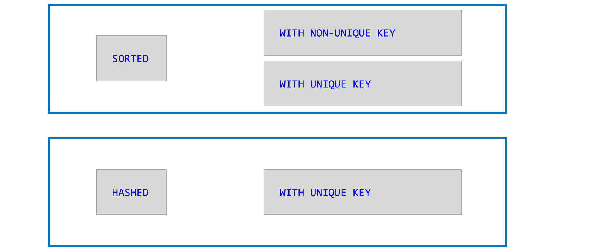
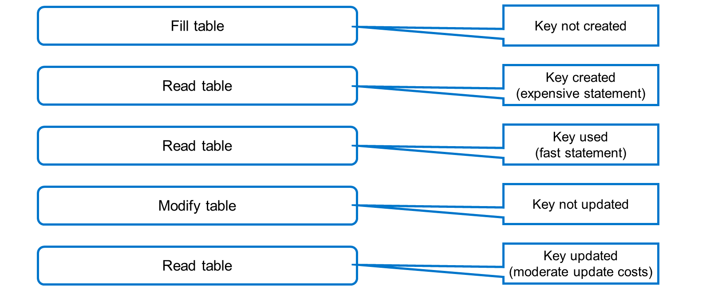
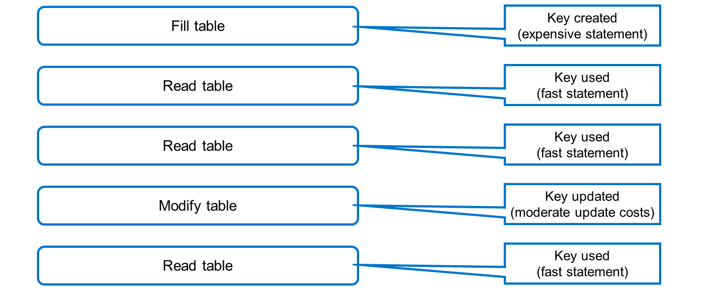

# 🌸 4 [IMPROVING INTERNAL TABLE PERFORMANCE USING SECONDARY KEYS](https://learning.sap.com/learning-journeys/acquire-core-abap-skills/improving-internal-table-performance-using-secondary-keys_b426a7ff-a881-4270-95d9-9933e03a37f1)

> 🌺 Objectifs
>
> - [ ] Vous pourrez améliorer les performances de la table interne en utilisant des clés secondaires

## 🌸 SECONDARY KEYS

[Référence - Link Vidéo](https://learning.sap.com/learning-journeys/acquire-core-abap-skills/improving-internal-table-performance-using-secondary-keys_b426a7ff-a881-4270-95d9-9933e03a37f1)

Pour accélérer l'accès à la table interne à l'aide de champs qui ne font pas partie de la clé primaire, vous pouvez ajouter une ou plusieurs clés secondaires à la définition de votre table interne.

Comme illustré dans la figure, la clé secondaire d'une table interne peut être triée ou hachée. Comme pour la clé primaire des tables internes, une clé triée peut être unique ou non, tandis qu'une clé hachée doit toujours être unique.

Regardez cette vidéo pour découvrir comment utiliser une clé secondaire pour améliorer les performances d'une table interne.

[Référence - Link Vidéo](https://learning.sap.com/learning-journeys/acquire-core-abap-skills/improving-internal-table-performance-using-secondary-keys_b426a7ff-a881-4270-95d9-9933e03a37f1)

Si une table interne possède une clé secondaire non unique, le système ne crée la clé que lorsque le programme accède à la table à l'aide de cette clé. Créer la clé pour la première fois nécessite un temps d'exécution supplémentaire, et par conséquent, le premier accès en lecture est généralement plus coûteux que sans la clé. Cependant, une fois la clé créée, les accès en lecture suivants sont très rapides (et considérablement plus rapides que la lecture de la table sans la clé secondaire).

Si vous modifiez le contenu de la table, le système ne met pas automatiquement à jour l'index, mais attend de voir si d'autres accès en lecture utilisent la clé secondaire. Lors du premier accès en lecture suivant, le système met à jour la clé secondaire. Cette opération est moins coûteuse que la création de la clé, mais les coûts de mise à jour sont modérés.

Une clé secondaire unique a deux objectifs : accélérer l'accès à la table et garantir l'unicité de la combinaison de clés de toutes les lignes de la table. Par conséquent, le système doit constamment maintenir la clé à jour et utilise une stratégie de mise à jour différente de celle des clés secondaires non uniques.

Toute opération modifiant le contenu de la table interne (remplissage ou modification) entraîne la création de l'index (premier accès) ou sa mise à jour (accès suivants). Les accès en lecture sont toujours rapides, car l'index secondaire est toujours à jour.
