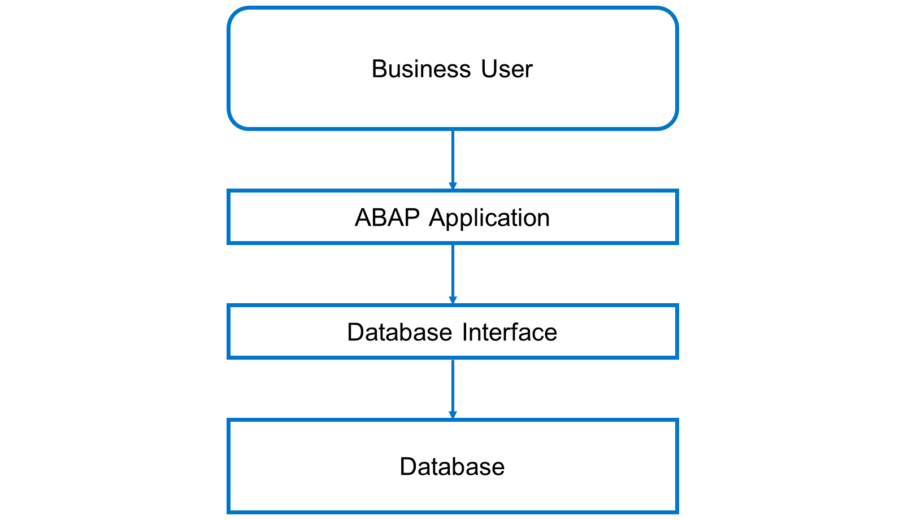
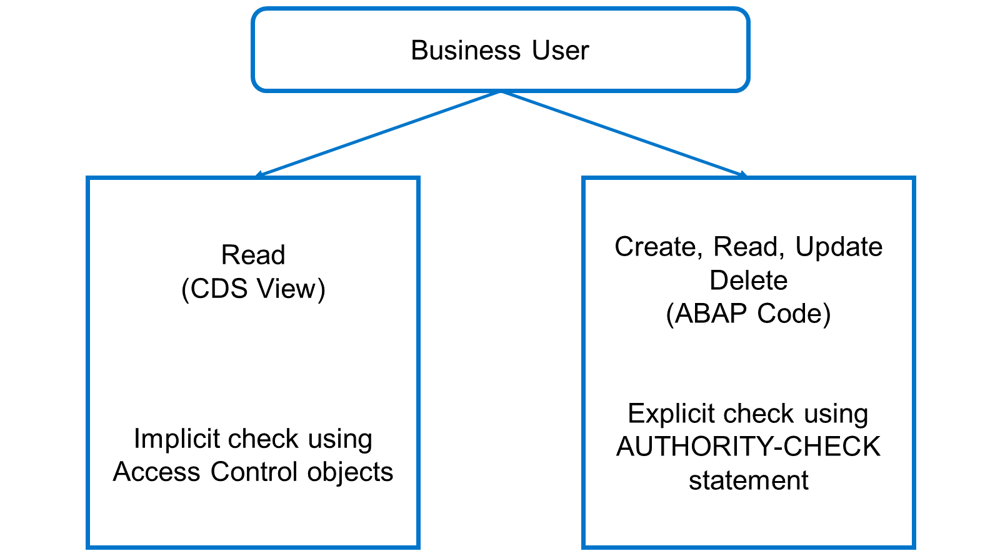

# 🌸 1 [DESCRIBING THE AUTHORIZATION CONCEPT IN ABAP](https://learning.sap.com/learning-journeys/acquire-core-abap-skills/describing-the-authorization-concept-in-abap_b3ca46dc-d15b-442d-a45e-582741f52257)

> 🌺 Objectifs
>
> - [ ] Vous serez capable de décrire le concept d'autorisation en ABAP

## 🌸 THE AUTHORIZATION CONCEPT IN ABAP

En ABAP, les requêtes adressées à la base de données sont traitées par l'interface de base de données. Cette interface est chargée de garantir le bon traitement des instructions SQL. Étant donné qu'une opération de base de données peut provenir de n'importe quelle application et concerner n'importe quelle activité (création, lecture, mise à jour, suppression), l'interface de base de données doit pouvoir effectuer la quasi-totalité des opérations. Les utilisateurs métier, quant à eux, ne doivent pouvoir effectuer que certaines actions sur certaines données.

Par conséquent, l'interface de base de données se connecte à la base de données avec un utilisateur spécifique, autorisé à effectuer toutes les actions, et non avec l'utilisateur métier. Pour limiter les privilèges des utilisateurs métier, ABAP utilise un système de contrôle d'autorisation logique.

Regardez cette vidéo pour comprendre comment attribuer des autorisations aux utilisateurs à l'aide de l'application IAM.

[Référence - Link Vidéo](https://learning.sap.com/learning-journeys/acquire-core-abap-skills/describing-the-authorization-concept-in-abap_b3ca46dc-d15b-442d-a45e-582741f52257)

En ABAP, il existe deux types de contrôle d'autorisation. Le premier est un contrôle lié à une vue `CDS`. Lorsque le système lit des données, il filtre les données récupérées en fonction des autorisations de l'utilisateur. Le second est un contrôle explicite utilisant l'instruction `AUTHORITY-CHECK`. Celle-ci définit un code de retour indiquant si l'utilisateur dispose des autorisations requises. Dans ce cas, le développeur doit s'assurer que l'action demandée n'est pas exécutée si l'utilisateur ne dispose pas de ces autorisations. Dans le modèle de programmation d'applications RESTful ABAP, les contrôles d'accès pour les opérations de lecture et les instructions `AUTHORITY-CHECK` permettent généralement de valider les autorisations avant d'autoriser la modification des données.
