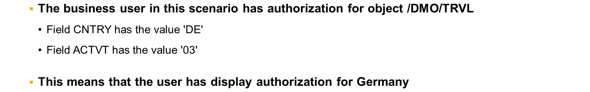
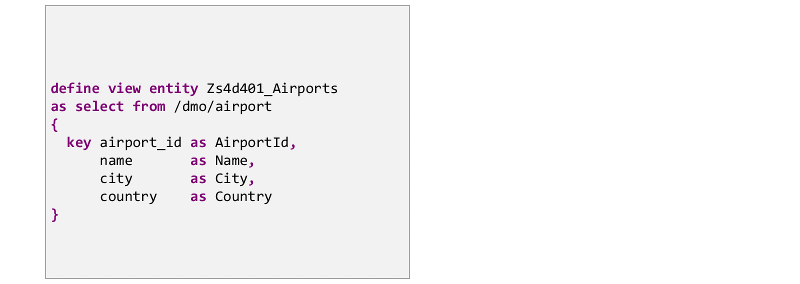
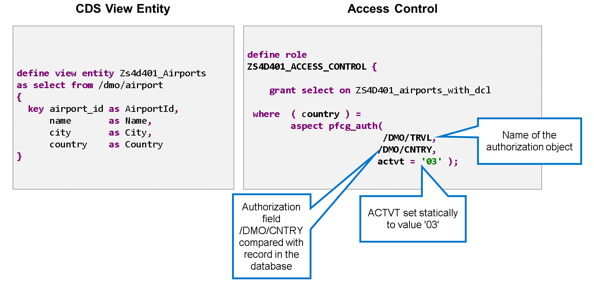
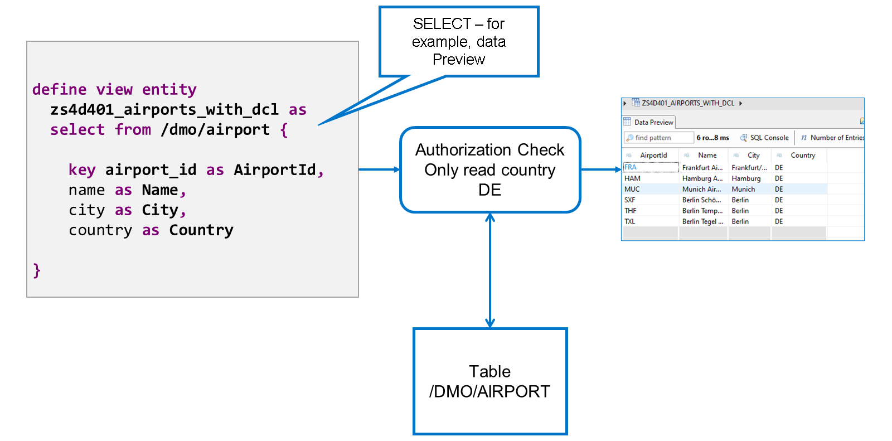

# 🌸 2 [USING CDS ACCESS CONTROL](https://learning.sap.com/learning-journeys/acquire-core-abap-skills/using-cds-access-controls_e0f0ff7f-2754-42b1-aafc-bd9e13b487bb)

> 🌺 Objectifs
>
> - [ ] Vous pourrez utiliser les contrôles d'accès CDS

## 🌸 CDS ACCESS CONTROLS

### PREREQUISITES FOR THIS SECTION

Ce scénario utilise une entité de vue `CDS` qui sélectionne les données d'une table de base de données contenant les informations sur l'aéroport. Aucun contrôle d'autorisation n'est associé à cette vue. Par conséquent, l'utilisateur peut consulter toutes les données, y compris celles pour lesquelles il n'a aucune autorisation.

Pour appliquer un contrôle d'accès à une entité de vue `CDS`, créez un objet de type Contrôle d'accès. Dans cet exemple, le contrôle d'accès vérifie l'autorisation pour l'objet `/DMO/TRVL`. Le champ `/DMO/CNTRY` est comparé aux valeurs de la base de données et l'activité est définie sur « 03 », ce qui signifie lecture.

Pour trouver le contrôle d'accès correspondant à une entité de vue `CDS` spécifique, placez le curseur sur le nom de l'entité dans l'éditeur et appuyez sur [Ctrl] + [Maj] + [G]. Cela charge la liste des cas d'emploi de l'entité, c'est-à-dire tous les objets dont la définition inclut l'entité. Si l'entité de vue dispose d'un contrôle d'accès, elle sera répertoriée. Si la liste est très longue, vous pouvez la filtrer en sélectionnant l'icône entonnoir et en définissant le champ Type d'objet sur `DCLS/DL`.

Lorsqu'un utilisateur sélectionne des données via la vue `CDS`, le système utilise le contrôle d'accès pour visualiser les valeurs requises et les comparer aux valeurs d'autorisation attribuées à l'utilisateur. Il définit ensuite un filtre pour garantir que seules les données correspondant à l'autorisation de l'utilisateur sont lues ; dans notre cas, les aéroports situés en Allemagne. Cette méthode est à la fois sécurisée, car le système effectue la vérification automatiquement, sans aucun moyen de la contourner, et performante, car elle garantit qu'aucune donnée redondante n'est lue dans la base de données.

## 🌸 HOW TO USE CDS ACCESS CONTROL

[Référence - Link Vidéo](https://learning.sap.com/learning-journeys/acquire-core-abap-skills/using-cds-access-controls_e0f0ff7f-2754-42b1-aafc-bd9e13b487bb)
