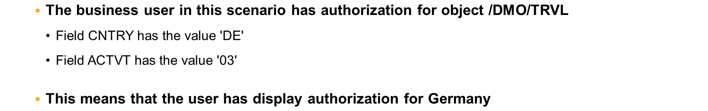
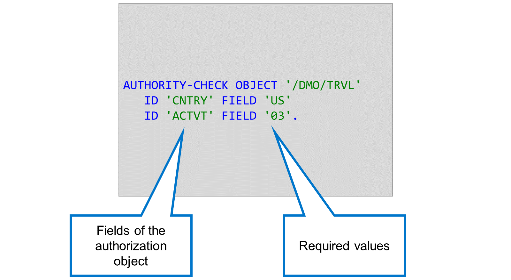
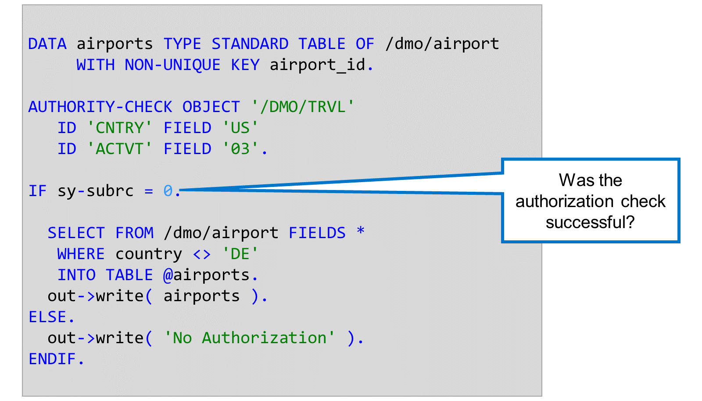

# 🌸 3 [USING THE AUTHORITY-CHECK STATEMENT](https://learning.sap.com/learning-journeys/acquire-core-abap-skills/using-the-authority-check-statement_a60b8989-12c1-4764-89b2-e168feae035d)

> 🌺 Objectifs
>
> - [ ] Vous pourrez utiliser l'instruction AUTHORITY-CHECK

## 🌸 THE AUTHORITY-CHECK STATEMENT

Pour effectuer une vérification d'autorisation explicite, utilisez l'instruction `AUTHORITY-CHECK`. Dans celle-ci, spécifiez l'objet d'autorisation à vérifier, ainsi que les valeurs requises. L'instruction `AUTHORITY-CHECK` effectue ici une vérification sur l'objet `/DMO/TRVL` et requiert que l'utilisateur dispose d'une autorisation contenant la valeur US pour le champ `CNTRY` et 03 pour le champ `ACTVT`.

### HOW TO CHECK THE RESULT OF THE AUTHORIZATION CHECK

Contrairement aux contrôles d'autorisation filtrés fournis avec les contrôles d'accès CDS, l'instruction `AUTHORITY-CHECK` n'empêche pas les utilisateurs de voir les données pour lesquelles ils n'ont aucune autorisation.

`AUTHORITY-CHECK` place un code retour dans le champ système `sy-subrc`. En vérifiant la valeur de `sy-subrc` immédiatement après la vérification d'autorisation, vous pouvez déterminer si la vérification a réussi ou non.

Si la vérification d'autorisation a réussi, `sy-subrc` a la valeur 0. D'autres valeurs de `sy-subrc` signifient que la vérification a échoué :

- La valeur 4 signifie que l'utilisateur dispose d'une autorisation pour l'objet correspondant, mais pas les valeurs correctes.

- La valeur 12 signifie que l'utilisateur ne dispose d'aucune autorisation pour l'objet correspondant.

Si la vérification d'autorisation échoue, vous devez vous assurer que l'utilisateur ne peut pas accéder aux données.

Dans l'exemple, la vérification d'autorisation nécessite que l'utilisateur dispose d'une autorisation pour le pays « États-Unis ». Comme ce n'est pas le cas pour notre utilisateur, `sy-subrc` est différent de zéro après la vérification d'autorisation. Dans ce cas, l'application affiche le texte « Aucune autorisation ».

## 🌸 HOW TO USE THE AUTHORITY-CHECK STATEMENT

[Référence - Link Vidéo](https://learning.sap.com/learning-journeys/acquire-core-abap-skills/using-the-authority-check-statement_a60b8989-12c1-4764-89b2-e168feae035d)
