# 🌸 1 [IMPLEMENTING INHERITANCE](https://learning.sap.com/learning-journeys/acquire-core-abap-skills/implementing-inheritance_bfdb59f7-0f99-48b9-b019-a7b766830ecc)

> 🌺 Objectifs
>
> - [ ] Vous pourrez implémenter une classe spécialisée

## 🌸 INHERITANCE IMPLEMENTATION

Regardez cette vidéo pour comprendre le concept de cours généraux et plus spécialisés.

[Référence - Link Vidéo](https://learning.sap.com/learning-journeys/acquire-core-abap-skills/implementing-inheritance_bfdb59f7-0f99-48b9-b019-a7b766830ecc)

### INHERITANCE - THE "IS A" RELATIONSHIP

En modélisation, on parle de spécialisation. L'implémentation de cette relation dans un langage de programmation utilise le concept d'héritage, où une nouvelle classe (la sous-classe) dérive d'une classe existante (la superclasse). Un test fiable pour vérifier l'existence d'une véritable relation d'héritage entre deux classes consiste à dire : « une sous-classe est une superclasse ». Si c'est clairement le cas, il existe une relation d'héritage. Si c'est manifestement faux, ou même si cela semble étrange, il n'y a pas de relation d'héritage et il ne faut pas en implémenter une, car cela risque de poser des problèmes ultérieurement. En testant notre modèle, nous pouvons affirmer sans équivoque qu'« un avion cargo est un avion » et qu'« un avion de ligne est un avion ».

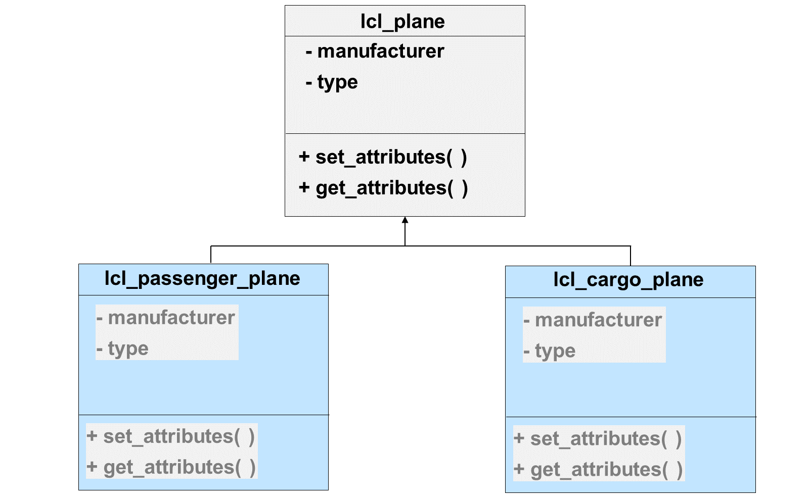

Une classe qui hérite d'une superclasse contient automatiquement tous les composants de cette superclasse. Par exemple, la classe « avion de ligne » possède un constructeur et un type, tout comme un avion. Cela n'est pas surprenant, car un avion de ligne est un avion. Ce qui peut paraître surprenant à première vue, c'est que la classe « avion de ligne » ne peut pas accéder à ses propres constructeur et type. En effet, ce sont des attributs privés de la superclasse et, par conséquent, inaccessibles à la sous-classe. Vous découvrirez plus loin comment permettre à une sous-classe d'accéder aux composants d'une superclasse sans les rendre entièrement publics.

### DEFINING THE INHERITANCE RELATIONSHIP

En ABAP, l'héritage est implémenté à l'aide de l'ajout `INHERITING FROM` dans l'instruction de définition de classe. Dans cet exemple, la classe avion de passagers est définie comme une sous-classe de la classe avion. Notez que la sous-classe connaît sa super-classe, mais la classe avion ignore ses sous-classes (le cas échéant).

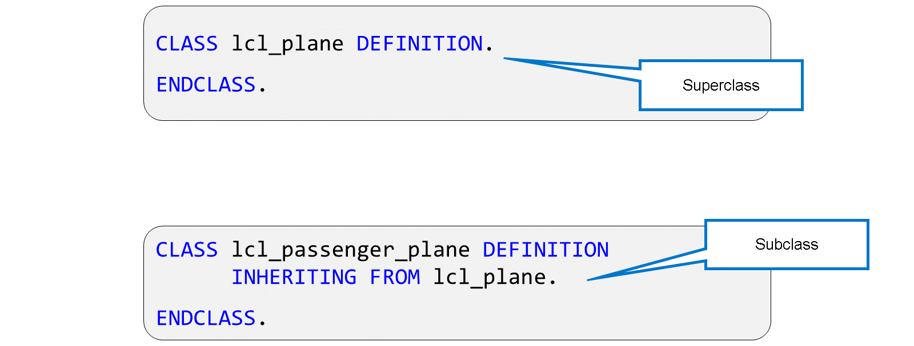

Une sous-classe ne peut avoir qu'une seule superclasse directe.

### ONE SUPERCLASS - ANY NUMBER OF SUBCLASSES

La classe plane peut avoir n'importe quel nombre de sous-classes, mais elle n'en connaît aucune.

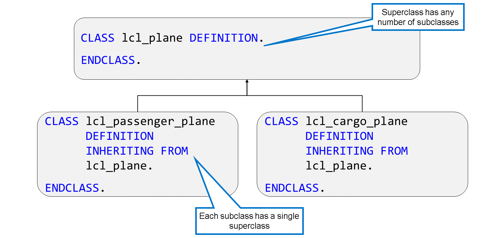

Chaque sous-classe possède une seule superclasse directe. Elle connaît sa superclasse, mais ignore ses classes sœurs (autres classes dérivées de la même superclasse). Dans notre exemple, la classe des avions de passagers ignore l'existence de la classe des avions cargo.

### HOW TO EXTEND A SUBCLASS

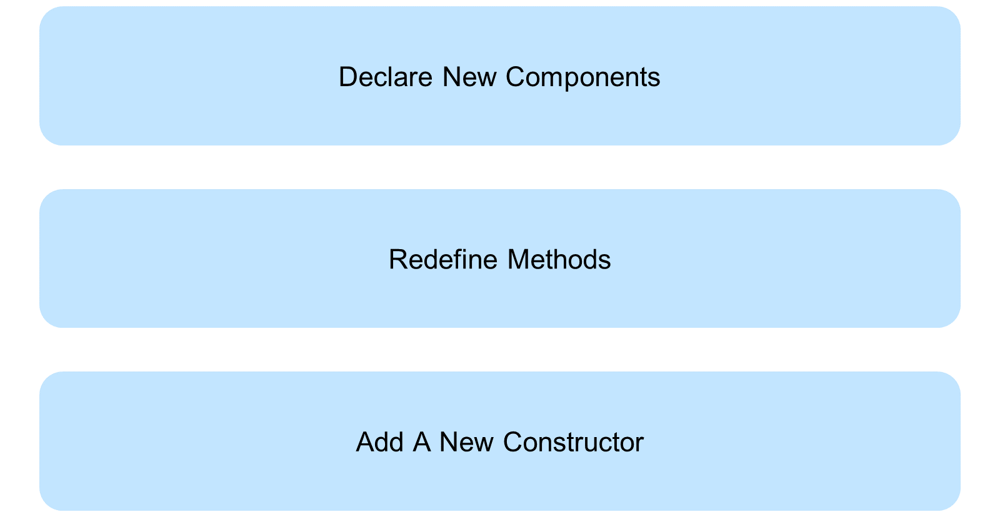

Une fois une sous-classe déclarée, vous devez y ajouter de nouveaux composants ou modifier les composants existants. C'est ainsi que la simple copie de la classe avion devient un avion de ligne ou un avion cargo. Grâce à l'héritage, inutile d'implémenter la classe de A à Z ; il suffit de l'étendre avec les nouveaux composants nécessaires.

Il existe trois façons de procéder :

#### 💮 **Add new components** :

Vous pouvez déclarer de nouveaux attributs, types, constantes et méthodes dans la classe. Leurs noms ne doivent pas entrer en conflit avec ceux déjà utilisés pour déclarer des composants dans la superclasse. Vous devez également vous assurer que les nouveaux composants ne concernent que la sous-classe, et non toutes ses spécialisations. Si vous déclarez un nouvel attribut ou une nouvelle méthode généralement pertinente, vous devez la déplacer dans la superclasse.

#### 💮 **Redefine methods** :

Redéfinir les méthodes : Lorsque vous appelez une méthode héritée, le système d'exécution exécute l'implémentation de la méthode depuis la superclasse. Cependant, cette implémentation ne peut pas prendre en compte les nouveaux composants déclarés dans la sous-classe. Dans ce cas, vous pouvez redéfinir la méthode. Cela signifie que vous pouvez lui attribuer une nouvelle implémentation pertinente pour la sous-classe.

#### 💮 **Add a new constructor** :

Ajouter un nouveau constructeur : Les constructeurs garantissent l'initialisation correcte des nouvelles instances de la classe. Lors de la création d'une instance d'une sous-classe, le système d'exécution exécute toujours le constructeur de la superclasse. Cela garantit, par exemple, qu'un avion de ligne possède un constructeur et un type, comme tout autre avion. Cependant, le constructeur de la superclasse ne peut pas initialiser les attributs de la sous-classe, car il ignore leur existence. C'est pourquoi vous pouvez définir un nouveau constructeur pour la sous-classe.

### DECLARING NEW COMPONENTS

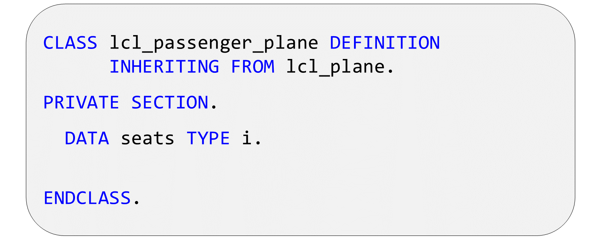

Vous pouvez étendre une sous-classe en déclarant de nouveaux composants. Ceux-ci sont visibles par la classe elle-même, mais pas par la superclasse, ni par les autres classes héritant de la même superclasse. Il faut donc déterminer si les nouveaux composants sont uniquement pertinents pour la classe actuelle ou s'ils doivent être déclarés dans la superclasse.

### PROTECTED COMPONENTS

Même si une sous-classe contient tous les attributs de sa superclasse, elle n'est pas autorisée à accéder directement aux composants privés. Cela est parfois nécessaire, mais il arrive aussi qu'une superclasse doive autoriser ses sous-classes à accéder à des attributs ou méthodes particuliers sans les rendre entièrement publics. Elle peut le faire en les déclarant dans la section protégée. Les composants protégés sont visibles au sein de la classe elle-même, mais aussi par toutes les sous-classes.

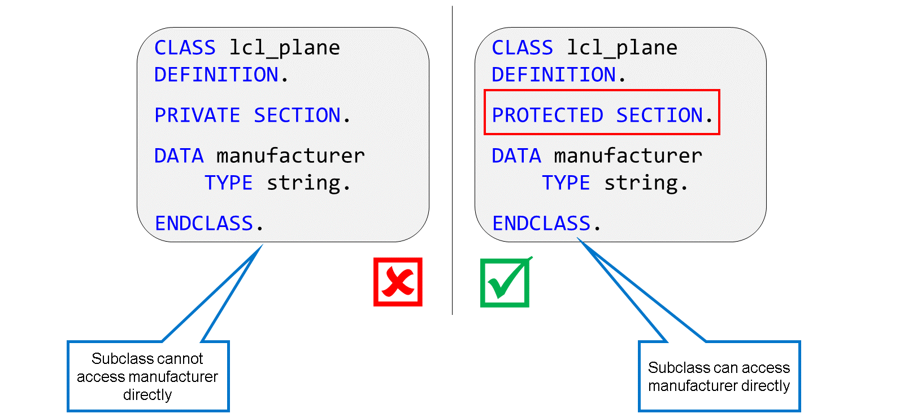

Dans la définition de classe, vous introduisez la section protégée à l'aide de l'instruction `PROTECTED SECTION`. Vous devez toujours déclarer les sections de visibilité selon la séquence : `PUBLIC SECTION` - `PROTECTED SECTION` - `PRIVATE SECTION`.

Vous pouvez déplacer un composant existant d'une classe à l'aide d'un correctif rapide. Pour ce faire, placez le curseur sur le nom du composant dans ADT et appuyez sur [Ctrl] + [1], puis choisissez le correctif rapide `make <element> protected`.

Déplacer un composant privé vers la section protégée est une modification compatible : vous avez élargi la visibilité du composant. En revanche, protéger un composant public est une modification incompatible et peut entraîner des erreurs de syntaxe. En effet, vous avez restreint la visibilité du composant, qui a peut-être déjà été utilisé en dehors de la hiérarchie d'héritage.

### REDEFINING METHODS

Les superclasses contiennent souvent des méthodes que vous souhaitez utiliser dans une sous-classe, mais leurs implémentations sont inadaptées car elles ne prennent pas en compte la nature particulière de la sous-classe. Par exemple, la méthode `get_attributes` de la classe plane ne peut pas renvoyer les attributs définis dans la classe passenger plane. Cependant, cette dernière nécessite tout de même une méthode `get_attributes`.

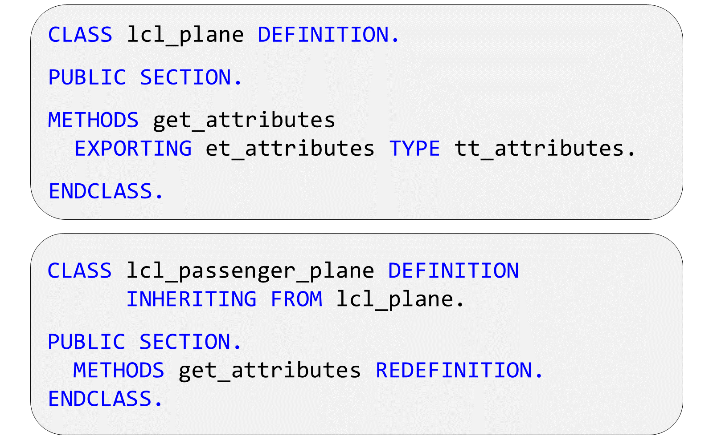

En ABAP, vous pouvez résoudre ce problème en redéfinissant la méthode d'instance get_attributes. Lorsque vous redéfinissez une méthode, vous écrivez une nouvelle implémentation dans la sous-classe, prenant en compte des éléments que seule la sous-classe peut connaître. Cependant, la définition de la méthode reste identique. Vous devez suivre les règles suivantes :

- La méthode conserve le même nom.

- Vous indiquez que vous souhaitez redéfinir la méthode en la déclarant dans la sous-classe avec l'ajout REDEFINITION.

- La méthode a la même visibilité que dans la super-classe.

- Vous ne devez pas modifier la signature de la méthode.

- Vous ne pouvez pas redéfinir une méthode statique.

### IMPLEMENTING THE REDEFINITION

Lorsque vous implémentez la redéfinition d'une méthode, vous pouvez appeler l'implémentation dans la superclasse. Pour ce faire, utilisez la référence d'objet implicite super, qui pointe vers la superclasse dans l'instance courante. De cette façon, vous pouvez réutiliser l'implémentation de la méthode de la superclasse et l'enrichir dans votre propre implémentation.

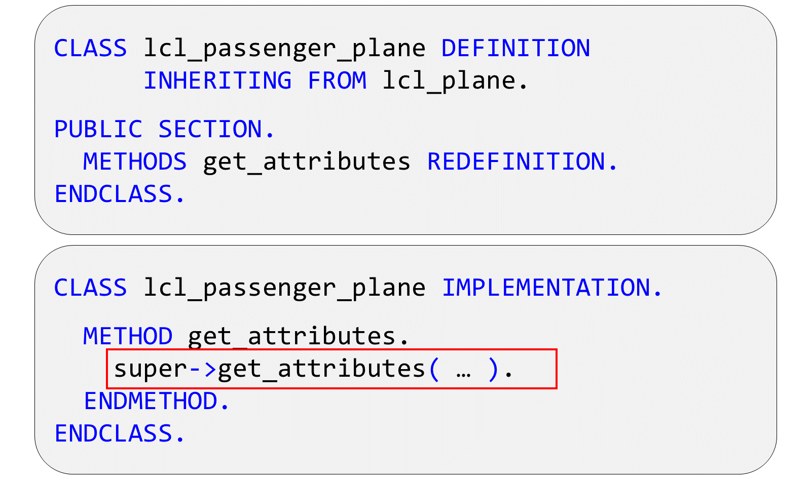

Il n'est pas nécessaire de déclarer la variable de référence super. Elle est automatiquement disponible lors de l'implémentation des méthodes redéfinies.

Appeler la méthode dans la superclasse de cette manière est facultatif. Parfois, c'est une bonne idée, parfois, cela n'apporte rien.

### NEW CONSTRUCTOR DEFINITION

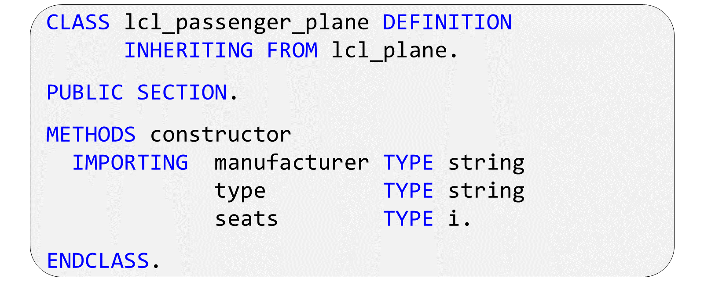

Dans une sous-classe, vous pouvez définir un nouveau constructeur. Contrairement aux redéfinitions de méthodes, un constructeur peut avoir sa propre signature. La signature d'un constructeur contient souvent les mêmes paramètres que le constructeur de la superclasse, ainsi que ses propres paramètres. En effet, le nouveau constructeur d'instance a deux tâches : d'abord, appeler le constructeur de la superclasse, puis initialiser ses propres attributs spécifiques à la sous-classe.

Outre la définition d'un nouveau constructeur, vous pouvez également définir un nouveau constructeur statique dans une sous-classe.

### ROLE OF THE CONSTRUCTOR

The constructor of a subclass has two functions; it must ensure that the instance of the superclass is properly created, and after that, it can set the initial values of its own attributes.

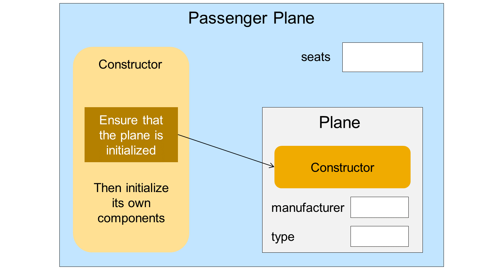

Dans notre exemple, puisqu'un avion de ligne est un avion, il ne peut y avoir d'instance d'avion de ligne tant que le constructeur de la classe avion n'a pas défini le constructeur et le type du nouvel avion de ligne. Ce n'est qu'après cela que la classe avion de ligne peut définir ses propres attributs.

Le constructeur de la sous-classe doit donc pouvoir définir non seulement ses propres attributs, mais aussi transmettre les valeurs requises au constructeur de la superclasse. C'est pourquoi la signature du constructeur de la sous-classe contient souvent la signature complète du constructeur qu'il doit appeler.

### SEQUENCE OF NEW CONSTRUCTOR IMPLEMENTION

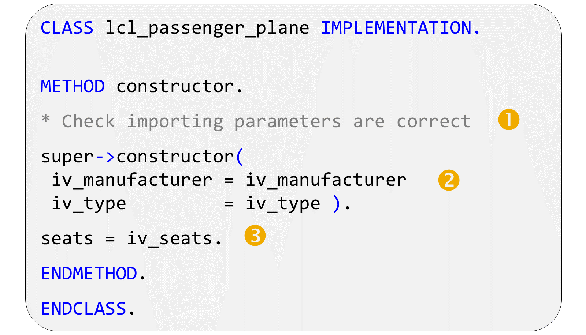

Lors de l'implémentation du nouveau constructeur, une séquence d'opérations particulière doit être respectée. L'événement le plus important est l'appel au constructeur de la superclasse. Cet appel est obligatoire et la méthode est appelée à l'aide de la référence implicite super, comme lors de l'appel de l'implémentation originale d'une méthode redéfinie. Là encore, il n'est pas nécessaire de déclarer explicitement super.

Avant d'appeler le constructeur de la superclasse, vous ne devez pas adresser les composants d'instance de l'instance en cours de construction. Vous pouvez adresser les composants statiques de la classe et vérifier l'exactitude des paramètres d'importation du constructeur. S'ils sont incorrects, générez une exception.

Une fois le constructeur de la superclasse exécuté avec succès, vous pouvez adresser les composants d'instance de votre nouvelle instance.

### SEQUENCE OF CONSTRUCTOR CALLS

La figure illustre la séquence d'appel des constructeurs statiques et d'instance. L'exemple suppose qu'un programme souhaite instancier la classe d'avion de passagers et que celle-ci n'a pas encore été traitée.

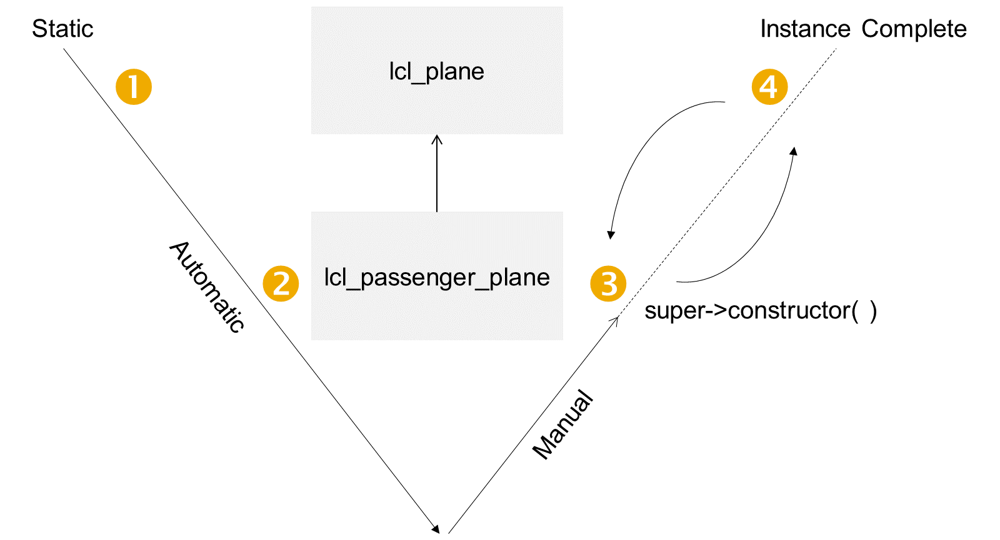

Lorsque le programme tente de créer une instance de la classe d'avion de passagers, le système d'exécution appelle automatiquement les constructeurs statiques séquentiellement, en commençant par le haut de la hiérarchie d'héritage. Une fois tous les constructeurs statiques exécutés, le système d'exécution appelle le constructeur d'instance de la sous-classe, qui appelle à son tour le constructeur d'instance de la superclasse.

### USING ABSTRACT AND FINAL COMPONENTS

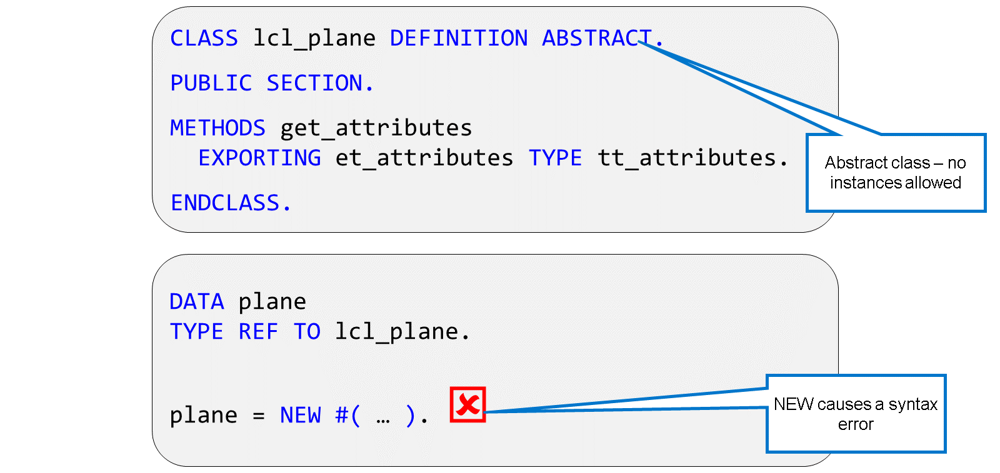

Vous pouvez déclarer une classe comme abstraite. Cela signifie qu'un programme ne peut pas l'instancier. Dans notre exemple avec les avions, les avions de ligne et les avions cargo, vous pourriez décider que, dans le monde réel, il n'existe que des avions de ligne et des avions cargo. Cependant, du point de vue de la modélisation logicielle, il est utile d'avoir la classe lcl_plane pour contenir les composants communs aux avions cargo et aux avions de ligne. En utilisant la classe abstraite, vous pouvez implémenter tous les composants communs de la classe plane sans craindre que quelqu'un ne crée des instances de la classe par erreur.

Si une classe est abstraite, vous pouvez toujours accéder à ses composants statiques. Ce sont :

- Méthodes statiques

- Attributs statiques

- Constantes

- Définitions de type

Bien qu'il soit possible d'implémenter les méthodes d'une classe abstraite, vous pouvez également déclarer une méthode individuelle comme abstraite. Dans ce cas, elle n'est pas implémentée dans la classe où elle est déclarée. Notez que vous ne pouvez déclarer une méthode abstraite que dans une classe abstraite.

Les sous-classes de la classe abstraite ne peuvent être instanciées qu'une fois la méthode abstraite redéfinie.

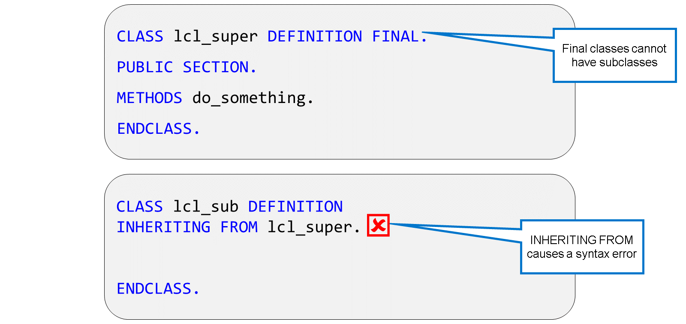

Vous pouvez déclarer une classe comme FINALE. Cela signifie qu'elle ne peut pas avoir de sous-classes.

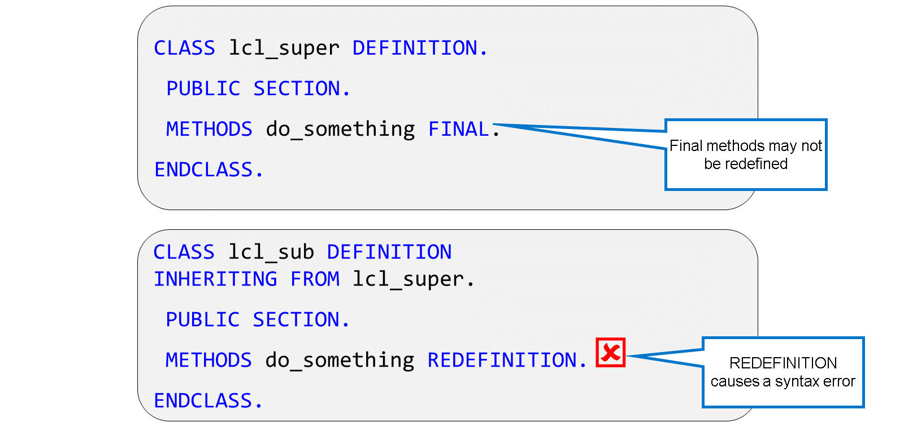

Dans une classe qui n'est pas elle-même finale, vous pouvez déclarer des méthodes comme finales. Cela signifie que, même si la classe peut avoir des sous-classes, la méthode elle-même ne peut pas être redéfinie. Vous pouvez le faire si une méthode contient un contrôle d'autorisation. Sinon, une sous-classe pourrait redéfinir la méthode et omettre le contrôle d'autorisation.
