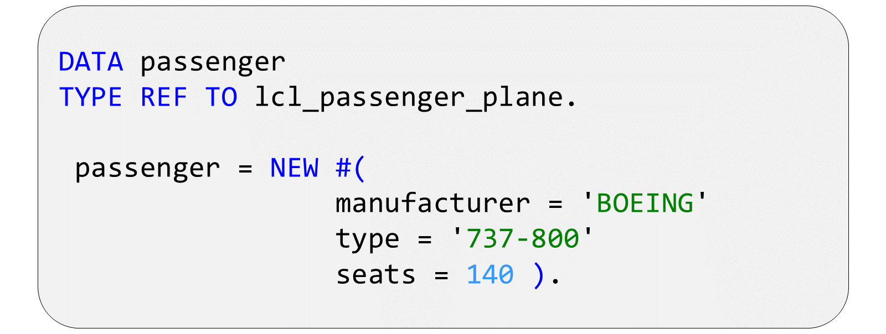
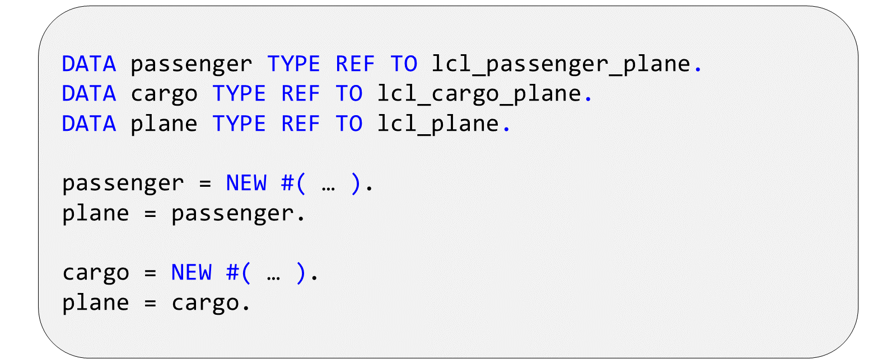
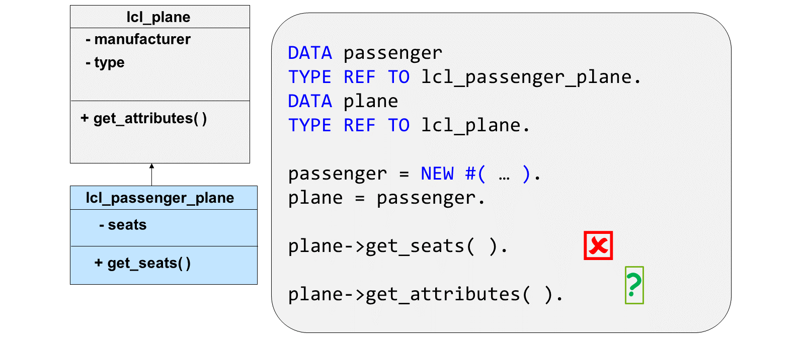
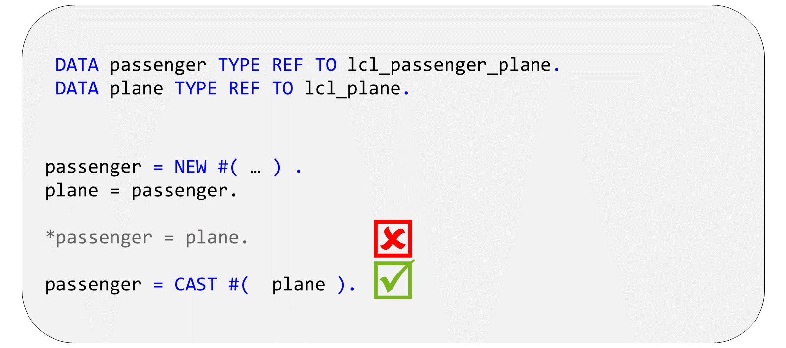
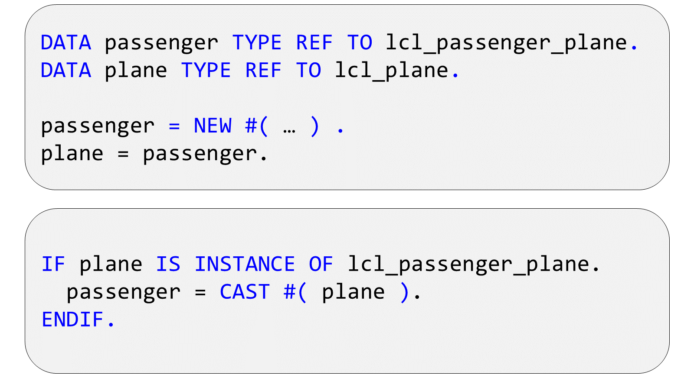

# 🌸 2 [USING INHERITANCE](https://learning.sap.com/learning-journeys/acquire-core-abap-skills/using-inheritance_e8db2ae2-5d5d-4848-8534-ea9fa00f4f3c)

> 🌺 Objectifs
>
> - [ ] Vous pourrez utiliser l'héritage

## 🌸 UP-CAST AND DOWN-CAST

Pour instancier une sous-classe, déclarez une variable de référence du type de la classe concernée. Utilisez ensuite l'opérateur `NEW` pour créer l'instance. Vous devez transmettre des valeurs à tous les paramètres obligatoires du constructeur.

### USING SUPERCLASS REFERENCES

Une variable de référence de type superclasse (ici `lcl_plane`) peut également contenir des références à des objets de type sous-classe. Ceci est logique, puisqu'un avion de ligne ou un avion cargo est un avion.

Cependant, une variable de référence de type superclasse ne connaît que les composants définis dans la superclasse. Par conséquent, lorsque vous utilisez une référence de ce type pour gérer une instance d'une sous-classe, vous ne pouvez adresser que les composants de la superclasse, même si l'objet vers lequel pointe la référence est une instance de la sous-classe.

L'affectation de références d'objet à une variable de référence d'un type différent est appelée transtypage. L'affectation d'une référence pointant vers une sous-classe à une variable de référence de type super-classe est appelée transtypage ascendant, car l'affectation est effectuée vers un type plus haut dans la hiérarchie d'héritage.

### CALLING METHODS AFTER AN UP-CAST

Lorsque vous utilisez une variable de référence avec le type ref sur lcl_plane pour gérer une instance d'avion de passagers, vous ne pouvez pas l'utiliser pour accéder aux composants qui appartiennent à la classe d'avion de passagers, car la classe d'avion ne sait pas qu'ils existent et la vérification de la syntaxe ne peut pas savoir vers quel type d'objet la référence pointera réellement au moment de l'exécution.

En utilisant la référence, vous pouvez cependant accéder à des méthodes dont la définition d'origine est contenue dans la classe. C'est le cas de la méthode get_attributes dans l'exemple de la figure. La question est de savoir quelle implémentation de la méthode sera appelée. Dans ce cas, le système examine à l'exécution le type d'objet vers lequel pointe la variable de référence et appelle l'implémentation depuis la classe correspondante. Autrement dit, bien que nous utilisions une référence d'avion pour gérer une instance de la classe d'avion de passagers, c'est toujours l'implémentation de la méthode de cette classe qui est appelée.

### ASSIGNING A GENERIC REFERENCE TO A SPECIFIC TYPE

Vous pouvez toujours affecter une variable de référence de type sous-classe à une variable de référence de type superclasse. Par exemple, vous pouvez toujours affecter une référence d'avion de ligne à une référence d'avion. Comme nous l'avons vu, cela est dû au fait qu'un avion de ligne est un avion. Affecter des variables de référence dans le sens inverse est en revanche plus délicat. En effet, une référence d'avion peut contenir des références à d'autres classes que celle de l'avion de ligne. Autrement dit, si chaque avion de ligne est un avion, chaque avion n'est pas forcément un avion de ligne.

Étant donné qu'un objet référence un plan dont le type de référence est lcl_plane et un objet `passenger_plane` dont le type de référence est `lcl_passenger_plane`, le système autorisera toujours l'écriture plane = `passenger_plane`. Cependant, l'affectation `passenger_plane` = plane génère une erreur de syntaxe, car la vérification syntaxique ne permet pas de garantir que la référence plane contiendra effectivement une référence à un objet `passenger_plane` à ce moment précis.

### THE CAST OPERATOR

La vérification syntaxique ne permet pas d'affecter directement une référence de superclasse à une référence de sous-classe. Cependant, vous pouvez le faire avec l'opérateur `CAST`. Transtyper un objet revient à considérer qu'il possède un type différent. Dans l'exemple, nous demandons au système de traiter « plane » comme une instance de la classe passenger plane. Ceci est syntaxiquement correct, car nous supposons maintenant que « vehicle » à droite de l'expression a le même type que « passenger » à gauche. Cependant, rien ne garantit que plane contienne réellement une référence passenger plane, et s'il s'avère qu'il n'en contient pas à l'exécution, l'affectation est impossible. Sans protection, cette affectation pourrait provoquer une erreur d'exécution.

### SECURING A DOWN-CAST

Si vous n'êtes pas certain que l'objet vers lequel pointe une variable de référence est bien une instance de la bonne sous-classe, vous pouvez le vérifier à l'aide de l'expression logique IS INSTANCE OF. Dans cet exemple, l'affectation à la référence de l'avion de passagers n'est traitée que si l'objet plane pointe réellement vers une instance de la classe `lcl_passenger_plane`.
