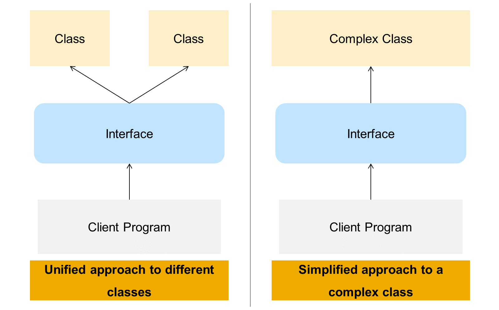
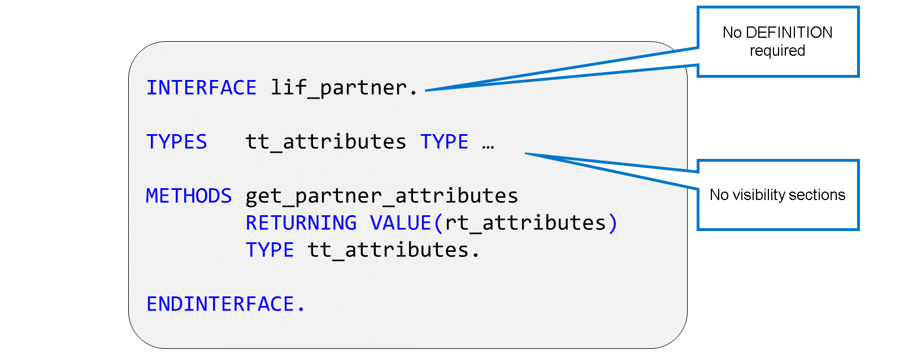
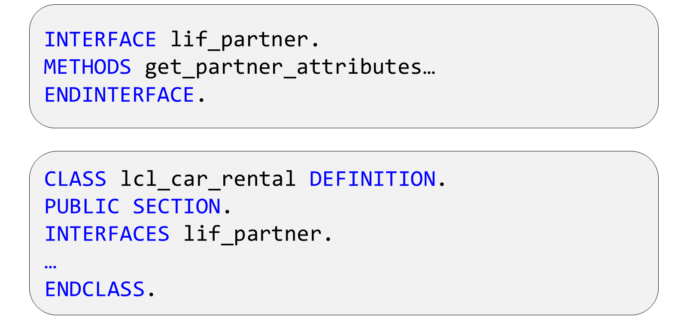
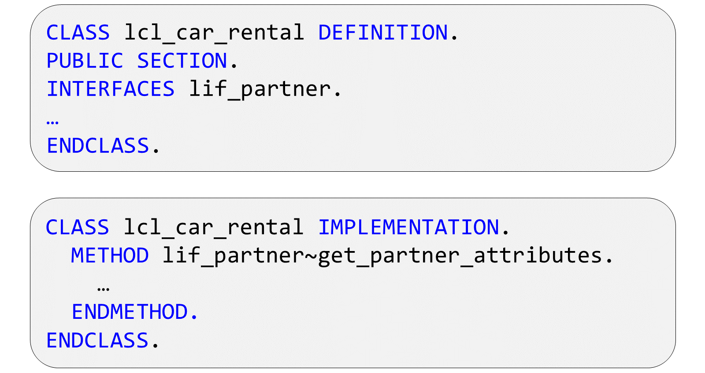

# 🌸 3 [DEFINING INTERFACES](https://learning.sap.com/learning-journeys/acquire-core-abap-skills/defining-interfaces_ab3c7c07-bb66-424b-ba06-6cfa7cc39439)

> 🌺 Objectifs
>
> - [ ] Vous pourrez définir des interfaces

## 🌸 INTERFACE DEFINITION

### REASONS TO USE INTERFACES

Les interfaces permettent de définir la manière dont un programme interagira avec une ou plusieurs classes. Dans une interface, vous pouvez définir des méthodes, des attributs, des types et des constantes, comme dans une classe. Ces composants décrivent la manière dont un programme client peut interagir avec les objets correspondants. Cependant, une interface ne peut pas être instanciée et ne contient aucune implémentation de ses méthodes. Pour que ce concept fonctionne, nous avons également besoin d'une ou plusieurs classes implémentant l'interface. Cela signifie qu'elles incluent l'interface dans leur propre déclaration de classe et que les composants déclarés dans l'interface font partie intégrante de la classe elle-même. Si l'interface contient des déclarations de méthodes, la classe qui l'implémente doit également fournir une implémentation de cette méthode.

Les interfaces ont deux fonctions importantes :

Fournir une approche unifiée des différentes classes : Si vous avez des classes qui ne sont pas liées par héritage, mais qui doivent néanmoins fournir des services communs à leurs utilisateurs, vous pouvez définir ces services dans une interface. Cela garantit que chaque classe fournit une méthode portant le même nom et la même signature pour effectuer une tâche spécifique. Les programmes qui utilisent ces classes disposent alors d'un moyen unique d'appeler des fonctions spécifiques, quelle que soit la classe à laquelle elles s'adressent.

Fournir une approche simplifiée d'une classe complexe : Comme vous le verrez plus loin, les interfaces offrent une vue restreinte d'un objet. Cela vous permet d'exposer un ensemble spécifique de méthodes à un programme qui utilisera une classe particulière en fonction des fonctions dont il a réellement besoin.

Consultez cet exemple pour comprendre le fonctionnement d'une interface.

[Référence - Link Vidéo](https://learning.sap.com/learning-journeys/acquire-core-abap-skills/defining-interfaces_ab3c7c07-bb66-424b-ba06-6cfa7cc39439)

### INTERFACE DEFINITION

La définition d'une interface est très similaire à la section de définition d'une classe. Cependant, comme une interface n'a pas d'implémentation, l'instruction `INTERFACE` ne contient pas de section `DEFINITION`. La deuxième différence majeure réside dans l'absence de section de visibilité dans une interface, car tous ses composants sont publics. Les interfaces sont utiles pour leur interaction avec d'autres classes ; l'utilisation de composants non publics serait donc insensée.

Dans la définition de l'interface, vous pouvez utiliser des types, des attributs, des constantes et des méthodes. Les composants d'instance et statiques sont autorisés. N'oubliez pas que les méthodes d'interface ont une définition, mais pas d'implémentation. Celle-ci sera fournie par la classe d'implémentation.

À bien des égards, les interfaces sont similaires aux super-classes abstraites. Elles constituent une technique utile pour définir des composants communs à des classes sans qu'il y ait de raison d'héritage, autrement dit, sans relation « est-un » claire.

### IMPLEMENTING THE INTERFACE

Pour implémenter une interface dans une classe, utilisez l'instruction `INTERFACES`. Comme tous les composants de l'interface sont publics et qu'il est impossible de modifier la visibilité d'un composant existant, vous devez inclure l'interface dans la section publique de la classe.

Dès que vous avez écrit l'instruction `INTERFACES`, votre programme est syntaxiquement incorrect. Cela est dû au fait que l'interface contient une méthode que vous n'avez pas encore implémentée. Vous pouvez utiliser une solution rapide ([Ctrl] + [1]) pour ajouter l'implémentation de la méthode à votre classe.

Lorsque vous déclarez une interface dans une classe, vous devez implémenter toutes ses méthodes.

Lors de l'implémentation de votre classe, vous devez implémenter toutes les méthodes déclarées dans l'interface. Lorsque vous nommez la méthode dans l'implémentation, vous devez utiliser le nom complet, composé du nom de l'interface et du nom de la méthode, reliés par un tilde. En effet, il n'y a aucune garantie que le nom de la méthode soit univoque ; rappelez-vous que les noms de composants ne doivent être uniques que dans la classe ou l'interface où ils sont déclarés. Par conséquent, une classe peut déclarer une méthode appelée `get_partner_attributes` ainsi que l'interface `lif_partner`.
