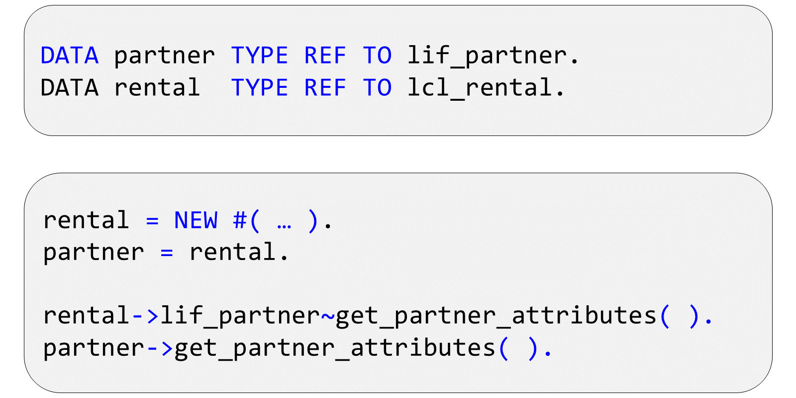
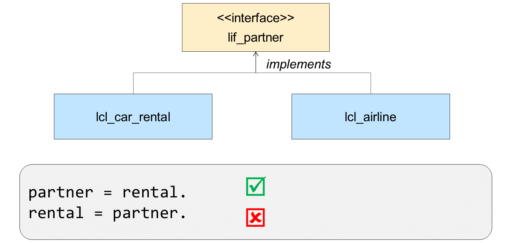

# 🌸 4 [USING INTERFACES](https://learning.sap.com/learning-journeys/acquire-core-abap-skills/using-interfaces_e45af9bb-46e5-457b-88ef-d5ad6b0d38d7)

> 🌺 Objectifs
>
> - [ ] Vous pourrez utiliser les interfaces

## 🌸 INTERFACE USE

### DECLARING AN INTERFACE REFERENCE

Vous pouvez utiliser des interfaces comme type de référence pour déclarer une variable de référence. Comme vous l'avez appris précédemment, les variables de référence permettent de créer et de gérer des instances d'une classe. Puisqu'il est impossible d'instancier une interface, vous vous demandez peut-être quels types d'objets gérer avec une référence d'interface.

Les références d'interface peuvent contenir des références à des instances de toute classe implémentant l'interface, de la même manière qu'une variable de référence de type superclasse peut contenir des références à n'importe quelle sous-classe. (Si vous imaginez maintenant que la superclasse est abstraite, vous vous trouvez dans la même situation : un type non instanciable contient des références à d'autres classes qui lui sont liées.)



Lorsque vous utilisez une variable de type superclasse pour gérer une instance de l'une de ses sous-classes, vous ne pouvez accéder qu'aux composants définis dans la superclasse. De même, lorsque vous utilisez une référence d'interface pour gérer une instance d'une classe implémentant l'interface, vous ne pouvez accéder qu'aux composants définis dans l'interface. Cela signifie que le développeur d'un framework de classes particulier peut fournir des interfaces offrant une vue spécifique d'un objet au lieu d'exposer toutes les fonctionnalités de la classe.

Vous pouvez appeler une méthode depuis une interface en utilisant une variable de référence de type classe. Dans ce cas, vous devez utiliser le nom complet de la méthode (y compris le nom de l'interface). Si vous avez défini un alias pour la méthode, vous pouvez l'utiliser. Lorsque vous appelez une méthode d'interface en utilisant une référence d'interface, le nom de l'interface est déduit du type de la variable de référence, et il n'est pas nécessaire de spécifier le nom de l'interface avant celui de la méthode.

### CASTING WITH INTERFACE REFERENCES

L'affectation de références d'objet à une référence d'interface est également un transtypage ; l'objet de location ou de transport est considéré comme un partenaire commercial. Vous pouvez toujours affecter une instance de la classe d'implémentation à une référence d'interface. Il s'agit d'un transtypage ascendant, garanti par le fait que la classe implémente l'interface. En revanche, vous ne pouvez pas affecter un objet d'une référence d'interface à une référence de type classe d'implémentation, car la vérification syntaxique ne permet pas de déterminer la compatibilité des objets d'exécution. L'affectation go_rental = go_partner fonctionnerait si l'objet de la référence d'interface était réellement une instance de lcl_rental, mais s'il s'agissait d'une instance d'une autre classe d'implémentation, une erreur d'exécution se produirait.



Nous avons ici un transtypage descendant, similaire à celui rencontré en héritage. La solution est la même. Si vous devez assigner une référence d'objet d'une variable de référence de type interface à une référence de type classe (afin d'accéder à des fonctionnalités spécifiques de la classe), vous devez utiliser l'opérateur CAST. La solution correcte dans ce cas serait :

```

  IF partner IS INSTANCE OF lcl_car_rental.
      rental = CAST #( partner ).
  ENDIF.

```
