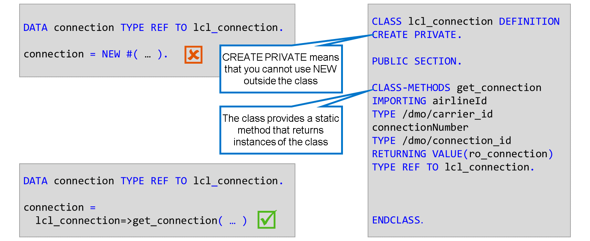

# 🌸 5 [IMPLEMENTING FACTORY METHODS](https://learning.sap.com/learning-journeys/acquire-core-abap-skills/implementing-factory-methods_ff885b1e-5e7c-4d73-b9df-b4be5112e1fa)

> 🌺 Objectifs
>
> - [ ] Vous pourrez utiliser les méthodes d'usine

## 🌸 FACTORY METHODS

Parfois, une classe doit garder le contrôle de ses instances. Cela peut servir à empêcher la création d'instances multiples. Pour ce faire, elle doit empêcher ses utilisateurs de créer eux-mêmes des instances. En ABAP, cela se fait en utilisant l'ajout `CREATE PRIVATE` dans l'instruction `CLASS DEFINITION`. Toute tentative d'utilisation de l'opérateur `NEW` en dehors de la classe entraînera désormais une erreur de syntaxe. Notez que d'autres langages de programmation obtiennent cet effet en modifiant la visibilité de la méthode constructeur. ABAP ne prend pas en charge cette fonctionnalité.

Comme les utilisateurs de la classe ne peuvent pas créer leurs propres instances, la classe doit alors fournir une méthode statique publique qui crée des instances et les renvoie à l'utilisateur. C'est ce qu'on appelle une méthode de fabrique.

## 🌸 SINGLETON PATTERNS

L'objectif du modèle singleton est de garantir qu'il n'existe qu'une seule instance d'une classe dans une application. Il peut s'agir d'une seule instance de la classe ou, dans notre cas, d'une seule instance pour chaque combinaison d'attributs clés.

Regardez les vidéos suivantes pour en savoir plus sur le modèle singleton.

[Référence - Link Vidéo](https://learning.sap.com/learning-journeys/acquire-core-abap-skills/implementing-factory-methods_ff885b1e-5e7c-4d73-b9df-b4be5112e1fa)
