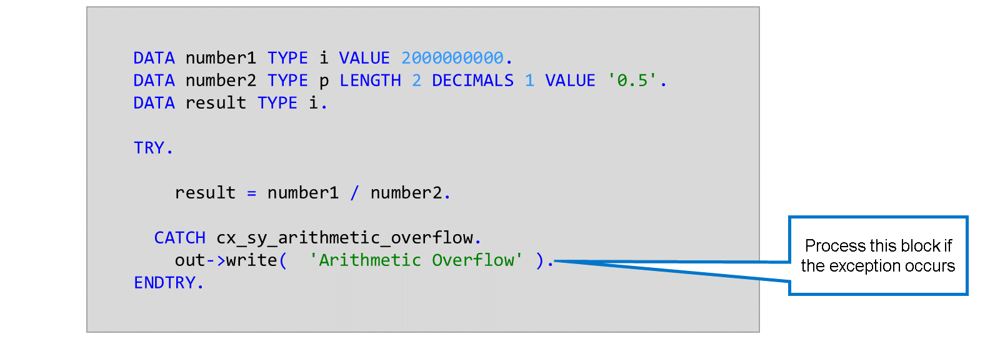
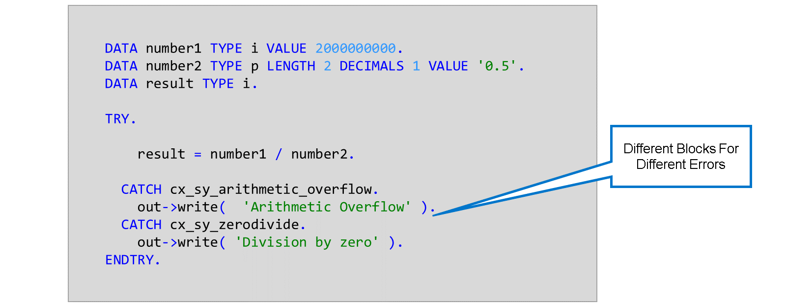
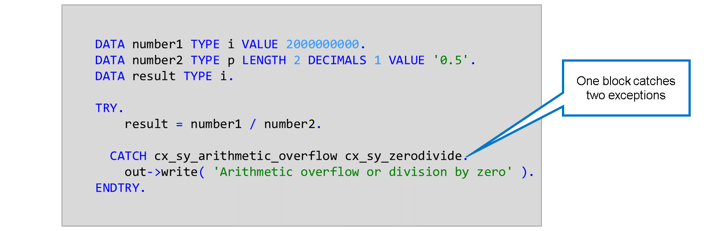
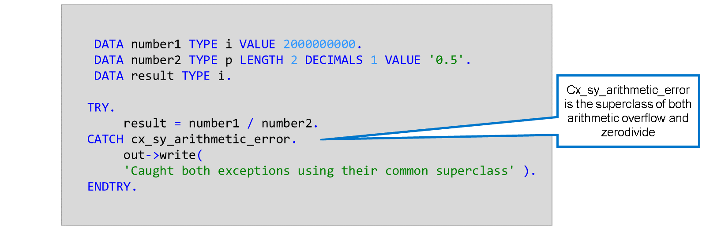
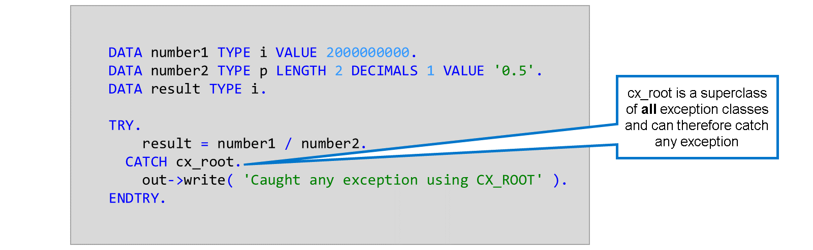
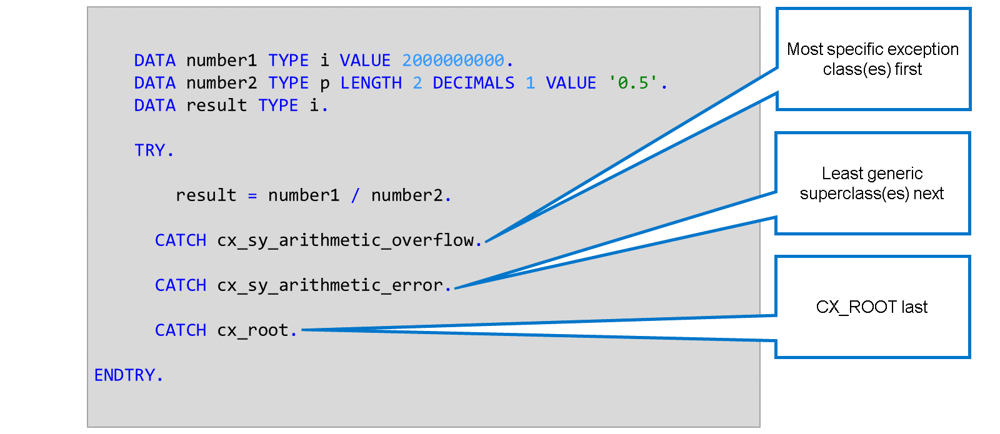
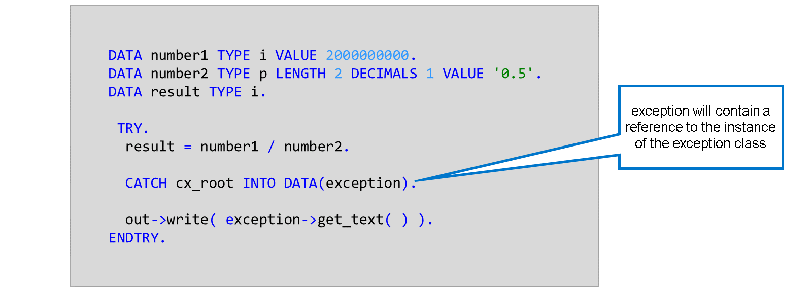
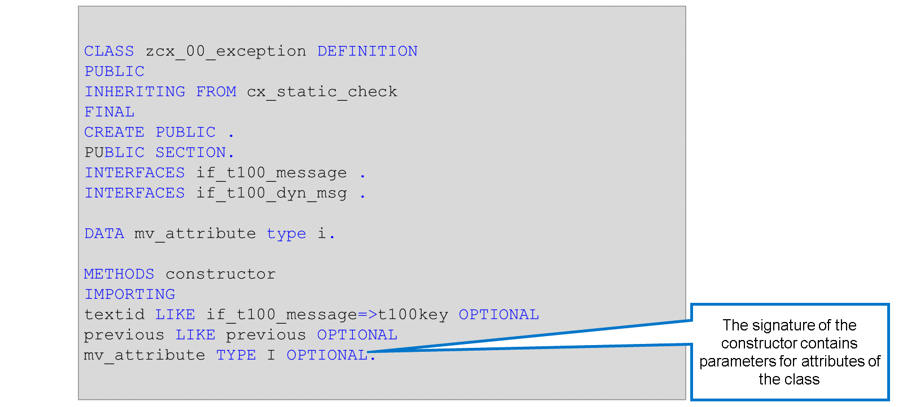
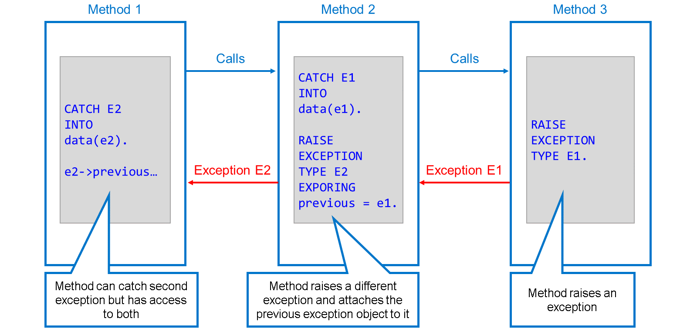
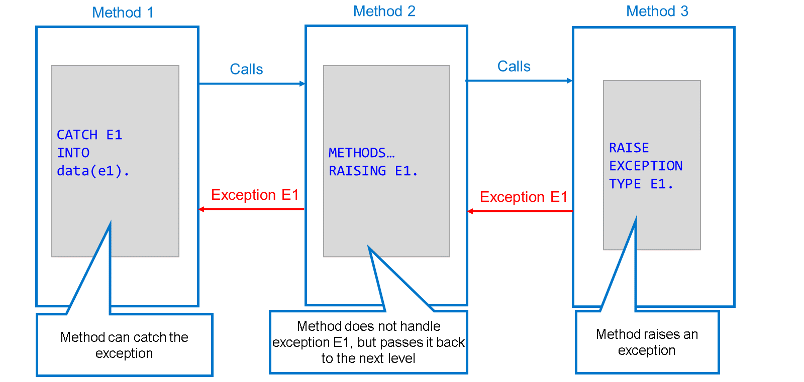

# 🌸 1 [WORKING WITH EXCEPTION CLASSES](https://learning.sap.com/learning-journeys/acquire-core-abap-skills/working-with-exception-classes_acd9568c-be4e-445a-a454-14c6f2cfcd2e)

> 🌺 Objectifs
>
> - [ ] Vous pourrez travailler avec des classes d'exception

## 🌸 EXCEPTION HANDLING

Plus tôt dans ce parcours d'apprentissage, nous avons étudié la gestion des erreurs à l'aide des instructions `TRY`, `CATCH` et `ENDTRY`. Après l'instruction TRY vient l'instruction susceptible de provoquer une erreur. Si l'erreur se produit, le système passe à l'instruction `CATCH` et traite son contenu. Quoi qu'il en soit, la méthode poursuit son traitement après l'instruction `ENDTRY`.

Dans un bloc `TRY…ENDTRY`, vous pouvez inclure plusieurs instructions `CATCH`. Cela vous permet de gérer différemment les exceptions.

Vous pouvez lister plusieurs exceptions dans une seule instruction `CATCH`. Dans cet exemple, le même bloc catch sera traité si le système déclenche `cx_sy_arithmetic_error` ou `cx_sy_zerodivide`.

Lorsqu'une classe est listée dans une instruction `CATCH`, le système traite le bloc correspondant si une exception liée à cette classe ou à l'une de ses sous-classes est déclenchée. Dans cet exemple, `cx_sy_arithmetic_error` est une superclasse de `cx_sy_arithmetic_overflow` et de `cx_sy_zerodivide`. Par conséquent, le bloc est traité si une exception du type de l'une des sous-classes est levée.

Toutes les classes d'exceptions font partie d'une hiérarchie d'héritage dont la superclasse supérieure est la classe `CX_ROOT`. Comme nous l'avons vu, si vous utilisez une superclasse dans une instruction CATCH, le système y accèdera si une exception du type de l'une de ses sous-classes est déclenchée. Puisque toutes les classes d'exceptions sont des sous-classes de `CX_ROOT`, l'instruction CATCH `CX_ROOT` suffit à intercepter n'importe quelle exception.

### SEQUENCE OF CATCH STATEMENTS

Lors de la rédaction d'instructions `CATCH`, vous devez placer la ou les classes les plus spécifiques en premier et les plus génériques en dernier. Placer une superclasse au-dessus d'une de ses sous-classes entraînera une erreur de syntaxe. En effet, le système ne pourra pas traiter le bloc `CATCH` spécifique, car il est éclipsé par le bloc plus générique.

### THE INTO ADDITION

Chaque exception est représentée par un objet. Vous pouvez placer cet objet dans une variable de référence et l'utiliser, par exemple pour récupérer le texte d'erreur de la classe d'exception à l'aide de la méthode `get_text()`, comme illustré dans l'exemple ci-dessous.

Vous pouvez utiliser une déclaration en ligne dans l'instruction CATCH pour garantir que la variable de référence est déclarée avec le type correct.

L'action la plus courante avec l'objet exception est d'appeler sa méthode `get_text()`. Cependant, les objets exception peuvent posséder d'autres attributs et méthodes pour vous aider à gérer l'erreur.

Les classes d'exception peuvent avoir des attributs décrivant plus précisément le problème. Ces attributs sont souvent utilisés pour remplir les espaces réservés des messages. Vous définissez l'attribut dans la section publique de la classe d'exception avec son nom et son type appropriés.

Pour remplir l'attribut lorsque l'exception est levée, vous avez besoin d'un paramètre d'importation correspondant du constructeur de la classe d'exception. Vous pouvez générer l'attribut à l'aide d'un correctif rapide. Placez le curseur sur le nom de la méthode constructeur et appuyez sur [Ctrl] + [1]. Choisissez le correctif rapide `Re-generate constructor`.

### THE ATTRIBUTE "PREVIOUS"

Il arrive qu'au sein d'une chaîne d'appel, une méthode intercepte une exception. En réponse, elle lève une exception différente que son propre appelant doit intercepter. Cela peut se produire, par exemple, si un framework lève une exception trop technique pour que l'application puisse la traiter elle-même. Cependant, dans certains cas, la méthode qui effectue cette opération (méthode 2 dans l'exemple) peut vouloir déclencher sa propre exception, tout en transmettant la première. Elle peut le faire grâce à l'attribut previous de la classe d'exception.

Lorsque vous déclenchez une exception, vous pouvez transmettre une instance d'une classe d'exception au paramètre d'importation précédent. Cela attache l'objet d'exception à la nouvelle exception. Une méthode interceptant la seconde exception peut accéder au premier objet d'exception grâce aux attributs publics en lecture seule précédents.

Précédent est implémenté dans la superclasse `CX_ROOT` et est donc disponible dans toutes les classes d'exception.

Une méthode n'a pas toujours besoin de gérer les exceptions d'une autre méthode qu'elle a appelée. Elle peut propager la méthode tout au long de la chaîne d'appel. Au lieu d'utiliser l'instruction `CATCH` pour gérer l'exception, la méthode inclut la clause `RAISING` dans sa définition. Cela indique aux appelants de la méthode que l'exception peut leur être transmise.

Si l'exception n'est pas interceptée tout au long de la chaîne d'appel, une erreur d'exécution se produit.
