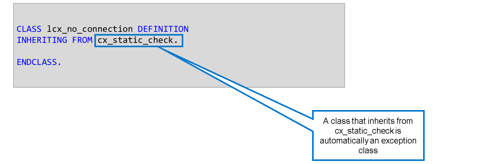

# 🌸 2 [DEFINING YOUR OWN EXCEPTION CLASSES](https://learning.sap.com/learning-journeys/acquire-core-abap-skills/working-with-exception-classes_acd9568c-be4e-445a-a454-14c6f2cfcd2e)

> 🌺 Objectifs
>
> - [ ] Vous pourrez définir vos propres classes d'exception

## 🌸 DEFINING YOUR OWN EXCEPTION CLASSES

Il existe de nombreuses classes d'exceptions système prédéfinies dont les noms commencent tous par `cx_sy`. Cependant, ces classes décrivent des erreurs techniques et ne reflètent pas la sémantique de votre application.

Dans une application de vol, une classe peut nécessiter une exception décrivant une situation où une combinaison particulière de compagnie aérienne et de numéro de vol n'existe pas.

Pour définir votre propre classe d'exception, créez une nouvelle classe héritant de la classe cx_static_check.

Dans cette vidéo, vous découvrirez comment créer, préparer, attacher et déclencher une exception.

[Référence - Link Vidéo](https://learning.sap.com/learning-journeys/acquire-core-abap-skills/defining-your-own-exception-classes_cf6cb318-246a-46ca-bd9a-f3eef5cbbb67)
