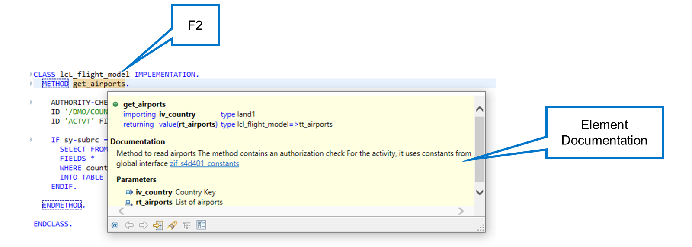
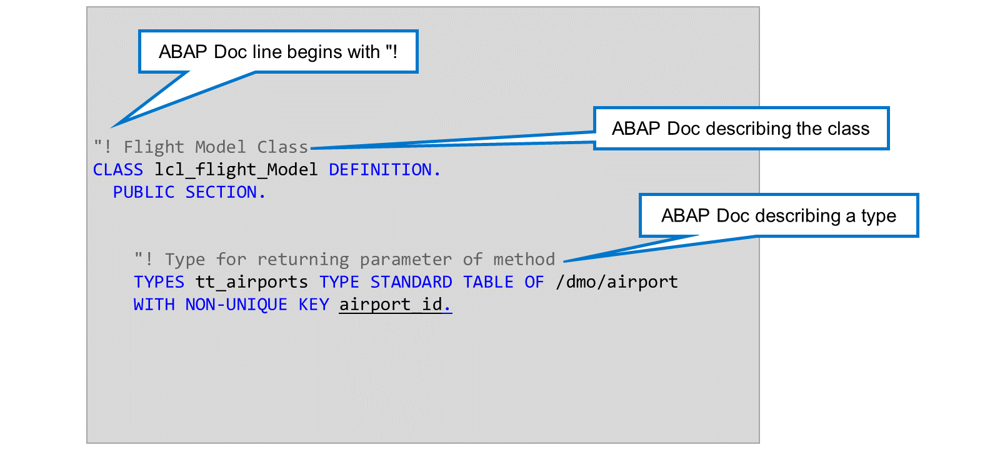
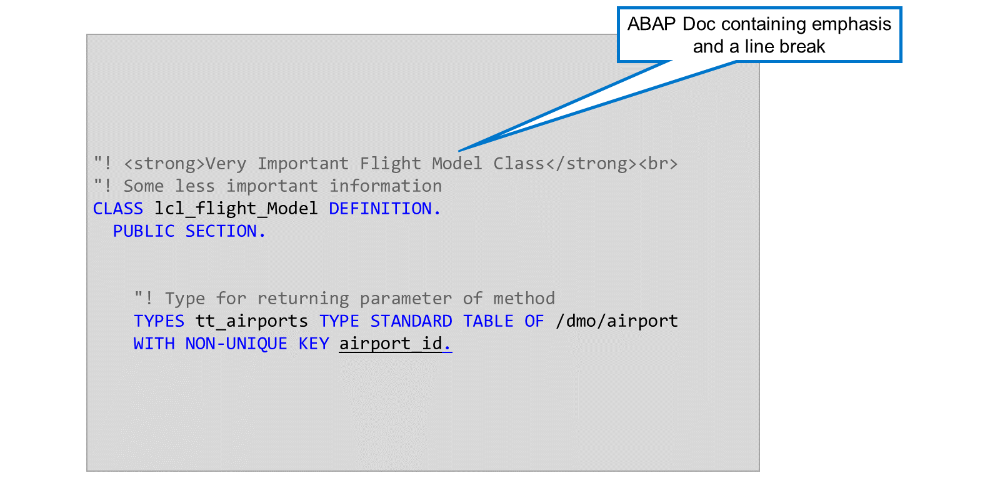
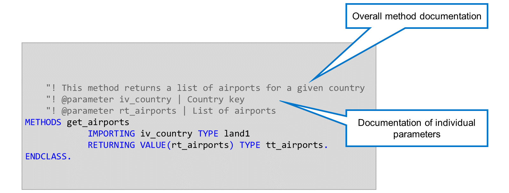
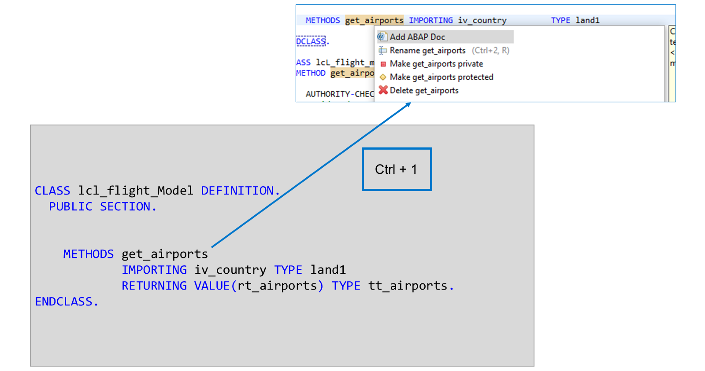
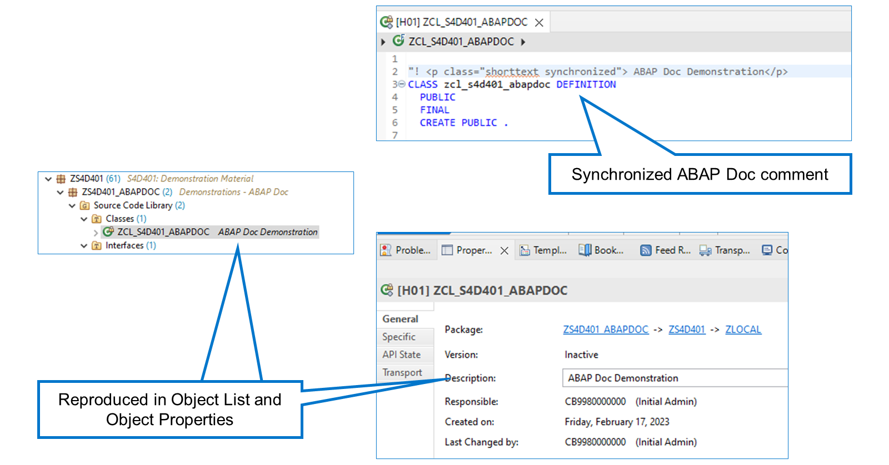
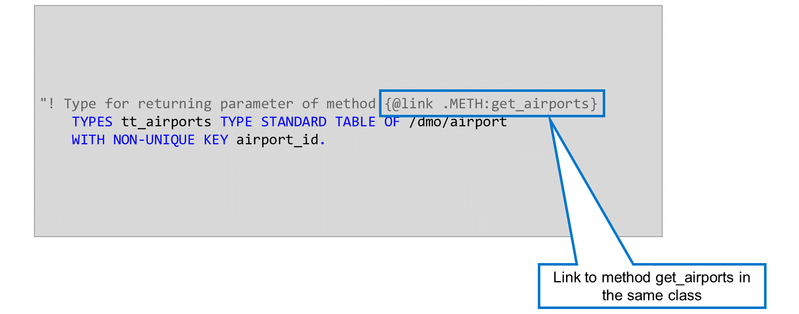

# 🌸 1 [DOCUMENTING ABAP CODE](https://learning.sap.com/learning-journeys/acquire-core-abap-skills/documenting-abap-code_ad565c7e-6ac5-4a49-95e2-e4c33268dac6)

> 🌺 Objectifs
>
> - [ ] Vous serez capable de documenter le code ABAP

## 🌸 ABAP CODE DOCUMENTATION

Si vous placez le curseur sur le nom d'une classe, d'une méthode ou d'un type, vous verrez une fenêtre de dialogue contenant les informations de l'élément correspondant : les paramètres de la méthode ou la description d'un type de données.

Vous pouvez également ajouter de la documentation à cette boîte de dialogue à l'aide d'**ABAP Doc**. Cette documentation est créée en ajoutant des lignes de commentaires spécifiques à votre code. **ABAP Doc** vous permet de documenter les instructions déclaratives suivantes :

- **CLASSE**

- **INTERFACE**

- **MÉTHODES**

- **TYPES**

- **DONNÉES**

- **CONSTANTES**

Vous pouvez également documenter les paramètres et exceptions individuels des méthodes et des modules de fonctions.

Une fois la classe activée, vos commentaires **ABAP Doc** sont intégrés aux informations des éléments de code.

Les commentaires **ABAP Doc** se placent avant l'élément qu'ils documentent. Ils commencent par les caractères `!`. Si vous tentez de créer un commentaire **ABAP Doc** à un emplacement non autorisé dans la classe, le système affiche un avertissement de syntaxe et la documentation est ignorée.

Les commentaires **ABAP Doc** ne sont pas traduisibles. Il est donc important de bien réfléchir à la langue dans laquelle vous souhaitez créer votre documentation.

**ABAP Doc** utilise un sous-ensemble de balises HTML pour formater votre documentation. L'exemple utilise la balise `<strong>` pour mettre en valeur le texte et la balise ` ` pour un saut de ligne. (Notez que sans la balise de saut de ligne, les deux lignes d'**ABAP Doc** sont affichées l'une à côté de l'autre).

En plus de l'emphase et du saut de ligne, vous pouvez utiliser les balises suivantes :

Balises de format supplémentaires dans ABAP Doc

| Purpose         | Formatting Tags                      |
| --------------- | ------------------------------------ |
| Header, level 1 | <h1>...</h1>                         |
| Header, level 2 | <h2>...</h2>                         |
| Header, level 3 | <h3>...</h3>                         |
| Italic text     | <em>...</em>                         |
| Paragraph       | 
...
                           |
| Unnumbered list | <ul><li>...</li>...<li>...</li></ul> |
| Numbered list   | <ol><li>...</li>...<li>...</li></ol> |

> #### 🍧 Hint
>
> Dans un document ABAP, vous pouvez utiliser la saisie semi-automatique du code pour insérer ces balises de formatage. Appuyez simplement sur Ctrl + Espace et choisissez parmi les formats disponibles.

Avec ABAP Doc, vous pouvez documenter une méthode et ses paramètres individuels. Pour documenter la méthode, utilisez les commentaires habituels `!`. Pour documenter un paramètre, utilisez la notation `! @parameter <name> |` et ajoutez votre commentaire après la barre verticale `|`.

Vous pouvez ajouter la documentation ABAP d'une méthode et de sa signature à l'aide d'un correctif rapide. Une fois la méthode déclarée, appuyez sur [Ctrl] + [1] pour ouvrir les correctifs rapides possibles, puis choisissez Ajouter une documentation ABAP. L'éditeur génère alors la documentation correspondante.

Si la signature d'une méthode change, vous pouvez utiliser des correctifs rapides pour supprimer les commentaires de la documentation ABAP des paramètres supprimés et pour ajouter des commentaires de la documentation ABAP pour les nouveaux paramètres.

Vous pouvez garantir que la description ABAP Doc d'un objet est répliquée dans la description des propriétés de l'objet et dans la liste des objets. Pour ce faire, utilisez une balise de paragraphe `
` avec l'ajout `class="shorttext synchronized"`.

Les modifications apportées à la description dans les propriétés de l'objet sont répliquées dans le commentaire ABAP Doc.

Vous pouvez ajouter des liens de navigation vers la documentation ABAP d'autres objets. Pour ce faire, utilisez la notation `{@link <object_name>}`.

Outre la création d'un lien vers la documentation ABAP d'un objet, vous pouvez également créer un lien vers ses éléments individuels. Dans notre exemple, il existe un lien vers la documentation ABAP de la méthode GET_AIRPORTS. Le lien « ! {@link zif_s4d401_constants.DATA:auth_create} » définit un lien vers la documentation ABAP de la constante auth_create dans l'interface ZIF_S4D401_CONSTANTS.

Utilisez les identifiants suivants pour chaque élément :

#### 💮 **DATA** :

pour les constantes, les variables et les paramètres de procédure dans le contexte approprié

#### 💮 **DOMA** :

pour les domaines du dictionnaire ABAP

#### 💮 **INTF** :

pour les interfaces implémentées dans une classe (utilisées pour accéder aux composants de l'interface)

#### 💮 **METH** :

pour les méthodes
