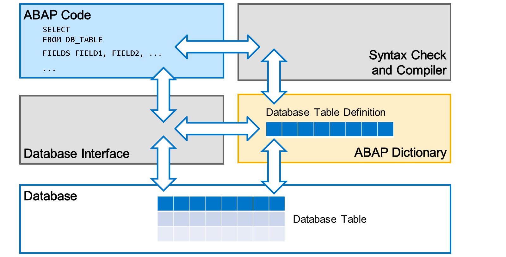
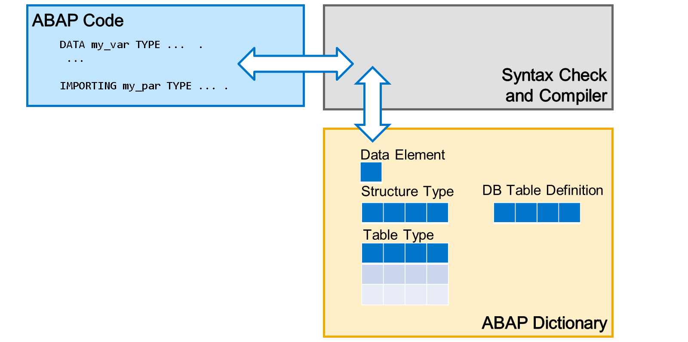
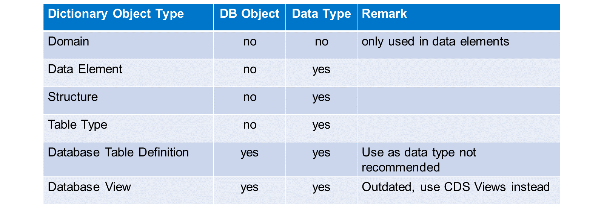

# 🌸 1 [EXPLORING ABAP DICTIONARY](https://learning.sap.com/learning-journeys/acquire-core-abap-skills/exploring-abap-dictionary_af8fdedf-0a10-43ab-aa1b-20abbece9d8b)

> 🌺 Objectifs
>
> - [ ] Décrire les tâches de base du dictionnaire ABAP
>
> - [ ] Nommer les objets les plus importants du dictionnaire

## 🌸 ABAP DICTIONARY

### ABAP DICTIONARY IN THE CLASSICAL ABAP WORLD

[Référence - Link Vidéo](https://learning.sap.com/learning-journeys/acquire-core-abap-skills/exploring-abap-dictionary_af8fdedf-0a10-43ab-aa1b-20abbece9d8b)

Une **définition de table** de base de données dans le dictionnaire ABAP est une représentation de la table dans la base de données. Elle est indépendante des détails de la base de données. Par exemple, elle utilise ses propres **types intégrés** et non les types spécifiques à la base de données. La définition contient la liste des champs de la table et des propriétés supplémentaires.

Lorsque le code ABAP accède à la table de base de données dans une instruction SQL ABAP, le contrôle de syntaxe ABAP analyse la définition dans le dictionnaire ABAP. Il vérifie notamment l'existence de la table et de ses champs.

À l'exécution, l'interface de base de données traduit l'instruction SQL ABAP dans la syntaxe SQL spécifique à la base de données et l'envoie à la base de données. Pour ce faire, elle interroge également la définition de la table dans le dictionnaire ABAP.

> #### 🍧 Note
>
> Auparavant, les vues de base de données étaient gérées de la même manière. Cependant, ces vues de dictionnaire ABAP sont obsolètes et les vues ABAP Core Data Services sont désormais utilisées (voir la leçon suivante).

La deuxième fonction du dictionnaire ABAP est de fournir des types de données pour le code ABAP. Les types de données définis dans le dictionnaire ABAP sont visibles dans l'ensemble du système, ce qui les distingue des types de données définis avec le mot-clé ABAP TYPES.

Les types du dictionnaire peuvent être des types scalaires (éléments de données), des types de structure (structures) et des types de table. Les définitions de tables de base de données ont un double rôle : elles définissent un objet de base de données, mais peuvent également servir de types de données dans le code ABAP.

> #### 🍧 Note
>
> En général, il est déconseillé d'utiliser des définitions de tables de base de données comme types de données. Privilégiez plutôt des types de structure dédiés.

.png>)

Dans les technologies d'interface utilisateur ABAP classiques, le dictionnaire ABAP remplissait une troisième fonction. Les objets du dictionnaire, principalement des types de structure et des définitions de tables de base de données, étaient enrichis d'informations sémantiques, telles que des relations de clés étrangères et des liaisons d'aide à la recherche. Lorsque les éléments d'interface utilisateur référençaient les objets du dictionnaire, ces informations supplémentaires étaient utilisées pour fournir des textes à l'utilisateur final, des aides à la saisie, des vérifications de saisie, etc.

Cette fonction du dictionnaire ABAP n'est pas pertinente pour les technologies d'interface utilisateur modernes, à savoir le modèle de programmation d'applications RESTful ABAP. Ce modèle utilise les métadonnées des entités CDS pour fournir des services à l'interface utilisateur.

Dans cette formation, nous n'aborderons pas les fonctionnalités du dictionnaire ABAP liées à la programmation d'interface utilisateur ABAP classique. Les techniques d'interface utilisateur ABAP classiques sont obsolètes et ne sont pas prises en charge par ABAP Cloud.

## 🌸 ABAP DICTIONARY OBJECTS

Voici un aperçu des objets les plus importants du dictionnaire ABAP.

- Les **domaines** ne définissent ni les objets de base de données ni les types de données ABAP. Ils ne sont utilisés qu'indirectement, à l'intérieur des éléments de données.

- Les **éléments de données**, les structures et les types de tables définissent les types de données ABAP. Ils ne définissent pas d'objets de base de données en tant que tels.

- L'objectif principal des **définitions de tables** et des **vues de base de données** est de définir un objet de base de données correspondant. Vous pouvez également les utiliser comme types de données, mais cela n'est pas recommandé. Les vues de dictionnaire sont obsolètes et il est préférable d'utiliser les vues CDS.

.png>)

Dans l'explorateur de projets d'ADT, vous trouverez les objets du dictionnaire sous le package de développement, dans un nœud dédié Dictionnaire.
