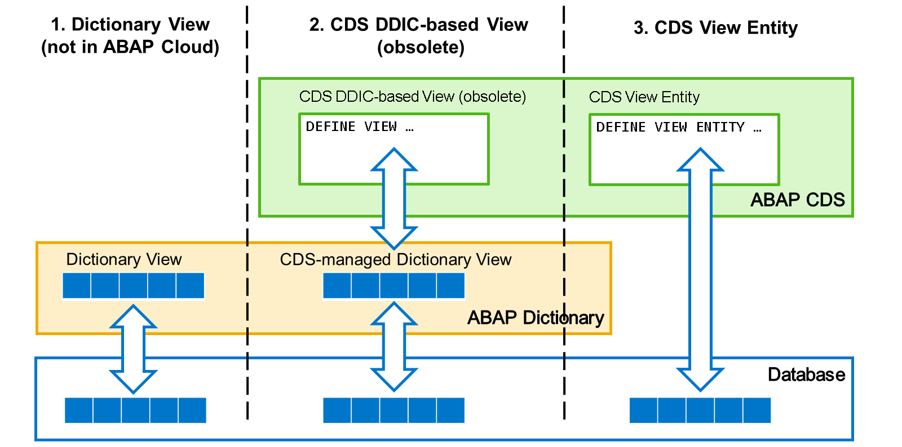
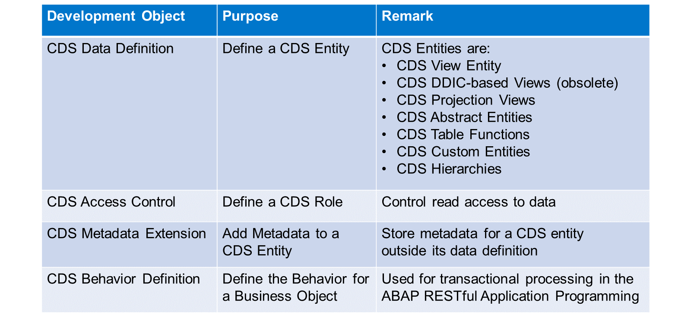

# 🌸 2 [EXPLORING ABAP CORE DATA SERVICES](https://learning.sap.com/learning-journeys/acquire-core-abap-skills/exploring-abap-dictionary_af8fdedf-0a10-43ab-aa1b-20abbece9d8b)

> 🌺 Objectifs
>
> - [ ] Décrire les tâches de base des services de données ABAP Core.
>
> - [ ] Nommer les objets CDS ABAP les plus importants.

## 🌸 ABAP CDS FUNCTIONALITY

### ABAP CORE DATA SERVICES

[Référence - Link Vidéo](https://learning.sap.com/learning-journeys/acquire-core-abap-skills/exploring-abap-core-data-services_f6b58d1f-ca51-461b-8355-aef95aa3864e)

Pendant longtemps, les développeurs ABAP ont défini des vues dans le dictionnaire ABAP, de la même manière qu'ils définissent les tables de base de données. Ces vues de dictionnaire étaient très limitées en termes de logique SQL. Elles ne prenaient en charge que les jointures internes, la sélection de champ (projection) et des conditions de filtrage simples. Notez que la définition de vues de dictionnaire n'est pas prise en charge dans les environnements ABAP cloud.

L'une des raisons pour lesquelles SAP a introduit Core Data Services dans ABAP était la nécessité d'exécuter de la logique sur la base de données. Comme vous le découvrirez plus tard dans cette formation, les vues CDS ABAP prennent en charge une grande variété d'expressions et de fonctions SQL pour introduire la logique dans la base de données.

Il existe deux types de vues CDS.

#### 💮 **CDS DDIC-based views (obsolete)** :

Ce type de vues CDS obsolète utilise une vue de dictionnaire générée comme représentation technique de l'objet de base de données. Les vues CDS basées sur DDIC sont définies avec l'instruction DEFINE VIEW.

#### 💮 **CDS View Entities** :

Cette nouvelle génération de vues CDS est définie avec l'instruction `DEFINE VIEW ENTITY`. Les entités de vue CDS définissent directement l'objet de base de données, sans générer d'objet de dictionnaire au préalable.

> #### 🍧 Note
>
> Dans cette formation, nous aborderons uniquement les entités de vue CDS. Pour les types de vue plus anciens, consultez la documentation des mots-clés ABAP.

.png>)

ABAP CDS ne prend pas seulement en charge la définition technique des objets de base de données. Il permet également d'enrichir ces définitions techniques avec des informations sémantiques.

Prenons un exemple.

L'entité de vue CDS `Z00_C_Employee` est définie avec une instruction `DEFINE VIEW ENTITY` dans une **définition de données CDS**. Il s'agit de la définition technique de la vue, utilisée pour créer une vue nommée `Z00_C_EMPLOYEE` dans la base de données. Outre l'instruction `DEFINE VIEW ENTITY`, le code source contient des **annotations**. Les **annotations** sont des éléments de code qui enrichissent la définition de la vue technique avec des informations sémantiques. Elles commencent par un signe `@`.

Seules quelques **annotations** sont évaluées par le système ABAP. Le reste est simplement transmis aux consommateurs de l'entité CDS, c'est-à-dire aux frameworks qui l'utilisent pour lire les données. Les consommateurs décident eux-mêmes des **annotations** à évaluer et de celles à ignorer.

Les consommateurs les plus importants des entités ABAP CDS sont les technologies d'interface utilisateur modernes telles que SAP Fiori et l'analyse intégrée SAP S/4HANA.

.png>)

Le cœur du modèle de programmation d'applications ABAP RESTful est l'objet métier.

La structure de l'objet métier est modélisée avec une ou plusieurs entités de vue CDS. Une définition de comportement CDS permet d'ajouter la logique transactionnelle. Cette logique est implémentée dans un pool de comportements ABAP, une classe ABAP de la bibliothèque de code source ABAP.

Les objets métier sont souvent utilisés par les services métier, par exemple les services OData. Vous pouvez également y accéder en code ABAP, grâce au langage de manipulation d'entités (EML).

> #### 🍧 Note
>
> Les détails de la modélisation, de l'implémentation et de l'utilisation des objets métier ne font pas partie de cette formation. Ils sont abordés dans un cours dédié au modèle de programmation d'applications ABAP RESTful.

## 🌸 ABAP CDS OBJECTS

Les objets de développement CDS importants sont les suivants :

#### 💮 **CDS Data Definition** :

Une définition de données CDS contient la définition d'une entité CDS. Les entités CDS les plus importantes sont les entités de vue CDS et leurs prédécesseurs, les vues DDIC désormais obsolètes.

Mais il existe de nombreux autres types d'entités CDS que vous pouvez définir dans une définition de données :

- Les vues de projection CDS sont basées sur une vue CDS et projettent un sous-ensemble de ses éléments.

- Les entités abstraites CDS décrivent uniquement les propriétés de type et ne sont instanciées sur aucun objet de base de données.

- Les fonctions de table CDS sont implémentées dans des fonctions de base de données et renvoient un ensemble de résultats tabulaire.

- Les entités personnalisées CDS sont implémentées manuellement, par exemple dans du code ABAP.

- Les hiérarchies CDS définissent des hiérarchies SQL à partir d'une source SQL.

> #### 🍧 Note
>
> Dans cette formation, nous nous concentrerons sur les entités de vue CDS. Pour plus de détails sur les autres entités CDS, consultez la documentation ABAP.

#### 💮 **CDS Access Control** :

Les contrôles d'accès CDS contiennent la définition d'un rôle CDS. Lors de l'accès aux entités SQL CDS auxquelles un rôle CDS est attribué, des conditions d'accès supplémentaires sont évaluées par défaut.

#### 💮 **CDS Metadata Extension** :

Les extensions de métadonnées CDS sont utilisées pour stocker les **annotations** CDS pour une entité CDS en dehors de sa définition de données.

#### 💮 **CDS Behavior Definition** :

Les définitions de comportement CDS définissent le comportement transactionnel d'un objet métier.

.png>)

Dans l'explorateur de projets des outils de développement ABAP, vous trouvez les objets CDS sous le package de développement, dans un nœud dédié Core Data Services.
