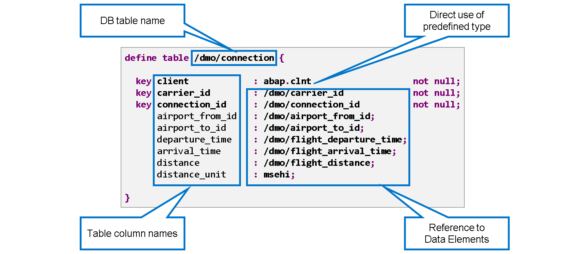
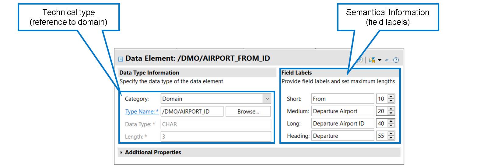
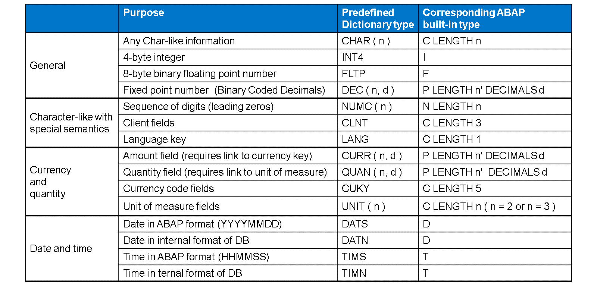
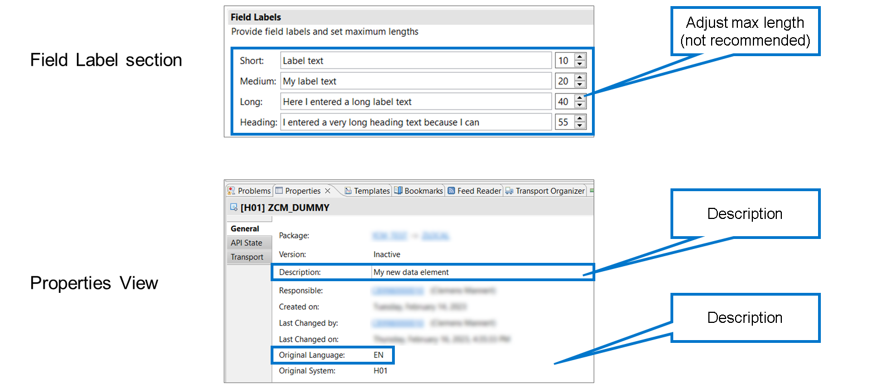

# 🌸 1 [DEFINING DOMAINS AND DATA ELEMENTS](https://learning.sap.com/learning-journeys/acquire-core-abap-skills/defining-domains-and-data-elements_b65b511a-4ad1-4437-80f5-5ad689cab833)

> 🌺 Objectifs
>
> - [ ] Décrire l'utilisation des éléments de données et des domaines lors de la définition des tables de base de données.
>
> - [ ] Créer des domaines.
>
> - [ ] Créer des éléments de données.

## 🌸 DATABASE TABLES, DATA ELEMENTS AND DOMAINS

### DATABASE TABLES IN THE ABAP DICTIONARY

[Référence - Link Vidéo](https://learning.sap.com/learning-journeys/acquire-core-abap-skills/defining-domains-and-data-elements_b65b511a-4ad1-4437-80f5-5ad689cab833)

Il s'agit d'une définition de table de base de données dans le dictionnaire ABAP. Le nom de la table de base de données est indiqué après le mot clé « define table », et les noms des champs de la table sont indiqués à gauche des deux-points (`:`). Les types de champs sont indiqués à droite des deux-points.

Dans cet exemple, le premier champ (champ client) est typé directement avec un type prédéfini (type `abap.clnt`). Ceci est généralement possible, mais il est recommandé de l'utiliser uniquement pour des champs purement techniques comme le champ client. Pour tous les autres champs, il est recommandé de référencer un élément de données afin que les champs soient également liés à des informations sémantiques.

Un élément de données spécifie les propriétés techniques et sémantiques d'un champ de table. Lorsqu'un élément de données est affiché, la définition du type technique se trouve à gauche et les informations sémantiques (libellés de champ) à droite.

Dans cet exemple, le type technique est défini par une référence à un domaine. Il s'agit de l'approche recommandée. Le type de données de base CHAR et la longueur 3 ne sont pas stockés dans l'élément de données lui-même, mais proviennent du domaine référencé. Ils sont affichés ici à titre de référence et pour vous éviter de naviguer dans le domaine.

Les libellés de champ deviennent pertinents lorsque les champs basés sur cet élément de données sont visibles dans l'interface utilisateur (IU). Cela est vrai pour les technologies d'IU ABAP classiques comme Screens (également appelés Dynpros) et Web Dynpro, ainsi que pour les techniques de programmation modernes comme le modèle de programmation d'applications ABAP RESTful. La principale différence entre les quatre libellés de champ à droite réside dans leur longueur maximale respective.

> #### 🍧 Note
>
> Les libellés de champ sont sujets à traduction. Ils sont conservés par le développeur dans la langue d'origine de l'objet. Ils peuvent ensuite être traduits dans d'autres langues.

.png>)

L'objectif principal d'un domaine est de spécifier les propriétés techniques d'un champ de table. Dans cet exemple, le domaine utilise le type technique CHAR et définit la longueur à 3.

D'autres paramètres permettent de restreindre la plage de valeurs des champs. Nous aborderons ce sujet en détail dans la section suivante.

## 🌸 CREATING A NEW DICTIONARY OBJECT

[Référence - Link Vidéo](https://learning.sap.com/learning-journeys/acquire-core-abap-skills/defining-domains-and-data-elements_b65b511a-4ad1-4437-80f5-5ad689cab833)

## 🌸 HOW TO CREATE A DOMAIN

[Référence - Link Vidéo](https://learning.sap.com/learning-journeys/acquire-core-abap-skills/defining-domains-and-data-elements_b65b511a-4ad1-4437-80f5-5ad689cab833)

## 🌸 PREDEFINED TYPES IN ABAP DICTIONARY

Lors de la création d'un domaine, vous devez choisir parmi différents types de dictionnaires prédéfinis. Certains sont destinés à un usage général, d'autres ont une fonction et une sémantique spécifiques.

#### 💮 **General** :

Les types de dictionnaires d'usage général sont CHAR, INT4, FLTP et DEC, qui correspondent directement aux types ABAP intégrés C, I, F et P.

#### 💮 **Char-like with special semantics** :

Les champs de type dictionnaire NUMC, CLNT et LANG sont de type char dans la base de données, mais possèdent une sémantique particulière.

- Les champs de type NUMC ne peuvent contenir que des chiffres, et certains frameworks ABAP insèrent automatiquement des zéros non significatifs.

- Un champ clé de type CLNT dans une table de base de données est automatiquement traité comme un champ client. Par défaut, l'accès à cette table est limité au client de connexion de l'utilisateur actuel.

- Un champ clé de type LANG dans une table de base de données est identifié comme une clé de langue. Les clés de langue sont importantes dans les tables contenant du texte traduisible (tables de texte).

#### 💮 **Currency and Quantity** :

Le dictionnaire ABAP connaît des types dédiés aux champs de montant et aux quantités. Techniquement, les types prédéfinis CURR et QUAN sont identiques au type DEC et, comme DEC, ils sont mappés au type ABAP P. Cependant, comme nous le verrons plus loin, tout champ de table de type CURR doit être lié à un champ de code de devise. De même, un champ de type QUAN nécessite un lien vers un champ contenant une unité de mesure.

Les types prédéfinis CUKY et UNIT permettent d'identifier un champ comme un champ de code de devise ou un champ d'unité de mesure. Techniquement, il s'agit simplement de champs de caractères de longueur fixe : 5 pour les codes de devise et 2 ou 3 pour les champs d'unité de mesure.

#### 💮 **Date and Time** :

En ABAP, les informations de date et d'heure sont traitées comme une séquence de 8 chiffres (date) et 6 chiffres (heure). Pendant longtemps, le dictionnaire ne connaissait que les types prédéfinis DATS et TIMS. Avec ces types, les champs de la base de données sont de type caractère, avec le même format qu'en ABAP. Avec les nouveaux types DATN et TIMN, le framework peut créer les champs de la base de données avec des formats optimisés spécifiques à la base de données. Notez que cela n'a aucun impact sur le code ABAP. Les anciens et nouveaux types de dictionnaires sont mappés aux mêmes types ABAP prédéfinis.

.png>)

Lorsque vous définissez un domaine avec l'un des types DEC, QUAN ou CURR, vous devez spécifier une longueur et le nombre de décimales. Ceci est similaire à l'utilisation du type P en ABAP. Il existe cependant une différence majeure.

En ABAP, le nombre n dans TYPE P LENGTH n correspond au nombre d'octets. Le nombre de chiffres est alors déduit par la formule : 2 \* n - 1. Dans le dictionnaire ABAP, le nombre de chiffres est spécifié directement.

En ABAP, un objet de données de type P occupe toujours un nombre entier d'octets. Il en résulte toujours un nombre impair de chiffres. Si le type dictionnaire utilise DEC, QUAN ou CURR avec une longueur paire, les objets de données ABAP seront mis à niveau vers le nombre entier d'octets suivant.

Prenons un exemple. L'élément de données /DMO/FLIGHT_PRICE est de type CURR avec une longueur de 16. Pour stocker les 16 chiffres et un signe, 8,5 octets sont nécessaires. La variable ABAP price est typée avec l'élément de données /DMO/FLIGHT_PRICE. Comme le montre l'affichage du débogueur, sa longueur ABAP est de 9, car il est impossible d'occuper 8,5 octets. Il est donc techniquement possible d'attribuer des valeurs PRICE à 17 chiffres.

> #### 🍧 Hint
>
> Lorsque vous définissez des domaines de type DEC, QUAN ou CURR, privilégiez des valeurs de longueur impaires afin d'éviter les incohérences et le gaspillage de mémoire.

## 🌸 DATA ELEMENT CREATION

### DATA ELEMENTS - DEFINING THE TECHNICAL TYPE

[Référence - Link Vidéo](https://learning.sap.com/learning-journeys/acquire-core-abap-skills/defining-domains-and-data-elements_b65b511a-4ad1-4437-80f5-5ad689cab833)

Il existe deux emplacements pour gérer les textes d'un élément de données : trois étiquettes et un titre dans la section « Étiquettes de champ », et une description dans la vue Propriétés, généralement affichée dans l'onglet sous l'éditeur.

Les étiquettes et le titre sont assortis de longueurs maximales. Lorsque vous créez un élément de données, l'éditeur prédéfinit ces longueurs selon des valeurs suggérées. Il est recommandé de conserver les longueurs suggérées. Divers frameworks, principalement des techniques d'interface utilisateur, utilisent les étiquettes et le titre pour fournir des métadonnées sémantiques aux champs.

Comme tous les autres objets de développement ABAP, les éléments de données possèdent également une description. Notez que cette description n'est pas destinée à l'utilisateur final. Elle sert à fournir des informations sémantiques supplémentaires aux développeurs qui analysent le code existant ou envisagent de réutiliser l'élément de données.

Lorsque vous gérez les textes d'un élément de données, il est important que votre langue de connexion soit identique à la langue d'origine de l'objet. Vous trouverez la langue d'origine dans la vue Propriétés. Lorsque vous créez un élément de données, la langue d'origine est automatiquement définie sur votre langue de connexion.

> #### 🍧 Note
>
> Les textes d'un élément de données sont sujets à traduction. Des informations détaillées sur le mécanisme de traduction sont disponibles dans la documentation ABAP ou dans le cours Programmation ABAP intermédiaire.

## 🌸 HOW TO CREATE A NEW DATA ELEMENT WITH A NEW DOMAIN

[Référence - Link Vidéo](https://learning.sap.com/learning-journeys/acquire-core-abap-skills/defining-domains-and-data-elements_b65b511a-4ad1-4437-80f5-5ad689cab833)
