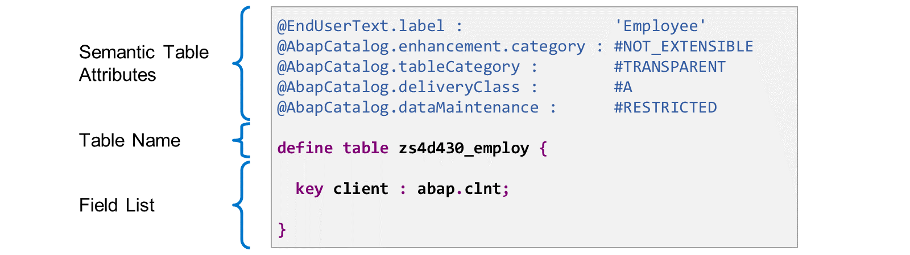
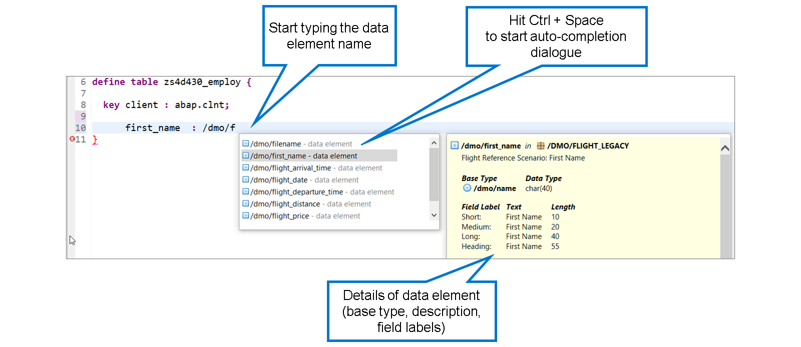
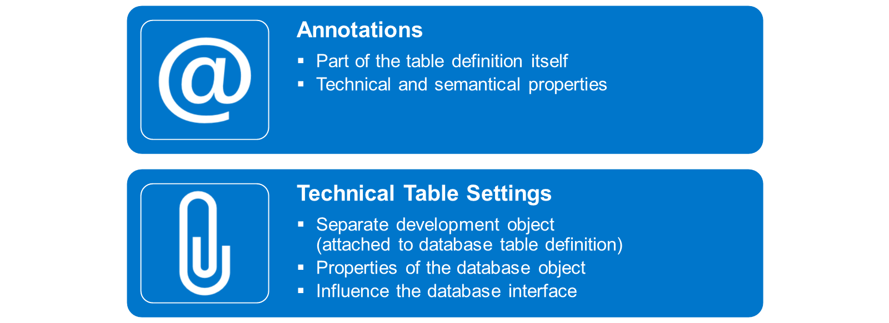
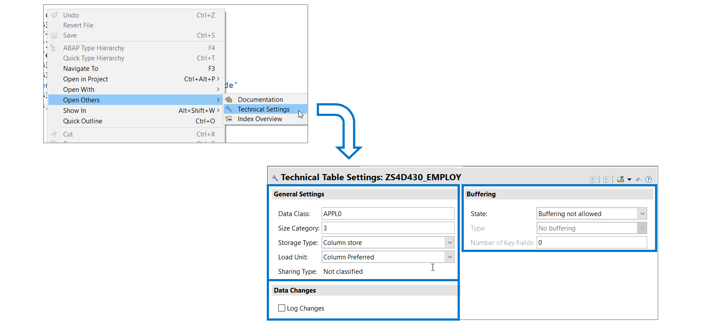
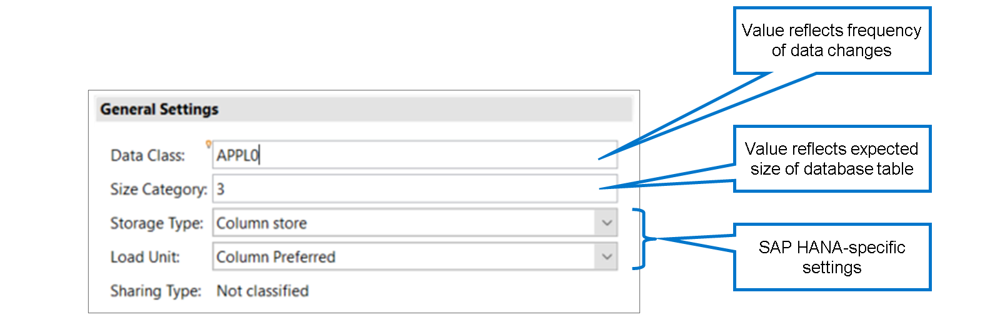
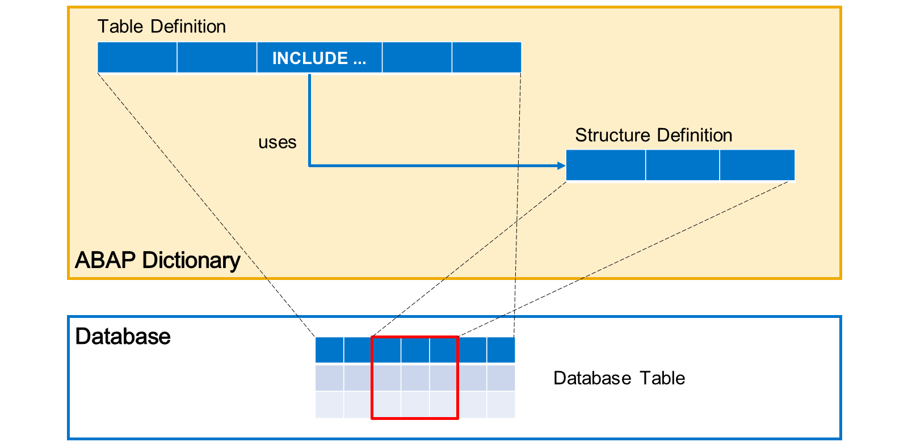

# 🌸 2 [CREATING DATABASE TABLES](https://learning.sap.com/learning-journeys/acquire-core-abap-skills/creating-database-tables_ebc1477d-96ed-414b-82d4-4171da43f4a6)

> 🌺 Objectifs
>
> - [ ] Créer une définition de table
>
> - [ ] Modifier la liste des champs d'une table de base de données
>
> - [ ] Gérer des propriétés de table supplémentaires
>
> - [ ] Définir et utiliser des structures d'inclusion

## 🌸 TABLE DEFINITION CREATION

Lors de la création d'une définition de table de base de données, l'éditeur utilise un modèle illustrant la structure de base du code source. Ce modèle se compose des trois parties suivantes :

#### 💮 **Semantic Table Attributes** :

Les lignes de code commençant par le signe @ sont appelées annotations et définissent les attributs de table sémantique. Ces attributs sémantiques sont prédéfinis avec les valeurs les plus courantes. Nous les aborderons plus loin dans ce cours.

#### 💮 **Define Table Statement** :

L'instruction « Define Table » est suivie du nom de la table de base de données. Vous spécifiez ce nom lors de la création de l'objet de développement. Sa modification dans le code source entraîne une erreur de syntaxe.

#### 💮 **Field List** :

Les crochets suivant le nom de la table contiennent la liste des champs de la table. Chaque définition de champ se termine par un point-virgule ( ; ) et se compose d'un nom de champ et d'un type de champ séparés par deux points ( : ). Le modèle de définition de table de base de données suggère un premier champ de table nommé « client » et de type « abap.clnt ». Conservez ce champ pour garantir que votre table reste dépendante du client.

## 🌸 HOW TO CREATE A NEW TABLE DEFINITION

[Référence - Link Vidéo](https://learning.sap.com/learning-journeys/acquire-core-abap-skills/creating-database-tables_ebc1477d-96ed-414b-82d4-4171da43f4a6)

## 🌸 FIELD LIST EDITING

Lorsque vous modifiez la liste des champs d'une table de base de données, il est recommandé d'utiliser des éléments de données. Si l'élément de données existe déjà, commencez par saisir son nom après les deux points, puis appuyez sur Ctrl + Entrée pour afficher la liste des éléments de données correspondants. Faites défiler la liste vers le haut ou vers le bas pour afficher les détails des éléments de données, par exemple le type de base, la description et les libellés des champs.

.png>)

Si vous ne souhaitez utiliser aucun élément de données, vous pouvez en créer un directement à l'aide d'un correctif rapide. Si vous saisissez un nom de type qui ne correspond pas à un élément de données, un message d'erreur s'affiche. Ce message d'erreur est accompagné d'un correctif rapide. Cliquez sur l'icône d'erreur à gauche de cette ligne de code ou placez le curseur sur le nom du type et appuyez sur Ctrl + 1 pour activer le correctif rapide.

> #### 🍧 Note
>
> Le message d'erreur est le suivant : Champ <nom du champ> : Type de composant ou domaine utilisé inactif ou inexistant. Ne vous laissez pas tromper. Il n'est pas possible d'utiliser des domaines directement dans la liste des champs des tables de base de données.

.png>)

Chaque table de base de données nécessite une clé primaire. La clé primaire est l'identification unique d'une ligne de la table. Elle se compose d'un sous-ensemble de champs de la table, appelés champs clés. L'index primaire est créé pour la clé primaire de la table. Cet index optimise l'accès aux lignes de la table lorsque des valeurs sont spécifiées pour les champs clés.

Dans la définition de la table de base de données, vous marquez un champ comme champ clé en spécifiant « clé supplémentaire » devant son nom. Au moins un champ de la table doit être marqué comme champ clé, et chaque table peut contenir jusqu'à 16 champs clés. Les champs clés d'une table doivent être regroupés au début de la table, ce qui signifie qu'aucun champ non clé n'est autorisé entre deux champs clés.

.png>)

Une valeur nulle est une valeur spéciale renvoyée par une base de données pour indiquer une valeur ou un résultat indéfini. Les valeurs nulles ne correspondent à aucun contenu d'objet de données en ABAP. Si la base de données renvoie une valeur nulle, elle est remplacée par la valeur initiale spécifique au type en ABAP.

À l'origine, l'ajout de NOT NULL était utilisé pour imposer la valeur initiale spécifique au type dans la base de données afin d'éviter toute confusion entre valeurs initiales et valeurs nulles. En ajoutant NOT NULL à un champ de table, le développeur s'assurait que la colonne de la table ne puisse pas contenir de valeurs nulles. Ceci était particulièrement important pour les clés primaires. Par conséquent, l'ajout de NOT NULL est devenu obligatoire pour les champs clés.

Aujourd'hui, l'ajout de NOT NULL est toujours obligatoire pour les champs clés, mais il n'a plus d'effet. L'outil dictionnaire impose la valeur initiale spécifique au type pour presque tous les champs, que vous ajoutiez NOT NULL ou non.

La seule exception concerne les champs de certains types, notamment ceux pour lesquels aucune valeur initiale n'existe. Pour ces champs, il est techniquement impossible d'imposer des valeurs initiales. Par conséquent, l'éditeur ne permet pas d'ajouter NOT NULL à ces champs. Dans l'exemple, l'élément de données /DMO/email_address est basé sur le type prédéfini STRG. Ce type STRG est l'un des types prédéfinis pour lesquels aucune valeur initiale n'existe. Lorsque vous ajoutez NOT NULL au champ email_address, l'éditeur génère une erreur de syntaxe.

> #### 🍧 Note
>
> Il n'est pas nécessaire d'ajouter manuellement l'indicateur NOT NULL aux champs clés. Si, lors de l'activation, l'indicateur NOT NULL est manquant pour un champ clé, l'éditeur l'ajoute automatiquement.

.png>)

Les champs de montant sont des champs basés sur le type prédéfini CURR. Dans les définitions de tables de base de données, les champs de montant nécessitent une référence à un champ de code de devise. Les champs de code de devise sont basés sur le type prédéfini CUKY. Dans l'exemple, le champ PRICE est un champ de montant et le champ CURRENCY_CODE est un champ de code de devise. La référence est définie par l'annotation @Semantics.amount.currencyCode avant le champ de montant. L'argument de l'annotation contient le nom de la table et celui du champ de code de devise, séparés par un point (.).

> #### 🍧 Note
>
> Généralement, les champs de montant et de code de devise se trouvent dans la même table de base de données, comme dans notre exemple. Cependant, il est également possible de référencer un champ de code de devise dans une autre table de base de données.

De même, les champs de quantité, basés sur le type prédéfini QUAN, nécessitent une référence à un champ d'unité, basé sur le type prédéfini UNIT. L'annotation correspondante pour les champs de quantité est @Semantics.quantity.unitOfMeasure.

> #### 🍧 Note
>
> Les frameworks d'interface utilisateur classiques étaient construits directement sur les objets du dictionnaire. Ils évaluaient les champs référencés pour ajuster l'affichage des montants et des quantités en fonction du code de devise ou de l'unité. Nous verrons plus loin que pour les interfaces utilisateur modernes construites sur les vues CDS, des annotations similaires sont disponibles pour les champs de montant et de quantité dans les vues CDS.

### QUICK FIXES FOR A%PUNT AND QUANTITY FIELDS

[Référence - Link Vidéo](https://learning.sap.com/learning-journeys/acquire-core-abap-skills/creating-database-tables_ebc1477d-96ed-414b-82d4-4171da43f4a6)

## 🌸 HOW TO EDIT THE FIELD LIST

[Référence - Link Vidéo](https://learning.sap.com/learning-journeys/acquire-core-abap-skills/creating-database-tables_ebc1477d-96ed-414b-82d4-4171da43f4a6)

## 🌸 ADDITIONAL TABLE PROPERTIES

La liste des champs est un élément essentiel de la définition d'une table de base de données. Cependant, des informations supplémentaires sont nécessaires pour définir une table. Les propriétés de la table sont définies selon les techniques suivantes :

#### 💮 **Annotations** :

Les annotations sont des lignes de code commençant par le signe @. Elles font partie intégrante de la définition de la table et définissent ses propriétés techniques et sémantiques.

#### 💮 **Technical Table Settings** :

Les paramètres techniques de la table constituent un objet de développement autonome, activable et transportable séparément de la table. Ils définissent les propriétés de la table physique de la base de données et influencent l'accès via ABAP SQL.

> #### 🍧 Note
>
> Lorsque vous créez une table de base de données, l'éditeur définit les propriétés de la table sur les valeurs les plus courantes. Cela vous permet d'activer la table sans modifier ses propriétés. Cependant, assurez-vous toujours que les valeurs par défaut sont adaptées à votre table et modifiez-les si nécessaire.

### TABLE ANNOTATIONS

[Référence - Link Vidéo](https://learning.sap.com/learning-journeys/acquire-core-abap-skills/creating-database-tables_ebc1477d-96ed-414b-82d4-4171da43f4a6)

Certaines propriétés de table ne sont pas gérées par des annotations, mais par un éditeur dédié basé sur des formulaires. Pour ouvrir cet éditeur de paramètres de table technique, faites un clic droit n'importe où dans la définition de la table de base de données et choisissez Ouvrir Autres → Paramètres techniques.

> #### 🍧 Hint
>
> Les paramètres de la table technique sont également affichés dans l'Explorateur de projets, en tant que sous-élément de la table de base de données.

La boîte de dialogue Paramètres techniques de la table comprend les trois sections suivantes :

#### 💮 **General Settings** :

L'objectif principal des paramètres généraux est d'influencer la création de la table dans la base de données. La transmission d'un paramètre à la base de données dépend du système de base de données. La classe de données, par exemple, n'a plus d'effet avec SAP HANA. Cependant, il est toujours obligatoire de fournir une valeur.

#### 💮 **Buffering** :

Les paramètres de mise en mémoire tampon permettent de définir si et comment la mise en mémoire tampon d'une table de dictionnaire est autorisée dans la mémoire tampon d'une instance de serveur d'applications. Lorsque des tables avec mise en mémoire tampon active sont accessibles via ABAP SQL, la mémoire tampon est utilisée implicitement.

#### 💮 **Data Changes** :

Si la journalisation est activée dans cette section, toutes les modifications apportées aux entrées de la table dans ABAP SQL sont enregistrées dans la table de journalisation DBTABLOG. Il existe divers prérequis et restrictions. Pour plus de détails, consultez la documentation ABAP.

Ce mécanisme de journalisation doit être limité aux tables de base de données très importantes et rarement modifiées. Étant donné que les modifications de données de toutes les tables associées à cet indicateur sont enregistrées dans la même table de base de données, des situations de verrouillage peuvent survenir pour la table de journalisation. En général, la journalisation doit être effectuée par la logique applicative.

Les paramètres généraux peuvent influencer la création de la table dans la base de données. Cependant, tous les paramètres n'ont pas d'influence. La transmission d'un paramètre technique à la base de données dépend du système de base de données.

Les paramètres généraux suivants existent :

#### 💮 **Data Class** :

La classe de données n'a d'effet que sur les bases de données Oracle. Elle est ignorée par toutes les autres bases de données, notamment SAP HANA. Elle reste obligatoire, mais uniquement à des fins de documentation. Les classes de données les plus importantes pour les données d'application sont :

- APPL0 (données de base) : données rarement modifiées. Les données d'une table d'adresses, telles que les noms, les adresses postales et les numéros de téléphone, sont des exemples de données de base.

- APPL1 (données de transaction) : données fréquemment modifiées. Les stocks d'entrepôt, qui changent à chaque commande, sont des exemples de données de transaction.

- APPL2 (données d'organisation) : données de personnalisation spécifiées lors de la configuration du système et rarement modifiées par la suite. La table T005, qui contient les codes pays, en est un exemple.

Il existe d'autres classes de données pour les tables système utilisées en interne par les frameworks d'exécution, telles que DDIC pour les tables de dictionnaire ABAP.

#### 💮 **Size Category** :

La catégorie de taille affecte la taille de la zone mémoire initiale réservée à la table dans la base de données. Des valeurs comprises entre 0 et 9 peuvent être spécifiées, et des intervalles de lignes attendues leur sont attribués. Les limites d'intervalle attribuées à chaque catégorie de taille dépendent de la structure de la table de la base de données. Si l'espace initial réservé est dépassé, une nouvelle zone mémoire est ajoutée implicitement, conformément à la catégorie de taille choisie.

> #### 🍧 Hint
>
> Il est conseillé de choisir une catégorie de taille appropriée afin d'éviter un nombre excessif de zones mémoire de petite taille ou une zone mémoire trop grande.

#### 💮 **Storage Type** :

Le type de stockage n'a d'effet que si la base de données actuelle est une base de données SAP HANA. Les paramètres suivants peuvent être définis pour la base de données SAP HANA :

- Stockage de colonnes : ce paramètre est à utiliser dans les cas suivants :

  - La table de base de données DDIC est conçue pour les données d'application analysées dans SAP HANA.

  - La table de base de données DDIC contient un très grand nombre de lignes, car le type de stockage Stockage de colonnes offre une meilleure compression.

  - La table de base de données DDIC contient des champs de table avec des types de données SAP HANA pris en charge uniquement par le type de stockage Stockage de colonnes.

- Stockage de lignes : ce paramètre est à utiliser uniquement dans les bases de données SAP HANA si la table est principalement utilisée pour des accès fréquents à une seule ligne.

> #### 🍧 Hint
>
> Pour plus d'informations sur les différences entre le stockage de lignes et le stockage de colonnes dans la base de données SAP HANA, consultez la documentation SAP HANA.

#### 💮 **Load Unit** :

L'unité de chargement n'a d'effet que si la base de données actuelle est SAP HANA. L'unité de chargement d'une table spécifie le mode de chargement des données dans la mémoire principale de la base de données SAP HANA. La base de données SAP HANA propose les paramètres suivants :

- Chargement par colonne : la table entière est considérée comme en mémoire. Les données de la table sont chargées au démarrage du système dans un format orienté colonnes dans la mémoire principale de la base de données SAP HANA. Il s'agit du comportement par défaut.

- Chargement par page : grâce à une fonctionnalité de la base de données SAP HANA appelée NSE (Native Storage Extension), les données de la table sont stockées sur le disque par pages plutôt que par colonnes. Ces pages sont chargées uniquement sur demande dans un tampon spécial de la mémoire principale de SAP HANA. Les données inutilisées dans le tampon peuvent être paginées.

Le chargement par page est généralement utilisé pour les tables volumineuses nécessitant des accès moins fréquents.

Dans le dictionnaire, vous pouvez soit imposer un paramètre d'unité de chargement spécifique, soit simplement le définir comme préférence, ce qui permet d'utiliser un paramètre différent pour la base de données.

> #### 🍧 Hint
>
> Pour plus d'informations sur l'extension de stockage natif de la base de données SAP HANA, consultez la documentation SAP HANA.

## 🌸 HOW TO MAINTAIN THE TECHNICAL TABLE SETTINGS

[Référence - Link Vidéo](https://learning.sap.com/learning-journeys/acquire-core-abap-skills/creating-database-tables_ebc1477d-96ed-414b-82d4-4171da43f4a6)

## 🌸 DATABASE TABLES WITH INCLUDE STRUCTURES

L'inclusion de structures est une technique permettant d'ajouter un sous-ensemble complet de champs à la liste d'une table de base de données. Vous définissez d'abord un objet de développement de type Structure avec les champs à ajouter à la table. Cet objet de développement ne définit pas d'objet de base de données lui-même. Cependant, lorsque vous le référencez dans la liste de champs à l'aide de l'instruction INCLUDE, la table de base de données contiendra les champs définis dans la structure à la position de l'instruction INCLUDE.

Dans l'exemple, la structure définit trois champs. La définition de la table en définit quatre, avec une instruction include entre le deuxième et le troisième. La table de base de données comporte alors sept colonnes au total.

Cette technique est couramment utilisée dans un modèle de données, où l'on souhaite s'assurer que plusieurs tables de base de données contiennent le même sous-ensemble de champs de types identiques.

Dans les exemples suivants, nous utiliserons une structure include pour ajouter des champs administratifs pour les utilisateurs et les horodatages à une table de base de données.

> #### 🍧 Note
>
> Ces champs administratifs jouent un rôle important dans le modèle de programmation d'applications ABAP RESTful.

.png>)

Il s'agit de la définition d'une structure comportant cinq champs : deux pour les noms d'utilisateur et trois pour les différents horodatages.

Comme vous pouvez le constater, la définition de la structure est très similaire à celle d'une table de base de données. La principale différence réside dans l'utilisation du mot-clé « define structure » au lieu de « define table », et dans l'absence de nombreuses annotations obligatoires pour une table de base de données.

.png>)

Les cinq champs de la structure sont ajoutés à la liste des champs de la table de base de données avec le mot-clé INCLUDE, suivi du nom de la structure.

> #### 🍧 Hint
>
> Utilisez la fonction de saisie semi-automatique de l'éditeur (Ctrl + Espace) pour choisir parmi les structures existantes.

Notez que les champs ne sont pas copiés. La définition de la table de base de données référence les champs de la structure. Ainsi, lorsque vous modifiez ultérieurement la liste des champs de la structure, celle de la table de base de données est immédiatement mise à jour.

.png>)

Un moyen pratique de vérifier le résultat est d'afficher l'infobulle de la table de base de données. Placez le curseur sur le nom de la table et appuyez sur la touche F2. Comme vous pouvez le constater, la liste des champs de la table contient les cinq champs de la structure d'inclusion.

## 🌸 HOW TO DEFINE AND USE AN INCLUDE STRUCTURE

[Référence - Link Vidéo](https://learning.sap.com/learning-journeys/acquire-core-abap-skills/creating-database-tables_ebc1477d-96ed-414b-82d4-4171da43f4a6)
