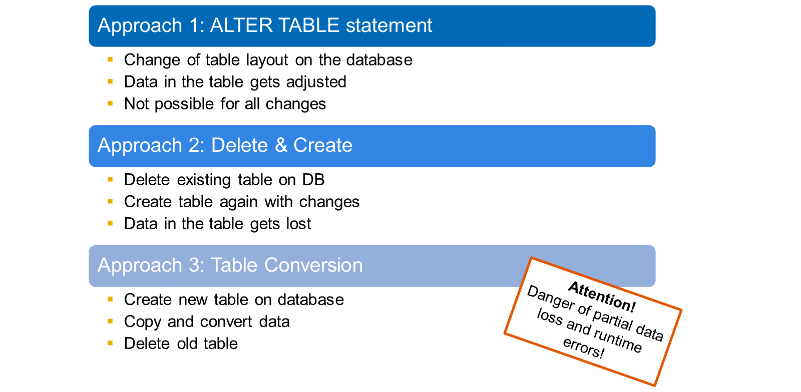
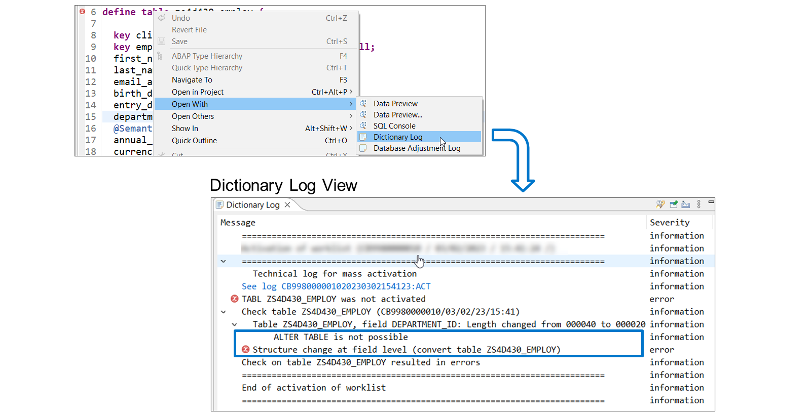
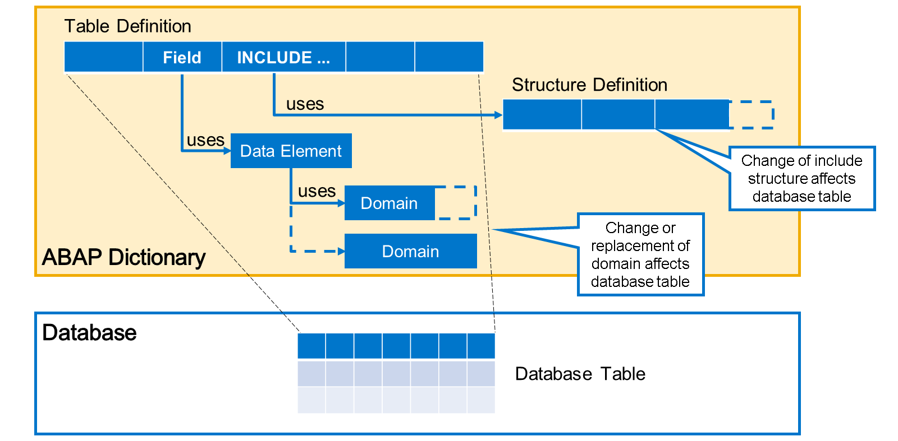

# 🌸 3 [HANDLING CHANGES TO DATABASE TABLES](https://learning.sap.com/learning-journeys/acquire-core-abap-skills/handling-changes-to-database-tables_d6d6d97a-979e-4efe-b5c3-f3e3d85332fb)

> 🌺 Objectifs
>
> - [ ] Décrire l'ajustement des tables de base de données
>
> - [ ] Ajuster les modifications directes apportées aux tables de base de données
>
> - [ ] Décrire le processus de conversion des tables de base de données
>
> - [ ] Ajuster les modifications indirectes apportées aux tables de base de données

## 🌸 ADJUSTMENT OF DATABASE TABLES

Si une modification du dictionnaire affecte une table de base de données, directement ou indirectement, elle doit être appliquée à cette table. C'est ce qu'on appelle l'ajustement de la table de base de données.

Il existe trois approches différentes pour ajuster une table de base de données :

#### 💮 **ALTER TABLE** :

Grâce à cette instruction SQL, l'outil dictionnaire peut modifier la disposition de la table dans la base de données. Les données de la table sont ajustées si nécessaire. Cependant, toutes les modifications ne peuvent pas être implémentées avec ALTER TABLE. En particulier, celles qui impliquent un risque de perte de données ou d'erreurs de conversion ne le sont pas.

#### 💮 **Delete and Create** :

Il s'agit de l'approche la plus simple. L'objet de base de données est supprimé puis recréé en fonction de la définition modifiée. Cette méthode n'est recommandée que si la table est vide ou si les données qu'elle contient sont redondantes.

#### 💮 **Table Conversion** :

Dans cette procédure, la table est d'abord créée dans la base de données sous un nouveau nom. Les données sont ensuite copiées de l'ancienne table vers la nouvelle, en les convertissant si nécessaire. Enfin, l'ancienne table est supprimée et la nouvelle est renommée pour la remplacer.

Lors d'une conversion de table, une perte partielle de données est possible, par exemple si vous supprimez un champ ou réduisez sa longueur. Des erreurs d'exécution peuvent survenir si vous modifiez la clé primaire ou le type d'un champ de table existant.

### ACTIVATING CHANGES - DECISION TREE

[Référence - Link Vidéo](https://learning.sap.com/learning-journeys/acquire-core-abap-skills/handling-changes-to-database-tables_d6d6d97a-979e-4efe-b5c3-f3e3d85332fb)

## 🌸 HOW TO PERFORM AND ANALYZE DIRECT CHANGES

[Référence - Link Vidéo](https://learning.sap.com/learning-journeys/acquire-core-abap-skills/handling-changes-to-database-tables_d6d6d97a-979e-4efe-b5c3-f3e3d85332fb)

## 🌸 CONVERTING A DATABASE TABLE

Lorsqu'il est impossible d'appliquer vos modifications à la base de données lors de l'activation, l'éditeur affiche le message d'erreur « TABLE <...> n'a pas été activée ».

Pour plus de détails, faites un clic droit n'importe où dans le code source et choisissez Ouvrir avec → Journal du dictionnaire.

La vue Journal du dictionnaire indique alors que la modification de la table est impossible et affiche le message d'erreur « Modification de la structure au niveau du champ (convertir la table <...> »).

.png>)

La conversion manuelle s'effectue à l'aide d'un correctif rapide. Dans l'éditeur, faites un clic droit sur le nom de la table et choisissez « Correction rapide ». Vous pouvez également placer le curseur sur le nom de la table et appuyer sur Ctrl + 1. Deux solutions rapides permettent d'ajuster et d'activer une table de base de données :

#### 💮 **Adjust and activate database table, convert data** :

Choisissez cette solution rapide si vous souhaitez conserver et convertir vos données. Dans la plupart des cas, cette option est la plus adaptée.

#### 💮 **Adjust and activate database table, delete data** :

Choisissez cette solution rapide si les données de la table ne sont plus nécessaires.

Évitez d'utiliser le correctif rapide « Supprimer la table de la base de données ». Cela supprime la table de la base de données. Après cela, tout accès à la table sera impossible jusqu'à ce que vous la réactiviez dans le dictionnaire.

> #### 🍧 Note
>
> Une erreur d'activation n'est pas une condition préalable à l'utilisation de ces correctifs rapides. En principe, vous pouvez modifier ou supprimer une table de la base de données à tout moment, à condition de disposer des autorisations nécessaires.

.png>)

Lorsque vous choisissez « Ajuster » une table de base de données activée ou « Convertir les données », la vue Assistance rapide s'ouvre automatiquement sous la fenêtre de l'éditeur. Dans la section de gauche, vous pouvez déclencher la même correction rapide ou une autre. La section de droite vous permet d'analyser plus en détail le dernier ajustement. Vous y trouverez l'heure de début du dernier ajustement et un lien vers le journal détaillé des ajustements de la base de données.

.png>)

Le journal d'ajustement de la base de données contient des informations détaillées sur la manière dont la table a été ajustée. Il est particulièrement utile en cas de problème lors de la conversion.

Avant d'aborder plus en détail le déroulement d'une conversion de table, regardez la vidéo suivante pour découvrir l'ajustement d'une table de base de données.

## 🌸 HOW TO CONVERT A DATABASE TABLE

[Référence - Link Vidéo](https://learning.sap.com/learning-journeys/acquire-core-abap-skills/handling-changes-to-database-tables_d6d6d97a-979e-4efe-b5c3-f3e3d85332fb)

## 🌸 THE CONVERSION PROCESS (STEP BY STEP)

[Référence - Link Vidéo](https://learning.sap.com/learning-journeys/acquire-core-abap-skills/handling-changes-to-database-tables_d6d6d97a-979e-4efe-b5c3-f3e3d85332fb)

## 🌸 ADJUSTING INDIRECT CHANGES TO DATABASE TABLES

Nous avons précédemment expliqué comment la table de base de données doit être ajustée après une modification directe de sa définition dans le dictionnaire ABAP. Intéressons-nous maintenant aux modifications indirectes.

Un exemple de modification indirecte est la modification du type de base d'un domaine décrivant un champ de la table de base de données. Un autre exemple est le remplacement du domaine utilisé dans un élément de données. Si la table inclut une structure, la modification de la structure d'inclusion affecte également la table de la base de données.

.png>)

Lorsque vous activez un objet dictionnaire, l'outil ajuste également tous les objets dépendants. Cependant, si une table de base de données est affectée, l'outil interrompt l'activation et affiche le message d'erreur « Le domaine <...> ne peut pas être activé en raison de tables dépendantes ». Cette erreur est indépendante de la question de savoir s'il est possible d'ajuster directement les tables de base de données affectées ou si une conversion manuelle est nécessaire.

Dans l'exemple, le domaine ZS4D430_DEPARMENT_ID est utilisé indirectement dans la définition de table ZS4D430_EMPLOYEE. Après un changement de longueur de 20 à 40, l'activation échoue et affiche le message d'erreur, même si l'extension de longueur d'un champ peut être ajustée via ALTER TABLE.

Ce message d'erreur est accompagné d'un correctif rapide. Pour l'activer, faites un clic droit sur le message d'erreur dans la vue « Problèmes ». Vous pouvez également faire un clic gauche sur le message d'erreur et appuyer sur Ctrl + 1. Dans la fenêtre de correctif rapide qui s'ouvre, choisissez « Terminer ».

.png>)

Le résultat de la correction rapide s'affiche dans la vue Assistance rapide. L'activation est réussie si toutes les tables dépendantes ont pu être ajustées via ALTER TABLE ou Supprimer et Créer.

L'activation échoue si au moins une des tables dépendantes nécessite un ajustement manuel. Consultez le journal d'activation pour identifier les tables de base de données concernées et ajustez-les manuellement, comme indiqué précédemment.

> #### 🍧 Hint
>
> Après avoir ajusté toutes les tables dépendantes, revenez à l'objet dictionnaire que vous avez modifié directement et assurez-vous qu'il est à l'état Actif. Dans notre exemple, il s'agit du domaine ZS4D430_DEPARTMENT_ID.

## 🌸 HOW TO ACTIVATE AN INDIRECT CHANGE

[Référence - Link Vidéo](https://learning.sap.com/learning-journeys/acquire-core-abap-skills/handling-changes-to-database-tables_d6d6d97a-979e-4efe-b5c3-f3e3d85332fb)
