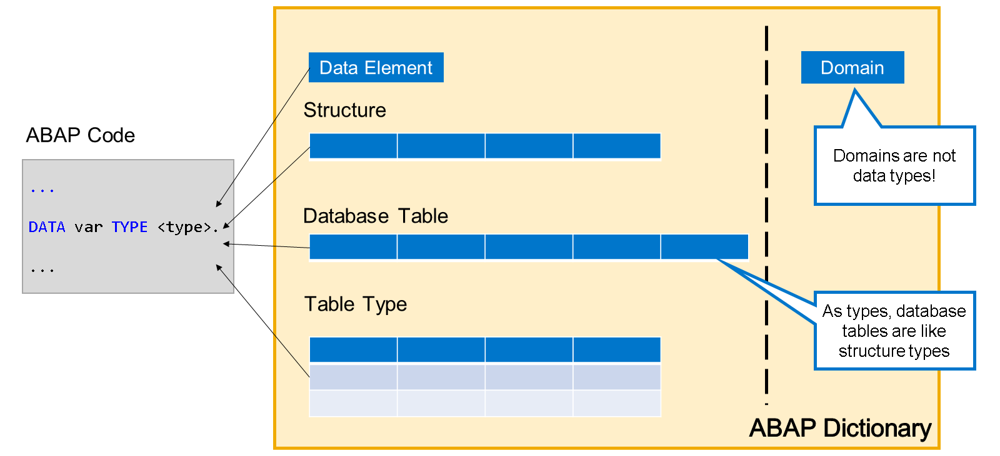
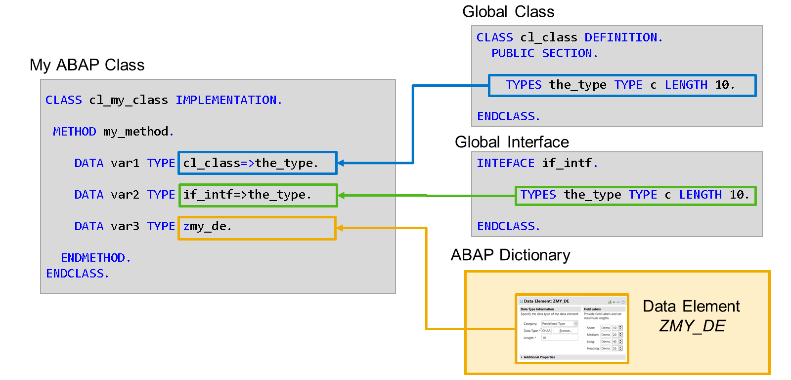
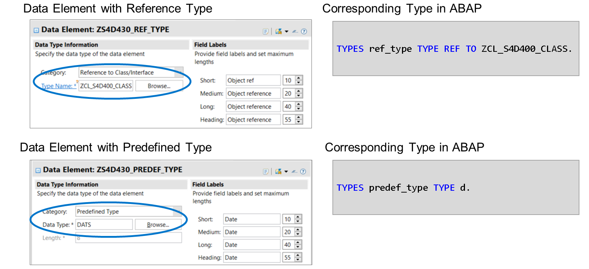

# 🌸 1 [USING DICTIONARY AS A DATA TYPES](https://learning.sap.com/learning-journeys/acquire-core-abap-skills/using-dictionary-objects-as-data-types_e28df7c3-7686-414e-9827-673dceeb21fb)

> 🌺 Objectifs
>
> - [ ] Vous serez capable de décrire l'utilisation des objets du dictionnaire comme types de données

## 🌸 DICTIONARY OBJECTS AS DATA TYPES

Dans l'unité précédente de ce cours, nous avons vu comment utiliser des objets dictionnaire de type Table de base de données pour définir des tables dans la base de données. Nous avons également montré comment utiliser des éléments de données pour spécifier les propriétés techniques et sémantiques des champs de la table. Enfin, un objet dictionnaire de type Structure a été créé et inclus dans la liste des champs d'une table de base de données.

Les trois types d'objets dictionnaire (Élément de données, Table de base de données et Structure) peuvent également servir de types de données pour les variables, les paramètres de méthode, etc.

> #### 🍧 Note
>
> Il n'est pas possible d'utiliser des domaines comme types de données. Les domaines servent uniquement de base aux éléments de données.

Les objets de dictionnaire de type Table ne sont pas liés à la définition des tables de base de données. Leur seul but est d'être utilisés comme types de données dans le codage ABAP.

La nature des types de données est assez évidente. Un élément de données est un type scalaire, une structure est un type de structure et un type de table est le type d'une table interne. La seule surprise pourrait être la nature des tables de base de données.

Utilisées comme types de données, les tables de base de données sont des types de structure. Évitez d'utiliser directement les tables de base de données comme types de données.

Par le passé, les développeurs ABAP utilisaient souvent des objets de dictionnaire comme types de données. Cela était principalement dû à l'absence de véritable alternative aux types de données globaux, c'est-à-dire aux types de données disponibles dans tout code ABAP du système. La situation a changé lorsqu'il est devenu possible de définir des types dans des classes et des interfaces globales. Les types publics d'une classe globale et les types dans les interfaces bénéficient de la même visibilité que les types de dictionnaire. Ils présentent également un avantage : les types dans les classes et les interfaces sont associés au contexte de la classe ou de l'interface. Les types de dictionnaire n'ont que le package auquel ils appartiennent.

> #### 🍧 Note
>
> Évitez de définir de nouveaux objets de dictionnaire servant uniquement de types de données, sauf si vous dépendez de fonctionnalités de dictionnaire telles que l'extensibilité ou une sémantique supplémentaire. Utilisez plutôt des types dans les classes et les interfaces.

## 🌸 DATA ELEMENTS AS DATA TYPES

Tous les éléments de données utilisés dans les définitions de tables de base de données peuvent également être utilisés comme types de données. L'inverse n'est pas valable. Il existe toutefois quelques exceptions :

#### 💮 **Data elements with a reference type** :

Il est techniquement impossible de typer le champ d'une table de base de données avec un type de référence. Les éléments de données utilisant un type de référence ne sont pas autorisés dans les définitions de tables de base de données.

#### 💮 **Data elements with a predefined type** :

Lors de la définition d'une table de base de données, il est fortement recommandé d'utiliser des éléments de données faisant référence à un domaine. Les éléments de données utilisant directement un type prédéfini ne doivent pas être utilisés dans les définitions de tables de base de données, même si cela est techniquement possible.
