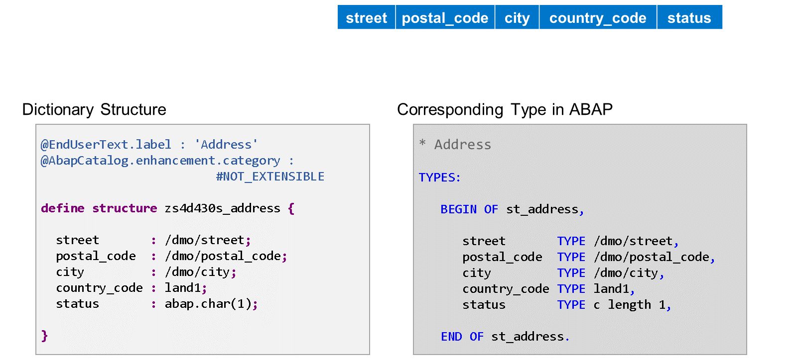
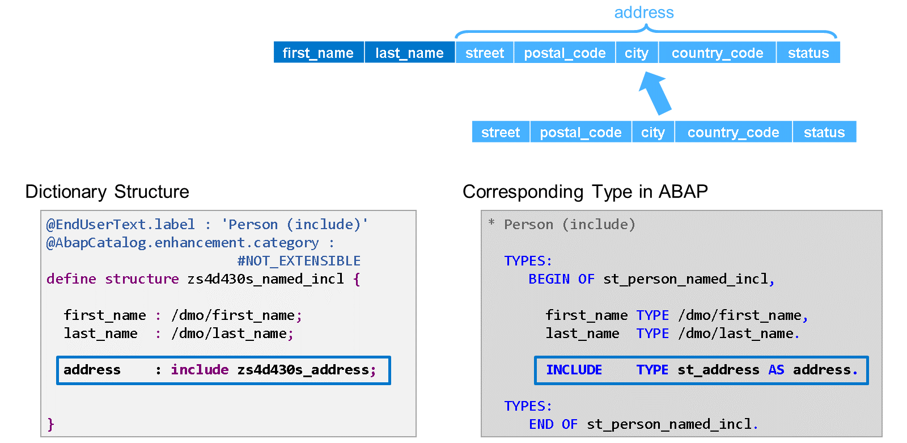

# 🌸 2 [DEFINING DICTIONARY STRUCTURES](https://learning.sap.com/learning-journeys/acquire-core-abap-skills/defining-dictionary-structures_f49fdfa0-b063-4697-a795-cbdcc38aff6a)

> 🌺 Objectifs
>
> - [ ] Vous pourrez définir des structures de dictionnaire

## 🌸 DICTIONARY STRUCTURES



Les structures de dictionnaire peuvent être utilisées comme types de données dans le dictionnaire ABAP.

La structure de gauche de notre exemple est composée de cinq composants. Les quatre premiers référencent différents éléments de données. Le dernier composant est typé directement avec le type de dictionnaire prédéfini CHAR.

Le code ABAP de droite définit exactement le même type de structure à l'aide de l'instruction TYPES. Ce code peut se trouver dans une méthode, dans la partie définition d'une classe ou dans une interface. Les quatre premiers composants utilisent les mêmes éléments de données que les composants de la structure du dictionnaire. Le dernier composant utilise le type C ABAP intégré.

Outre l'extensibilité et l'étiquette, les deux structures sont entièrement compatibles.

## 🌸 NESTED STRUCTURES

### NESTED STRUCTURES TYPES IN ABAP DICTIONARY

[Référence - Link Vidéo](https://learning.sap.com/learning-journeys/acquire-core-abap-skills/defining-dictionary-structures_f49fdfa0-b063-4697-a795-cbdcc38aff6a)

> #### 🍧 Note
>
> Lorsque vous saisissez un objet de données avec un type de structure imbriquée, vous devez accéder à ses composants comme suit :
>
> ```
>
> gs_struct-address-post_code = '69190'.
> gs_struct-address-city      = 'Walldorf'.
>
> ```

Il n'est pas possible d'accéder directement aux sous-composants de l'adresse.

## 🌸 NESTED STRUCTURES

[Référence - Link Vidéo](https://learning.sap.com/learning-journeys/acquire-core-abap-skills/defining-dictionary-structures_f49fdfa0-b063-4697-a795-cbdcc38aff6a)

## 🌸 INCLUDE STRUCTURES


Les structures imbriquées ne doivent pas être confondues avec les structures qui incluent un autre type de structure.

Plus tôt dans ce cours, vous avez appris à inclure une structure dans la liste des champs d'une table de base de données. La même technique est disponible pour définir un type de structure.

Dans l'exemple, la structure zs4d430s_person_include comporte sept composants : les composants first_name et last_name sont définis directement dans la structure, tandis que les cinq autres sont ajoutés en incluant le type de structure zs4d430s_address.

Le code ABAP à droite illustre comment définir le même type à l'aide de l'instruction TYPES dans une classe ou une interface ABAP.

> #### 🍧 Note
>
> Pour comprendre ce code, sachez que INCLUDE TYPES est une instruction à part entière et non un ajout à l'instruction TYPES. L'instruction de chaîne TYPES se termine avant l'instruction INCLUDE par un point (.) et une nouvelle instruction de chaîne TYPES commence après l'instruction INCLUDE.

> #### 🍧 Note
>
> Lorsqu'un tel type de structure est utilisé en ABAP, l'inclusion n'est pas visible. L'accès aux composants supplémentaires se fait normalement :
>
> ```
>
> gs_struct-first_name = 'John'.
> gs_struct-post_code  = '69190'.
> gs_struct-city       = 'Walldorf'.
>
> ```

## 🌸 NAMED INCLUDES



Lorsque vous incluez une structure dans une autre, vous pouvez lui donner un nom. Cette inclusion est alors appelée inclusion nommée.

Dans le dictionnaire ABAP, ajoutez le nom avant le mot-clé INCLUDE et séparez les deux par deux points (:). Lorsque vous définissez votre type de structure dans ABAP, placez le nom après celui de la structure d'inclusion, précédé du mot-clé AS.

L'inclusion nommée établit une sorte de groupe de champs qui vous permet d'accéder aux champs non seulement directement, mais aussi via le nom de l'inclusion.

Considérons une structure d'objet de données typée avec le type de structure zs4d430s_person_include. Vous pouvez accéder au champ city de deux manières : soit avec struct-city, comme avec une inclusion classique, soit avec struct-address-city.

> #### 🍧 Note
>
> Les inclusions nommées et les groupes de champs sont très utilisés dans les types de données dérivés du modèle de programmation d'applications RESTful ABAP.

## 🌸 HOW TO INCLUDE STRUCTURES

[Référence - Link Vidéo](https://learning.sap.com/learning-journeys/acquire-core-abap-skills/defining-dictionary-structures_f49fdfa0-b063-4697-a795-cbdcc38aff6a)
