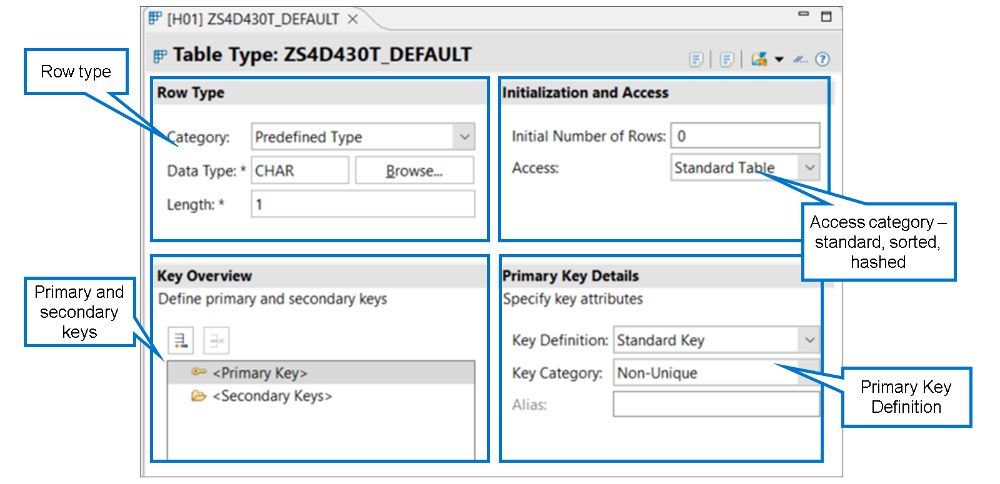
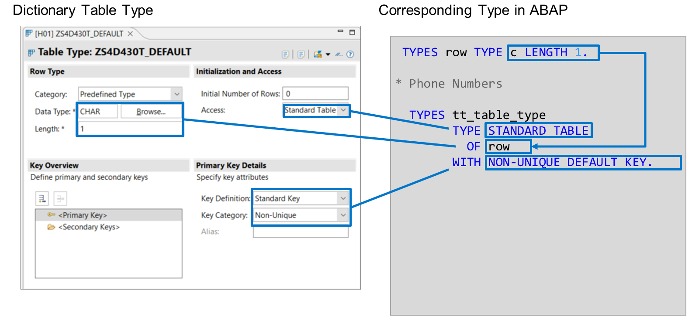
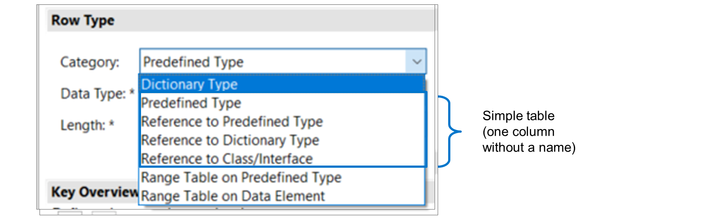
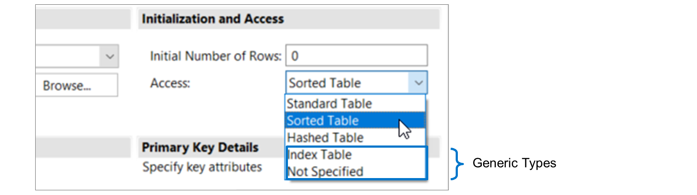
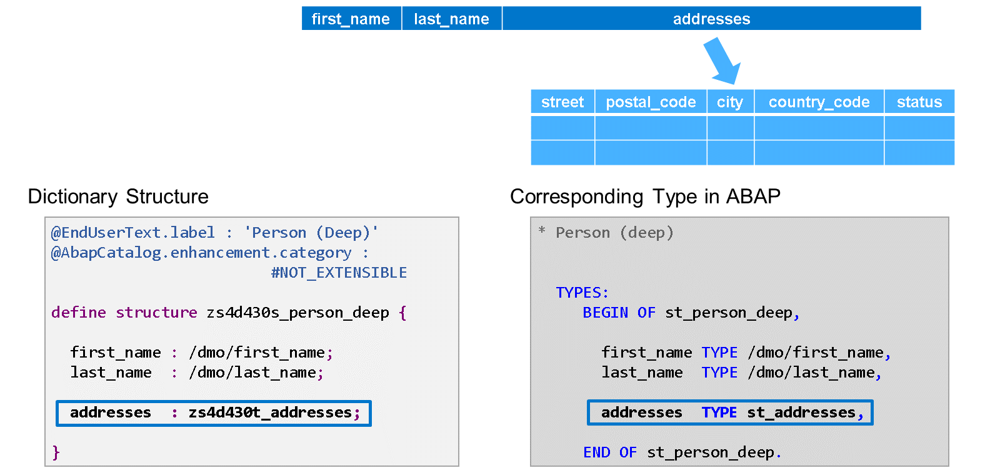

# 🌸 3 [DEFINING DICTIONARY TABLE TYPES](https://learning.sap.com/learning-journeys/acquire-core-abap-skills/defining-dictionary-table-types_df502cc6-441f-4fdc-aa9e-cc81caf6919c)

> 🌺 Objectifs
>
> - [ ] Définir un type de table de dictionnaire
>
> - [ ] Définir un type de table imbriquée

## 🌸 DICTIONARY TABLE TYPES

### CREATING A DICTIONARY TABLE TYPE

[Référence - Link Vidéo](https://learning.sap.com/learning-journeys/acquire-core-abap-skills/defining-dictionary-table-types_df502cc6-441f-4fdc-aa9e-cc81caf6919c)

### DICTIONARY TABLE TYPES

L'éditeur d'objets de dictionnaire de type Table est basé sur des formulaires et non sur du code, contrairement aux éditeurs de structures et de tables de bases de données. Il se compose des quatre sections suivantes :

#### 💮 **Row Type** :

Ce cadre contient l'origine et le nom du type de ligne. Lors de la création d'un type de table, celui-ci utilise le type de dictionnaire prédéfini CHAR d'une longueur de 1.

#### 💮 **Initialization and Access** :

Ce cadre contient la définition de la catégorie d'accès à la table (standard/triée/hachée). Par défaut, la catégorie d'accès est définie sur Table standard.

Le nombre initial de lignes peut être utilisé pour indiquer à l'environnement d'exécution ABAP la taille de la mémoire initiale requise. Avec la valeur par défaut de 0, l'environnement d'exécution ABAP alloue lui-même la totalité de la zone mémoire initiale. Notez que, dans la plupart des cas, il est préférable de conserver la valeur par défaut de 0 inchangée.

#### 💮 **Key Overview** :

Ce cadre offre un aperçu des clés. Choisissez la clé dont vous souhaitez afficher les détails.

Chaque type de table contient la définition d'une clé primaire. Les clés secondaires sont facultatives. Le type de table de l'exemple ne contient aucune clé secondaire.

#### 💮 **Key Details** :

Ce cadre affiche les détails de la clé sélectionnée. Cela peut concerner la catégorie de clé, c'est-à-dire son caractère unique ou non, et sa définition. Dans l'exemple, la clé primaire est non unique et comprend le type de ligne complet.

En comparant la définition d'un type de table de dictionnaire et celle d'un type de table défini avec l'instruction ABAP TYPES, on distingue facilement les différentes parties :

- Le type de ligne est spécifié après l'ajout de « OF ».

> #### 🍧 Note
>
> La syntaxe de l'instruction TYPES n'autorise qu'un seul mot. Si vous utilisez un type intégré ABAP nécessitant une longueur (type ABAP incomplet), le type de ligne doit être défini dans une instruction TYPES distincte.

- La catégorie d'accès à la table est spécifiée après l'ajout de « TYPE ».

- La définition de la clé primaire est spécifiée après l'ajout de « WITH ». La valeur de la définition de clé « Row Type » correspond à « table_line » dans la syntaxe ABAP.

## 🌸 OPTIONS FOR DEFINING THE ROW TYPE

Lorsque vous définissez un type de table, plusieurs options permettent de spécifier le type de ligne :

#### 💮 **Dictionary Type** :

Il s'agit de la catégorie de type de ligne la plus courante. Le type de ligne est spécifié via un autre objet de dictionnaire, généralement une structure. Si le type de ligne est un élément de données, la table interne ne comportera qu'une seule colonne sans nom.

#### 💮 **Predefined Type** :

Techniquement, l'utilisation d'un type prédéfini comme type de ligne est identique à celle d'un élément de données. Il manque la sémantique supplémentaire d'un élément de données.

#### 💮 **Reference to** :

Avec l'une de ces options, le type de ligne est un type référence. La table interne comportera une colonne sans nom contenant une liste de références, soit à des objets de données, soit à des instances de classes.

#### 💮 **Range Table on** :

Avec l'une de ces options, le type de table définit le type d'une table d'intervalles. Bien que vous ne spécifiiez qu'un type prédéfini ou un élément de données, la table d'intervalles comportera quatre colonnes : OPTION, SIGNE, BAS et HAUT. Pour plus d'informations sur l'utilisation des tables d'intervalles, consultez la documentation ABAP.

.png>)

Lorsque vous définissez le type de ligne d'un nouveau type de table, vous pouvez rechercher les types de dictionnaire existants. Vous y trouverez des éléments de données, des structures, mais aussi des tables de base de données et des types de table. Placez le curseur dans le champ de saisie « Nom du type » et appuyez sur Ctrl + Espace, ou choisissez « Parcourir ».

> #### 🍧 Hint
>
> Si le type de dictionnaire spécifié existe, un clic gauche sur « Nom du type » permet d'accéder à sa définition.

> #### 🍧 Cautious
>
> Même si des types de table sont proposés ici, leur utilisation comme types de ligne n'est pas pertinente. La « Table des tables » résultante est difficile à gérer, car il n'existe aucun moyen simple d'identifier les lignes de la table externe. Utilisez plutôt des structures avec des composants de type tableau. Nous aborderons ces tables imbriquées ultérieurement.

## 🌸 ACCESS CATEGORY AND KEYS

La catégorie de table est une propriété technique du type de table qui spécifie le stockage et la méthode d'accès principale. La valeur par défaut est « Table standard ». Les autres valeurs sont :

#### 💮 **Sorted Table** :

Le contenu de la table interne est trié par clé primaire à tout moment. L'environnement d'exécution ABAP optimise l'accès à l'aide de recherches binaires lorsque cela est possible. Des restrictions s'appliquent aux accès en écriture.

#### 💮 **Hashed Table** :

Le contenu de la table interne est administré à l'aide d'une table de hachage. L'environnement d'exécution ABAP optimise l'accès à l'aide d'un algorithme de hachage lorsque cela est possible. Des restrictions s'appliquent aux accès en lecture et en écriture.

#### 💮 **Index Table and Not Specified** :

Avec ces options, le type de table n'est pas entièrement spécifié. Ces types génériques ne peuvent pas être utilisés pour typer des objets de données. Leur utilisation est limitée aux paramètres et aux symboles de champ. L'utilisation de types de données génériques nécessite des techniques de programmation dynamique que nous n'abordons pas dans cette formation ABAP. Pour plus de détails, consultez la documentation ABAP.

.png>)

Pour définir la clé primaire d'un type de table, les options suivantes sont disponibles :

#### 💮 **Standard Key** :

La clé standard (également appelée clé par défaut) est composée de tous les composants non numériques du type de ligne.

#### 💮 **Row Type** :

Avec cette option, la clé primaire est composée de tous les composants du type de ligne. Si le type de ligne est non structuré, la colonne est la colonne clé.

#### 💮 **Not Specified** :

Avec cette option, aucune clé primaire n'est définie. Le type de table est générique et ne peut pas être utilisé pour les objets de données ABAP.

#### 💮 **Key Components** :

La clé primaire est composée des composants explicitement spécifiés. Lorsque vous sélectionnez cette option, l'éditeur affiche une nouvelle section sous la section Détails de la clé primaire. Dans cette section, vous devez saisir les composants de la clé.

> #### 🍧 Note
>
> Appuyez sur Ctrl + Espace pour choisir parmi les composants du type de ligne.

> #### 🍧 Note
>
> N'oubliez pas que la clé primaire des tables internes n'est pas nécessairement unique. Pour les tables standard et les tables triées, les clés primaires non uniques sont également prises en charge. Pour les tables standard, c'est la seule option. Ceci s'oppose aux tables de base de données où la clé primaire est toujours une clé unique.

### SECONDARY KEY DEFINITION

[Référence - Link Vidéo](https://learning.sap.com/learning-journeys/acquire-core-abap-skills/defining-dictionary-table-types_df502cc6-441f-4fdc-aa9e-cc81caf6919c)

### HOW TO DEFINE A DICTIONARY TABLE TYPE

[Référence - Link Vidéo](https://learning.sap.com/learning-journeys/acquire-core-abap-skills/defining-dictionary-table-types_df502cc6-441f-4fdc-aa9e-cc81caf6919c)

### NESTED TABLE TYPES

Vous pouvez utiliser un type table pour saisir le composant d'un type structure. Dans l'exemple, les adresses du composant sont saisies avec le type table zs4d430T_addresses. Le code ABAP à droite illustre comment définir exactement le même type de structure en ABAP.

> #### 🍧 Note
>
> Une structure comportant un composant table est souvent appelée structure profonde. Son contraire est une structure plate. Cela est lié à la structure mémoire d'un tel objet de données en ABAP. Pour plus de détails sur les structures profondes et plates, consultez la documentation ABAP.

.png>)

Lorsque vous utilisez une structure avec un composant de type table comme type de ligne d'un autre type de table, ce type de table devient imbriqué. Dans l'exemple, la structure ZS4D430S_PERSON_DEEP est utilisée comme type de ligne du type de table ZS4D430T_NESTED. Les adresses de colonne de la table interne résultante contiennent une table interne dans chaque ligne.

> #### 🍧 Note
>
> Dans chaque ligne de la table externe, la table interne peut comporter un nombre différent de lignes.
