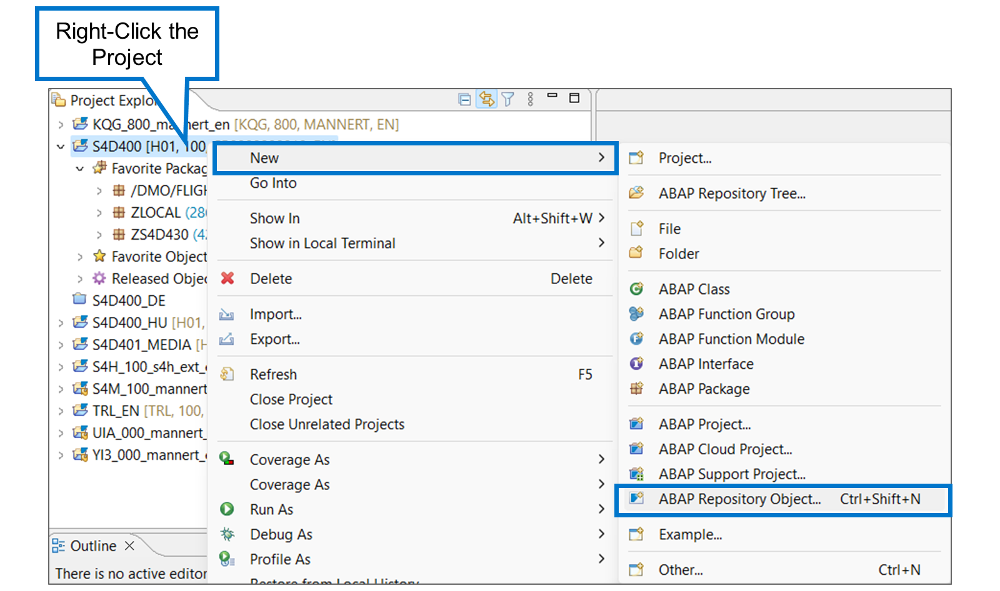
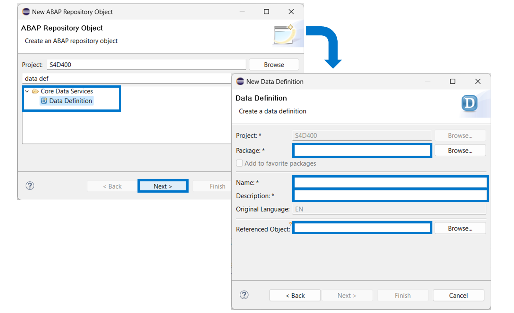
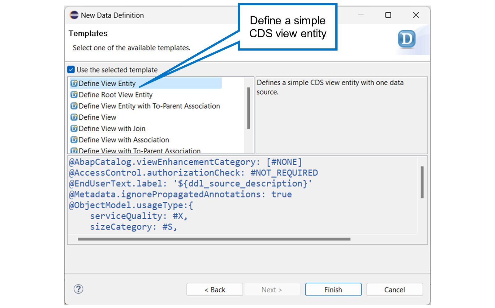
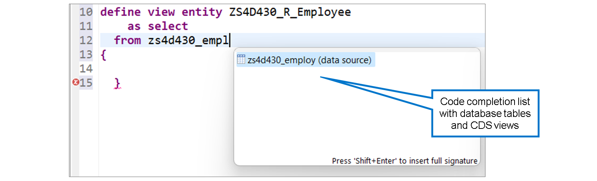
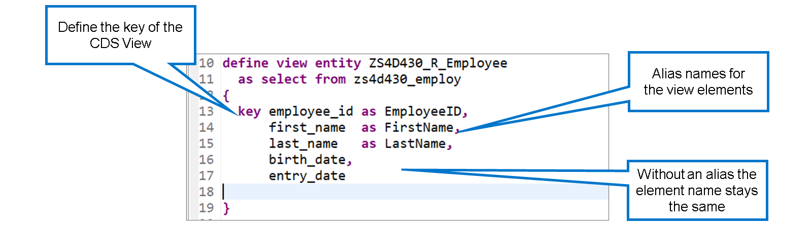
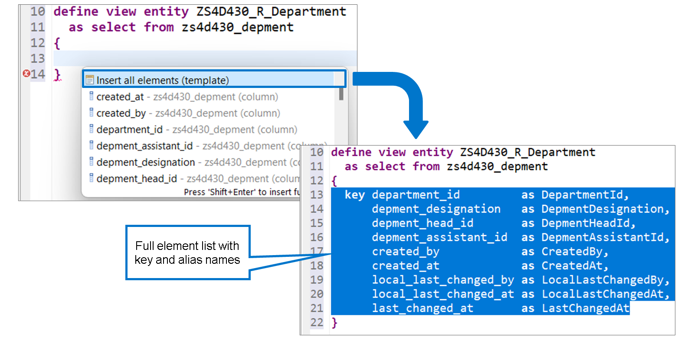
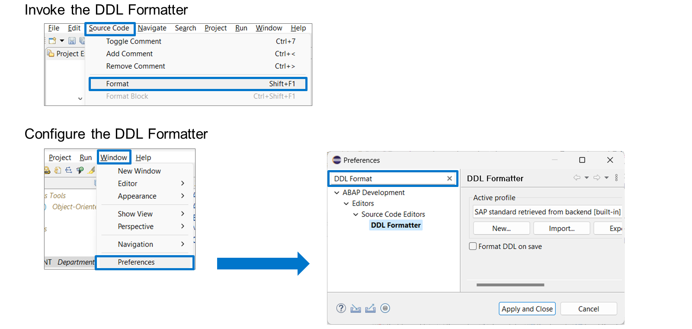

# 🌸 1 [DEFINING A BASIC CDS VIEW](https://learning.sap.com/learning-journeys/acquire-core-abap-skills/defining-a-basic-cds-view_b94f4075-778b-4311-b28b-f9f46b870c5e)

> 🌺 Objectifs
>
> - [ ] Créer une définition de données
>
> - [ ] Gérer la clause FROM et la liste des éléments

## 🌸 CREATING A DATA DEFINITION

Pour créer une définition de données, procédez comme suit :

1. Cliquez avec le bouton droit sur votre projet dans l'Explorateur de projets.

2. Choisissez [New] → [ABAP Repository Object…]

3. Dans la liste, choisissez [Core Data Services] → [Data Definition].

> #### 🍧 Hint
>
> Vous pouvez utiliser le champ de saisie sous Projet pour saisir un terme de recherche, par exemple « définition de données ».

4. Cliquez sur Suivant.

5. Saisissez le nom d'un **package** existant, ainsi qu'un nom et une description pour la nouvelle définition de données.

> #### 🍧 Hint
>
> Si vous saisissez le nom d'une table de base de données ou d'une entité de vue CDS comme Objet référencé, la nouvelle vue lira tous les champs de cet objet référencé.

Si votre **package** contient déjà une définition de données, vous pouvez utiliser le raccourci suivant :

1. Dans l'Explorateur de projets, développez le sous-nœud « [Core Data Services] » → [Data Definition] du **package** favori.

2. Cliquez avec le bouton droit sur [Data Definition] et choisissez [New Data Definition].

## 🌸 DATA DEFINITION TEMPLATES

Lorsque vous créez une nouvelle définition de données, vous pouvez partir d'une page vierge. Vous pouvez également utiliser l'un des nombreux modèles disponibles comme point de départ. Le modèle recommandé pour définir une vue simple est [Define View Entity].

En général, une boîte de dialogue correspondante s'affiche après avoir attribué la nouvelle définition de données à votre requête de transport. Vous pouvez toutefois revenir à la sélection du modèle ultérieurement lors de la modification.

.png>)

Pour choisir un modèle ultérieurement, accédez à l'onglet [Templates] dans la barre d'onglets située sous la fenêtre de l'éditeur.

> #### 🍧 Hint
>
> Vous pouvez définir vos propres modèles dans les [Preferences] de l'éditeur. Accédez à [Window] → [Preferences] et recherchez [Data Definition Templates].

## 🌸 THE FROM CLAUSE

Une vue CDS ne stocke jamais de données seule. Elle référence toujours une ou plusieurs sources de données à partir desquelles elle lit les données.

La base de données d'une vue CDS est spécifiée dans l'instruction define après le mot-clé FROM. Vous pouvez y spécifier des tables de base de données et d'autres vues CDS.

> #### 🍧 Hint
>
> Lorsque vous appuyez sur [Ctrl] + [Espace] pour saisir la source de données en complétant le code, l'éditeur ne suggère que les objets de développement appropriés comme sources de données.

## 🌸 THE ELEMENT LIST

### THE ELEMENT LIST

[Référence - Link Vidéo](https://learning.sap.com/learning-journeys/acquire-core-abap-skills/defining-a-basic-cds-view_b94f4075-778b-4311-b28b-f9f46b870c5e)

Le mot-clé `KEY` permet d'intégrer un élément de vue à la clé de la vue. Les éléments clés doivent être placés dans un bloc au début de la liste des éléments.

Pour une vue CDS, la définition d'une clé n'est pas obligatoire, mais fortement recommandée. Un avertissement s'affichera lors de la vérification de la syntaxe si la vue ne contient pas au moins un élément clé.

Un autre avertissement s'affiche si la clé de la vue CDS ne correspond pas à celle de sa source de données. Il peut être judicieux d'ignorer cet avertissement, mais généralement, la clé de la vue doit être identique à celle de la source de données. Il existe cependant une exception générale : si la source de données est une table de base de données contenant un champ client, ce champ client ne doit pas figurer dans la liste des éléments de la vue.

L'ajout AS permet de définir un nom pour un élément. Si un élément est simplement un champ de la source de données, l'ajout AS est facultatif. Dans ce cas, le nom reste identique à celui de la source de données.

> #### 🍧 Hint
>
> Dans les tables de base de données, les noms de champs ne font pas de distinction entre majuscules et minuscules. Lorsqu'une vue CDS lit une table de base de données, il est courant d'améliorer la lisibilité en introduisant des noms d'alias composés d'un mélange de majuscules et de minuscules (majuscules et minuscules). Dans l'exemple, employee_id est devenu EmployeeID et first_name est devenu FirstName.

Au lieu d'ajouter les champs de la source de données un par un, vous pouvez appuyer sur Ctrl + Espace et choisir [Insert all elements]. Ce modèle ajoute non seulement tous les champs de la source de données (à l'exception du champ client) à la liste des éléments, mais reprend également la définition de la clé et suggère des noms d'alias en majuscules et minuscules pour tous les champs.

> #### 🍧 Hint
>
> Lorsque vous créez une vue CDS avec une table de base de données ou une vue CDS comme objet référencé, le modèle [Insert all elements] est appliqué par défaut.

## 🌸 THE ELEMENT LIST

La syntaxe utilisée dans les définitions de données est appelée **CDS Data Definition Language (DDL)**. Pour une meilleure lisibilité, vous pouvez laisser ADT formater la source DDL. Placez le curseur dans la définition de données et choisissez [Source Code] → [Format] dans le menu Eclipse ou appuyez sur [Ctrl] + [F1].

Par défaut, Eclipse utilise un profil de formatage standard dérivé du système ABAP. Vous pouvez définir vos propres profils de formatage dans la boîte de dialogue « [Preferences] » d'Eclipse. Choisissez [Window] → [Preferences] dans le menu Eclipse et recherchez [DDL Formatter].

### COMMENTS IN CDS DDL

[Référence - Link Vidéo](https://learning.sap.com/learning-journeys/acquire-core-abap-skills/defining-a-basic-cds-view_b94f4075-778b-4311-b28b-f9f46b870c5e)

### HOW TO DEFINE A BASIC CDS VIEW

[Référence - Link Vidéo](https://learning.sap.com/learning-journeys/acquire-core-abap-skills/defining-a-basic-cds-view_b94f4075-778b-4311-b28b-f9f46b870c5e)
