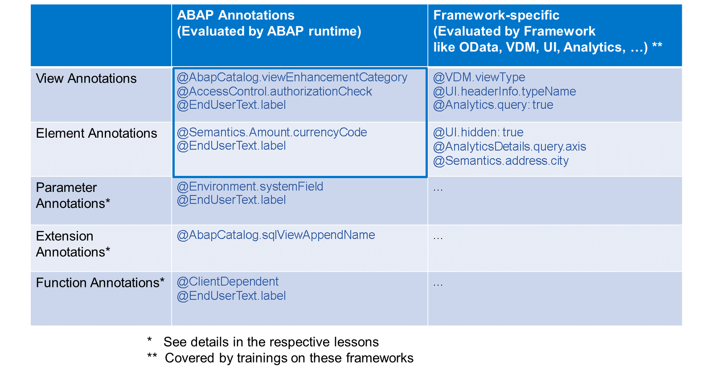
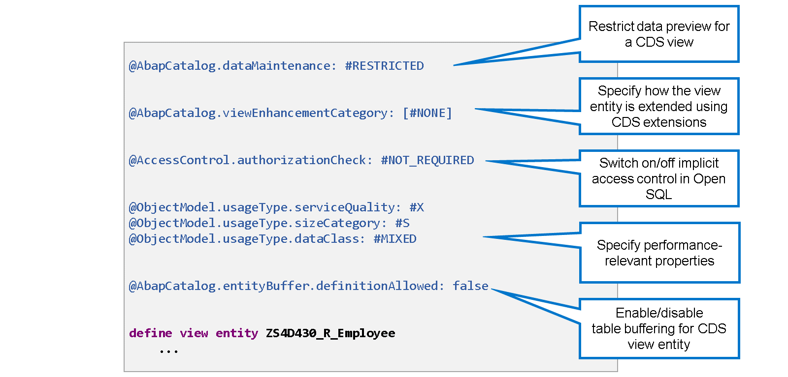
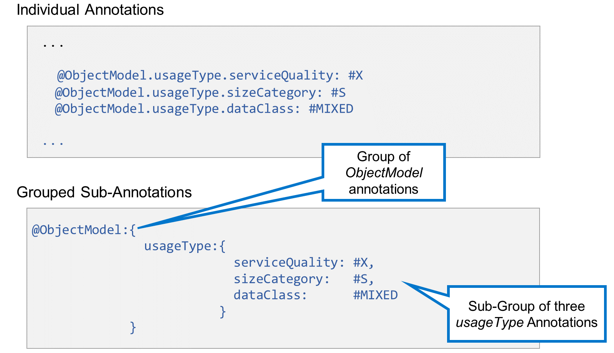
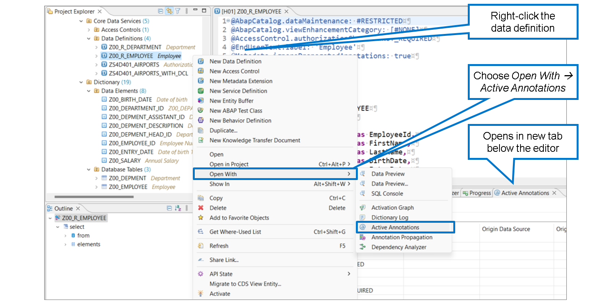

# 🌸 2 [USING ABAP ANNOTATIONS IN CDS VIEWS](https://learning.sap.com/learning-journeys/acquire-core-abap-skills/using-abap-annotations-in-cds-views_fcda7ade-1bb7-4c79-8b1f-0f20c7f45a70)

> 🌺 Objectifs
>
> - [ ] Utiliser les annotations ABAP dans les vues CDS
>
> - [ ] Travailler avec des textes traduisibles dans CDS
>       c
>       

Les annotations SAP sont des annotations CDS créées et fournies par SAP. Selon l'évaluation, nous distinguons deux groupes d'annotations SAP : les annotations ABAP et les annotations spécifiques au framework.

#### 💮 **ABAP annotations** :

Les annotations ABAP définissent les attributs techniques et sémantiques d'un objet CDS. Elles sont évaluées lors de l'activation de l'objet défini dans le code source CDS ou lors de son utilisation dans l'environnement d'exécution ABAP. Les annotations ABAP peuvent modifier le comportement des instructions SQL ABAP qui accèdent à un objet CDS.

#### 💮 **Framework-specific annotations** :

Les annotations spécifiques au framework définissent les propriétés techniques et sémantiques des objets CDS requises par des composants logiciels spécifiques, tels qu'ODATA, l'interface utilisateur, Analytics, etc. Elles sont évaluées par les frameworks des composants logiciels correspondants via une API appropriée et ne sont pas pertinentes pour les activations ni pour l'environnement d'exécution ABAP.

Selon le périmètre, nous distinguons cinq groupes d'annotations :

#### 💮 **Entity annotations** :

Annotations for CDS views and CDS view entities. Placed in front of the DEFINE VIEW statement or the DEFINE VIEW ENTITY statement.

#### 💮 **Element annotations** :

Annotations for an element of the SELECT list of a CDS view. Placed in front of the element.

#### 💮 **Parameter annotations** :

Annotations for a parameter of a CDS view. Placed In front of the parameter.

#### 💮 **Extension annotations** :

Annotations for a CDS view extension. Placed in front of the EXTEND VIEW statement or the DEFINE VIEW ENTITY statement.

#### 💮 **Function annotations** :

Annotations for a CDS table function. Placed in front of the DEFINE TABLE FUNCTION statement.

### IMPORTANT ABAP ANNOTATIONS FOR CDS VIEW ENTITIES

Pour les entités de vue CDS, les annotations ABAP importantes suivantes existent :

#### 💮 **AbapCatalog.dataMaintenance** :

Permet de restreindre l'aperçu des données d'une entité de vue CDS.

#### 💮 **ABAPCatalog.viewEnhancementCategory** :

Spécifie comment l'entité de vue est étendue à l'aide des extensions de vue CDS. Une liste de valeurs séparées par des virgules peut être spécifiée entre crochets du tableau d'annotations.

#### 💮 **AccessControl.authorizationCheck** :

Définit le contrôle d'accès implicite lorsque ABAP SQL est utilisé pour accéder à la vue CDS.

#### 💮 **ObjectModel.usageType.<...>** :

Caractérise les entités de vue CDS en fonction de leurs propriétés de performance.

#### 💮 **AbapCatalog.entityBuffer.definitionAllowed** :

Permet d'activer ou de désactiver la mise en mémoire tampon des tables pour une entité de vue CDS.

## 🌸 ABAP ANNOTATIONS FOR VIEW ELEMENTS

.png>)

La plupart des annotations sémantiques se résument à cela : des informations sémantiques destinées à être évaluées par les frameworks basés sur CDS.

La catégorie Sémantique ne contient que quelques annotations ABAP.

Dans les entités de vue CDS, il est obligatoire d'utiliser l'annotation @Semantics.amount.currencyCode pour lier les éléments de montant (type de dictionnaire prédéfini CURR) à un élément de code de devise (type de dictionnaire prédéfini CUKY). De même, il est obligatoire d'utiliser l'annotation @Semantics.quantity.unitOfMeasure pour lier les éléments de quantité (type de dictionnaire prédéfini QUAN) à un élément d'unité (type de dictionnaire prédéfini UNIT). Sans ces annotations, l'utilisateur de l'entité CDS aura des difficultés à interpréter et à traiter correctement les valeurs fournies dans ces champs.

## 🌸 GROUPED ANNOTATIONS

Les annotations d'une même catégorie peuvent être regroupées pour indiquer clairement leur appartenance. Dans l'exemple, trois annotations appartiennent à la catégorie « ObjectModel ». Elles appartiennent toutes à la sous-catégorie « ObjectModel.usageType ». Dans l'exemple de code ci-dessous, un groupe commence par « @ObjectModel: » suivi d'accolades. Entre les accolades se trouve généralement une liste d'annotations séparées par des virgules, sans la première partie (ObjectModel). Dans notre exemple, seul un sous-groupe commence par « usageType: » et contient trois annotations séparées par des virgules.

.png>)

> #### 🍧 Hint
>
> Si vous préférez cette syntaxe, vous pouvez la définir comme valeur par défaut lors de l'insertion d'annotations par saisie semi-automatique. Dans le menu ADT, accédez à Fenêtre → Préférences. Accédez à Développement ABAP → Éditeurs → Éditeurs de code source → CDS → Complétion de code et, sous « Insertion d'annotations CDS », sélectionnez « Structuré (plusieurs lignes avec crochets) ».

## 🌸 ABAP ANNOTATIONS FOR TRANSLATABLE TEXTS

.png>)

Les annotations ABAP commençant par EndUserText permettent de définir des textes sémantiques traduisibles pour les objets CDS.

EndUserText.label est disponible en tant qu'annotation de vue ou d'élément. Sa valeur est limitée à 60 caractères.

EndUserText.quickinfo est uniquement disponible en tant qu'annotation d'élément. Sa valeur est stockée sous forme de chaîne et sa longueur peut être arbitraire.

> #### 🍧 Note
>
> Lorsqu'un élément de vue est basé sur un élément de données de dictionnaire, le framework CDS dérive un libellé et une information rapide des libellés de champ conservés dans l'élément de données. Pour ces champs, les annotations textuelles ne sont nécessaires que si vous souhaitez remplacer les textes provenant de l'élément de données.

## 🌸 ACTIVE ANNOTATIONS VIEW

La vue Annotations actives résume les informations sémantiques de l'entité CDS et de ses éléments. Elle répertorie toutes les annotations d'entité et d'élément contenues dans la définition de données. Elle répertorie également les informations sémantiques dérivées (héritées) d'autres objets du référentiel, par exemple les définitions de tables de dictionnaire et les éléments de données.

Pour ouvrir la vue Annotations actives, procédez comme suit :

1. Cliquez avec le bouton droit sur Définition de données (dans la fenêtre de l'éditeur ou dans l'Explorateur de projets).

2. Choisissez « Ouvrir avec » → « Annotations actives ».

Dans la configuration par défaut de la perspective ABAP, la vue Annotations actives s'affiche dans un nouvel onglet, dans la barre d'onglets située sous la vue de l'éditeur.

.png>)
