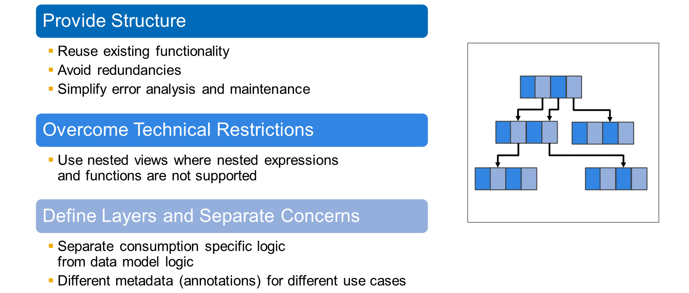
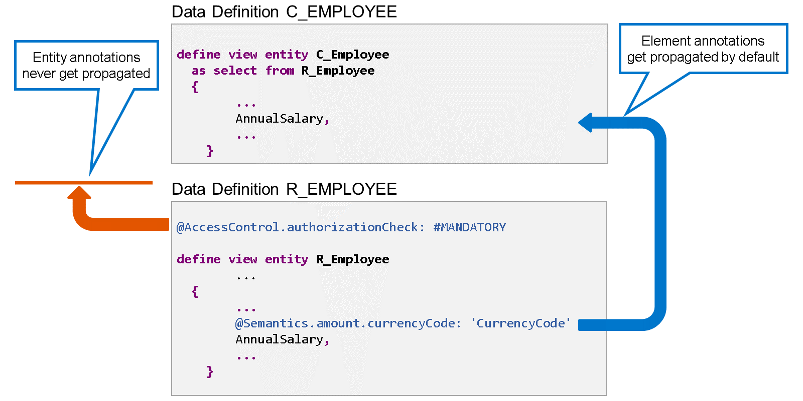

# 🌸 3 [BUILDING VIEWS ON VIEWS](https://learning.sap.com/learning-journeys/acquire-core-abap-skills/building-views-on-views_fa49f0cf-c38f-481f-86e0-a520f254924a)

> 🌺 Objectifs
>
> - [ ] Définir une vue CDS lisant depuis une autre vue
>
> - [ ] Contrôler la propagation des annotations des éléments

## 🌸 VIEW ON VIEW - MOTIVATION

Lorsque vous définissez une entité de vue CDS, vous pouvez non seulement lire les tables de la base de données, mais aussi utiliser d'autres vues CDS comme source de données. Pourquoi créer des vues sur d'autres vues ?

- La première raison est similaire à celle de la structuration du code source en classes et méthodes :

  - Réutiliser les fonctionnalités existantes

  - Éviter les redondances

  - Prendre en charge l'analyse des erreurs et la maintenance

- Le deuxième argument est plus technique. L'imbrication d'expressions et de fonctions SQL au sein d'une même vue CDS présente certaines limites. Les vues imbriquées sont une technique courante pour contourner ces restrictions.

- La principale raison des vues imbriquées est probablement la superposition de votre modèle de données. Dans le modèle de programmation RESTful ABAP, par exemple, il est recommandé de définir des vues de consommation sur des vues de modèle de données. Alors que les vues de modèle de données contiennent la logique générale du modèle de données, les vues de consommation ajoutent une logique et des métadonnées spécifiques à la consommation.

## 🌸 PROPAGATED ANNOTATIONS

Si une entité de vue CDS lit à partir d'une autre entité de vue, elle peut hériter des métadonnées de la vue source. C'est ce qu'on appelle la propagation d'annotations.

Dans cet exemple, l'entité de vue CDS C_Employee utilise l'entité de vue CDS R_Employee comme source de données. Par défaut, les annotations d'élément de R_Employee sont propagées dans C_Employee. Par conséquent, l'annotation @Semantics.amount.currencyCode n'est pas requise dans C_Employee.

La propagation est limitée aux annotations d'élément. Les annotations d'entité et de vue ne sont jamais propagées.

.png>)

L'annotation d'entité @Metadata.ignorePropagatedAnnotations permet de contrôler la propagation des annotations d'élément. Si elle est absente de l'entité de vue CDS de lecture ou si elle est définie sur « false », les annotations d'élément sont héritées. Avec @Metadata.ignorePropagatedAnnotations : true, la propagation des annotations d'élément est désactivée.

Si, dans notre exemple, l'entité de vue CDS C_Employee est annotée avec @Metadata.ignorePropagatedAnnotations : true, l'annotation @Semantics.amount.currencyCode de l'élément AnnualSalary n'est pas propagée. La vérification de syntaxe affiche une erreur, car l'annotation obligatoire est manquante pour le champ « montant ».

## 🌸 HOW TO DEFINE A VIEW ON TOP OF A VIEW

[Référence - Link Vidéo](https://learning.sap.com/learning-journeys/acquire-core-abap-skills/building-views-on-views_fa49f0cf-c38f-481f-86e0-a520f254924a)
