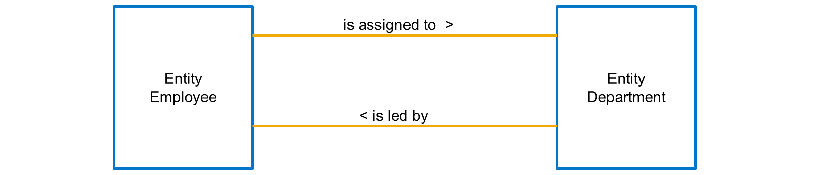
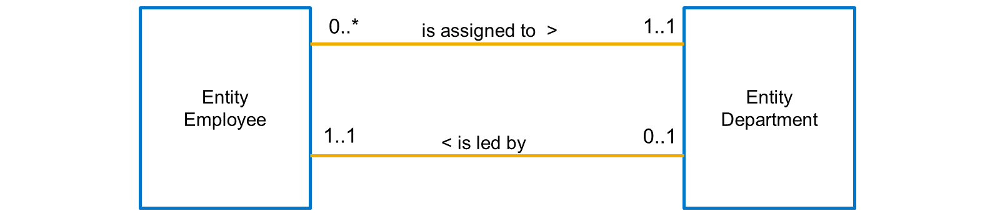
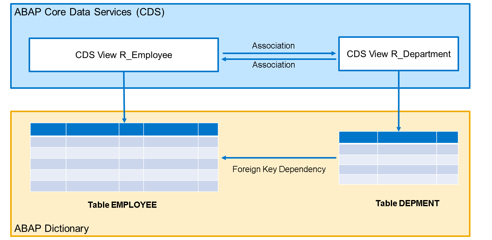
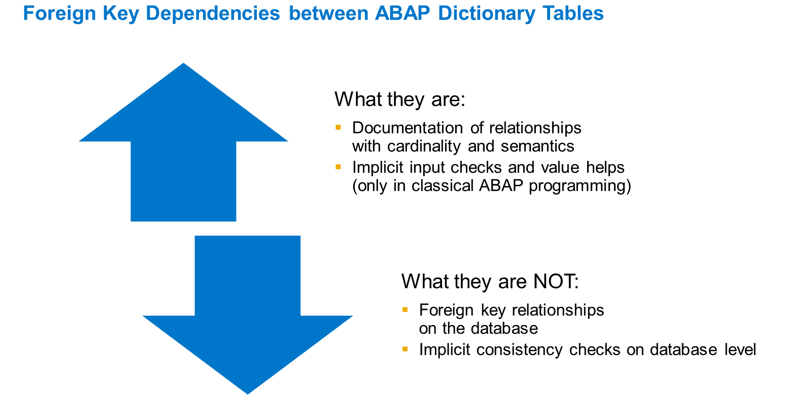
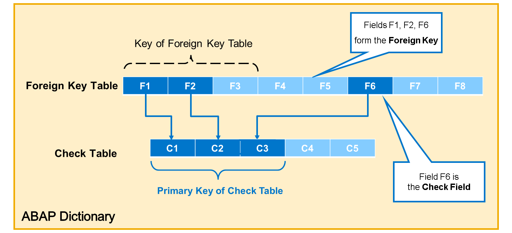
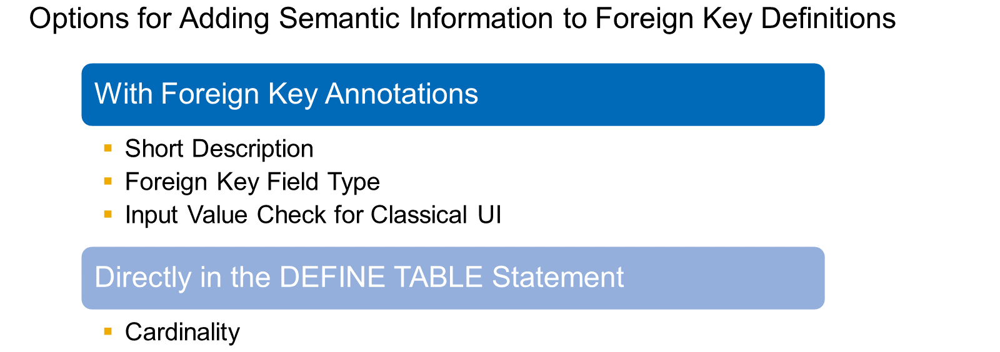
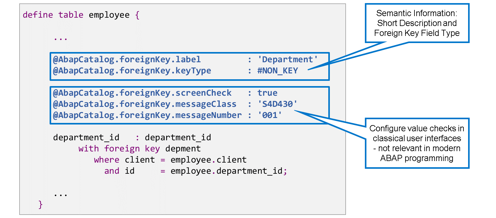
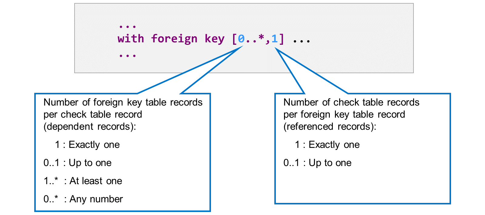
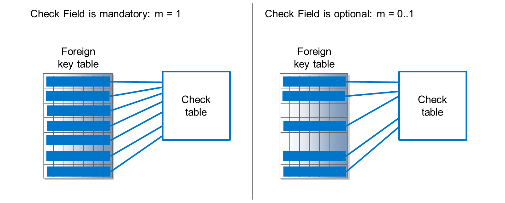
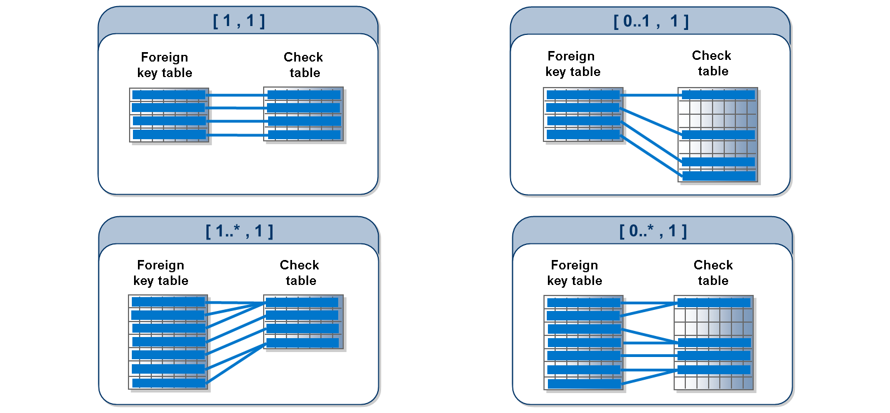

# 🌸 1 [DEFINING RELATIONSHIPS BETWEEN DATABASE TABLES](https://learning.sap.com/learning-journeys/acquire-core-abap-skills/defining-relationships-between-database-tables_e55dbd61-6083-4747-bb5d-905ba29ab662)

> 🌺 Objectifs
>
> - [ ] Comprendre les relations dans les modèles de données
>
> - [ ] Définir les dépendances de clés étrangères dans les tables de dictionnaire

## 🌸 RELATIONSHIPS IN DATA MODELS

Généralement, les entités d'un modèle de données sont liées entre elles. La définition d'un modèle de données inclut la définition de ces relations.

Examinons le modèle de données d'une entreprise, qui comprend les entités « Employé » et « Service ». Ces deux entités sont liées car les employés sont affectés à des services.

Mais elles peuvent également partager d'autres relations. Par exemple, chaque service est dirigé par un employé.

Les cardinalités ou multiplicités sont des caractéristiques importantes d'une relation. Elles indiquent combien d'instances d'une entité appartiennent à une instance de l'autre entité.

Il existe différents systèmes de notation pour les cardinalités. Le langage de modélisation unifié (UML), par exemple, utilise une valeur maximale et minimale, avec \* pour un maximum illimité.

Examinons nos exemples :

Chaque employé doit être affecté à un seul service. La cardinalité dans ce sens est donc de 1..1. Dans l'autre sens, un service peut avoir n'importe quel nombre d'employés affectés, même zéro est autorisé. La cardinalité est donc de 0..\*.

Pour l'autre relation, considérons que chaque service est dirigé par un seul employé, ni plus ni moins. Cela signifie que nous ignorons les cas particuliers tels que les postes de direction vacants (zéro est une valeur autorisée) ou les doubles ou multiples dirigeants (les valeurs supérieures à 1 sont autorisées). Dans l'autre sens, nous pouvons facilement dire que tous les employés ne sont pas des dirigeants, ce qui signifie que le minimum est de zéro. Nous avons décidé de fixer la valeur maximale à 1, ce qui signifie qu'un employé ne peut pas diriger deux services simultanément.

> #### 🍧 Note
>
> Dans le dictionnaire ABAP et ABAP CDS, cardinalité et multiplicité sont synonymes. Au sens strict, une cardinalité correspond au nombre réel d'instances, tandis que la multiplicité spécifie la plage de valeurs autorisées.

ABAP CDS et le dictionnaire ABAP utilisent des concepts différents pour exprimer les relations :

#### 💮 **Associations** :

ABAP CDS utilise des associations pour définir les relations entre les entités de vue CDS. Généralement, une relation est reflétée par deux associations, pointant dans des directions opposées.

#### 💮 **Foreign Keys** :

ABAP Dictionary définit une dépendance pour les champs de table afin d'établir une relation avec une autre table de base de données. Une telle dépendance de clé étrangère correspond à une relation.

Explorons les possibilités de définition des relations en examinant de plus près les dépendances de clés étrangères dans le dictionnaire ABAP.

## 🌸 FOREIGN KEY DEFINITIONS IN DICTIONARY TABLES

Dans le dictionnaire ABAP, vous pouvez utiliser des dépendances de clés étrangères pour définir les relations entre les tables.

En programmation ABAP moderne, ces dépendances de clés étrangères servent principalement à la documentation. En développement ABAP classique, en revanche, elles avaient une influence directe sur l'interface utilisateur. Elles donnaient lieu à des vérifications implicites des entrées et à des aides à la saisie de valeurs.

> #### 🍧 Note
>
> Dans le développement ABAP moderne, les associations entre entités de vue CDS ont partiellement pris en charge cette tâche. Consultez la leçon suivante pour plus de détails.

Il est important de noter que les définitions de clés étrangères du dictionnaire ABAP restent sur la couche ABAP. Elles ne sont pas transmises à la base de données. Par conséquent, elles n'entraînent pas de vérifications implicites de cohérence dans la base de données.

Une dépendance de clé étrangère définit une relation entre deux tables de base de données de dictionnaire : la table de clés étrangères et la table de vérification.

Une dépendance de clé étrangère complète relie chaque champ de clé primaire de la table de vérification à un champ correspondant de la table de clés étrangères. Dans l'exemple, la clé primaire de la table de vérification est composée de trois champs : C1, C2 et C3. La relation de clé étrangère les relie aux champs F1, F2 et F6 de la table de clés étrangères. Ensemble, ces champs forment la clé étrangère.

> #### 🍧 Note
>
> Une clé étrangère peut comprendre n'importe quelle combinaison de champs : des champs clés et des champs non clés. Les champs associés de la table de vérification sont toujours des champs clés.

La dépendance de clé étrangère restreint les valeurs des champs de clé étrangère : seules les combinaisons présentes dans la table de vérification sont autorisées. Cette restriction est particulièrement importante pour le dernier champ de clé étrangère, c'est-à-dire celui lié au dernier champ de clé primaire de la table de vérification. Ce champ est appelé champ de vérification. Dans notre exemple, le champ de contrôle est le champ F6.

### EXAMPLE: FOREIGN KEY RELATIONSHIP

[Référence - Link Vidéo](https://learning.sap.com/learning-journeys/acquire-core-abap-skills/defining-relationships-between-database-tables_e55dbd61-6083-4747-bb5d-905ba29ab662)

## 🌸 SEMANTIC ATTRIBUTES OF FORIEGN KEYS

Lorsque vous définissez une relation de clé étrangère, vous pouvez ajouter des informations sémantiques pour la décrire plus en détail et influencer son utilisation par le framework.

La majorité des informations sémantiques sont spécifiées à l'aide d'annotations de clé étrangère. Seule la cardinalité est spécifiée directement dans l'instruction DEFINE TABLE.

Si un champ possède une relation de clé étrangère, vous pouvez ajouter les annotations de clé étrangère suivantes :

#### 💮 **Short Description** :

Ce texte court sert d'explication pour une relation de clé étrangère.

#### 💮 **Foreign Key Field Type** :

L'annotation @AbapCatalog.foreignKey.keyType décrit la signification des champs de clé étrangère dans la table de clés étrangères. Choisissez la valeur #KEY si tous les champs de clé étrangère sont des champs clés de la table de clés étrangères. Choisissez #NON_KEY si au moins un champ de clé étrangère n'est pas un champ clé de la table de clés étrangères. Dans l'exemple, #NON_KEY est correct, car le champ DEPARTMENT_ID n'est pas un champ clé de la table EMPLOYEE. La troisième valeur, #TEXT_KEY, est pertinente si la table de clés étrangères est une table texte, c'est-à-dire qu'elle contient du texte traduisible pour la table de vérification.

#### 💮 **Value Check for Classical UI** :

L'annotation @ABAPCatalog.foreignKey.screenCheck contrôle si les boîtes de dialogue utilisateur classiques effectuent des vérifications de valeur en fonction de cette relation de clé étrangère. Si cette option est définie sur « true », d'autres annotations sont disponibles pour spécifier un message d'erreur dédié. Sinon, un message d'erreur générique s'affiche.

> #### 🍧 Note
>
> Les annotations d'écran et de message ne sont pas pertinentes dans les dialogues utilisateur modernes. Sauf si vous envisagez de développer des interfaces utilisateur classiques, définissez la valeur de @ABAPCatalog.foreignKey.screenCheck sur false.

La cardinalité décrit une relation de clé étrangère en fonction du nombre d'enregistrements dépendants (enregistrements de la table de clés étrangères) ou référencés (enregistrements de la table de vérification) possibles.

Dans le dictionnaire ABAP, la cardinalité est spécifiée par [ n , m ] immédiatement après le mot-clé KEY.

- Le côté gauche (n) spécifie le nombre d'enregistrements de la table de clés étrangères par enregistrement de la table de vérification et peut prendre les valeurs 1, 0..1, 1.._ et 0.._.

- Le côté droit (m) spécifie le nombre d'enregistrements de la table de vérification par enregistrement de la table de clés étrangères et peut prendre les valeurs 1 ou 0..1.

Pour choisir la cardinalité correcte, commencez par le côté droit.

Choisissez m = 1 si le champ de vérification est obligatoire. Dans ce cas, chaque enregistrement de la table de clé étrangère requiert une valeur dans le champ de vérification et un enregistrement correspondant dans la table de vérification.

Choisissez m = 0..1 si le champ de vérification est facultatif. Ainsi, les enregistrements sans valeur dans le champ de vérification ne nécessitent pas d'enregistrement correspondant dans la table de vérification.

Reprenons notre exemple avec les employés et les services :

S'il est obligatoire qu'un employé soit affecté à un service, la cardinalité de la clé étrangère doit être m = 1. S'il est également possible qu'un employé ne soit pas affecté à un service, la cardinalité doit être m = 0..1.

Examinons maintenant le côté gauche de la cardinalité. La signification des différentes valeurs est la suivante :

#### 💮 **n = 1** :

Il existe exactement un enregistrement dépendant (enregistrement de la table de clé étrangère) pour chaque enregistrement de la table de vérification.

#### 💮 **n = 0..1** :

Il existe au plus un enregistrement dépendant pour chaque enregistrement de la table de vérification. Cependant, certains enregistrements de la table de vérification ne possèdent aucun enregistrement dépendant dans la table de clé étrangère.

#### 💮 **n = 1..\*** :

Il existe au moins un enregistrement dépendant pour chaque enregistrement de la table de vérification.

#### 💮 **n = 0..\*** :

Il peut y avoir n'importe quel nombre d'enregistrements dépendants pour chaque enregistrement de la table de vérification : aucun, un ou plusieurs.

Dans notre exemple, posez-vous la question : combien d'employés peuvent être affectés au même service ? Exactement un ? Un seul au plus ? Au moins un ? N'importe quel nombre ? Qu'en pensez-vous ?

## 🌸 HOW TO DEFINE A FOREIGN KEY RELATIONSHIP

[Référence - Link Vidéo](https://learning.sap.com/learning-journeys/acquire-core-abap-skills/defining-relationships-between-database-tables_e55dbd61-6083-4747-bb5d-905ba29ab662)
