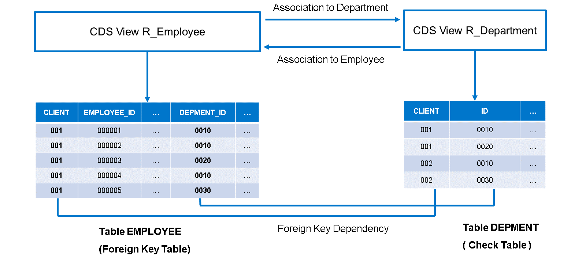
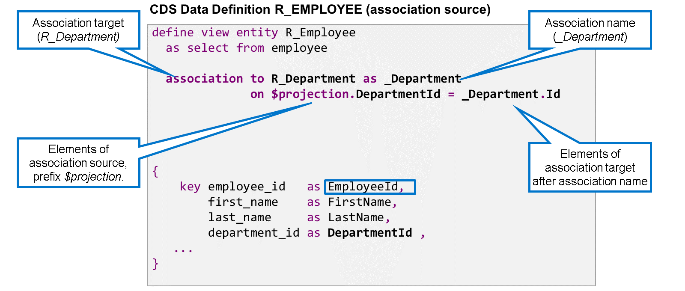
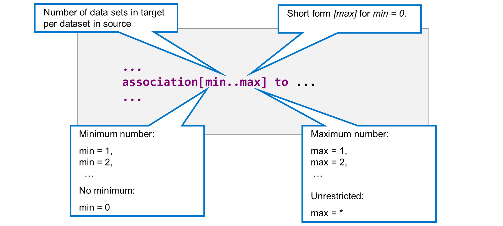
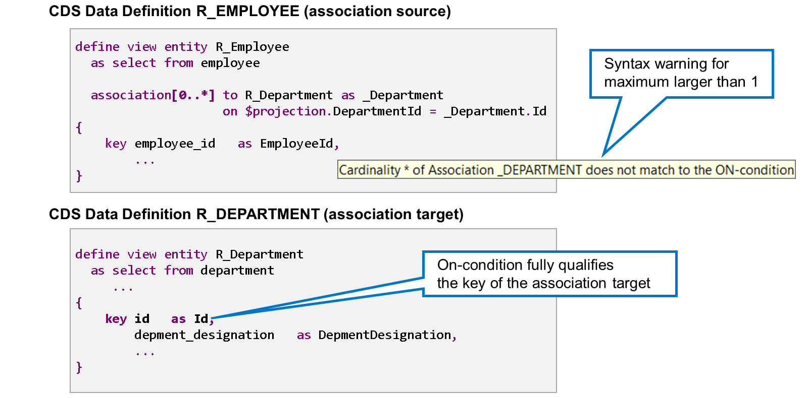
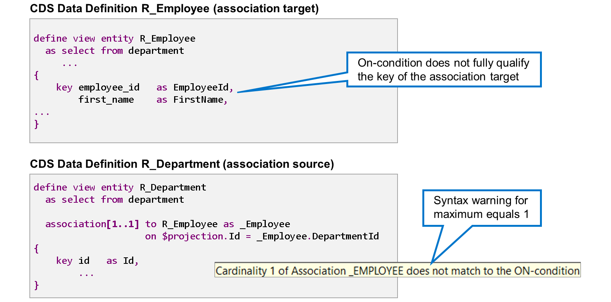
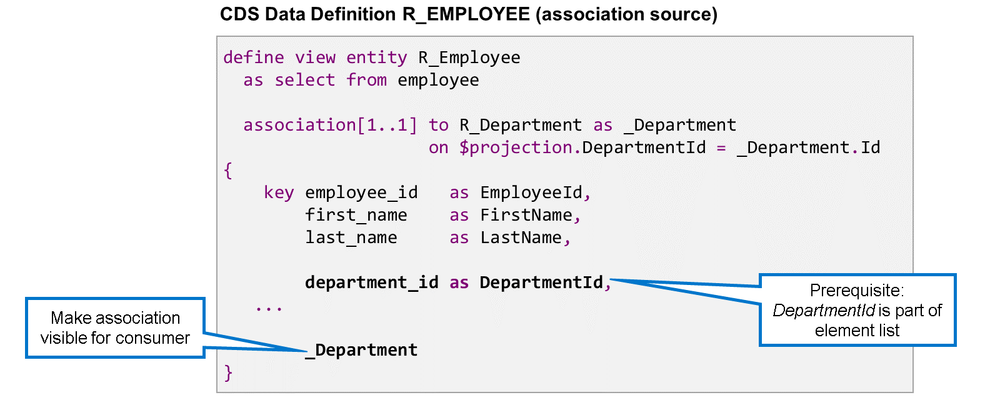

# 🌸 2 [DEFINING ASSOCIATIONS BEWTEEN CDS VIEWS](https://learning.sap.com/learning-journeys/acquire-core-abap-skills/defining-associations-between-cds-views_b325f87f-ff81-4bbe-a5c3-06d0c3ba5def)

> 🌺 Objectifs
>
> - [ ] Définir les associations
>
> - [ ] Exposer les associations

## 🌸 ASSOCIATIONS IN CDS VIEWS

Dans la leçon précédente, vous avez appris que les dépendances de clés étrangères expriment les relations entre les tables de base de données. De la même manière, les associations expriment les relations entre les entités CDS.

Les associations sont plus flexibles que les dépendances de clés étrangères. Une dépendance de clé étrangère lie toujours une table de clés étrangères à une table de contrôle. Une association peut lier n'importe quelle source d'association à n'importe quelle cible d'association. En particulier, il existe généralement deux associations entre les entités CDS lorsqu'il existe une dépendance de clé étrangère entre deux tables de base de données. Prenons un exemple :

La définition de la table de base de données EMPLOYEE contient une dépendance de clé étrangère pour le champ DEPMENT_ID, utilisant la table de base de données DEPMENT comme table de contrôle. R_Employee et R_Department sont des vues CDS qui lisent ces deux tables de base de données. Au niveau CDS, la dépendance de clé étrangère correspond à une association (relation) avec R_Employee comme source et R_Department comme cible. Elle relie chaque employé à son service respectif. Cependant, il peut également y avoir une association (relation) dans le sens inverse, reliant un département à tous les employés qui travaillent dans ce département.

Les associations sont définies dans la définition de données de l'entité CDS servant de source d'association. Dans notre exemple, il s'agit de la définition de la vue CDS R_Employee. L'association est définie dans la clause FROM, après la source de données de la vue. Une définition de vue CDS peut contenir un nombre illimité d'associations.

> #### 🍧 Note
>
> Le modèle de données de SAP S/4HANA contient des vues avec plus de cent associations.

Une définition d'association comprend les éléments suivants :

#### 💮 **Association target** :

Le mot-clé « association to » est suivi du nom de la cible de l'association ; dans notre exemple, il s'agit de la vue CDS R_Department. La cible de l'association doit toujours être une entité CDS. Il est possible, mais déconseillé, que les associations dans les vues CDS utilisent des tables de base de données comme cibles.

#### 💮 **Association Name** :

Le nom de l'association vient après l'ajout AS et sert d'identifiant pour l'association. Il est recommandé d'utiliser un trait de soulignement (\_) comme premier caractère du nom de l'association CDS. Dans l'exemple, le nom de l'association est \_Department.

> #### 🍧 Note
>
> D'un point de vue technique, la définition d'un nom d'association est facultative. Sans ce nom, le nom de la cible de l'association sert d'identifiant. Cela peut compliquer la lecture du code et rendre impossible l'utilisation de plusieurs associations pour une même cible. Il est donc fortement recommandé de définir un nom d'association pour toutes les associations.

#### 💮 **Association condition** :

La condition d'association commence par le mot-clé ON. Elle compare généralement les éléments de vue de la source de l'association à ceux de la cible de l'association, mais d'autres conditions sont possibles. Dans le format recommandé, les éléments de vue de la source de l'association sont à gauche, avec $projection. comme préfixe, et ceux de la cible de l'association sont à droite, avec le nom de l'association comme préfixe.

> #### 🍧 Note
>
> Comme il n'est pas nécessaire d'inclure le champ client dans la liste des éléments des vues CDS, il n'apparaît pas non plus dans la condition d'association.

> #### 🍧 Hint
>
> Lorsque vous définissez une association, utilisez la saisie semi-automatique (Strg + Espace) pour insérer les mots-clés, le nom de la cible de l'association et les éléments de la vue.

## 🌸 CARDINALITY OF ASSOCIATIONS

La cardinalité d'une association spécifie le nombre d'ensembles de données possibles dans la cible de l'association pour un ensemble de données dans la source de l'association.

Dans ABAP CDS, la cardinalité est spécifiée entre crochets immédiatement après le mot-clé association.

La cardinalité est spécifiée sous la forme [min..max] ou simplement [max]. Si min est omis, la valeur min = 0 est utilisée.

Les valeurs autorisées pour min sont 0 et tous les nombres entiers positifs. Les valeurs les plus courantes pour min sont 0 et 1.

Les valeurs autorisées pour max sont tous les nombres entiers positifs et l'astérisque (_) pour un nombre maximal illimité. Les valeurs les plus courantes pour max sont 1 et _.

> #### 🍧 Hint
>
> Si vous ne spécifiez pas de cardinalité, la cardinalité par défaut [0..1] est utilisée.

La vérification de syntaxe vérifie la plausibilité de la valeur maximale d'une cardinalité. Pour cela, elle compare la condition ON à la clé de la cible de l'association. Si la condition ON qualifie entièrement la clé primaire, la cardinalité attendue est de 0 à 1 ou 1 à 1.

Dans l'exemple, la cardinalité 0 à 1 pour l'association \_Department génère un avertissement de syntaxe, car la cible de l'association (R_Department) ne possède qu'un seul champ clé (Id) qualifié dans la condition ON.

Cet exemple illustre l'association dans le sens inverse. Ici, la cardinalité 1..1 pour l'association \_Employee génère un avertissement de syntaxe, car le champ clé EmployeeID de la cible de l'association R_Employee n'est pas qualifié dans la condition ON.

> #### 🍧 Hint
>
> Dans les modèles de données complexes, il peut arriver qu'une cardinalité soit correcte, même si elle ne correspond pas à la condition ON. Dans ce cas, vous pouvez simplement ignorer l'avertissement ou le supprimer à l'aide d'un pseudo-commentaire.

## 🌸 EXPOSED ASSOCIATIONS

Lorsque vous définissez une nouvelle association, l'éditeur affiche un avertissement indiquant que l'association n'est pas utilisée. Il existe deux façons d'utiliser une association : définir une expression de chemin avec cette association (voir plus loin) ou l'exposer.

Pour exposer une association, ajoutez son nom à la liste des éléments de la vue CDS. Cela rend l'association visible pour l'utilisateur de la vue.

> #### 🍧 Note
>
> Lorsque vous exposez une association, tous les éléments de la source de l'association, utilisés dans la condition ON, doivent obligatoirement figurer dans la liste des champs. Cette condition est automatiquement remplie lorsque vous utilisez le préfixe $projection dans la condition ON.
