# 🌸 3 [USING ASSOCIATIONS IN PATH EXPRESSIONS](https://learning.sap.com/learning-journeys/acquire-core-abap-skills/using-associations-in-path-expressions_daff758b-a544-4613-9a6e-aa1a2df73a33)

> 🌺 Objectifs
>
> - [ ] Utiliser des expressions de chemin dans les vues CDS
>
> - [ ] Utiliser des conditions de filtrage dans les expressions de chemin
>
> - [ ] Utiliser des expressions de chemin dans ABAP SQL

## 🌸 PATH EXPRESSIONS IN CDS

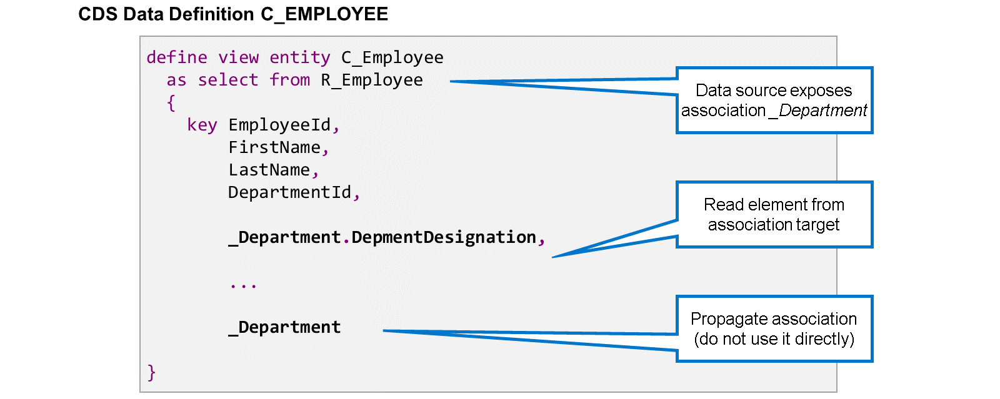

Lorsqu'une entité de vue CDS lit une entité dont les associations sont exposées, deux possibilités s'offrent à vous :

#### 💮 **Propagating the association** :

En ajoutant le nom de l'association à la liste des éléments, l'association devient également visible pour les utilisateurs de cette vue. Dans l'exemple, l'association \_Department est définie et exposée dans l'entité de vue R_Employee. L'entité de vue C_Employee lit depuis R_Employee et propage l'association \_Department.

#### 💮 **Using the association** :

En ajoutant un point (.) et un nom d'élément après le nom de l'association, l'association est utilisée pour lire les données de la cible de l'association. Ce type d'utilisation est appelé expression de chemin. Dans l'exemple, la cible de l'association \_Department est l'entité de vue CDS C_Department. L'entité de vue CDS C_Employee utilise une expression de chemin pour lire le champ DepmentDesignation de la cible de l'association et l'ajouter à sa propre liste d'éléments.

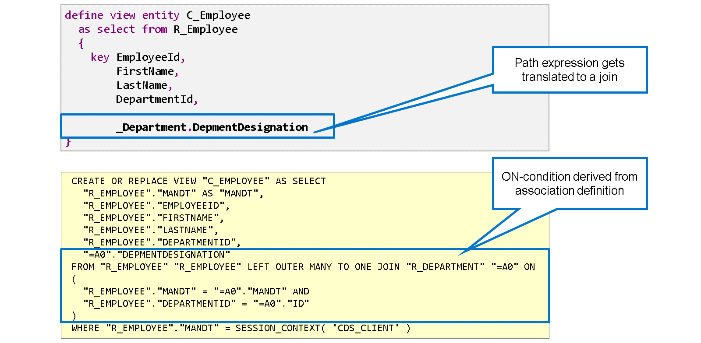

Au niveau de la base de données, une expression de chemin est traduite en une jointure entre la source et la cible de l'association. Ceci est visible dans la fonction Afficher l'instruction SQL Create de l'éditeur.

Dans l'exemple, l'expression de chemin \_Department.DepmentDesignation conduit à une jointure des vues SQL R_EMPLOYEE et R_DEPARTMENT sur la base de données. La condition ON de la jointure est dérivée de la condition ON de l'association.

> #### 🍧 Note
>
> Le type de jointure LEFT OUTER MANY TO ONE JOIN est une spécificité de la base de données SAP HANA. Il existe également un type de jointure.

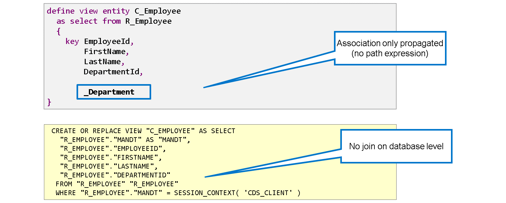

Il est important de souligner que la jointure au niveau de la base de données n'est créée que lorsque l'association est utilisée dans une expression de chemin. La définition, l'exposition et la propagation d'une association ne conduisent pas à une jointure. Cette fonctionnalité des associations est parfois appelée « jointure à la demande ».

Prenons un autre exemple : même si l'entité de vue CDS R_Employee définit et expose l'association \_Department et que l'entité de vue CDS C_Employee propage cette association, la vue SQL correspondante C_EMPLOYEE lit uniquement à partir de la vue SQL R_EMPLOYEE.

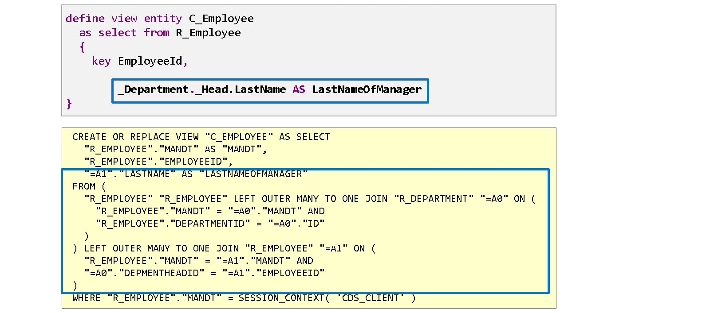

Jusqu'à présent, nous avons abordé les expressions de chemin avec une seule association. Il est également possible de créer des expressions de chemin plus longues en enchaînant plusieurs associations.

Voici un exemple : l'entité de vue CDS R_Employee expose l'association \_Department, dont la cible est l'entité de vue CDS R_Department. Cette cible expose une autre association \_Head, pointant vers R_Employee mais lisant l'employé responsable du service concerné. L'expression de chemin \_Department.\_Head.LastName lit le nom de famille du responsable du service auquel un employé est affecté. La jointure longue et complexe de trois sources de données est générée automatiquement.

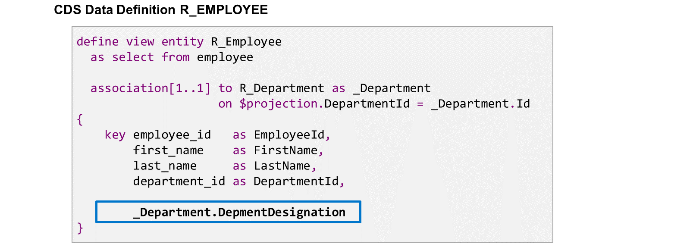

La plupart du temps, lorsqu'une entité de vue CDS définit une association, elle l'expose à ses utilisateurs. Cependant, elle peut également utiliser l'association directement, soit au lieu de l'exposer, soit en plus.

On parle alors d'utilisation ad hoc des associations. Dans l'exemple, l'entité de vue CDS R_Employee définit l'association \_Department. Au lieu d'exposer l'association, elle l'utilise directement dans une expression de chemin pour récupérer la désignation du service associé.

Dans le cas d'une utilisation ad hoc, la jointure est immédiatement créée dans la vue SQL de cette entité de vue CDS.

## 🌸 HOW TO WRITE PATH EXPRESSIONS IN CDS

[Référence - Link Vidéo](https://learning.sap.com/learning-journeys/acquire-core-abap-skills/using-associations-in-path-expressions_daff758b-a544-4613-9a6e-aa1a2df73a33)

## 🌸 THE INFLUENCE OF THE CARDINALITY ON PATH EXPRESSIONS

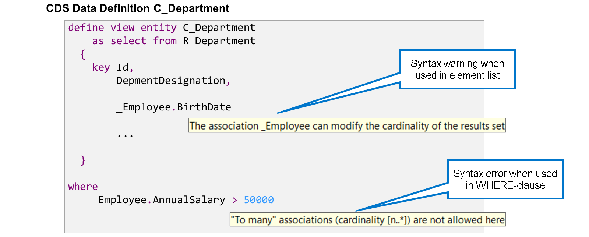

Lorsque vous utilisez une association dans une expression de chemin, la cardinalité peut influencer la vérification de la syntaxe. L'éditeur affiche des avertissements, voire des erreurs, en cas d'utilisation incorrecte d'associations « trop nombreuses », c'est-à-dire dont la cardinalité maximale est supérieure à 1.

Dans les expressions de chemin de la clause WHERE de la définition de vue, l'utilisation d'associations « trop nombreuses » est totalement interdite et entraîne une erreur de syntaxe.

Dans la liste des éléments, les associations « trop nombreuses » sont autorisées, mais l'éditeur affiche un avertissement indiquant que cette expression de chemin peut modifier le nombre de jeux de résultats.

Que signifie cet avertissement ? Imaginez que vos tables ne contiennent qu'un seul service avec 5 employés. Sans l'expression de chemin, la vue CDS C_Department renvoie exactement un jeu de données. Ajoutez ensuite l'expression de chemin avec l'association « trop nombreuses » \_Employee à la liste des éléments. La même vue renvoie alors 5 jeux de données, un pour chaque employé. Cela peut être trompeur pour les utilisateurs de la vue C_Department, car ils attendent un jeu de données par service.

> #### 🍧 Hint
>
> Si vous souhaitez combiner les données des employés et celles des services, commencez par la vue R_Employee et utilisez l'association « to one » \_Department pour ajouter les détails du service.

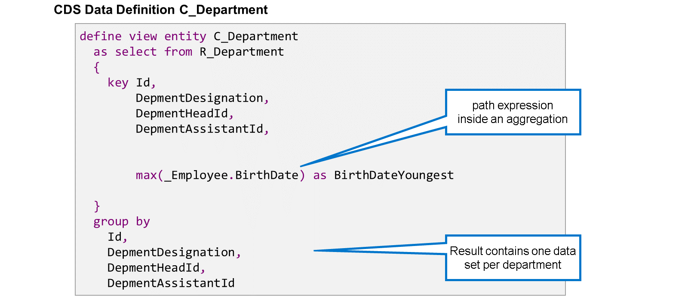

Une façon d'utiliser correctement une association « plusieurs » consiste à placer l'expression de chemin dans une agrégation. La clause GROUP-BY, obligatoire pour les agrégations, garantit que le nombre d'ensembles de données reste identique. Dans l'exemple, l'entité de vue CDS C_Department renvoie toujours un ensemble de données par service, et non par employé.

> #### 🍧 Note
>
> Une autre façon d'utiliser correctement une association « plusieurs » consiste à ajouter une condition de filtre. Nous aborderons les filtres dans la section suivante.

## 🌸 FITERS IN PATH EXPRESSIONS

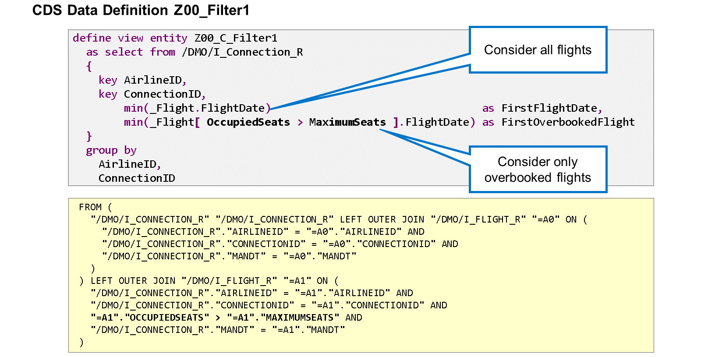

Lorsque vous utilisez une association dans une expression de chemin, vous pouvez ajouter des filtres pour restreindre les ensembles de données de la cible de l'association. La condition de filtre est placée entre crochets ([ ]) immédiatement après le nom de l'association. Comme dans une clause WHERE, vous pouvez utiliser les opérateurs relationnels et les opérateurs booléens AND, OR, NOT. Le côté gauche d'une condition doit être un champ de la cible de l'association. Le côté droit offre plus de flexibilité. Vous pouvez notamment utiliser des champs de la cible de l'association, des littéraux, des fonctions intégrées, etc.

Dans l'exemple, il existe deux expressions de chemin : l'une sans condition de filtre, l'autre avec la condition OccupiedSeats > MaximumSeats. Alors que la première expression de chemin recherche le premier vol associé à une correspondance, la seconde restreint la recherche aux vols surbookés, c'est-à-dire les vols dont le nombre de sièges occupés dépasse le nombre de sièges disponibles.

Techniquement, la condition de filtre est ajoutée à la condition ON de la jointure générée au niveau de la base de données.

Examinons l'instruction SQL create de notre exemple : la première jointure de notre exemple appartient à l'expression de chemin sans filtre. La condition ON compare AIRLINEID, CONNECTIONID et le champ client MANDT. La deuxième jointure appartient à l'expression de chemin avec filtre. Pouvez-vous identifier la condition supplémentaire dans l'expression de chemin filtrée ?

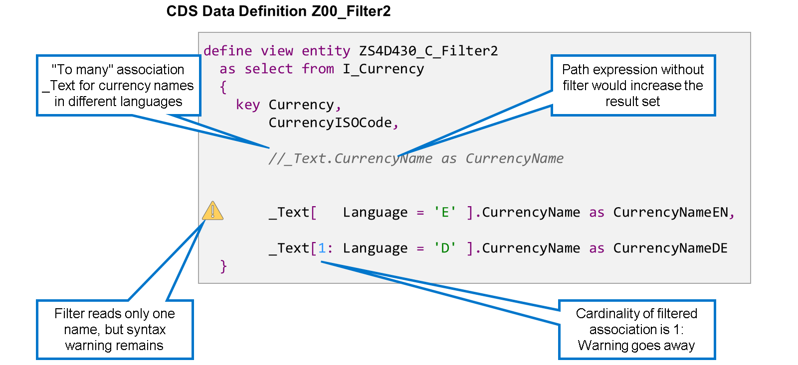

Lorsque vous filtrez une association dont la cardinalité est supérieure à 1, il peut arriver qu'après application du filtre, il ne reste qu'une seule entrée de l'association cible. Le filtre transforme l'association « à plusieurs » en association « à un ». Dans ce cas, ajoutez « 1: » devant la condition de filtre pour documenter la modification de cardinalité de l'association.

Dans cet exemple, l'entité de vue CDS I_Currency définit et expose l'association \_Text, une association « à plusieurs », qui renvoie les noms de devises dans différentes langues. Sans filtre, l'association lirait le nom d'une devise dans toutes les langues gérées par le système. Cependant, les deux expressions de chemin avec filtre ne lisent qu'un seul nom de devise chacune, en anglais ou en allemand.

Comme nous l'avons vu précédemment, la vérification de syntaxe génère des avertissements et des erreurs lorsqu'une association « à plusieurs » est utilisée dans une expression de chemin située en dehors d'une agrégation. Mais que se passe-t-il si un filtre garantit qu'il n'y a qu'un seul enregistrement ? La vérification de syntaxe génère-t-elle toujours des avertissements et des erreurs ? Oui, car il ne peut pas savoir que le filtre transforme l'association « à plusieurs » en association « à un ». Nous pouvons documenter cela en ajoutant « 1: » entre crochets, avant la condition de filtre. Dans l'exemple, un avertissement de syntaxe s'affiche pour l'expression de chemin avec le filtre Langue = 'E'. En revanche, il n'y a aucun avertissement de syntaxe pour l'expression de chemin avec le filtre 1 : Langue = 'D'.

## 🌸 PATH EXPRESSIONS IN ABAP SQL

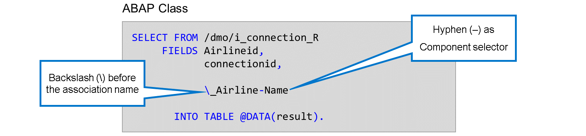

Une autre façon d'utiliser les associations exposées est d'utiliser les expressions de chemin en ABAP SQL. Le concept est identique à celui de CDS, mais la syntaxe est légèrement différente.

Les principales différences syntaxiques sont les suivantes :

#### 💮 **Association Prefix** :

Dans les expressions de chemin ABAP SQL, les associations doivent être séparées par une barre oblique inverse (\).

#### 💮 **Element Selector** :

Dans les expressions de chemin CDS, un point (.) est utilisé comme séparateur entre le nom de l'association et celui de l'élément. En ABAP SQL, le point n'est pas approprié car il terminerait l'instruction. Par conséquent, en ABAP SQL, un trait d'union est utilisé comme sélecteur d'élément.

Prenons un exemple : cette instruction ABAP SQL SELECT lit l'entité de vue CDS /DMO/I_Connection_R qui expose une association \_Airline. La dernière expression de la liste FIELDS est une expression de chemin permettant de lire le nom de l'élément depuis la cible de l'association /DMO/I_Carrier.

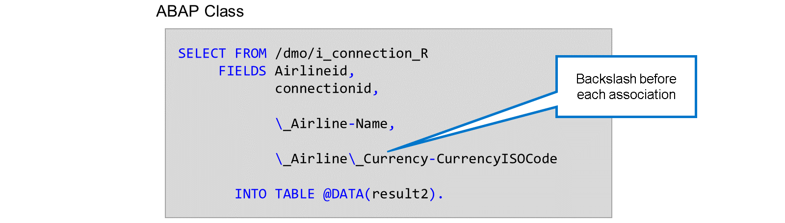

Une autre différence de syntaxe concerne les associations chaînées. Lorsqu'une expression de chemin contient une séquence d'associations, il n'existe pas de séparateur dédié. Alors que dans CDS, les associations sont séparées par un point (.), elles se suivent directement dans ABAP SQL. Notez cependant que chaque nom d'association nécessite une barre oblique inverse (\) comme préfixe.

Dans cet exemple, la cible de l'association \_Airline expose une association \_Currency qui renvoie les détails de la devise locale de la compagnie aérienne. L'expression \_Airline_Currency-CurrencyISOCode lit le code ISO de la devise locale de la compagnie aérienne qui exploite la correspondance.

> #### 🍧 Note
>
> Dans CDS, la même expression de chemin est \_Airline.\_Currency.CurrencyISOCode.

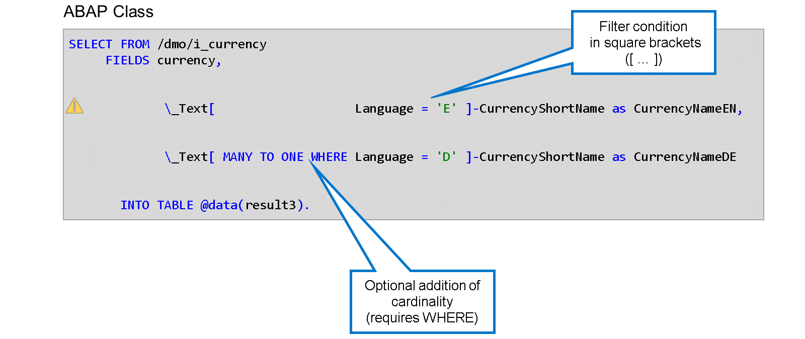
