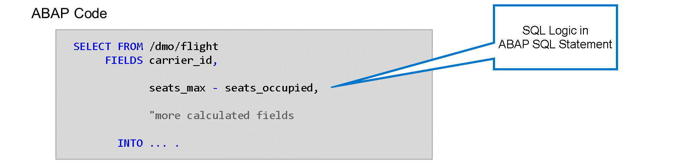
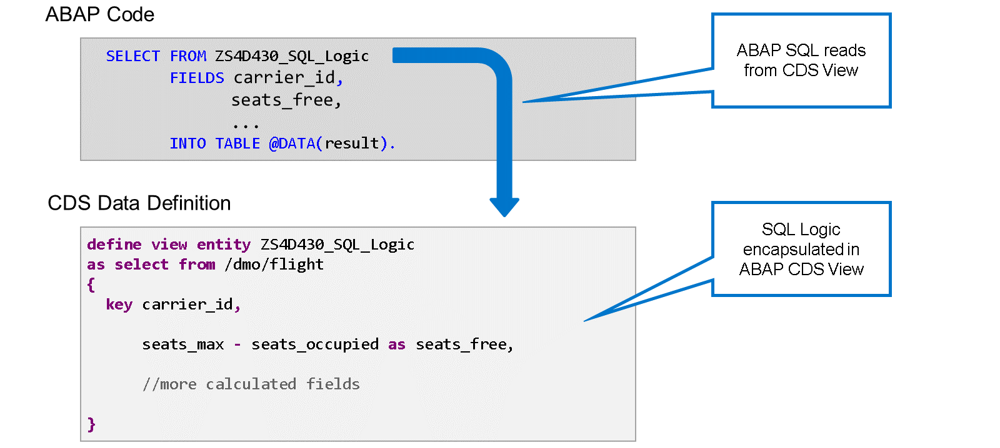
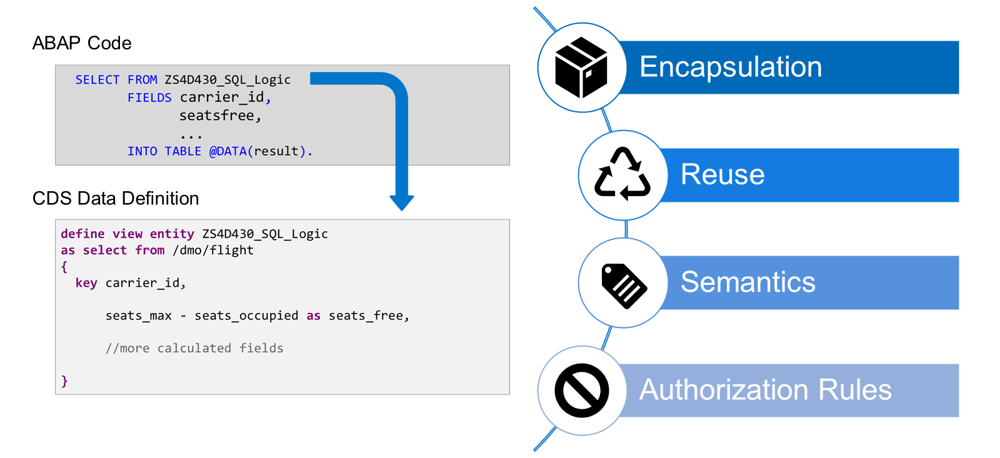
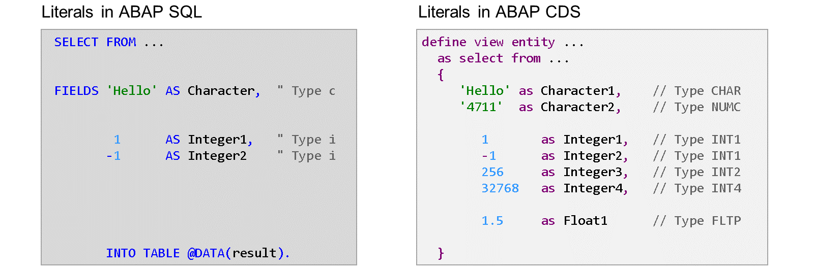
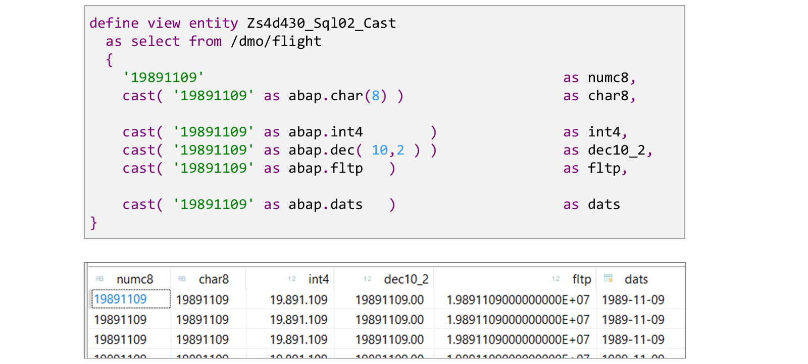
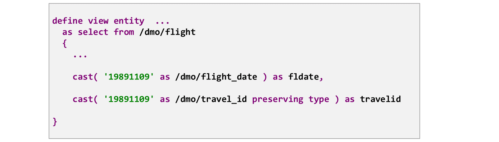
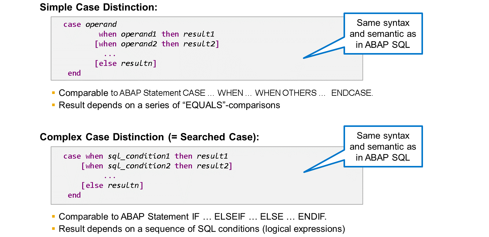
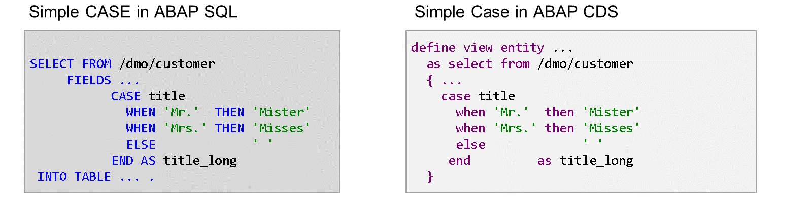
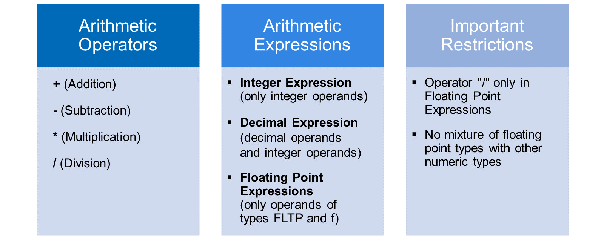
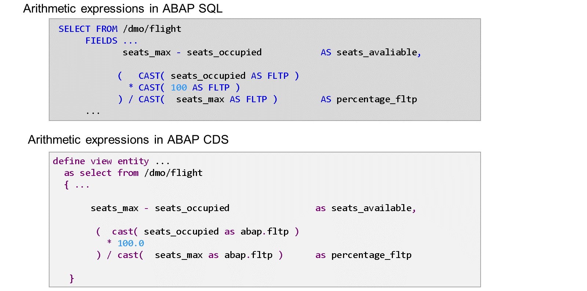

# 🌸 1 [IMPLEMENTING SQL EXPRESSIONS IN CDS VIEWS](https://learning.sap.com/learning-journeys/acquire-core-abap-skills/implementing-sql-expressions-in-cds-views_a9962c08-c5df-46a6-ba30-a74acf5c86b2)

> 🌺 Objectifs
>
> - [ ] Encourager l'utilisation du code pushdown dans les vues CDS
>
> - [ ] Utiliser les expressions SQL dans les vues CDS

## 🌸 CODE PUSHDOWN IN ABAP SQL AND ABAP CDS

Dans une partie précédente de ce parcours d'apprentissage, vous avez appris qu'avec les capacités d'analyse de données exceptionnelles de SAP HANA, il est recommandé d'effectuer des calculs directement dans la base de données, dès que possible. Vous avez également appris qu'ABAP SQL propose de nombreuses expressions et fonctions intégrées à cet effet.

La plupart de ces expressions et fonctions intégrées sont également disponibles dans les définitions de vue CDS. Cela vous permet de déplacer les calculs complexes vers une définition de vue CDS, puis d'en extraire les données.

Prenons un exemple. Dans ce code ABAP, l'instruction ABAP SQL utilise une expression arithmétique pour calculer le nombre de sièges libres sur un vol en soustrayant le nombre de sièges occupés du nombre total de sièges.

Dans l'exemple suivant, l'expression arithmétique est déplacée vers une définition de vue CDS. Le résultat du calcul est visible pour les utilisateurs de la vue sous la forme de l'élément de vue seats_free. Le code ABAP lit l'élément de vue seats_free comme tout autre élément de vue.

> #### 🍧 Note
>
> Pour l'utilisateur d'une vue CDS, peu importe qu'un élément de vue soit une simple projection d'un champ de table de base de données ou le résultat d'un calcul complexe.

Transférer la logique SQL d'ABAP SQL vers une vue CDS présente plusieurs avantages :

#### 💮 **Encapsulation** :

Comme la logique SQL est masquée dans la définition de la vue CDS, les instructions ABAP SQL sont plus lisibles.

#### 💮 **Reuse** :

En lisant depuis la même vue CDS, vous pouvez facilement réutiliser la logique SQL dans d'autres applications. Vous pouvez notamment l'utiliser dans les frameworks utilisant les vues CDS, par exemple pour l'analyse intégrée, les extracteurs de données basés sur CDS pour SAP BW, la programmation d'applications ABAP RESTful, et bien d'autres.

#### 💮 **Semantics** :

Vous pouvez ajouter de la sémantique au résultat du calcul en donnant à l'élément un nom significatif et en l'annotant avec des annotations.

#### 💮 **Authorization Rules** :

Vous pouvez restreindre l'accès aux données calculées en créant un contrôle d'accès CDS pour la vue CDS.

## 🌸 LITERALS IN ABAP CDS

En comparant les littéraux d'ABAP SQL et ceux d'ABAP CDS, vous remarquerez qu'ABAP CDS offre une plus grande variété de types.

#### 💮 **Character Literals** :

Alors qu'ABAP SQL ne reconnaît que les littéraux de caractères de type prédéfini C (correspondant au type de dictionnaire CHAR), ABAP CDS utilise le type de dictionnaire prédéfini NUMC, lorsque le littéral de caractères est composé uniquement de chiffres.

#### 💮 **Numeric Literals** :

ABAP SQL ne reconnaît que les littéraux entiers positifs et négatifs et utilise le type ABAP I prédéfini (type de dictionnaire INT4) pour tous.

ABAP CDS, quant à lui, utilise également les types de dictionnaire INT4, INT2 et INT1, choisissant le type le plus court pouvant contenir la valeur du littéral. Par exemple, la valeur littérale 255 est toujours de type INT1, tandis que 256 est trop grande pour un octet et nécessite le type INT2.

ABAP CDS reconnaît également les littéraux non entiers. Ils contiennent un point décimal et possèdent un type de dictionnaire prédéfini FLTP.

> #### 🍧 Note
>
> Les littéraux non entiers ne sont pas pris en charge dans ABAP SQL, principalement parce que le point (.) est réservé comme délimiteur d'instruction.

## 🌸 TYPE CONVERSIONS

Comme avec ABAP SQL, vous pouvez utiliser l'expression CAST pour implémenter des conversions de type techniques.

L'opérande de l'expression CAST ne peut pas être un simple littéral, comme dans notre exemple. De nombreuses autres expressions sont possibles, par exemple des champs de la source de données, des expressions arithmétiques, des distinctions CASE, des fonctions SQL, etc.

Le type cible peut être spécifié comme un type de dictionnaire prédéfini. Cette méthode est identique à l'utilisation de CAST en ABAP SQL. Notez cependant que dans CDS, le préfixe abap. est requis.

La combinaison des types source et cible est soumise à des restrictions. Certaines combinaisons ne sont pas prises en charge. D'autres fonctionnent avec des limitations. Par exemple, il n'est actuellement pas possible d'utiliser des opérandes de type FLTP comme source pour l'expression CAST. Une matrice détaillée est disponible dans la documentation du langage ABAP.

Une particularité de CAST dans ABAP CDS est la possibilité d'utiliser un élément de données de dictionnaire comme type cible. Ce type de conversion convertit non seulement le type technique, mais récupère également des informations sémantiques, telles que les libellés de champ, de l'élément de données.

Une conversion avec un élément de données comme type cible peut même être utile si le type technique de l'opérande et celui de l'élément de données cible sont identiques. Dans ce cas, seules les informations sémantiques de l'opérande sont modifiées. Si une conversion ne modifie pas le type technique, la vérification syntaxique génère un avertissement. Vous pouvez supprimer cet avertissement en ajoutant PRESERVING TYPE dans l'expression de conversion.

## 🌸 CASE DISTINCTIONS IN ABAP CDS

ABAP CDS offre exactement les mêmes distinctions de casse qu'ABAP SQL. Les distinctions de casse simple et complexe suivent les mêmes règles syntaxiques et offrent les mêmes fonctionnalités.

Ceci peut être illustré par un exemple. L'expression de cas simple à gauche provient d'une instruction ABAP SQL SELECT. L'expression de cas simple à droite fait partie d'une définition d'entité de vue CDS. Il n'y a aucune différence, hormis le formatage et la coloration différents dans les deux éditeurs.

## 🌸 ARITHMETIC EXPRESSIONS IN ABAP CDS

Comme avec ABAP SQL, les expressions arithmétiques peuvent être utilisées dans la liste d'éléments d'une définition de vue CDS. Les mêmes règles et restrictions s'appliquent dans les deux cas. Comme avec ABAP SQL, la restriction la plus importante est que l'opérateur de division (/) n'est autorisé que dans les expressions à virgule flottante.

> #### 🍧 Hint
>
> Vous pouvez utiliser n'importe quel opérande numérique dans une expression à virgule flottante en convertissant le type en FLTP avec CAST().

Comparez ces exemples d'ABAP SQL et d'ABAP CDS. Là encore, la différence réside principalement dans le formatage. Deux différences ne concernent pas vraiment les expressions arithmétiques, mais plutôt l'utilisation de littéraux et d'expressions de conversion :

L'expression de conversion dans ABAP CDS nécessite le préfixe « abap. » devant les types de dictionnaire prédéfinis.
Vous pouvez utiliser des littéraux à virgule flottante dans ABAP CDS. Vous pouvez utiliser le littéral 100.0 directement dans l'expression à virgule flottante. Il n'est pas nécessaire d'utiliser le littéral entier 100 et de le convertir en type prédéfini FLTP.
