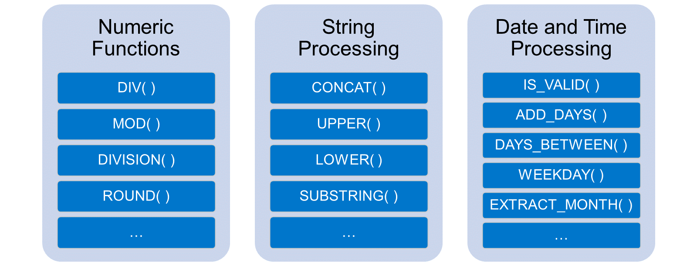
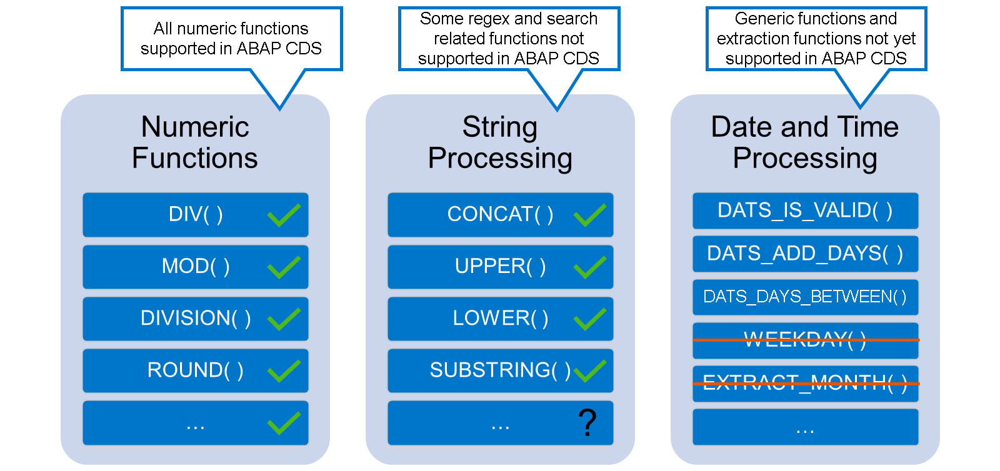
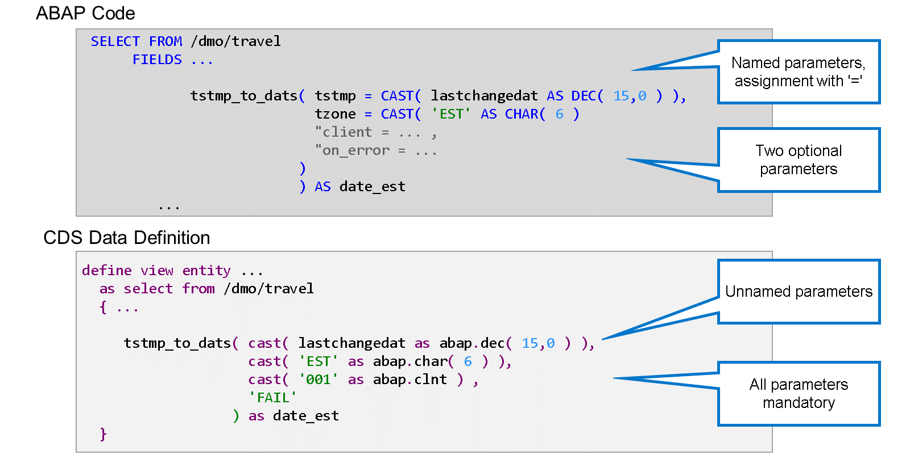
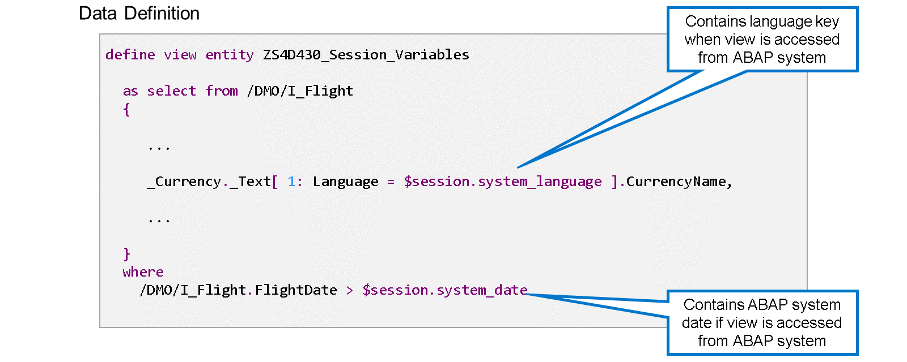
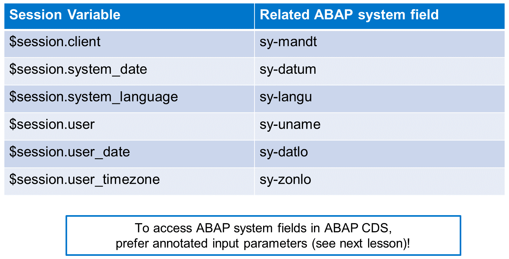

# 🌸 2 [CALLING BUILT-IN FUNCTIONS IN CDS VIEWS](https://learning.sap.com/learning-journeys/acquire-core-abap-skills/calling-built-in-functions-in-cds-views_ea117751-e9eb-45f0-bd46-8abb62f578dd)

> 🌺 Objectifs
>
> - [ ] Utiliser les fonctions intégrées dans ABAP CDS
>
> - [ ] Utiliser les variables de session

## 🌸 BUILT-IN FUNCTIONS IN CDS - OVERVIEW

### BUILT-IN FUNCTIONS IN ABAP SQL

Maintenant que vous savez que vous pouvez utiliser des expressions dans ABAP SQL et ABAP CDS exactement de la même manière, qu'en est-il des fonctions intégrées ? Pouvez-vous également les utiliser dans ABAP CDS ?

Regardons cela de plus près.

#### 💮 **Numeric Functions** :

Pour toutes les fonctions numériques, la réponse est « oui ». Elles sont également toutes prises en charge par ABAP CDS.

#### 💮 **String Processing** :

La plupart des fonctions de traitement des chaînes sont également prises en charge. Certaines sont uniquement disponibles en ABAP SQL, principalement liées aux expressions régulières. Une liste détaillée est disponible dans la documentation des mots-clés ABAP.

#### 💮 **Date and Time Processing** :

Les restrictions les plus importantes concernent les fonctions de traitement des données et de l'heure. Dans ce cas, les fonctions génériques (IS_VALID( ), ADD_DAYS( ), DAYS_BETWEEN( ), etc.) ne sont disponibles qu'en ABAP SQL. Dans ABAP CDS, vous devez utiliser les variantes spécifiques au type, c'est-à-dire les fonctions correspondantes commençant par DATS, DATN, TIMS, TSTMP, etc.

De plus, les fonctions permettant d'extraire des informations d'un champ de date ou d'heure ne sont pas prises en charge par ABAP CDS. Autrement dit, vous ne pouvez pas utiliser les fonctions WEEKDAY(), EXTRACT_MONTH(), etc. Consultez la documentation des mots-clés ABAP pour obtenir la liste complète.

Voyons quelques exemples.

## 🌸 CONVERSION FUNCTIONS IN ABAP CDS

### EXAMPLE: CURRENCY CONVERSION IN ABAP SQL AND ABAP CDS

[Référence - Link Vidéo](https://learning.sap.com/learning-journeys/acquire-core-abap-skills/calling-built-in-functions-in-cds-views_ea117751-e9eb-45f0-bd46-8abb62f578dd)

Certaines fonctions de conversion ont des paramètres nommés en ABAP SQL, mais pas en ABAP CDS. Par conséquent, les paramètres facultatifs en ABAP SQL deviennent obligatoires en ABAP CDS.

Prenons l'exemple de la fonction de conversion d'horodatage TSTMP_TO_DATS(). Cette fonction possède quatre paramètres, dont deux obligatoires et deux facultatifs en ABAP SQL. En ABAP CDS, les quatre paramètres sont obligatoires et transmis sans affectation explicite de paramètres.

## 🌸 SESSION VARIABLES

Dans une entité de vue ABAP CDS, vous pouvez utiliser des variables de session pour accéder à la valeur des champs système ABAP. L'accès à une variable de session commence par le préfixe $session., suivi du nom de la variable.

L'exemple utilise la variable de session system_language dans une expression de filtre et la variable de session system_date dans la clause WHERE. Vous pouvez également utiliser des variables de session à presque n'importe quelle autre position d'opérande.

> #### 🍧 Caution
>
> Les variables de session ne contiennent des valeurs que si la requête de lecture provient d'un système ABAP. Dans le cas contraire, les valeurs des variables de session sont indéfinies ! C'est pourquoi il est préférable d'utiliser des paramètres d'entrée pour accéder aux champs système ABAP. Consultez la leçon suivante pour plus de détails.

Actuellement, ABAP CDS propose six variables de session intégrées. La liste les présente avec le champ système associé.

> #### 🍧 Note
>
> Outre les variables de session intégrées, il existe également des variables de session d'application. Elles sont requises pour des applications spécifiques et définies par des programmes système dédiés. Pour plus de détails, consultez la documentation des mots-clés ABAP.
