# 🌸 3 [DEFINING CDS VIEWS WITH INPUT PARAMETERS](https://learning.sap.com/learning-journeys/acquire-core-abap-skills/defining-cds-views-with-input-parameters_bccd42ca-1dcb-4dfa-9ca7-903d4030e855)

> 🌺 Objectifs
>
> - [ ] Définir les vues CDS avec les paramètres d'entrée
>
> - [ ] Fournir les valeurs pour les paramètres des vues CDS
>
> - [ ] Lier les paramètres aux champs du système ABAP

## 🌸 THE NEED FOR INPUT PARAMETERS

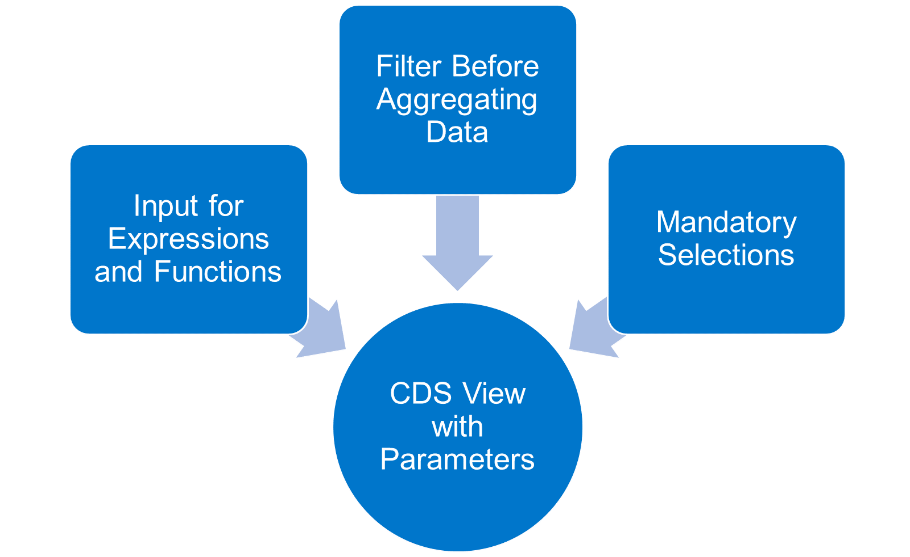

Dans les leçons précédentes, vous avez vu la puissance des vues CDS pour effectuer des calculs dans la base de données. Vous vous êtes peut-être déjà demandé dans quelle mesure le consommateur de la vue CDS peut influencer la manière dont les calculs sont effectués. Bien sûr, le consommateur peut fournir une clause WHERE pour effectuer une sélection sur le résultat. Mais en quoi cela est-il utile pour choisir la devise cible d'une conversion de devises ?

Les vues CDS avec paramètres d'entrée comblent ce manque. Elles permettent au consommateur d'une vue de fournir des informations supplémentaires lors de la récupération des données de cette vue. La vue CDS évalue ensuite ces informations et les prend en compte lors du calcul des résultats. Voici quelques cas d'utilisation possibles des paramètres :

- Le consommateur spécifie la devise cible d'une conversion de devises.

- Le consommateur précise si les prix sont calculés avec ou sans taxes.

- Le consommateur fournit un séparateur utilisé lors de la concaténation des champs.

- Le consommateur spécifie la langue dans laquelle le texte traduisible est renvoyé.

Un autre intérêt majeur des vues d'entrée réside dans les vues CDS avec agrégations, permettant de filtrer les données entrantes. Par exemple, si vous calculez le chiffre d'affaires total et souhaitez spécifier une date limite de prise en compte, SQL ne connaît pas les critères de sélection obligatoires. Un consommateur peut fournir une clause WHERE ou non. Avec un paramètre d'entrée obligatoire, la vue peut forcer le consommateur à fournir un critère de sélection nécessaire, par exemple une clé de langue, une date ou un nom d'utilisateur.

## 🌸 INPUT PARAMETER DECLARATION

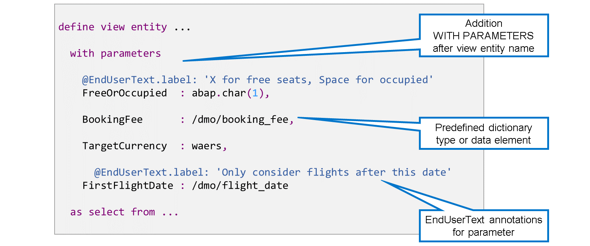

Vous définissez les paramètres d'entrée en ajoutant « AVEC PARAMÈTRES » après le nom de l'entité de vue CDS. Les paramètres sont ensuite définis dans une liste séparée par des virgules.

Chaque paramètre d'entrée doit être saisi avec un type de données élémentaire. Le nom et le type du paramètre sont séparés par deux points (:). Le type d'un paramètre peut être un type de dictionnaire ABAP prédéfini (sous la forme abap.<type>(<len>)) ou un élément de données. Les types structure, table et référence ne sont pas autorisés.

Vous pouvez utiliser des annotations de paramètres pour fournir des métadonnées.

## 🌸 ACCESS TO PARAMETER

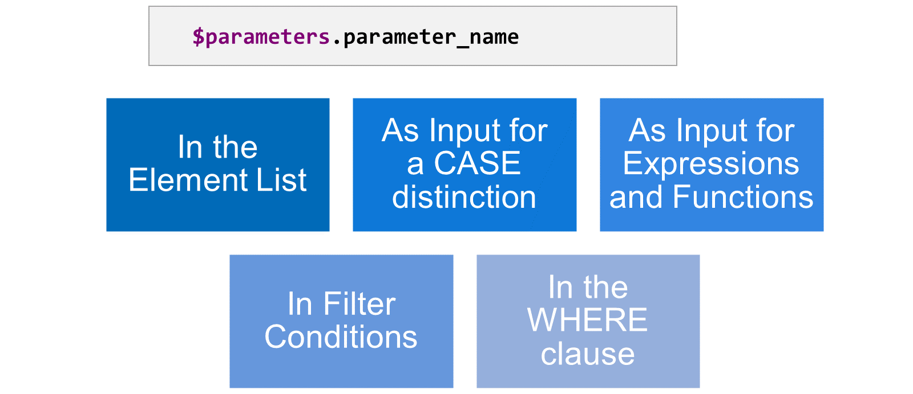

Pour accéder aux paramètres d'entrée dans la définition de la vue CDS, utilisez le préfixe $parameters suivi d'un point (.).

Vous pouvez utiliser un paramètre d'entrée aux positions suivantes :

- Comme élément autonome dans la liste d'éléments

- Comme entrée pour une distinction de casse

- Comme entrée pour des expressions et des fonctions

- À droite d'une condition dans une clause WHERE

- À droite d'une condition de filtre dans une expression de chemin

Voici quelques exemples.

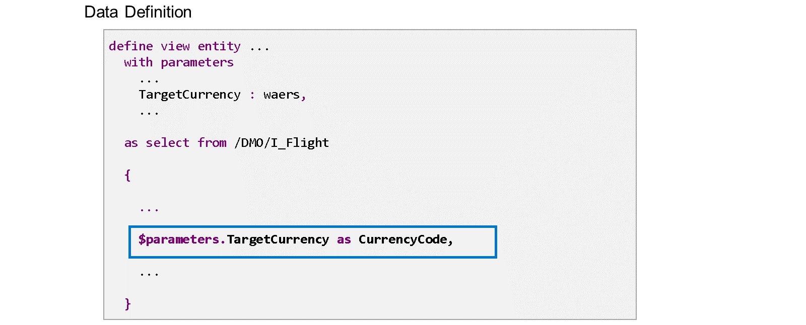

Le paramètre TargetCurrency est utilisé directement dans la liste d'éléments. Une raison typique pourrait être que cet élément soit utilisé dans une annotation @semantics.amount.currencyCode: pour un autre élément.

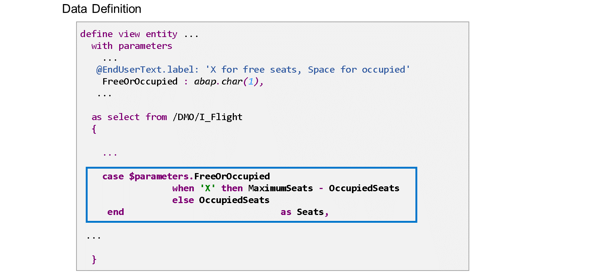

Ici, un paramètre est utilisé dans une distinction CASE, permettant au consommateur de décider si les sièges libres ou les sièges occupés sont retournés.

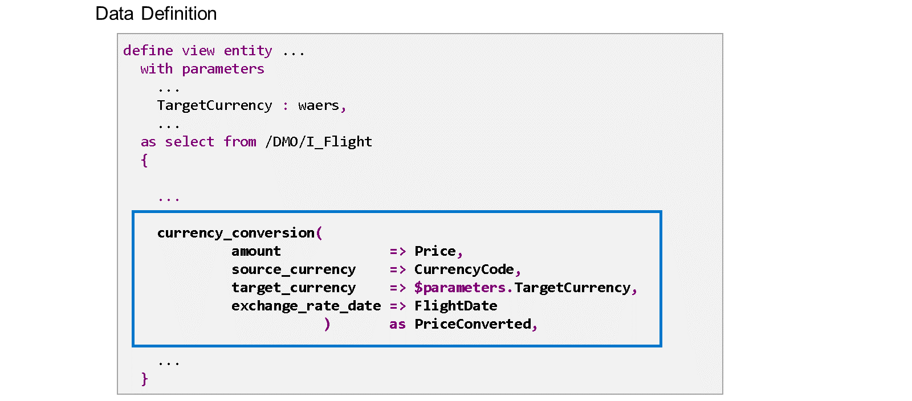

Dans cet exemple, le paramètre d'entrée « CibleCurrency » est utilisé comme entrée pour une fonction intégrée, à savoir la fonction de conversion de devises. Elle permet à l'utilisateur d'une vue de spécifier la devise dans laquelle les prix des vols sont affichés.

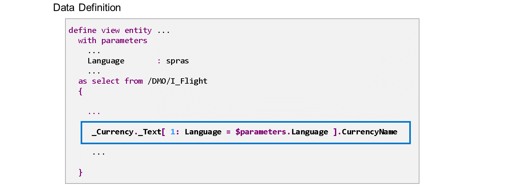

Dans cet exemple, le paramètre d'entrée « Langue » est utilisé dans la condition de filtre d'une expression de chemin. Il permet au consommateur de la vue de spécifier la langue du texte de l'élément « CurrencyName ».

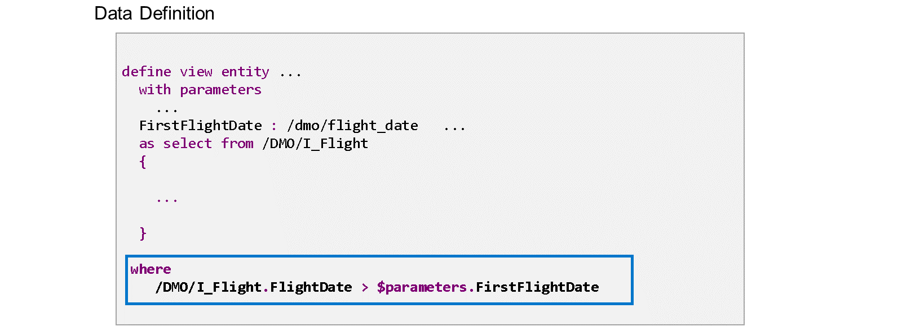

Dans cet exemple, le paramètre d'entrée FirstFlightDate est utilisé dans la condition WHERE de la définition de la vue. Cela établit une sorte de critère de sélection obligatoire. Le consommateur est contraint de filtrer les vols selon une date de vol minimale.

## 🌸 INPUT PARAMETERS IN DATA PREVIEW

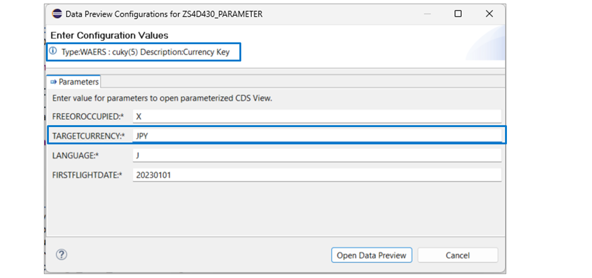

Lorsque vous ouvrez l'outil Aperçu des données pour une vue CDS définissant des paramètres d'entrée, vous êtes invité à saisir les valeurs réelles de ces paramètres avant de pouvoir analyser le résultat. Notez la présence d'un astérisque (\*) à côté des noms de paramètres, indiquant qu'ils sont obligatoires.

Seules les entrées compatibles avec le type de paramètre sont acceptées. Cependant, l'outil n'effectue aucune vérification supplémentaire.

> #### 🍧 Hint
>
> Lorsque le curseur est positionné sur un champ de saisie, l'écran affiche le type attendu au-dessus du masque de saisie.

## 🌸 INPUT PARAMETERS IN WIEW-ON-VIEW

Lorsque vous définissez une nouvelle vue CDS et utilisez une vue CDS avec des paramètres d'entrée comme source de données, vous devez fournir à tous les paramètres d'entrée des valeurs réelles. Prenons un exemple :

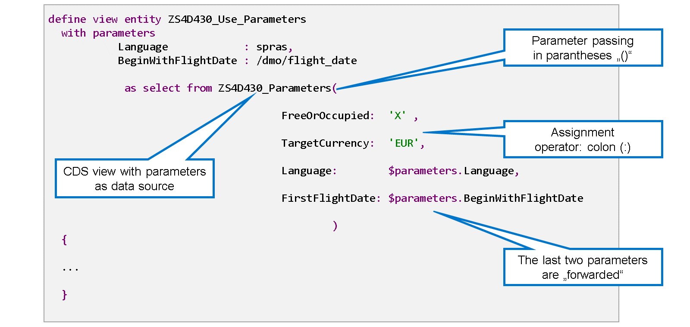

Cette vue CDS lit une vue CDS définissant quatre paramètres.

Les paramètres sont fournis entre parenthèses après le nom de la vue source. Comme il n'y a pas qu'un seul paramètre, ils sont fournis dans une liste séparée par des virgules.

> #### 🍧 Hint
>
> Lorsque vous définissez une vue CDS lisant une vue CDS avec paramètres, vous pouvez utiliser la saisie semi-automatique (Ctrl + Espace) pour insérer la signature complète de la vue CDS.

Chaque nom de paramètre est suivi du signe deux-points (:), qui sert d'opérateur d'affectation de paramètres, suivi de la valeur réelle. Une option consiste à utiliser un littéral comme valeur réelle. Une autre option, très courante, consiste à « transférer » un paramètre. Cela signifie que la vue appelante définit elle-même un paramètre et l'utilise pour fournir le paramètre de sa source de données. Par conséquent, le consommateur de cette vue est responsable de fournir la valeur réelle. Grâce à cette technique, vous pouvez transmettre des informations à travers une pile complète de vues CDS.

## 🌸 INPUT PARAMETERS IN ABAP SQL

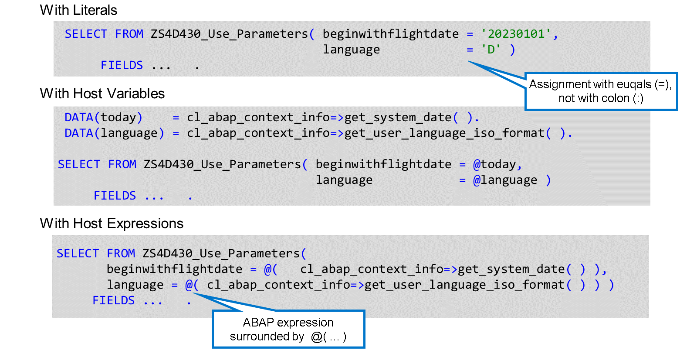

La syntaxe de fourniture des paramètres d'entrée d'une vue CDS en ABAP SQL est très similaire à celle utilisée en CDS. La seule différence réside dans l'opérateur d'affectation : dans CDS, il s'agit du signe deux-points « : », tandis qu'en ABAP SQL, c'est le signe égal (=) qui est utilisé.

Pour fournir les valeurs réelles, vous pouvez choisir parmi les options suivantes :

#### 💮 **Literals** :

Selon le type du paramètre, vous pouvez utiliser des littéraux numériques ou textuels comme valeurs réelles.

#### 💮 **Host Variables** :

Au lieu de littéraux, vous pouvez utiliser des constantes ou des variables ABAP pour fournir les valeurs réelles. Comme d'habitude en ABAP SQL, les variables hôtes et les constantes doivent être échappées avec le signe « @ ». Le type doit être compatible avec le type du paramètre. En particulier, seuls les objets de données ABAP élémentaires sont autorisés.

#### 💮 **Host Expressions** :

Vous pouvez même intégrer des expressions ABAP entières dans l'instruction ABAP SQL et utiliser le résultat comme valeur réelle pour un paramètre de vue. Ces expressions hôtes doivent être entourées de parenthèses et préfixées par le signe « @ ». Notez que les espaces sont obligatoires après la parenthèse ouvrante et avant la parenthèse fermante. L'expression doit avoir un résultat élémentaire et son type doit être compatible avec celui du paramètre.

## 🌸 HOW TO DEFINE AND USE A CDS VIEW WITH AN INPUT PARAMETER

[Référence - Link Vidéo](https://learning.sap.com/learning-journeys/acquire-core-abap-skills/defining-cds-views-with-input-parameters_bccd42ca-1dcb-4dfa-9ca7-903d4030e855)

## 🌸 ACCESS TO ABAP SYSTEM USING CDS VIEW PARAMETERS

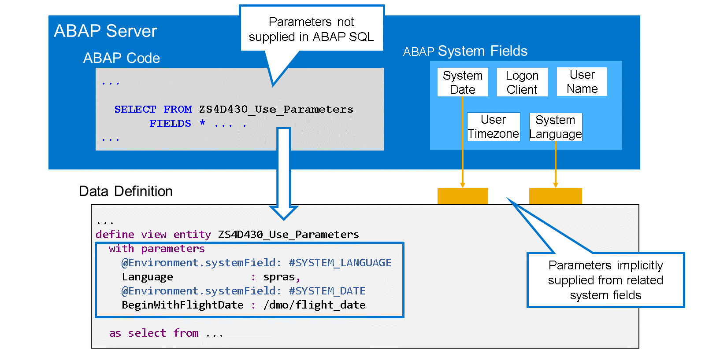

L'environnement d'exécution ABAP gère divers champs système contenant des informations d'intérêt général : la date et l'heure du système, le client et la langue de connexion, le nom d'utilisateur actuel, etc. Pour utiliser les valeurs de ces champs système dans des entités CDS, la méthode recommandée est la suivante :

1. Dans votre vue CDS, définissez des paramètres d'entrée dont le type correspond à celui du champ système, par exemple une date ou une clé de langue.

2. Annotez le paramètre avec Environment.systemField: et choisissez la valeur d'annotation associée au champ système auquel vous souhaitez accéder, par exemple #SYSTEM_DATE ou #SYSTEM_LANGUAGE.

Si un paramètre est annoté de cette manière, l'environnement d'exécution ABAP lui fournira automatiquement la valeur du champ système associé, si aucune autre valeur n'est fournie par le consommateur. Par conséquent, vous pouvez toujours fournir tous les paramètres comme auparavant lorsque vous utilisez la vue comme source de données dans une instruction SQL ABAP. Cependant, la vérification de la syntaxe vous oblige uniquement à fournir les paramètres qui ne sont PAS liés à un champ système. Pour ces paramètres, l'environnement d'exécution ABAP utilise la valeur du champ système associé comme valeur par défaut.

Dans l'exemple, les deux paramètres de la vue CDS sont liés à la date et à la langue du système. Le code ABAP ne fournit aucun de ces paramètres. Par conséquent, l'environnement d'exécution ABAP récupère les valeurs des champs système.

Les paramètres liés aux champs système ABAP ressemblent beaucoup à des paramètres facultatifs. Cependant, gardez à l'esprit que ce mécanisme ne fonctionne que lors de l'accès à la vue depuis ABAP. Dans CDS et au niveau de la base de données, les paramètres restent obligatoires.

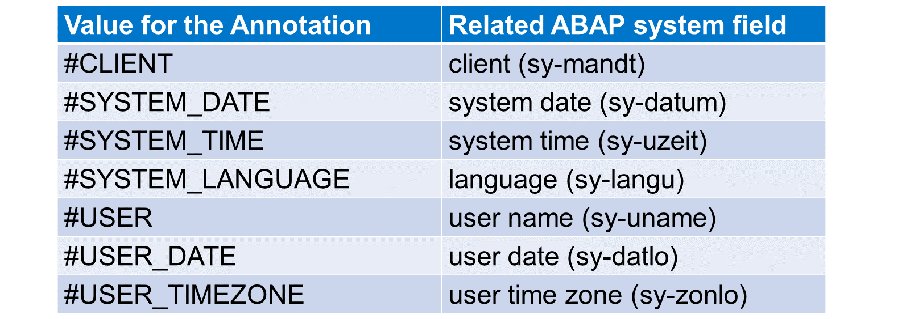

Actuellement, l'annotation Environment.systemField prend en charge sept valeurs différentes. La liste les présente avec le champ système associé.

> #### 🍧 Note
>
> Pour certains champs système, l'accès direct n'est pas recommandé dans le cloud ABAP. Il est recommandé d'utiliser plutôt les méthodes getter de la classe ABAP CL_ABAP_CONTEXT_INFO.

## 🌸 HOW TO ACCESS AN ABAP SYSTEM FIELD IN ABAP CDS

[Référence - Link Vidéo](https://learning.sap.com/learning-journeys/acquire-core-abap-skills/defining-cds-views-with-input-parameters_bccd42ca-1dcb-4dfa-9ca7-903d4030e855)
