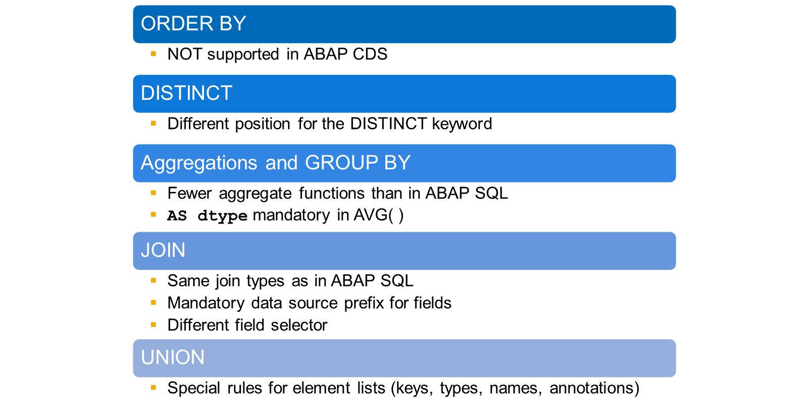
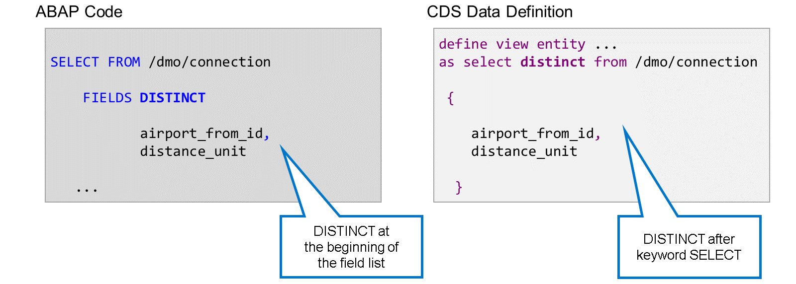
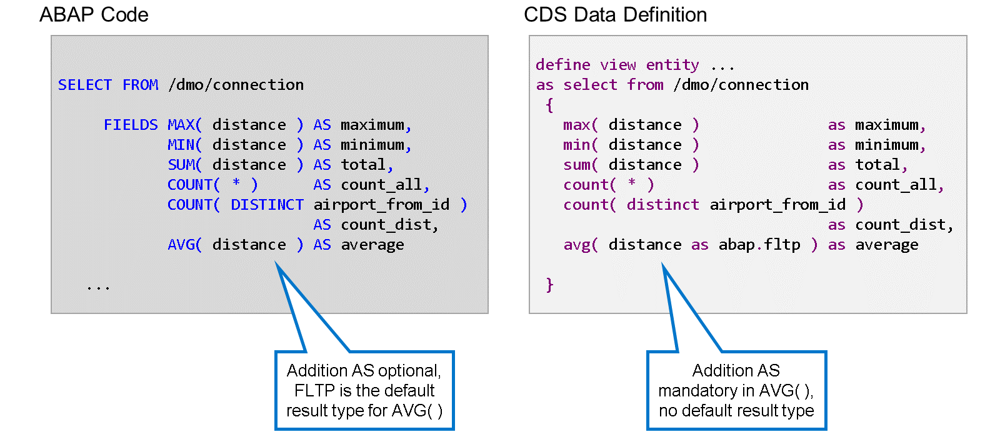
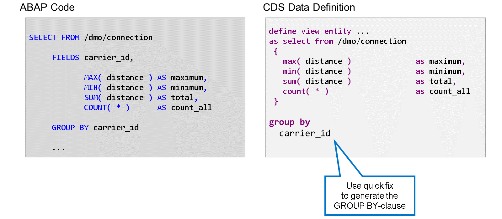
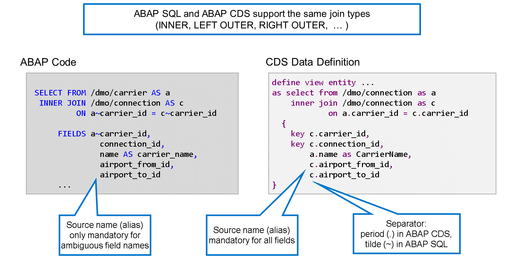
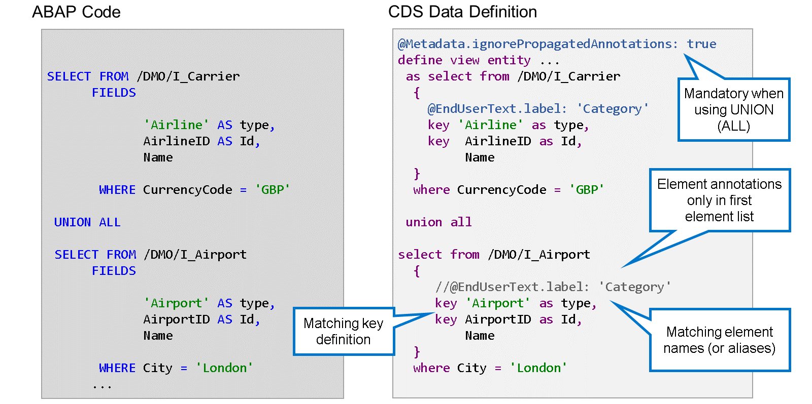

# 🌸 4 [PROCESSING DATA SETS IN CDS VIEWS](https://learning.sap.com/learning-journeys/acquire-core-abap-skills/including-aggregations-joins-and-unions-in-cds-views_fa94fdc8-20e2-4fb4-b980-5323314a47bf)

> 🌺 Objectifs
>
> - [ ] Décrire les techniques de traitement des ensembles de données dans ABAP CDS
>
> - [ ] Utiliser l'ajout DISTINCT dans les vues ABAP CDS
>
> - [ ] Inclure les agrégations et les regroupements dans les vues CDS
>
> - [ ] Utiliser les jointures et les unions dans les vues CDS

## 🌸 OVERVIEW

ABAP SQL propose différentes techniques SQL pour manipuler et combiner des ensembles de données. Sont-elles également prises en charge par ABAP CDS ? Et si oui, quelles sont les différences ?

Voici une liste des techniques SQL les plus importantes :

#### 💮 **ORDER BY** :

La clause ORDER BY pour trier les ensembles de résultats n'est pas prise en charge par ABAP CDS.

#### 💮 **DISTINCT** :

L'ajout DISTINCT permet de supprimer les doublons des ensembles de résultats. Il est pris en charge par ABAP CDS, mais avec DISTINCT après le mot-clé SELECT et non au début de la liste des champs.

#### 💮 **Aggregations and GROUP BY** :

Les agrégations permettent de dériver des valeurs d'un ensemble de données complet, par exemple le nombre d'enregistrements, une valeur maximale ou une valeur moyenne. Les agrégations sont souvent combinées à une clause GROUP BY qui définit des groupes d'enregistrements avant que l'agrégation ne soit effectuée séparément pour chaque groupe. Toutes les agrégations disponibles dans ABAP SQL ne sont pas prises en charge par les vues CDS, mais les plus importantes, telles que COUNT, MIN, MAX, SUM et AVG, sont disponibles. Il existe également des différences mineures de syntaxe. Par exemple, il est obligatoire de spécifier le type de résultat lors du calcul d'une moyenne avec AVG. En ABAP SQL, ce n'est qu'une option.

#### 💮 **JOIN** :

Les jointures permettent de combiner des enregistrements provenant de différents jeux de résultats qui remplissent une condition de jointure. Les mêmes types de jointures sont pris en charge par ABAP SQL et ABAP CDS. Là encore, il existe quelques différences syntaxiques mineures. Il est obligatoire de spécifier la source de données lors de l'accès aux champs, et ABAP CDS utilise un sélecteur de champ différent.

#### 💮 **UNION** :

L'instruction UNION permet d'unifier les enregistrements provenant de différents jeux de résultats. Lorsque l'instruction UNION est utilisée dans la définition des vues CDS, des règles spécifiques s'appliquent à la définition des clés, ainsi qu'aux types, noms et annotations des éléments de vue.

## 🌸 DISTINC RESULT IN ABAP CDS

L'ajout de DISTINCT permet de supprimer les doublons du jeu de résultats d'une instruction SELECT. En ABAP SQL, il est placé au début de la liste des champs. Dans les définitions de vue CDS, DISTINCT apparaît toujours directement après l'instruction SELECT. Il ne fait pas partie de la liste des éléments entre accolades.

## 🌸 AGGREGATIONS IN ABAP CDS

Cet exemple présente les fonctions d'agrégation les plus courantes et leur utilisation dans les définitions de vues ABAP SQL et CDS. Notez que l'ajout de abap.fltp entre parenthèses de la fonction d'agrégation AVG( ) spécifie le type numérique du résultat. L'ajout AS est obligatoire dans ABAP CDS. En ABAP SQL, il est facultatif et le type FLTP est utilisé par défaut.

Si la liste d'éléments d'une instruction SELECT contient un mélange de fonctions d'agrégation et d'autres éléments, tels que des colonnes, des expressions, etc., la syntaxe SQL requiert une clause GROUP BY. Cette clause doit répertorier tous les champs de la source de données qui apparaissent dans la liste de champs hors agrégations.

L'exemple montre qu'il n'y a aucune différence dans la façon de définir la clause GROUP BY entre ABAP SQL et ABAP CDS.

> #### 🍧 Hint
>
> L'éditeur de définitions de données CDS propose une solution rapide pour générer la clause GROUP BY. Cela peut être particulièrement utile lorsque la liste d'éléments est longue ou contient des expressions complexes. Une autre solution rapide est proposée après modification de la liste d'éléments, vous permettant d'ajuster la clause GROUP BY.

## 🌸 JOINS AND UNIONS IN ABAP CDS

En SQL, une jointure est la combinaison de deux sources de données en un seul jeu de résultats, composé de colonnes provenant des deux sources. Les lignes sont déterminées par le type de jointure et la condition de jointure, également appelée condition ON.

ABAP CDS et ABAP SQL prennent en charge les mêmes types de jointure, notamment les jointures internes (INNER JOIN), externes (LEFT OUTER JOIN) et externes (RIGHT OUTER JOIN). Pour connaître les autres types de jointure pris en charge, consultez la documentation des mots-clés ABAP.

La syntaxe des jointures est très similaire entre ABAP SQL et ABAP CDS, mais pas identique. Prenons un exemple.

Dans ABAP CDS, le point (.) est utilisé comme séparateur entre le nom d'un champ et le nom de la source de données ou, si un alias est défini pour cette source de données, le nom de l'alias de la source de données. Dans ce cas, ABAP SQL suit la norme SQL. Dans ABAP SQL, le signe tilde (~) est utilisé à cette fin. En effet, dans ABAP, le point est déjà utilisé comme délimiteur d'instruction.

L'autre différence de syntaxe concerne l'utilisation des champs dans la liste de champs ou la liste d'éléments. Dans les entités de vue CDS, le nom de la source de données est obligatoire pour tous les champs. En ABAP SQL, le nom de la source n'est requis que lorsque des champs du même nom existent dans différentes sources de données. Dans l'exemple, c'est le cas pour le champ carrier_id, car un champ portant ce nom existe dans les deux sources de données.

Une UNION fusionne les lignes des jeux de résultats de plusieurs instructions SELECT d'entités de vue CDS en un seul jeu de résultats. Sans l'ajout ADD, ALL, les doublons complets sont supprimés après la fusion.

Pour UNION ou UNION ALL, les jeux de résultats doivent comporter le même nombre d'éléments et les paires d'éléments apparaissant à la même position doivent avoir un type de données compatible. Cette condition est identique en ABAP SQL et ABAP CDS.

De plus, les règles suivantes s'appliquent à l'utilisation d'UNION ou d'UNION ALL dans les définitions de vue CDS :

#### 💮 **Element names** :

Les noms d'éléments directs ou les noms d'alias doivent correspondre pour chaque colonne des listes d'éléments.

#### 💮 **Key elements** :

Les éléments clés de toutes les listes d'éléments doivent correspondre. Sinon, une erreur de vérification de syntaxe se produit.

#### 💮 **Key elements** :

Seule la liste d'éléments de la première instruction SELECT peut définir des annotations d'éléments. Dans toutes les branches suivantes, les annotations d'éléments sont interdites.

Pour éviter les conflits, l'annotation @Metadata.ignorePropagatedAnnotations: true est obligatoire lorsqu'une définition de vue CDS contient UNION ou UNION ALL.
