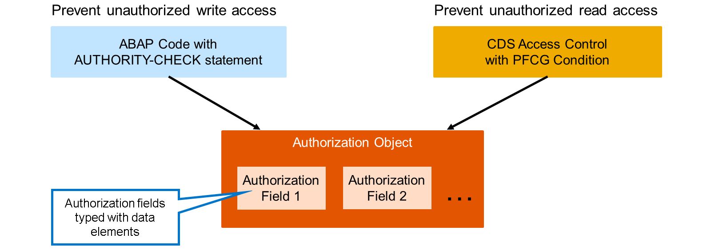
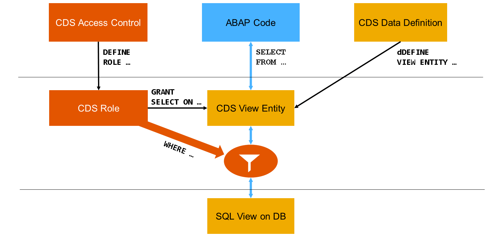
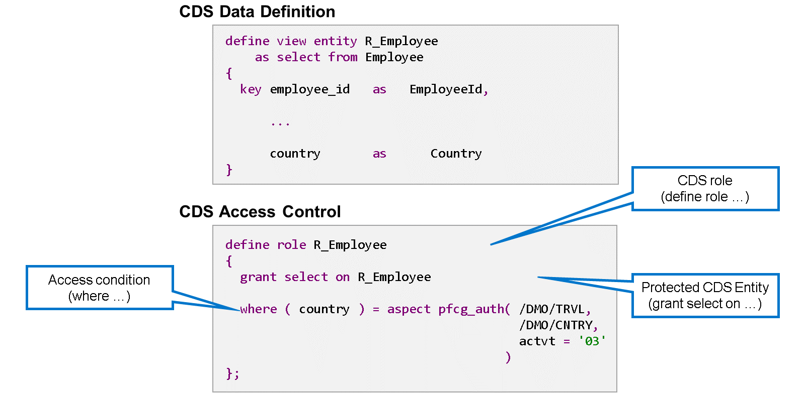
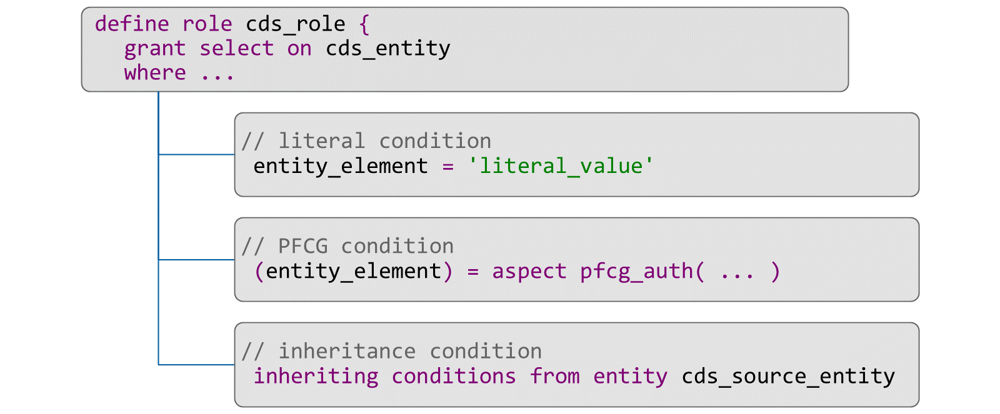
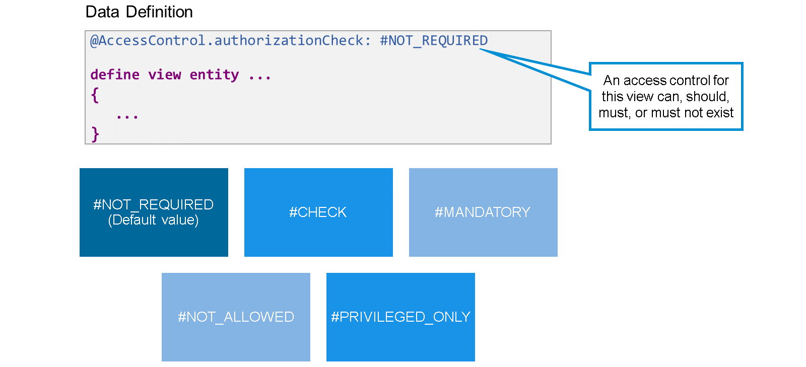

# 🌸 1 [PREVENTING UNAUTHORIZED ACCESS TO DATA](https://learning.sap.com/learning-journeys/acquire-core-abap-skills/preventing-unauthorized-access-to-data_e73ee8f7-8547-44d6-95a8-2675a62ee0cf)

> 🌺 Objectifs
>
> - [ ] Créer des champs et des objets d'autorisation
>
> - [ ] Mettre en œuvre les contrôles d'accès CDS

## 🌸 UNAUTHORIZED OBJECTS AND AUTHORIZED FIELDS

Au cours de ce parcours d'apprentissage, vous avez appris que les objets d'autorisation constituent la base du contrôle d'autorisation spécifique à l'utilisateur et basé sur les rôles. Pour protéger vos données contre les accès en écriture non autorisés, des contrôles d'autorisation sont implémentés dans le code ABAP à l'aide du mot-clé AUTHORITY-CHECK. Pour empêcher les accès en lecture non autorisés, l'utilisation de contrôles d'accès CDS est la priorité.

Un objet d'autorisation regroupe jusqu'à dix champs d'autorisation liés et devant être vérifiés ensemble. Les champs d'autorisation sont des objets de développement distincts. Un même champ d'autorisation peut être référencé par plusieurs objets d'autorisation.

Les champs d'autorisation sont typés avec des éléments de données. Ces éléments de données, ou les domaines qu'ils utilisent, assurent généralement le lien entre les champs d'autorisation et les données qu'ils protègent.

Que votre modèle de données nécessite ses propres objets d'autorisation ou que vous utilisiez des objets existants, cela dépend fortement de son degré d'indépendance par rapport aux données existantes.

Si vos données sont connectées à des modèles de données existants, il est toujours utile de rechercher des objets d'autorisation existants.

> #### 🍧 Hint
>
> Commencez la recherche à l'aide de la liste des cas d'emploi pour les éléments de données que vous utilisez dans vos tables de base de données afin de vérifier s'il existe des champs d'autorisation associés.

.png>)

Généralement, avant de créer un objet d'autorisation, vous devez d'abord créer un ou plusieurs champs d'autorisation.

Le nom du champ d'autorisation est limité à 10 caractères.

Notez que vous devez spécifier un élément de données existant dès le départ. Dans cet exemple, le champ d'autorisation Z00DEPMENT est créé à l'aide de l'élément de données Z00_DEPARTMENT_ID.

Dans la boîte de dialogue de maintenance du champ d'autorisation, il est recommandé de spécifier une table de contrôle. Cette table est une table de base de données contenant les valeurs autorisées pour le champ d'autorisation. Selon votre modèle de données, il s'agira d'une table de personnalisation ou d'une table contenant des données de base. Dans cet exemple, nous utilisons la table de données de base des services.

Pour un champ d'autorisation nouvellement créé, un avertissement dans l'en-tête ou dans la vue des problèmes vous indique que le champ d'autorisation n'est pas encore utilisé. Les liens de la section « Que faire ensuite ? » permettent de corriger rapidement cet avertissement. Vous pouvez alors ajouter le champ d'autorisation à un objet d'autorisation existant ou en créer un nouveau.

.png>)

Lors de la création d'un objet d'autorisation, vous devez fournir un nom et une description, comme d'habitude. Ce nom est également limité à 10 caractères.

> #### 🍧 Note
>
> La classe d'objet définit des groupes d'objets d'autorisation. L'attribution d'une classe d'objet dépend de la plateforme de développement. Dans SAP BTP, environnement ABAP, il n'existe actuellement qu'une seule classe d'objet (CPAE) pour tous les objets d'autorisation.

Tout nouvel objet d'autorisation contient par défaut le champ d'autorisation ACTVT. Ce champ permet de distinguer les différentes opérations de données avec des valeurs standardisées.

Par défaut, l'objet d'autorisation prend en compte les activités Créer (valeur « 01 »), Lire (valeur « 03 »), Mettre à jour (valeur « 02 ») et Supprimer (valeur « 06 »). Vous pouvez supprimer les activités inutiles et en ajouter d'autres parmi un large éventail d'activités disponibles. Placez le curseur dans le champ de saisie et appuyez sur Ctrl + Espace pour afficher la liste des activités disponibles.

> #### 🍧 Note
>
> Dans de rares cas, vous pouvez même supprimer complètement le champ d'autorisation ACVT. Cette opération est uniquement nécessaire si la vérification d'autorisation est indépendante de l'opération effectuée.

Pour ajouter d'autres champs d'autorisation, placez le curseur dans le champ de saisie et appuyez sur Ctrl + Espace pour afficher la liste des champs d'autorisation disponibles.

> #### 🍧 Hint
>
> Il n'est pas nécessaire d'activer les champs d'autorisation ni les objets d'autorisation. Il suffit de les enregistrer.

## 🌸 UNAUTHORIZED OBJECTS AND AUTHORIZED FIELDS

[Référence - Link Vidéo](https://learning.sap.com/learning-journeys/acquire-core-abap-skills/preventing-unauthorized-access-to-data_e73ee8f7-8547-44d6-95a8-2675a62ee0cf)

## 🌸 REPOSITORY OBJETCS CDS ACCESS CONTROL

Plus tôt dans ce parcours d'apprentissage, vous avez appris que les contrôles d'accès CDS permettent de filtrer les ensembles de données en fonction des autorisations. Rappelons le principe de base :

Un objet de référentiel de type contrôle d'accès CDS définit un rôle CDS à l'aide du mot-clé DEFINE ROLE. Dans ce rôle, le mot-clé GRANT SELECT ON associe le rôle CDS à une entité CDS (par exemple, une vue CDS) et, après le mot-clé WHERE, définit une ou plusieurs conditions d'accès. Chaque fois que le code ABAP accède à l'entité CDS, l'interface de base de données filtre le résultat de la sélection en fonction de ces conditions d'accès.

Les contrôles d'accès CDS n'ont d'effet que lorsque l'entité CDS est accessible directement depuis le code ABAP. Ils sont ignorés si l'entité CDS est accessible indirectement, par exemple via une autre entité CDS.

Prenons cet exemple : le contrôle d'accès CDS R_EMPLOYEE contient la définition du rôle CDS R_Employee. Il restreint l'accès à l'entité de vue CDS R_Employee avec une condition d'accès basée sur les autorisations utilisateur (condition PFCG).

## 🌸 ACCESS CONDITIONS

Les contrôles d'accès CDS prennent en charge différents types de conditions d'accès. Les plus importantes sont les suivantes :

#### 💮 **Literal Conditions** :

Une condition littérale, également appelée condition simple, compare un élément d'une entité CDS à une valeur fixe. Les conditions littérales constituent la forme la plus simple de conditions d'accès. Elles ne dépendent pas de l'utilisateur actuel. De ce fait, elles sont généralement combinées à d'autres types de conditions d'accès.

#### 💮 **PFCG Conditions** :

Une condition PFCG, également appelée aspect PFCG, associe les éléments d'une entité CDS aux autorisations du concept d'autorisation SAP (basées sur des objets d'autorisation). Les conditions PFCG sont les conditions d'accès les plus courantes pour les entités CDS qui lisent directement depuis les tables de base de données.

#### 💮 **Inheritance Conditions** :

Une condition d'héritage applique les conditions d'un autre rôle CDS. Les conditions d'héritage sont la condition d'accès habituelle pour les vues CDS qui lisent depuis d'autres entités CDS (vue sur vue).

.png>)

Examinons quelques exemples de conditions simples.

Le premier exemple est une condition littérale. Elle spécifie que la valeur de l'élément de vue DepartmentId doit être égale à « ADMIN », autrement dit, qu'un accès en lecture à l'entité CDS associée ne renvoie que les ensembles de données appartenant au service ADMIN.

Le deuxième exemple est également une condition d'accès simple, mais pas littérale. La condition d'accès lie l'élément de vue CreatedBy au nom d'utilisateur de l'utilisateur actuel. Un accès en lecture à l'entité CDS associée ne renvoie que les ensembles de données créés par l'utilisateur actuel.

Le troisième exemple illustre l'utilisation des opérateurs logiques AND et OR pour combiner différentes conditions d'accès. Ici, les conditions sont liées par OR, ce qui signifie que les utilisateurs peuvent voir tous les ensembles de données qu'ils ont créés eux-mêmes, quel que soit le service auquel ils appartiennent. Parmi les ensembles de données créés par d'autres utilisateurs, ils ne peuvent voir que ceux appartenant au service ADMIN.

> #### 🍧 Hint
>
> Lorsque vous créez un contrôle d'accès CDS basé sur le modèle « Définir un rôle avec une condition simple », vous obtenez la structure de base pour une condition littérale et une condition d'aspect utilisateur.

### EXAMPLE: PFCG CONDITIONS

Les rôles CDS avec des conditions d'accès simples sont rares. Lorsqu'elles sont utilisées, ces conditions sont combinées à d'autres conditions d'accès, par exemple les conditions PFCG. Ces conditions PFCG lient un ou plusieurs éléments de vue aux autorisations des données de base de l'utilisateur actuel.

Regardez la vidéo pour découvrir un exemple de rôle CDS avec des conditions PFCG et des conditions d'héritage.

[Référence - Link Vidéo](https://learning.sap.com/learning-journeys/acquire-core-abap-skills/preventing-unauthorized-access-to-data_e73ee8f7-8547-44d6-95a8-2675a62ee0cf)

## 🌸 ANNOTATION ACCESSCONTROLL.CHECKAUTHORIZATION

Lorsque vous créez une entité de vue CDS, vous pouvez utiliser l'annotation @AccessControl.authorization pour contrôler si un contrôle d'accès peut, doit, doit ou ne doit pas exister pour cette vue.

Les valeurs possibles sont les suivantes :

#### 💮 **#NOT_REQUIRED** :

Si un rôle CDS protège la vue, il est évalué à l'exécution. La vérification de syntaxe ne vérifie pas l'existence d'un rôle CDS. Il s'agit de la valeur par défaut.

#### 💮 **#CHECK** :

Comme #NOT_REQUIRED, mais avec un avertissement de vérification de syntaxe si aucun rôle CDS ne protège la vue.

#### 💮 **#MANDATORY** :

Comme #CHECK, mais en plus, le système génère une erreur d'exécution si aucun rôle CDS ne protège la vue.

#### 💮 **#NOT_ALLOWED** :

Aucun contrôle d'accès n'est effectué. Si un rôle est attribué à cette vue, un avertissement de syntaxe est émis et le contrôle d'accès est ignoré à l'exécution.

#### 💮 **#PRIVILEGED_ONLY** :

L'accès à l'entité CDS doit être effectué via l'extension ABAP SQL WITH PRIVILEGED ACCESS. Pour des informations détaillées, voir la note SAP : 2725274.

## 🌸 UNAUTHORIZED OBJECTS AND AUTHORIZED FIELDS

[Référence - Link Vidéo](https://learning.sap.com/learning-journeys/acquire-core-abap-skills/preventing-unauthorized-access-to-data_e73ee8f7-8547-44d6-95a8-2675a62ee0cf)
