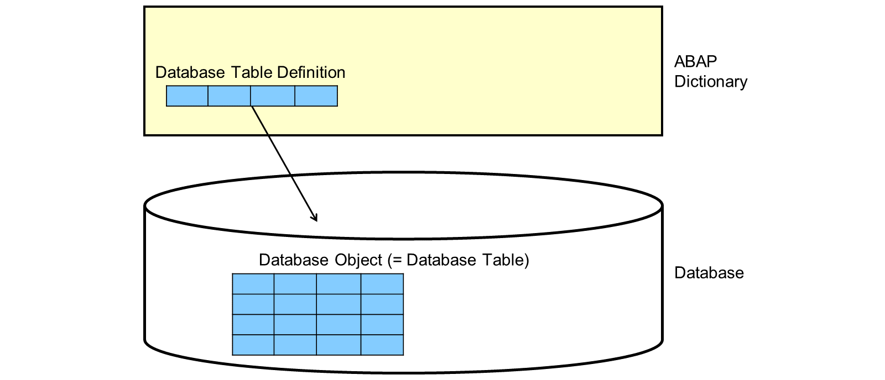
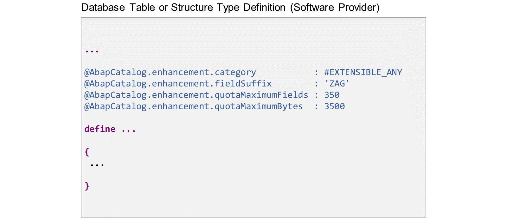

# 🌸 2 [EXTENDING DICTIONARY OBJECTS](https://learning.sap.com/learning-journeys/acquire-core-abap-skills/extending-dictionary-objects_b0c9bfa6-d415-408c-baed-2f15fb3a977f)

> 🌺 Objectifs
>
> - [ ] Vous pourrez étendre les objets du dictionnaire en utilisant des structures d'ajout

## 🌸 APPEND STRUCTURES

Vous avez déjà appris qu'une définition de table de base de données dans le dictionnaire ABAP correspond à une table physique de la base de données. Les modifications apportées à l'objet dictionnaire sont transmises à l'objet base de données lors de l'activation (ALTER TABLE) ou via la procédure d'ajustement de la base de données.

Les structures d'ajout sont une technique permettant d'ajouter des champs à une table de base de données sans modifier la définition de la table dans le dictionnaire ABAP.

.png>)

Prenons l'exemple d'une table de base de données définie par un fournisseur de logiciels, par exemple SAP. Un client ou un partenaire souhaite y ajouter des champs.

Au lieu d'ajouter les champs à la définition de la table de base de données dans le dictionnaire, il crée une structure d'ajout. Cette structure est un objet de dictionnaire distinct, détenu et géré par le client ou le partenaire. Techniquement, il s'agit d'un type de structure dans le dictionnaire ABAP. Cependant, elle est liée à la définition de la table de base de données et définit des champs supplémentaires pour cette table. Lorsque la structure d'ajout est activée, ses composants sont ajoutés en tant que champs à la table de base de données.

On peut dire que la table de base de données est définie par deux objets de dictionnaire : la définition de la table de base de données et la structure d'ajout.

> #### 🍧 Note
>
> Une structure d'ajout appartient à une seule table de base de données. Cependant, une table de base de données peut avoir plusieurs structures d'ajout.

Dans ABAP Cloud, vous ne pouvez créer un ajout que si le fournisseur de logiciels a publié la définition de la table pour l'extension.

.png>)

Mais que se passe-t-il si le fournisseur de logiciels fournit une nouvelle version de la définition de la table de base de données ?

Imaginons que, dans une prochaine version, la table de base de données contienne un champ supplémentaire. La solution est simple : lors de la mise à niveau, le nouveau champ est simplement ajouté au catalogue de champs de la table de base de données, à l'aide de l'instruction ALTER TABLE. La différence de séquence de champs entre la base de données et le dictionnaire ne pose aucun problème pour l'environnement ABAP.

.png>)

Voici un exemple de structure d'ajout.

Le code de gauche présente la définition de la table de base de données /DMO/AGENCY. Le code de droite présente la définition de la structure d'ajout Z00_EXT_AGENCY. Le lien entre les deux objets du dictionnaire est établi dans la structure d'ajout en mentionnant la table de base de données après le mot-clé EXTEND TYPE.

La structure d'ajout comporte un composant, zzcategory. Il est ajouté à la liste des champs de la table de base de données /DMO/AGENCY.

Le composant de la structure d'ajout commence par « ZZ » pour une raison. Les champs de table et les composants de structure commençant par « ZZ » ou « YY » se trouvent dans l'espace de noms client. SAP garantit que les tables fournies par SAP ne contiendront jamais de champs dans l'espace de noms client. En choisissant des noms de champs dans l'espace de noms client, les clients peuvent éviter les conflits de noms de champs si SAP ajoute de nouveaux champs à la table cible.

.png>)

La technique d'ajout ne fonctionne pas uniquement pour les définitions de tables de base de données. Vous pouvez également utiliser des structures d'ajout pour ajouter des composants à un type de structure.

Dans cet exemple, la structure d'ajout de droite étend la structure de dictionnaire /DMO/S_EXT_INCL_AGENCY avec un champ ZZCATEGORYZAG.

## 🌸 EXTENSIBILITY CONTROL DOR DICTIONARY OBJECTS

Pour éviter tout conflit ultérieur, le propriétaire d'une définition de table de base de données ou d'un type de structure peut restreindre l'extensibilité, voire l'interdire.

Le fournisseur de logiciels contrôle l'extensibilité à l'aide des sous-annotations suivantes de l'annotation @ABAPCatalog.enhancement :

#### 💮 **category** :

Définit la catégorie d'extension. Les valeurs suivantes peuvent être spécifiées :

- #NOT_CLASSIFIED - Non classé

- #NOT_EXTENSIBLE - Non extensible

- #EXTENSIBLE_CHARACTER - Peut être étendu (de type caractère)

- #EXTENSIBLE_CHARACTER_NUMERIC - Peut être étendu (de type caractère ou numérique)

- #EXTENSIBLE_ANY - Peut être étendu (de type caractère ou numérique)

#### 💮 **fieldSuffix** :

Définit un suffixe d'élément de 3 caractères. Ce suffixe doit être utilisé pour tous les champs d'une extension créée par les clients ou les partenaires. L'objectif est d'éviter les conflits de noms de champs.

#### 💮 **quotaMaximumFields** :

Définit le nombre maximal de champs pouvant être ajoutés à l'objet correspondant par les clients et les partenaires. Autrement dit, un nombre de champs est réservé aux extensions client et partenaire.

#### 💮 **quotaMaximumBytes** :

Définit la capacité maximale d'octets pouvant être ajoutée à l'objet correspondant par les clients et les partenaires. Autrement dit, un nombre d'octets est réservé aux extensions client et partenaire.

> #### 🍧 Note
>
> Pour la documentation complète des annotations d'extensibilité, consultez la documentation des mots-clés ABAP.

.png>)

SAP utilise souvent le contrôle des extensions pour imposer l'utilisation des inclusions d'extension.

Les inclusions d'extension sont des types de structures spécifiques inclus dans une ou plusieurs définitions de tables de base de données. Si les clients ou partenaires souhaitent ajouter des champs à la table, ils doivent créer une structure d'ajout pour cette inclusion d'extension plutôt qu'un ajout direct à la table de base de données.

Les principaux avantages sont les suivants :

L'éditeur de logiciels peut utiliser la même inclusion d'extension dans plusieurs définitions de tables de base de données et types de structures. Cela garantit l'ajout cohérent de champs supplémentaires à plusieurs tables.
L'éditeur de logiciels peut décider de ne publier que l'inclusion d'extension et non la définition de table de base de données elle-même.

.png>)

Prenons un exemple d'extension indirecte :

La structure d'ajout à droite n'étend pas directement la table de base de données /DMO/AGENCY. Elle étend plutôt le type de structure /DMO/S_EXT_INCL_AGENCY. Comme cette structure est utilisée comme structure d'inclusion dans la table de base de données /DMO/AGENCY, tout champ ajouté à la structure est également ajouté à la table de base de données.

## 🌸 EXTENSIBILITY CONTROL DOR DICTIONARY OBJECTS

### CREATING AN APPEND STRUCTURE

[Référence - Link Vidéo](https://learning.sap.com/learning-journeys/acquire-core-abap-skills/extending-dictionary-objects_b0c9bfa6-d415-408c-baed-2f15fb3a977f)

### HOW TO EXTEND A DATABASE TABLE DEFINITION

[Référence - Link Vidéo](https://learning.sap.com/learning-journeys/acquire-core-abap-skills/extending-dictionary-objects_b0c9bfa6-d415-408c-baed-2f15fb3a977f)
