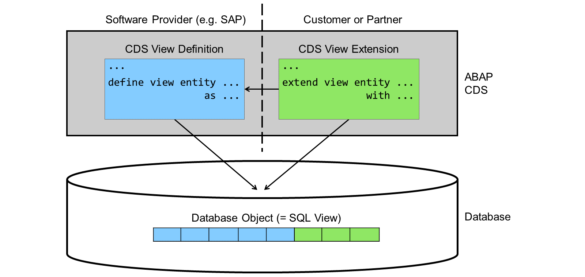
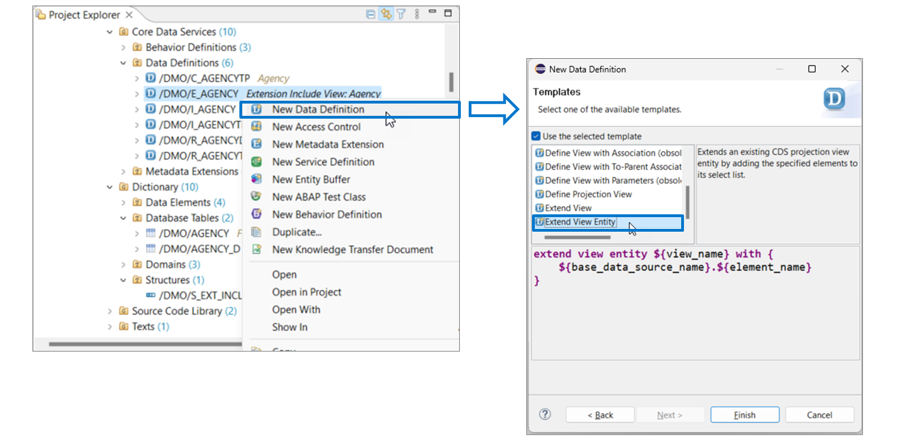

# 🌸 3 [EXTENDING CDS VIEWS](https://learning.sap.com/learning-journeys/acquire-core-abap-skills/extending-cds-views_fab548c5-6438-41e1-8384-c5190f13ea7b)

> 🌺 Objectifs
>
> - [ ] Vous pourrez étendre les entités CDS à l'aide des extensions de vue CDS

## 🌸 CDS VIEW EXTENSIONS

Techniquement, l'extension des entités CDS est très similaire à celle des objets de dictionnaire. Les clients ou partenaires créent de nouveaux objets de développement faisant référence à l'objet de développement qu'ils souhaitent étendre. Dans le dictionnaire ABAP, ils créent des structures APPEND ; dans CDS, ils définissent des extensions d'entités CDS. Les entités de vue CDS sont étendues avec des extensions de vue CDS. Une extension de vue CDS est définie dans une définition de données dédiée à l'aide de l'instruction EXTEND VIEW ENTITY. Une vue CDS existante peut comporter une ou plusieurs extensions de vue CDS.

.png>)

Dans cet exemple, l'entité de vue CDS /DMO/E_Agency à gauche contient un élément dans la liste. L'extension de vue à droite ajoute l'élément ZZCategoryZAG à cette liste. Le lien entre les deux définitions de données est établi via le nom de l'entité de vue CDS après le mot-clé EXTEND VIEW ENTITY.

> #### 🍧 Note
>
> L'extension de l'entité de vue CDS doit spécifier le nom de la source de données lors de l'adressage des champs ou des éléments. Dans cet exemple, elle utilise Agency, défini dans l'entité de vue CDS /DMO/E_Agency comme alias pour la table de base de données /DMO/AGENCY.

.png>)

Les extensions de vue CDS peuvent également définir des associations supplémentaires. Selon les paramètres d'extensibilité (voir ci-dessous), elles peuvent exposer ces associations ou les utiliser dans des expressions de chemin d'accès dans la liste d'éléments.

Dans cet exemple, l'extension de vue CDS définit l'association \_ZZTextZAG et l'ajoute à la liste d'éléments de l'entité de vue CDS /DMO/E_Agency.

## 🌸 EXTENSIBILITY CONTROL FOR CDS ENTITIES

.png>)

Le contrôle d'extensibilité des entités CDS est très similaire à celui des objets de dictionnaire. La plupart des annotations ont une syntaxe et une signification similaires. Pour une documentation complète, consultez la documentation des mots-clés ABAP.

Il existe cependant quelques différences mineures, comme illustré ici :

- Les annotations commencent par @ABAPCatalog.extensibility. Dans CDS, elles commencent par @ABAPCatalog.enhancement.

- Une simple annotation vrai/faux permet d'autoriser ou d'interdire l'extensibilité.

> #### 🍧 Note
>
> L'annotation AbapCatalog.viewEnhancementCategory spécifie comment une vue CDS peut être étendue.
>
> AbapCatalog.viewEnhancementCategory et AbapCatalog.extensibility.extensible peuvent éventuellement être spécifiés ensemble dans la même vue CDS. Dans ce cas, les valeurs des annotations doivent correspondre et autoriser ou interdire les extensions.

- Il n'est pas possible de répartir le quota entre les clients et les partenaires.

- Vous pouvez définir un elementSuffix et non un fieldSuffix, car la liste d'éléments d'une entité CDS peut contenir plus que de simples champs. Les associations exposées en sont un exemple.

La différence la plus importante réside dans les sous-annotations allowNewDatasources et dataSources, qui n'ont pas d'équivalent dans le dictionnaire ABAP. Grâce à ces annotations, le propriétaire d'une entité de vue CDS peut contrôler l'emplacement d'où les extensions peuvent lire leurs données. Si allowNewDatasources est défini sur true, le développeur d'une extension peut lire n'importe quelle source de données de la vue d'origine. S'il est défini sur false, le développeur de l'extension ne peut lire que les sources de données répertoriées sous dataSources. Il peut s'agir des sources de données directes de la vue d'origine ou des cibles de ses associations.

SAP utilise souvent cette option pour imposer l'utilisation d'inclusions d'extensions, une bonne pratique pour les extensions de vue CDS.

.png>)

Les inclusions d'extensions sont une bonne pratique pour les extensions de vues CDS. Leur nom est quelque peu trompeur, car ABAP CDS ne prend pas en charge la technique d'inclusion comme le dictionnaire ABAP. SAP utilise plutôt des entités de vue CDS spéciales, généralement identifiables par le préfixe « E* ». L'entité de vue CDS standard, par exemple une vue avec le préfixe « R* », est définie par une association à une telle vue E.

Sur la figure, la définition de la vue CDS en haut à gauche contient une association à la vue d'inclusion d'extension en bas à gauche. Les deux vues CDS sont extensibles, mais pour forcer l'utilisation de la vue E, la vue principale limite l'extensibilité aux éléments de l'association à la vue E. La vue E, quant à elle, permet l'extension avec les éléments de la source de données principale. Par conséquent, les développeurs d'extensions doivent d'abord ajouter de nouveaux éléments à la vue E avant de pouvoir les ajouter à la vue principale.

Prenons un exemple.

.png>)

Cet exemple illustre comment étendre l'entité de vue CDS /DMO/R_AgencyTP (en haut à gauche) avec le champ ZZCATEGORYZAG de la table de base de données /DMO/AGENCY.

Il est impossible d'effectuer l'extension directement, car l'entité de vue CDS /DMO/R_AgencyTP limite l'extension à l'association \_Extension, dont la cible est l'entité de vue CDS /DMO/E_Agency (en bas à gauche).

Par conséquent, dans un premier temps, le développeur étend /DMO/E_Agency (en bas à droite), puis seulement l'élément d'adressage ZZCategoryZAG de /DMO/R_AgencyTP via une expression de chemin.

## 🌸 CDS VIEW EXTENSION CREATION

Comme les vues CDS, les extensions de vue CDS sont définies dans les définitions de données CDS.

Pour définir une extension de vue CDS, procédez comme suit :

1. Dans l'explorateur de projets, localisez la définition de données de l'entité CDS à étendre.

2. Faites un clic droit sur la définition de données et choisissez « Nouvelle définition de données ».

3. Ajustez le package, saisissez un nom et une description pour le nouvel objet. Puis, cliquez sur « Suivant ».

> #### 🍧 Note
>
> Généralement, la définition de données avec l'extension ne se trouve pas dans le même package que l'objet de base. Il est donc important d'ajuster le package suggéré.

4. Saisissez une requête de transport et cliquez sur « Suivant ».

5. Dans la liste des modèles, choisissez « Étendre l'entité de vue », puis « Terminer ».
   Il existe également un modèle « Étendre la vue ». Il appartient à une ancienne génération de vues CDS. Utilisez ce modèle uniquement pour étendre une vue définie avec « Define View » et non avec « Define View Entity ».
