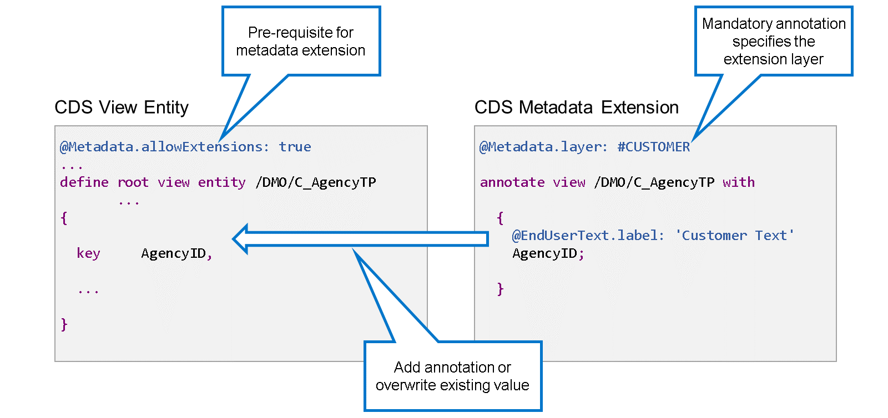
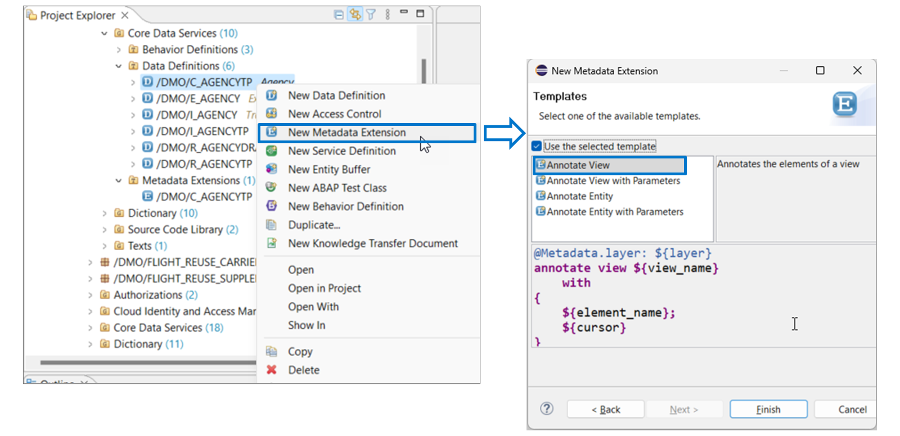

# 🌸 4 [CREATING METADA EXTENSIONS](https://learning.sap.com/learning-journeys/acquire-core-abap-skills/creating-metadata-extensions_e9741689-4756-4528-a4b0-8e0ede0b14b0)

> 🌺 Objectifs
>
> - [ ] Vous pourrez étendre les vues en utilisant les extensions de métadonnées CDS

## 🌸 METADATA EXTENSIONS

Dans la section précédente, vous avez vu comment ajouter de nouveaux éléments à la liste d'éléments d'une vue CDS à l'aide des extensions de vue CDS. Cependant, pour ajouter des annotations à des éléments existants ou remplacer des valeurs d'annotation, créer une extension de vue CDS n'est pas la solution idéale. Pour ajouter et remplacer des annotations, vous devez créer une extension de métadonnées CDS. La définition d'une extension de métadonnées CDS commence par le mot-clé ANNOTATE VIEW suivi du nom de l'entité cible.

Prenons un exemple : l'entité de vue CDS /DMO/C_AgencyTP, à gauche, définit, entre autres, un élément AgencyID.

L'extension de métadonnées CDS, à droite, répète ce nom d'élément AgencyID dans sa liste d'éléments, c'est-à-dire entre accolades, et ajoute l'annotation @EnduserText.label: 'Customer Text' devant.

Les restrictions suivantes s'appliquent aux extensions de métadonnées :

- Il n'est pas possible de définir de nouveaux éléments dans les extensions de métadonnées. Vous pouvez uniquement adresser les éléments existants de l'entité cible et leur ajouter des annotations.

- Toutes les annotations ne sont pas prises en charge dans les extensions de métadonnées. La liste des annotations autorisées contient principalement des annotations spécifiques au framework, liées au développement de l'interface utilisateur, à l'analyse et aux fonctionnalités de recherche.

Pour créer une extension de métadonnées CDS, le propriétaire de l'entité cible doit l'autoriser explicitement en ajoutant @Metadata.allowExtensions: true à la définition.

Dans une extension de métadonnées, il est obligatoire de spécifier une valeur pour l'annotation @Metadata.layer. Cette annotation permet de créer plusieurs extensions de métadonnées pour la même entité CDS. Elle permet de contrôler la priorité, en cas de contradiction entre les valeurs d'annotation des différentes extensions de métadonnées. Examinons cela de plus près.

.png>)

Lorsqu'il existe plusieurs extensions de métadonnées pour une même entité CDS, la vérification syntaxique vérifie qu'elles contiennent des valeurs différentes pour l'annotation @Metadata.layer. Autrement dit, comme cinq valeurs différentes sont actuellement prises en charge, vous pouvez définir un maximum de cinq extensions de métadonnées pour la même entité de base. La priorité est la suivante :

- #CUSTOMER écrase toutes les autres couches.

- #PARTNER écrase toutes les autres couches sauf #CUSTOMER.

- #INDUSTRY écrase #LOCALIZATION et #CORE.

- #LOCALIZATION écrase uniquement #CORE et

- #CORE a la priorité la plus basse. Les métadonnées de la couche #CORE peuvent être écrasées dans n'importe quelle autre extension de métadonnées.

> #### 🍧 Note
>
> Dans le modèle de programmation d'applications ABAP RESTful, il est recommandé de placer les métadonnées liées à l'interface utilisateur dans une extension de métadonnées de la couche #CORE. Cela offre aux solutions sectorielles, aux partenaires et aux clients un moyen élégant d'ajuster (écraser) la configuration de l'interface utilisateur selon leurs besoins.

## 🌸 METADATA EXTENSIONS CREATION

Les extensions de métadonnées CDS sont des objets de développement à part entière. Elles ne sont pas définies dans les définitions de données CDS.

Pour définir une extension de métadonnées CDS, procédez comme suit :

1. Dans l'explorateur de projets, localisez la définition de données de l'entité CDS à étendre.

2. Faites un clic droit sur la définition de données et choisissez « Nouvelle extension de métadonnées ».

3. Ajustez le package si nécessaire, puis saisissez un nom et une description pour le nouvel objet. Cliquez ensuite sur Suivant.

4. Saisissez une requête de transport et cliquez sur Suivant.

5. Dans la liste des modèles, sélectionnez « Annoter la vue », puis « Terminer ».

> #### 🍧 Note
>
> Il existe également un modèle « Annoter l'entité ». Ce modèle utilise le mot-clé « ANNOTATE ENTITY » plutôt que « ANNOTATE VIEW ». « ANNOTATE ENTITY » peut être utilisé pour tout type d'entité CDS, mais l'ensemble des annotations disponibles est plus restreint. Nous vous recommandons d'utiliser « ANNOTATE VIEW » lors de la création de votre extension de métadonnées pour une vue CDS et non pour un autre objet CDS.
