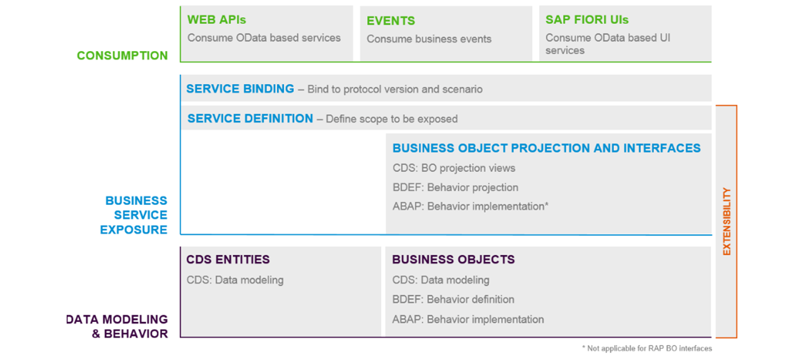
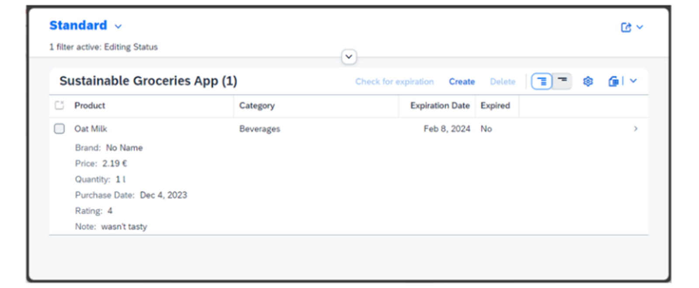

# 🌸 1 [UNDERSTANDING ABAP](https://learning.sap.com/learning-journeys/learn-the-basics-of-abap-programming-on-sap-btp/understanding-abap)

> 🌺 Objectifs
>
> - [ ] Comprendre les bases d'ABAP.
>
> - [ ] Comprendre l'environnement ABAP.
>
> - [ ] Comprendre les bases du modèle de programmation d'applications RESTful ABAP.

## 🌸 THE ABAP PROGRAMMING LANGUAGE

### THE BASICS OF ABAP

Lors de sa première publication en 1983, ABAP était conçu comme un langage de programmation procédural basé sur des instructions. Bien que relativement indépendant, il était influencé par d'autres langages de programmation populaires de l'époque, principalement COBOL et Pascal.

À la fin des années 1990, le langage ABAP a été étendu pour permettre la programmation orientée objet. Des concepts importants des langages de programmation orientés objet populaires, comme C++ et Java, ont été intégrés au langage ABAP. ABAP Objets, comme le langage de programmation était alors créé, combinant les parties procédurales et orientées objet en un seul langage.

ABAP a été à nouveau étendu avec des expressions modernes. ABAP combine des éléments de syntaxe traditionnels basés sur des instructions et des éléments de syntaxe modernes basés sur des expressions en un seul langage de programmation. Les éléments de syntaxe orientés objet et basés sur des expressions sont recommandés autant que possible pour les nouveaux développements ABAP.

Examinons quelques-unes des fonctionnalités clés d'ABAP dans la vidéo suivante.

[Référence - Link Video](https://learning.sap.com/learning-journeys/learn-the-basics-of-abap-programming-on-sap-btp/understanding-abap)

Le périmètre du langage ABAP a été adapté pour prendre en charge le développement ABAP cloud, et les versions « ABAP pour le développement cloud » et « ABAP pour les utilisateurs clés » ont été introduites. Les détails concernant les versions ABAP sont disponibles sur le [portail d'aide SAP](https://help.sap.com/docs/SAP_S4HANA_CLOUD/25cf71e63940453397a32dc2b7676947/3ccb57a1a4d04ee192fdc2a849a89158.html?version=2302.500#visibility-use-in-cloud-development-and-use-in-key-user%0Aapps).

| **Standard ABAP**                  | **ABAP for Cloud Development**                                                                                                   | **ABAP for Key Users**                                                          |     |
| ---------------------------------- | -------------------------------------------------------------------------------------------------------------------------------- | ------------------------------------------------------------------------------- | --- |
| Universal version                  | Restricted ABAP language version                                                                                                 | Restricted ABAP language version                                                |     |
| Unrestricted ABAP language version | Cloud optimized                                                                                                                  | Intended to implement enhancements by key users                                 |     |
| Covers the entire language scope   | Uses released public SAP: APIs (local or remote) to access SAP functionality and SAP data Extension points to extend SAP objects | Covers general rules of Classic ABAP with a restricted set of language elements |     |
|                                    | Does not support modifications to SAP objects                                                                                    |                                                                                 |     |
|                                    | ABAP Development Tools (ADT) as ABAP IDE                                                                                         |                                                                                 |     |

> #### 🍧 [Note]()
>
> Ce cours offre une introduction universelle au développement ABAP. Il se limite aux éléments de syntaxe et aux fonctionnalités du langage disponibles dans les trois versions. L'introduction du modèle de programmation d'applications RESTful ABAP constitue une exception, car il ne fait pas partie d'ABAP pour les utilisateurs clés.
>
> Ce cours utilisera l'environnement SAP BTP et ABAP pour les exercices et les démonstrations.

## 🌸 THE ABAP CLOUD

### ABAP ENVIRONMENTS

ABAP Cloud est le modèle de développement le plus répandu pour la création d'extensions et d'applications cloud, dans des scénarios on-stack et side-by-side. Il est disponible dans toutes les éditions de SAP S/4HANA et dans l'[environnement ABAP de SAP Business Technology Platform (BTP)](https://learning.sap.com/learning-journeys/discover-sap-business-technology-platform).

> #### 🍧 [Note]()
>
> Pour plus d'informations sur SAP S/4HANA, visitez https://learning.sap.com/learning-journeys/learn-the-basics-of-sap-fiori et choisissez Architecture → Description de SAP S/4HANA.

#### 💮 **ABAP Cloud** :

Le modèle de développement ABAP est une approche de développement complète qui couvre tous les aspects du processus de développement de bout en bout. Ce terme générique englobe des éléments concrets et abstraits, tels que l'architecture sous-jacente, les outils utilisés pour le développement, les directives de développement, et bien plus encore.

Examinons les concepts clés sur lesquels repose le modèle de programmation ABAP Cloud.

[Référence - Link Video](https://learning.sap.com/learning-journeys/learn-the-basics-of-abap-programming-on-sap-btp/understanding-abap)

## 🌸 THE RESTFUL APPLICATION PROGRAMMING MODEL

Le [modèle de programmation d'applications RESTful ABAP](https://help.sap.com/docs/abap-cloud/abap-rap/abap-restful-application-programming-model?version=sap_btp) définit l'architecture pour un développement efficace de bout en bout de services OData optimisés pour SAP HANA (tels que les applications SAP Fiori) dans l'environnement ABAP. Il prend en charge le développement de tous types d'applications Fiori et la publication d'API Web. Il s'appuie sur des technologies et des frameworks tels que Core Data Services (CDS) pour la définition de modèles de données sémantiquement riches, ainsi que sur une infrastructure de modèles de services pour la création de services OData avec des liaisons à un protocole OData, et de services applicatifs ABAP pour une logique personnalisée et des interfaces utilisateur basées sur SAPUI5.

SAP utilise le modèle de programmation d'applications RESTful pour créer de nouvelles applications standard et moderniser les applications existantes. SAP recommande également à ses clients et partenaires de l'utiliser pour des développements personnalisés sur SAP S/4HANA et SAP Business Technology Platform (BTP), environnement ABAP.

Les applications développées avec le modèle de programmation d'applications ABAP RESTful se composent des blocs de construction suivants :

#### 💮 **Business Objects** :

Les objets métier représentent le modèle de données et définissent la logique liée aux données, appelée comportement, indépendamment de leur consommation spécifique. Les objets métier RESTful Application Programming sont définis via les vues de modélisation de données Core Data Service (CDS), les définitions de comportement CDS et les implémentations de comportement dans les classes ABAP.

#### 💮 **Business Object Projections** :

La projection d'objet métier est une approche permettant de projeter et d'aliaser un sous-ensemble d'objet métier pour un service métier spécifique. Cette projection permet une consommation flexible des services ainsi que des conceptions de services basées sur les rôles. Dans les programmes d'application RESTful, une projection d'objet métier comprend des vues de projection CDS, des projections de comportement CDS et, si nécessaire, des vues supplémentaires ou spécifiques à la consommation.

#### 💮 **Service Definition** :

Une définition de service définit la portée d'un service métier, en particulier la projection d'objet métier à exposer par ce service.

#### 💮 **Service Binding** :

Une liaison de service définit le protocole de communication, tel que OData V2 ou OData V4, et le type de service à offrir à un consommateur, tel que des services d'interface utilisateur ou un service Web.

#### 💮 **SAP Fiori UI** :

L'interface utilisateur SAP Fiori fournit une interface utilisateur désignée pour les modèles d'application couramment utilisés basés sur les services OData.

#### 💮 **Web API** :

Une API Web fournit une interface publique permettant à tout client OData d’accéder au service.

    Après avoir appris les bases de la programmation ABAP, vous créerez une application RESTful ABAP pour une application d'épicerie durable. Vous utiliserez le générateur d'objets de référentiel et créerez un objet métier de programmation d'application RESTful ABAP prêt à l'emploi en moins d'une heure. Cette application vous permettra de suivre vos courses et leur date de péremption.

