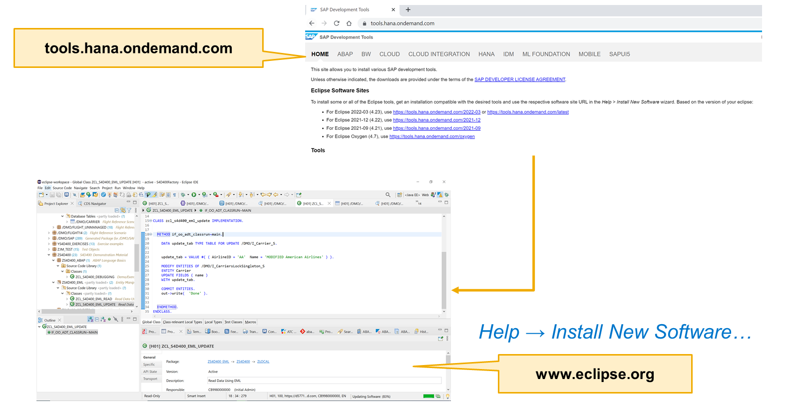
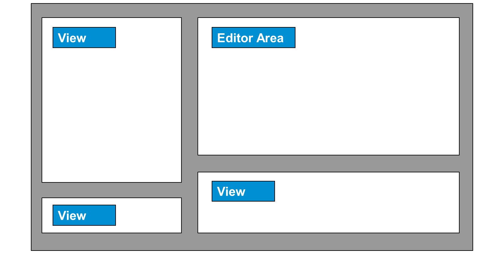
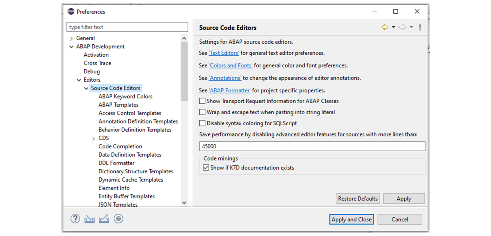
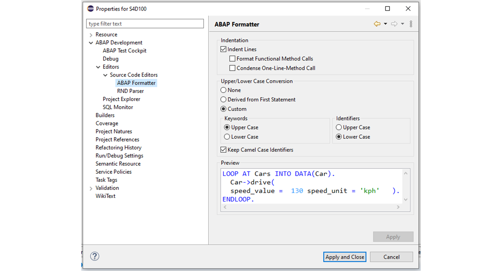

# 🌸 1 [ORGANIZING WORK WITH ECLIPSE](https://learning.sap.com/learning-journeys/learn-the-basics-of-abap-programming-on-sap-btp/organizing-work-with-eclipse_e4e2abab-c56e-44b7-9d40-659963edf192)

> 🌺 Objectifs
>
> - [ ] vous pourrez personnaliser les outils de développement ABAP (ADT).

## 🌸 THE ECLIPSE WORKBENCH

### ECLIPSE AND ABAP DEVELOPMENT TOOLS

Vous avez besoin de l'environnement de développement Eclipse pour développer des applications ABAP pour SAP Business Technology Platform (BTP).

Une perspective comprend un ensemble de **views** affichées sous forme d'onglets dans la fenêtre Eclipse. Les **views** les plus importantes sont l'éditeur de **source code** et l'explorateur de projets, qui permettent de naviguer entre les différents objets de développement. De nombreuses autres **views** sont nécessaires, telles que la **view** des problèmes pour afficher les messages d'erreur, la **view** de la documentation et les **views** permettant de rechercher des objets ou d'afficher l'emplacement d'utilisation d'un objet particulier dans le système.

Pour développer des applications ABAP pour SAP BTP, téléchargez d'abord gratuitement l'environnement de développement Eclipse sur https://www.eclipse.org/. Pour obtenir les outils de développement ABAP, procédez comme suit :

1. Ouvrez Eclipse.

2. Choisissez **Help** → **Install New Software**.

3. Dans la boîte de dialogue qui apparaît, saisissez : https://tools.hana.ondemand.com/latest.

4. Vérifiez les mises à jour dans **Help** → Rechercher les mises à jour.

### WORKBENCH

> #### 🍧 [Workbench]()
>
> Le terme Workbench désigne l'environnement de développement bureautique d'Eclipse. Il permet de modifier des objets, de gérer des **views** et d'organiser l'espace de travail du développeur.
>
> [Référence - Link Vidéo](https://learning.sap.com/learning-journeys/learn-the-basics-of-abap-programming-on-sap-btp/understanding-abap)

Les fonctionnalités de l'espace de travail sont les suivantes :

- Chaque espace de travail contient une ou plusieurs perspectives.

- Les perspectives contiennent des **views** et des éditeurs.

- Plusieurs fenêtres d'espace de travail peuvent être affichées simultanément sur le bureau. Par exemple, vous pouvez ouvrir simultanément les outils de développement ABAP et SAP HANA Studio.

### ADT PERSPECTIVES - ABAP DEVELOPMENT TOOLS

Dans Eclipse, une perspective est une fenêtre permettant d'effectuer une tâche spécifique. Cette fenêtre contient les outils nécessaires à la création d'objets de développement. SAP a créé la perspective **ABAP Development Tools (ADT)** comme **IDE** de référence pour le développement ABAP.

Pour développer des applications ABAP, choisissez :

**Window** → **Perspective** → **Open Perspective** → **Other**

puis double-cliquez sur ABAP. La perspective **ABAP Development Tools (ADT)** s'ouvre.

Une perspective comprend un ensemble de **views** apparaissant sous forme d'onglets dans la fenêtre Eclipse. Bien qu'il existe d'autres **views**, celles que nous allons examiner aujourd'hui sont les plus importantes :

- Éditeur de **source code**

- **Project Explorer** – SAP propose plusieurs perspectives dans Eclipse :

  - la perspective **ABAP Development Tools (ADT)**,

  - la perspective **ABAP Profiling**,

  - la perspective **Debug**.

  La plus importante d'entre elles est la perspective **ABAP Development Tools (ADT)**.

La perspective **ADT**, comme toute autre perspective, fournit un ensemble initial de **views** et d'éditeurs et détermine leur disposition. Plus précisément, les **views** et éditeurs ABAP vous permettent de travailler avec des objets de développement ABAP gérés par un système backend ABAP.

> #### 🍧 Note
>
> Pour utiliser la perspective ABAP, vous devez établir une connexion système, représentée par un projet ABAP correspondant. La perspective ABAP permet d'accéder aux outils ABAP basés sur Eclipse et SAP GUI.

La perspective ABAP comprend une zone d'édition contenant divers éditeurs de **source code** ABAP et les **views** suivantes :

- **Project Explorer**

- **Outline** (Structure)

- **Task Repositories** (Référentiels de tâches)

- **Task List**

- **Problems**

- **Templates** (Modèles)

- **Properties**

- **Feed Reader** (Lecteur de flux)

- **Transport Organizer**

### ECLIPSE PREFERENCES

Les Préférences Eclipse vous permettent de définir les paramètres généraux de fonctionnement d'Eclipse. Vous pouvez y accéder en sélectionnant :

**Window** → **Preferences**.

L'illustration **Eclipse Preferences** présente la section **Source Code Editors** de la fenêtre des Eclipse Preferences.

Si les outils de développement ABAP sont installés, une section dédiée aux paramètres liés au développement ABAP est disponible. Vous pouvez y contrôler les paramètres suivants :

- L'affichage du **system ID** dans l'onglet **Editor** et, le cas échéant, son emplacement.

- Les paramètres relatifs au **Debugging**, par exemple, le Debugging des programmes système.

- Les paramètres spécifiques au **source code**, par exemple, la fermeture automatique des crochets et la vérification automatique de la syntaxe.

- Les paramètres relatifs aux **Editor**, par exemple, la taille de police et les options de couleur.

Si vous souhaitez annuler les paramètres que vous avez définis, un bouton **Restore Defaults** est disponible.

### PROJECTS PROPERTIES

Vous pouvez ajuster les propriétés d'un projet ABAP spécifique, tout comme vous pouvez ajuster les préférences d'Eclipse en général. Pour cela, sélectionnez **Properties** dans le menu contextuel du projet. Vous trouverez une collection de paramètres utiles sous **ABAP Development** → **Editors** → **Source Code Editors** → **Formatter** (comme illustré dans la figure **ABAP Format Settings**).

Vous pouvez contrôler le style du code du **formatter**, notamment l'indentation du **source code** (par exemple, lors de la programmation d'une construction `IF` ou `CASE`) et l'utilisation des majuscules ou des minuscules pour les mots-clés et les identifiants.

Une fois ces paramètres définis et appliqués dans les **properties** du projet, la mise en forme peut être appliquée en appuyant sur [ MAJ ] + [ F1 ] (sur votre clavier) pour formater le code dans l'éditeur du **source code**.

## 🌸 OPEN AND CUSTOMIZE THE ABAP DEVELOPMENT TOOLS

### BUSINESS EXAMPLE

Vous êtes programmeur chez un client SAP et utilisez les nouveaux outils de développement ABAP. Votre tâche actuelle consiste à personnaliser la perspective ABAP en ajoutant le module de fonction ABAP au menu Nouveau, puis en enregistrant la perspective sous le nom S4D100_XX. Vous souhaitez également supprimer, puis réactiver, le menu Aide et la barre d'outils Lancer de votre nouvelle perspective.

> #### 🍧 Note
>
> Dans cet exercice, XX fait référence à votre numéro.

### STEPS

1. Ouvrez la perspective Débogage.

   a. Choisissez Fenêtre → Perspective → Ouvrir une perspective → Débogage.

2. Enregistrez la perspective ABAP sous une nouvelle perspective, S4D100_XX, où XX correspond à votre numéro.

   a. Choisissez Fenêtre → Perspective → Enregistrer la perspective sous…

   b. Dans la boîte de dialogue Enregistrer la perspective sous, saisissez le nom S4D100_XX.

   c. Cliquez sur OK.

3. Personnalisez la perspective ABAP en ajoutant « Module de fonction » au menu « Nouveau ».

   a. Choisissez Fenêtre → Perspective → Personnaliser la perspective…

   b. Choisissez l'onglet « Visibilité du menu ».

   c. Développez le nœud « Fichier ».

   d. Développez le nœud « Nouveau ».

   e. Sélectionnez « Module de fonction ABAP ».

   f. Cliquez sur OK.

Le module de fonction ABAP a été ajouté au menu « Nouveau » de la perspective ABAP.

> #### 🍧 Note
>
> Éditeurs :
>
> La plupart des perspectives du Workbench comprennent une **editor area** et une ou plusieurs **views**.
>
> Il existe différents **editors** pour les différents objets de développement ABAP. L'**editor** approprié s'ouvre automatiquement à l'ouverture de l'objet. En l'absence d'**editor** natif associé à un objet de développement ABAP, le Workbench tentera de lancer un **editor** externe associé au type d'objet.

### PRACTICE

[Exercices](./assets/hands_on.pdf)
