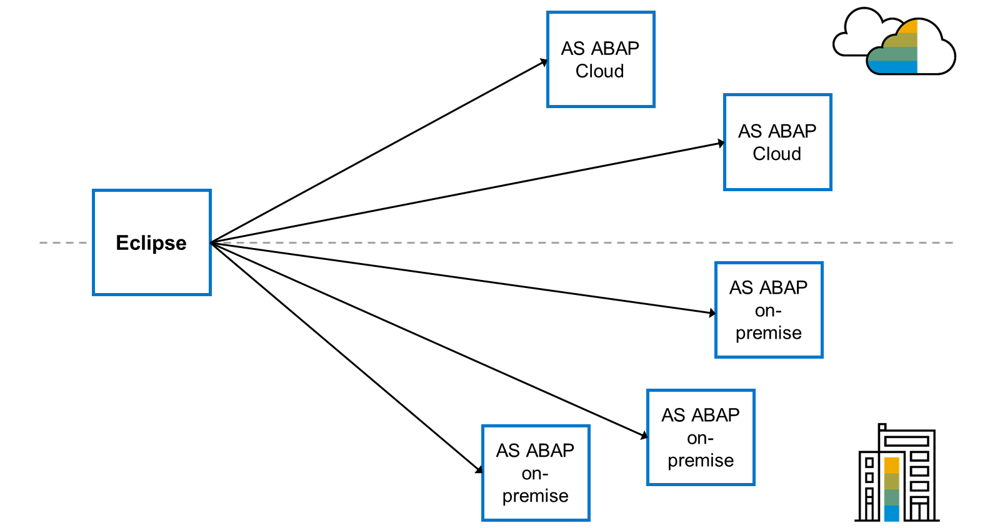
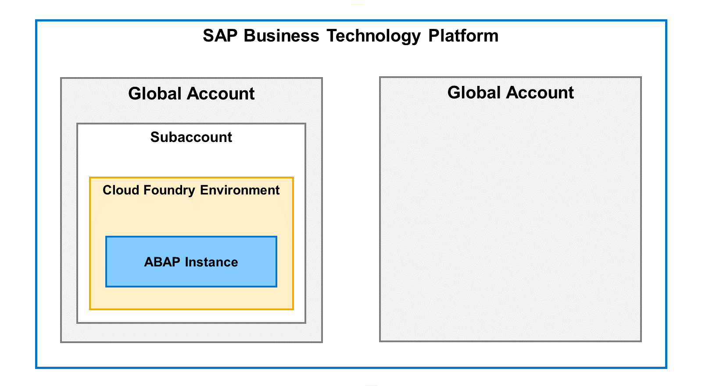

# 🌸 2 [GETTING STARTED](https://learning.sap.com/learning-journeys/learn-the-basics-of-abap-programming-on-sap-btp/getting-started_d7ec7027-cf0c-42b8-88be-fe80c85345f2)

> 🌺 Objectifs
>
> - [ ] vous pourrez configurer des projets ABAP Cloud dans les outils de développement ABAP.

## 🌸 ABAP CLOUD PROJECT CREATION IN THE ABAP DEVELOPMENT TOOLS

### DIFFERENT TYPES OF ABAP PROJECTS

En tant qu'environnement de développement, Eclipse n'est pas intégré au système ABAP. Vous devez donc le connecter à chaque système ABAP dans lequel vous souhaitez l'intégrer. Eclipse représente chaque connexion comme un projet.

Il existe deux types de projets dans ADT :

- ABAP Projects : ils se connectent à un **on-premise ABAP system**.

- ABAP Cloud Projects : ils se connectent à **SAP BTP**, **ABAP** ou **SAP S/4HANA Cloud**.

Dans cette unité, nous nous intéresserons uniquement à l'environnement cloud.

### OVERVIEW OF THE ABAP ENVIRONMENT

**SAP Business Technology Platform** est la _plateforme SAP en tant que service_ (**PaaS**). Pour y accéder, vous devez créer un **global account**. Ce **global account** comprend des **subaccounts**. Chaque **subaccount** peut être configuré différemment, permettant à une entreprise d'exécuter plusieurs plateformes tout en gérant son abonnement via un seul **global account**. Vous déployez un environnement d'exécution (par exemple, **Cloud Foundry** ou **Kyma**) dans le **subaccount**. Ce n'est qu'ensuite que vous pouvez déployer une instance ABAP.

Ce cours utilise une instance ABAP déployée sur **SAP Business Technology Platform** ou **SAP BTP**. Ce contenu est également pertinent pour d'autres déploiements ABAP, tels qu'un **on-premise ABAP system** ou un système **SAP S/4HANA Cloud**.

Une option pour connecter Eclipse à votre environnement cloud ABAP consiste à utiliser une **service key**. L'exemple suivant explique comment créer une **service key** dans l'environnement ABAP Cloud si vous n'en possédez pas déjà une. La **service key** doit ensuite être copiée au format JSON pour créer un projet ABAP Cloud dans Eclipse.

> #### 🍧 Note
>
> This course will use the SAP Business Technology Platform (BTP) ABAP Service in the exercises and demonstrations. If you require access to a BTP ABAP Service you can create a trial account by following the directions from https://developers.sap.com/tutorials/hcp-create-trial-account.html

## 🌸 HOW TO CREATE AN ABAP INSTANCE AND SERVICE KEY

[Exercices](<./assets/hands_on%20(1).pdf>)

### STEPS

1. Connectez-vous à votre **global account**.

2. Accédez au **subaccount**.

3. Choisissez **Instances and Subscriptions** sur le côté gauche de l'écran.

4. Faites défiler jusqu'à **Instances**.

5. Recherchez l'instance ABAP. Si aucune instance ABAP n'est disponible, créez-en une en suivant les étapes suivantes :

   a. Choisissez [Create] et créez une instance pour l'environnement ABAP avec un nom tel que S4D100.

   b. Saisissez votre adresse e-mail dans la propriété « e-mail » du fichier JSON.

   c. Sur la page de résumé, choisissez [Create] pour créer votre instance d'environnement ABAP.

6. Choisissez l'instance de service pour le système ABAP.

7. S'il n'existe pas de clé de service, dans la section « Clés de service » de la zone de détails, choisissez [Create] (à partir du bouton à trois points). Saisissez un nom de clé de service, par exemple S4D100, puis cliquez sur [Create] pour générer votre clé de service.

## 🌸 CREATE YOUR ABAP CLOUD PROJECT

### BUSINESS EXAMPLE

Vous devez développer des applications cloud ABAP.

### PREREQUISITES

Vous devez déjà disposer d'un compte **SAP Business Technology Platform (BTP)** avec un **service ABAP** et une **service key**. Vous devez également avoir installé Eclipse et les outils de développement SAP ABAP.

### STEPS

1. Connectez-vous à votre **subaccount** dans SAP BTP et copiez la clé de service ABAP dans votre presse-papiers.

   a. Démarrez le **SAP BTP Cockpit** et sélectionnez le **subaccount** contenant votre service ABAP.

   b. Choisissez **Instances and Subscriptions**.

   c. Dans la zone **Instances**, sélectionnez l'entrée **Key(s)** sous **Credentials**.

   d. Choisissez **opy JSON**, puis [Close].

2. Ouvrez Eclipse et passez à la perspective ABAP.

   a. Ouvrez Eclipse et fermez l'onglet Welcome (s'il est ouvert).

   b. Choisissez **Window** → **Perspective** → **Open Perspective** → **Other**.

   c. Dans la boîte de dialogue, double-cliquez sur ABAP.

   d. Choisissez **File** → **New** → **ABAP Cloud Project**.

   e. Sélectionnez **Use a Service Key** et cliquez sur **Next**.

   f. Collez la **service ABAP** dans l'éditeur en faisant un clic droit et en choisissant [Paste]. Cliquez ensuite sur **Next**.

   g. Choisissez **Open Logon Page** dans le navigateur. Si vous devez vous connecter, utilisez les identifiants que vous avez utilisés pour vous connecter à la BTP.

   h. Un message vous indiquera ensuite que vous avez été connecté avec succès.

   i. Fermez la fenêtre du navigateur et revenez à Eclipse.

   j. Pour terminer la création du projet, cliquez sur **Finish**.

### PRACTICE

[Exercices](<./assets/hands_on%20(2).pdf>)
