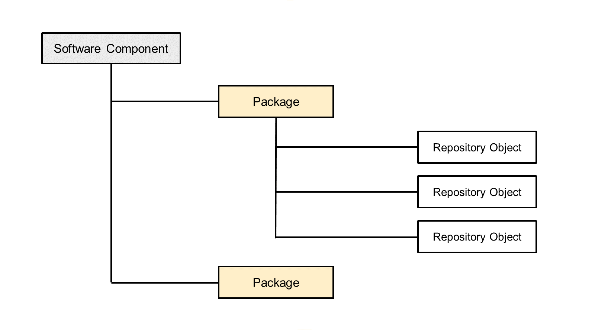
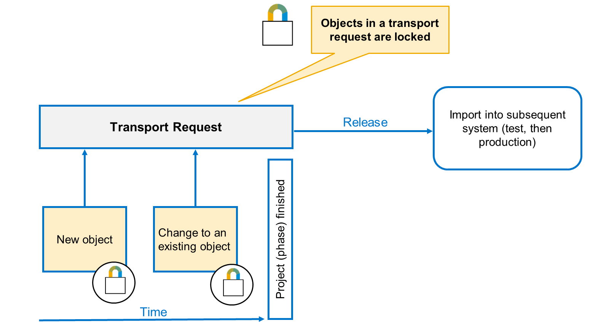
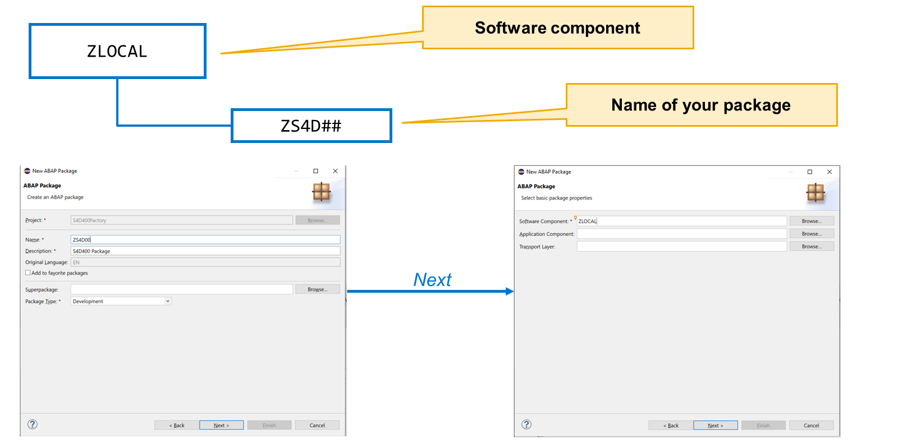
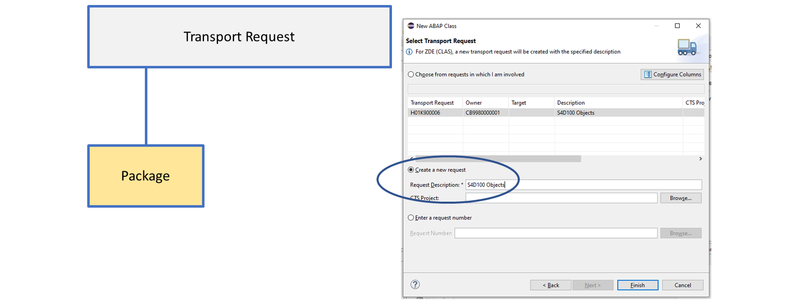

# 🌸 3 [RUNNING SOFTWARE STRUCTURE AND LOGISTICS](https://learning.sap.com/learning-journeys/learn-the-basics-of-abap-programming-on-sap-btp/running-software-structure-and-logistics_dcb66ad6-48f7-4537-9059-d047982224df)

> 🌺 Objectifs
>
> - [ ] Vous pourrez créer un **ABAP **Package\*\*\*\*.

## 🌸 ABAP **PACKAGE** CREATION

### ORGANIZING DEVELOPMENET

Vous développez vos applications dans un environnement de développement. Vous devez néanmoins vous assurer qu'elles peuvent être testées dans un environnement de test approprié avant de les transférer vers l'environnement de production. En général, vous disposez d'un compte global unique et d'un sous-compte pour chacun des environnements de développement, de test et de production. Les composants logiciels vous permettent de transporter vos objets.

### ORGANIZING DEVELOPMENET

Lorsque vous créez un nouvel objet de développement ou modifiez un objet existant, vous devez l'affecter à une requête de transport. Les requêtes de transport garantissent que tous les objets de développement créés ou modifiés, qui appartiennent logiquement au même ensemble, sont transportés ensemble vers le système de test, puis vers le système de production.

> #### 🍧 Note
>
> Ce n’est pas « l’objet » qui est transporté, mais le « changement » apporté à cet objet.

Chaque demande de transport a un propriétaire. Ce dernier peut y affecter d'autres utilisateurs. Ainsi, les demandes de transport soutiennent le développement de l'équipe.

Lorsqu'un objet est inclus dans une demande de transport, il est verrouillé. Cela signifie qu'il ne peut être modifié que par un utilisateur affecté à la même demande. Une fois le travail sur tous les objets de la demande terminé, les développeurs affectés doivent libérer leur travail. Ensuite, le propriétaire de la demande peut libérer l'intégralité de la demande. Si la demande de transport appartient à un composant logiciel transportable, l'administrateur peut l'importer dans le sous-compte de test pour le tester, puis dans le sous-compte de production. La libération d'une demande de transport libère les verrous des objets de la demande, permettant ainsi à tout développeur d'y accéder à nouveau.

## 🌸 TO CREATE A NEW **PACKAGE**S

### STEPS

1. Sélectionner **File** → **New** → **ABAP **Package\*\*\*\*.

   

2. Renseigner un **Package** Name – customer objects doivent commencer par un Z ou un Y comme premier caractère du nom.

3. Saisissez une description.

4. Choisissez [Next].

## 🌸 TO ASSIGN A **PACKAGE** TO A TRANSPORT REQUEST

### STEPS

1. Créer une **new request**.

   

2. Saisissez une description pour la demande de transport.

3. Cliquez sur [Finish].

## 🌸 CREATE A **PACKAGE**

### BUSINESS EXAMPLE

Créez un **ABAP **Package\*\*\*\* dans lequel vous pourrez stocker les objets de développement que vous créerez pendant ce cours. Ajoutez-le à vos favoris pour y accéder facilement à tout moment.

> #### 🍧 Note
>
> Dans cet exercice, XX fait référence à votre numéro.

### STEPS

1. Créez un **ABAP Package**, **ZS4D100_XX**, où XX est votre numéro (par exemple, nous utiliserons 01). Affectez le **package** au composant logiciel **ZLOCAL**. Lorsque vous êtes invité à affecter le **package** à une requête de transport, créez-en un nouveau.

   a. Choisissez **File** → **New** → **ABAP **Package\*\*\*\*.

   b. Saisissez le nom, **ZS4D100_XX**, où XX est votre numéro.

   c. Décrivez votre **package**.

   d. Choisissez [Next].

   e. Saisissez le composant logiciel **ZLOCAL**, puis [Next].

   f. Sélectionnez **Create a new request** et saisissez une description pour la nouvelle requête de transport.

   g. Choisissez [Finish].

2. Ajoutez le **package** à vos favoris.

   a. Développez l'arborescence de votre projet ABAP jusqu'à ce que le nœud **Favorite Packages** apparaisse.

   b. Cliquez avec le bouton droit de la souris et choisissez [Add Package].

   c. Dans la boîte de dialogue, saisissez le nom du **package** **ZS4D100_XX**.

   d. Double-cliquez sur le nom du **package** dans la liste des résultats pour l'ajouter à votre liste de **package**s favoris.

### PRACTICE

[Exercices](<./assets/hands_on%20(3).pdf>)
