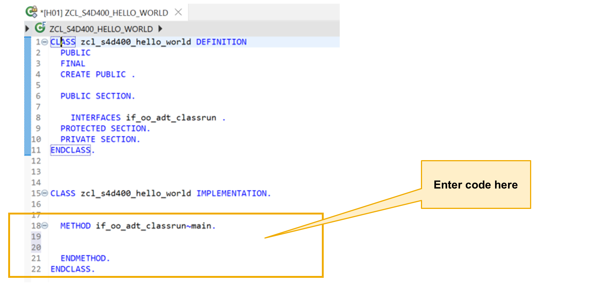
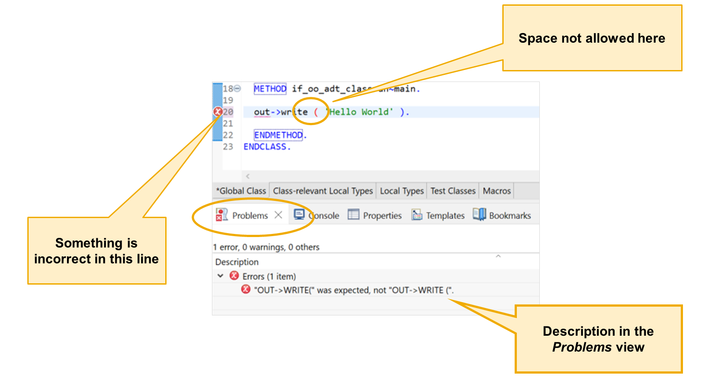
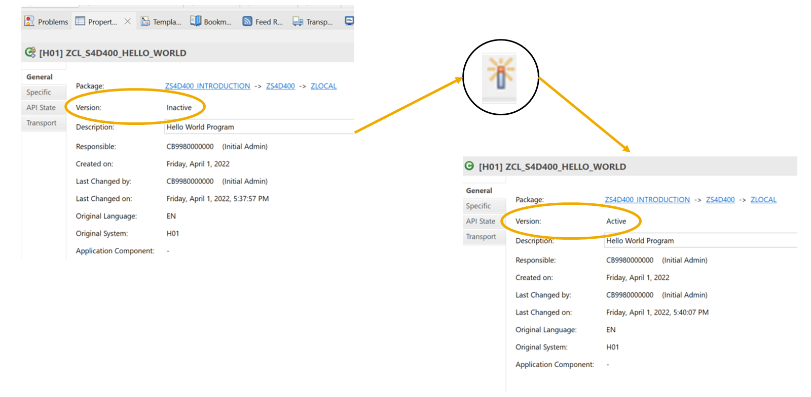
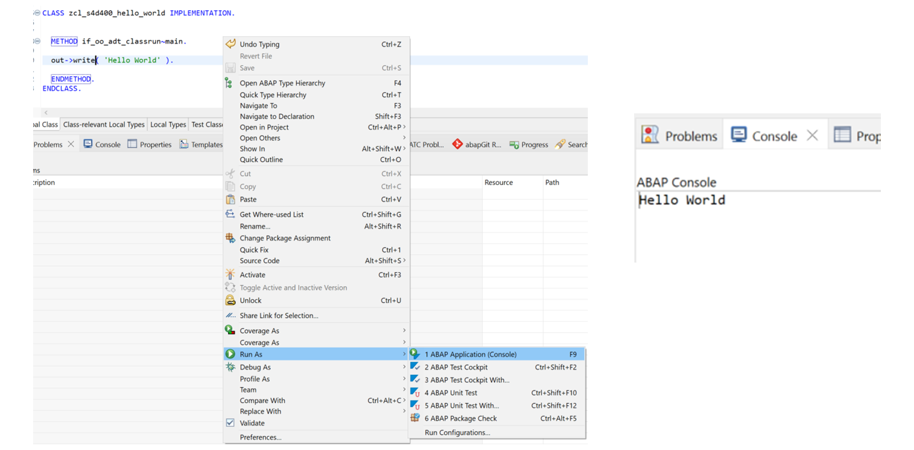

# 🌸 4 [DEVELOPING YOUR FIRST ABAP APPLICATION](https://learning.sap.com/learning-journeys/learn-the-basics-of-abap-programming-on-sap-btp/developing-your-first-abap_c89963e5-a6f6-414b-94cd-f505dd28d4f5)

> 🌺 Objectifs
>
> - [ ] Vous serez capable d'expliquer le langage ABAP à un niveau de base.

## 🌸 CREATE SIMPLE ABAP CODE IN THE **ABAP DEVELOPMENT TOOLS**

### CREATING A HELLO WORLD APP

La principale **user interface technology** que vous utiliserez en programmation ABAP moderne est **SAP Fiori**. Cependant, \***\*ABAP Development Tools** (ADT)\*\* fournit une console qui vous permet de créer des sorties rapidement et simplement dans les applications de test.

> #### 🍧 Note
>
> Pour plus d'informations sur **SAP Fiori**, consultez le parcours d'apprentissage « Apprentissage des bases de **SAP Fiori** » sur http://learning.sap.com.

1. Écrivez votre code ABAP dans une **Class**, puis choisissez **File** → **New** → **ABAP Class**.

2. Une boîte de dialogue s'affiche pour vous permettre de vérifier l'exactitude du projet.

3. Saisissez le nom du package que vous avez déjà créé.

4. Saisissez un nom pour votre **Class ZCL_S4H_100_HELLO_WORLD**, en veillant à commencer par Z ou Y. Ce nom peut comporter jusqu'à 30 caractères, dont les lettres de A à Z, les chiffres de 0 à 9 et le trait de soulignement.

5. Choisissez l'option **Add** pour ajouter une interface à une **Class**, dans notre exemple, `IF_OO_ADT_CLASSRUN` afin d'autoriser la sortie vers la console.

6. Utilisez le champ **Filter** pour limiter le nombre d'entrées dans la liste.

7. Double-cliquez sur l'interface `IF_OO_ADT_CLASSRUN`.

8. La nouvelle interface apparaît lorsque vous revenez à la boîte de dialogue **Class ABAP**.

9. Choisissez [Next].

10. Assignez ensuite la **Class** à une **Transport Request**.

11. Sous **Choose from Requests** dans lesquelles vous êtes impliqué, cochez la requête utilisée pour créer votre package.

12. Choisissez [Finish].

```
CLASS zcl_s4h_100_hello_world DEFINITION
  PUBLIC
  FINAL
  CREATE PUBLIC .

  PUBLIC SECTION.

    INTERFACES ``if_oo_adt_classrun`` .
  PROTECTED SECTION.
  PRIVATE SECTION.
ENDCLASS.


CLASS zcl_s4h_100_hello_world IMPLEMENTATION.


  METHOD ``if_oo_adt_classrun``~main.


  ENDMETHOD.
ENDCLASS.
```



> #### 🍧 Note
>
> L'interface `IF_OO_ADT_CLASSRUN` permet d'exécuter une classe dans **ABAP Development Tools** (ADT) à l'aide de la touche F9. Le système exécute alors le code entre METHOD ``if_oo_adt_classrun`~main`et`ENDMETHOD`. Ce bloc de code permet d'afficher des informations dans la `console ADT`.

_scr.png>)

Dans votre bloc de code, vous pouvez utiliser `out->write( )` pour afficher des informations dans la console. La ligne

```
CLASS zcl_s4h_100_hello_world DEFINITION
  PUBLIC
  FINAL
  CREATE PUBLIC .

  PUBLIC SECTION.

    INTERFACES ``if_oo_adt_classrun`` .
  PROTECTED SECTION.
  PRIVATE SECTION.
ENDCLASS.


CLASS zcl_s4h_100_hello_world IMPLEMENTATION.


  METHOD ``if_oo_adt_classrun``~main.

  out->write( 'Hello World' ).

  ENDMETHOD.
ENDCLASS.
```

Affiche « Hello World » dans la console.

Point crucial : vous n'avez pas besoin de savoir comment cela fonctionne à ce stade ; il vous suffit de saisir le code en vous assurant des points [Next]s :

- Il n'y a pas d'espace entre « write » et la parenthèse ouvrante.

- Il y a au moins un espace après la parenthèse ouvrante.

- Il y a au moins un espace avant la parenthèse fermante.

- Il y a un point à la fin de la ligne.



**ABAP Development Tools** vérifie votre code au fur et à mesure et signale les erreurs dans la marge gauche de l'éditeur par une croix blanche sur fond rouge.

Vous pouvez consulter les messages d'erreur correspondants dans la vue « Problèmes » sous l'éditeur. **ABAP Development Tools** affiche également le même message sous forme de pop-up lorsque vous passez la souris sur le symbole d'erreur dans l'éditeur.



Pour exécuter un objet ABAP, vous devez l'activer. L'activation vérifie la syntaxe, l'enregistre et génère une version d'exécution. En cas d'erreur de syntaxe, l'objet ne sera pas activé. Pour activer un objet, cliquez sur l'icône **Activate** dans la barre d'outils ou utilisez le raccourci clavier [Ctrl] + [F3]. Vous pouvez vérifier si un objet est actif ou non en consultant la vue **Properties**, généralement située dans l'onglet sous l'éditeur ABAP.



Pour exécuter la classe, appuyez sur la touche [F9] de votre clavier ou faites un clic droit dans l'éditeur, puis choisissez **Run as** → **ABAP Application (Console)** ». Le message « Hello World » s'affiche dans la console. Si la **Console view** n'est pas visible, choisissez **Window** → **Show View** → **Other...**, puis sélectionnez la **Console view**.

### USING THE ECLIPSE EDITOR

Voici quelques fonctions clés importantes lors de l’écriture de code dans l’éditeur ABAP.

| Button                          | Keyboard Command | Description                |
| ------------------------------- | ---------------- | -------------------------- |
|      | CTRL + S         | Save                       |
|     | CTRL + F2        | Check Syntax               |
|  | CTRL + F3        | Activate                   |
|  | F9               | ABAP Application (Console) |

## 🌸 CREATE A HELLO WORLD APPLICATION

### BUSINESS EXAMPLE

Vous êtes programmeur chez un client SAP et utilisez les **New**x outils de développement ABAP. Vous souhaitez créer une **ABAP Class** dans Eclipse, puis l'activer et l'exécuter en tant qu'application ABAP.

Nous allons affecter cette classe au package créé précédemment. Laissez la classe implémenter l'interface `IF_OO_ADT_CLASSRUN` afin de pouvoir l'utiliser comme programme principal pour une application console Eclipse.

> #### 🍧 Note
>
> Dans cet exercice, XX fait référence à votre numéro.

### STEPS

1. Dans le package créé précédemment, créez une nouvelle **ABAP Class** nommée `ZCL_XX_HELLO_WORLD`. Assurez-vous qu'elle utilise l'interface `IF_OO_ADT_CLASSRUN`. Lorsque vous êtes invité à affecter la classe à une requête de transport, utilisez la requête créée lors de l'exercice précédent.

   a. Choisissez **File** → **New** → **ABAP Class**.

   b. Saisissez votre package, `ZS4D100_XX`, où XX est votre numéro.

   c. Saisissez le nom, `ZCL_XX_HELLO_WORLD`, où XX est votre numéro, et saisissez une description pour votre classe.

   d. Choisissez [Add...] (à côté du groupe Interfaces).

   e. Saisissez le texte du filtre, `IF_OO_ADT_CLASSRUN`. Double-cliquez sur l'entrée correspondante dans la liste des résultats.

   f. Choisissez [Next].

   g. Sélectionnez **Choose from requests** dans lesquelles je suis impliqué et votre propre requête de transport.

   h. Choisissez [Finish].

2. Dans la méthode `if_oo_adt_classrun`~main( ), utilisez `out->write( )` pour afficher la phrase « Hello World ».

   a. Dans l'éditeur, entrez le code [Next] entre METHOD `if_oo_adt_classrun~main` et `ENDMETHOD` :

   ```
   out->write( | Hello World | ).
   ```

3. Activez et testez votre classe.

   a. Appuyez sur Activer (Ctrl-F3).

   b. Appuyez sur [F9] pour exécuter la classe.

4. Vérifiez le résultat dans la **Console view** d'Eclipse.

   a. Vérifiez la **Console view** qui aurait dû s'ouvrir sous la forme d'un nouvel onglet sous la vue de l'éditeur.

   b. Si la **Console view** n'est pas visible, ouvrez-la en choisissant Fenêtre → Afficher la vue → Autre. Double-cliquez sur Console dans la liste des résultats.

```
" Full Solution Code

CLASS zcl_s4d100_hello_world_sol DEFINITION PUBLIC FINAL CREATE PUBLIC.

PUBLIC SECTION.
  INTERFACES ``IF_OO_ADT_CLASSRUN``.
PROTECTED SECTION.
PRIVATE SECTION.
ENDCLASS.

CLASS zcl_s4d100_hello_world_sol IMPLEMENTATION.
  METHOD ``if_oo_adt_classrun``~main.
    out->write( | Hello World! | ).
  ENDMETHOD.

ENDCLASS.
```

### PRACTICE

[Exercices](<./assets/hands_on%20(4).pdf>)
