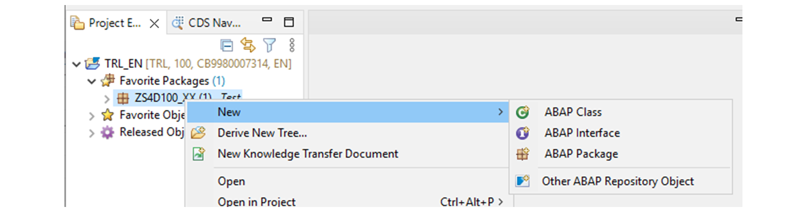
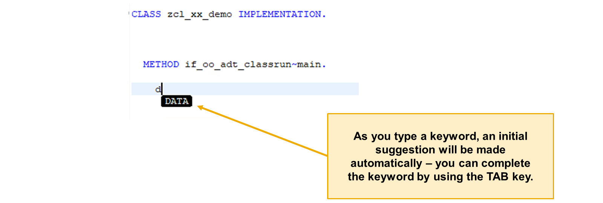
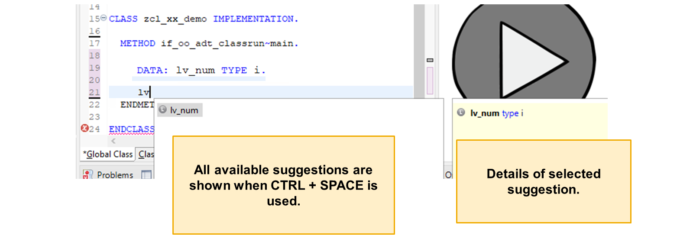
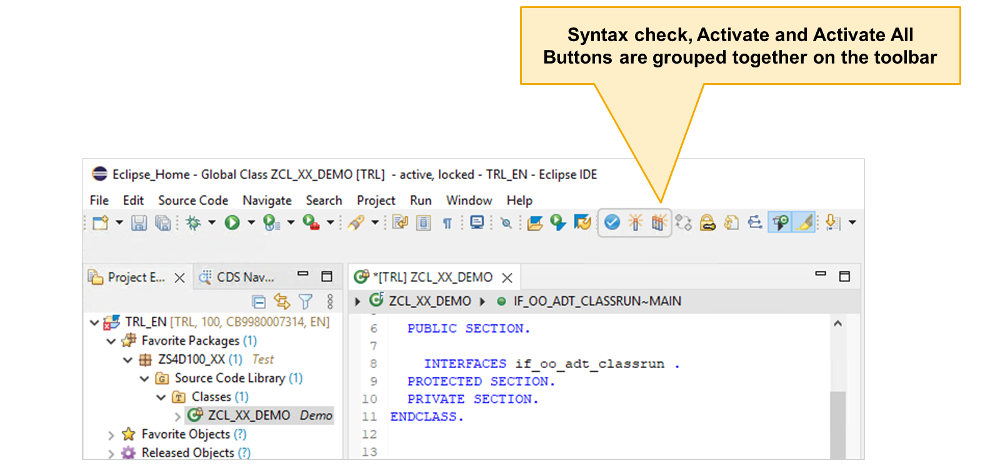
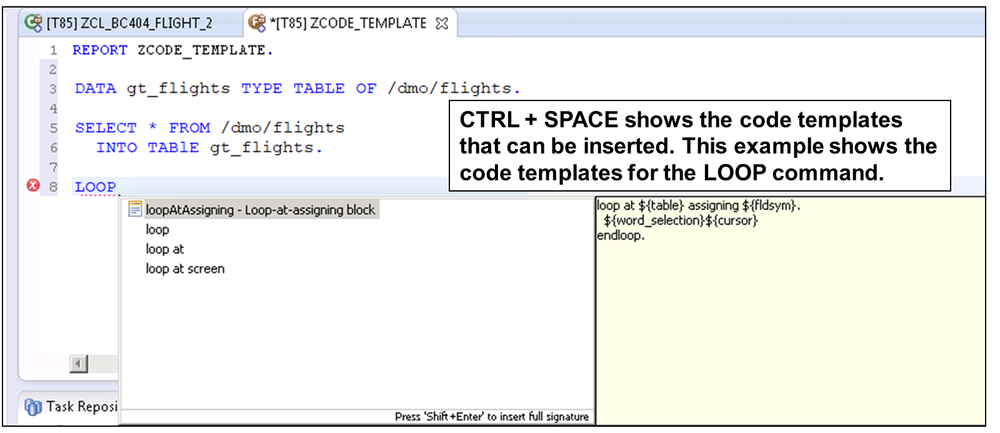
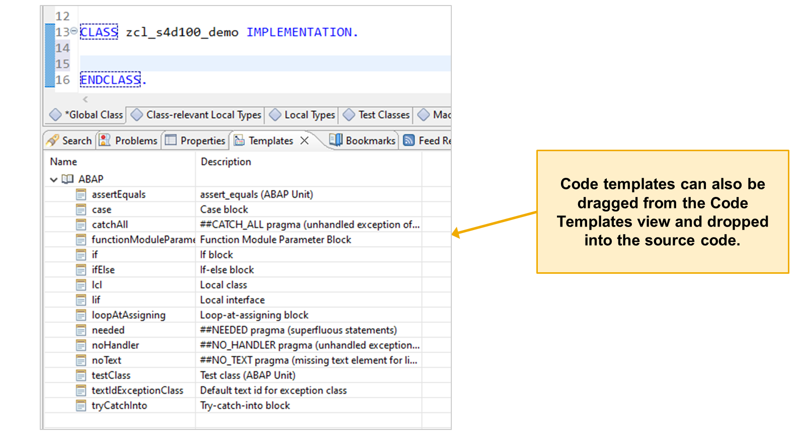
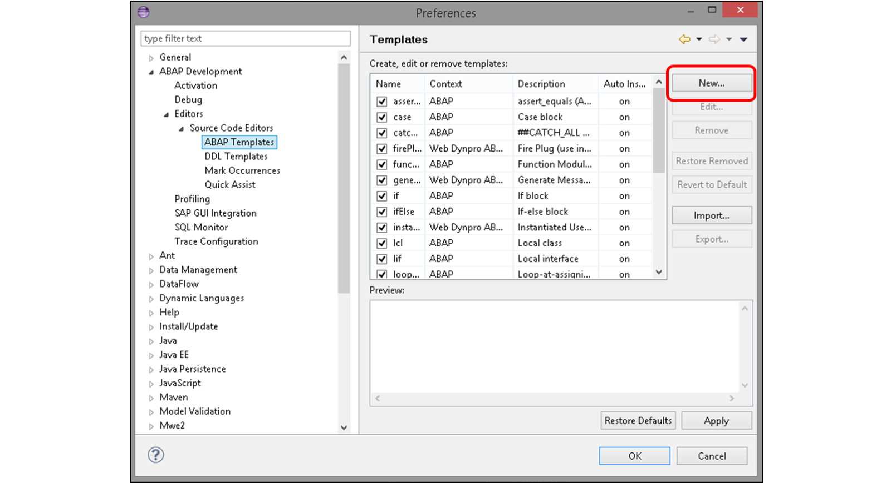

# 🌸 5 [EDITING A REPOSITORY OBJECT](https://learning.sap.com/learning-journeys/learn-the-basics-of-abap-programming-on-sap-btp/editing-a-repository-object_f260e947-98ef-4d32-a35c-2a1f0da075d2)

> 🌺 Objectifs
>
> - [ ] vous pourrez utiliser les utilitaires et modèles de complétion de code d'ABAP Development Tools.

## 🌸 REPOSITORY OBJECTS AND ABAP DEVELOPMENT TOOLS

### CREATING A REPOSITORY OBJECT

Certains **repository objects** peuvent contenir des sous-objets qui sont eux-mêmes des **repository objects**.

Les outils de développement ABAP vous permettent de créer et de modifier des **repository objects**.

Différents outils sont disponibles pour créer, modifier et afficher des **ABAP repository objects** dans **ABAP Development Tools (ADT)**.

### KEYWORD COMPLETION

La fonctionnalité de l'**ADT's keyword completion** vous permet de réduire le temps consacré à l'édition de code en proposant des **keywords** et des **identifiers** ABAP valides à insérer à n'importe quel endroit du code source. Pour utiliser la complétion par **keywords**, commencez par saisir les premiers caractères d'un **keyword** ou d'un **identifier** ; les suggestions apparaissent automatiquement.

Si la suggestion initiale est correcte, appuyez sur la touche [TAB] pour l'accepter. Pour afficher plus d'options, appuyez sur [Ctrl] + [Espace] sur votre clavier, puis sélectionnez le **keyword** ou l'**identifier** ABAP souhaité dans la liste des suggestions. Notez que la complétion par **ABAP keywords** peut être désactivée dans les Préférences, mais elle est activée par défaut.

### CODE COMPLETION

Le raccourci clavier [Ctrl] + [Espace] ne sert pas uniquement à la saisie semi-automatique par **keywords**. Il permet également d'accéder aux suggestions de saisie semi-automatique pour les éléments suivants :

- **Data objects** (Objets de données) déclarés dans l'application

- **Méthodes**, **attributs** et **events**

- **Noms de classe**

Lorsque vous appuyez sur [Ctrl] + [Espace], une liste complète des objets correspondant à ce que vous avez déjà saisi apparaît. À mesure que vous continuez à saisir, la liste se réduit.

#### 💮 **Pour insérer le nom d'une variable ou d'une méthode dans votre code** :

Sélectionnez l'entrée et appuyez sur [Entrée] ou double-cliquez sur le nom.

#### 💮 **Pour les méthodes** :

Il est souvent préférable d'insérer non seulement le nom, mais aussi l'interface complète ou la signature. Pour ce faire, sélectionnez la méthode et appuyez sur [Maj] + [Entrée].

### SYNTAX CHECKING AND OBJECT ACTIVATION

Il existe deux fonctions de base que tous les développeurs doivent utiliser pour développer des applications ABAP :

- la vérification de la syntaxe. [Ctrl] + [F2]

- l'activation des objets. [Ctrl] + [F3]

### STATIC CODE TEMPLATES

Les **ABAP code templates** sont des descriptions structurées de **coding patterns** utilisables dans le **code source ABAP**. Leur utilisation permet aux développeurs de réduire le temps consacré aux tâches d'édition courantes et d'améliorer la cohérence.

Les **ABAP code templates** vont au-delà des simples extraits de code. Ils sont intégrés à la fonctionnalité de **saisie semi-automatique d'ADT** et peuvent utiliser des **variables prédéfinies** et personnalisées. ADT propose plusieurs **predefined code templates**, mais vous pouvez facilement créer le vôtre en modifiant un modèle existant ou en partant de zéro. Les templates peuvent être insérés dans l'éditeur de **code source ABAP** à l'aide de la même commande clavier : [Ctrl] + [Espace], pour la saisie semi-automatique par **keyword** et le code.

Bien que plusieurs variables standard puissent être utilisées, comme indiqué dans le tableau ci-dessous, le principal avantage des **code templates** est la possibilité de définir vos propres espaces réservés. Lorsque vous insérez le modèle dans votre code, vous fournissez des valeurs pour remplacer les espaces réservés. Si un espace réservé est utilisé plusieurs fois, sa valeur remplace toutes ses occurrences. Cela permet d'éviter les erreurs de frappe ou les erreurs dues à l'oubli de renommer une variable à un emplacement précis dans un bloc de code.

Vous pouvez également glisser-déposer des **code templates** dans votre code depuis la **templates view**.

Vous pouvez afficher, modifier ou créer de nouveaux **ABAP code templates** dans les **ADT Preferences**.

Pour créer un **placeholder** (espace réservé) dans un modèle, utilisez le signe `dollar` suivi du nom de l'espace réservé entre `accolades`. Notez que l'éditeur de **code templates** ne propose pas de vérification de syntaxe.
