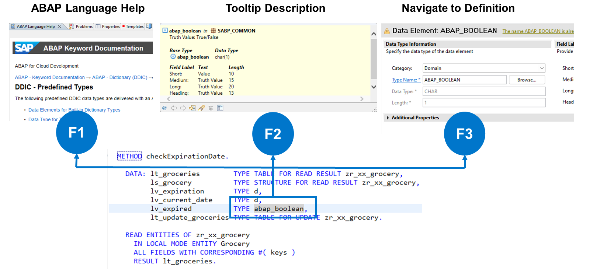
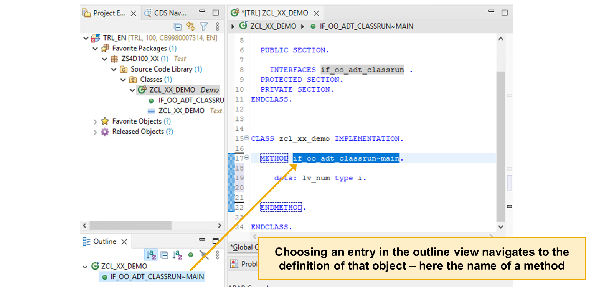

# 🌸 6 [NAVIGATING IN ECLIPSE](https://learning.sap.com/learning-journeys/learn-the-basics-of-abap-programming-on-sap-btp/navigating-in-eclipse_db09fa13-46d3-46dc-9c70-e9d9e11ce3f9)

> 🌺 Objectifs
>
> - [ ] Vous pourrez naviguer dans les éditeurs de code source et utiliser la fonction de plan.

## 🌸 NAVIGATING IN ECLIPSE

### NAVIGATING IN ECLIPSE

Les **ABAP Development Tools** offrent plusieurs moyens d'accéder rapidement aux objets de développement et à leurs éléments. Le **source code editor** vous permet de naviguer rapidement de la définition d'une méthode, de ses paramètres et exceptions à son implémentation.

### KEY FUNCTIONS

Lorsque vous travaillez avec du code ABAP, certaines touches de fonction des outils de développement ABAP vous seront utiles. Ces touches sont les suivantes :

- [F1] : La touche [F1] affiche l'aide en langage ABAP de l'instruction en cours. Une instruction est le nom d'une commande en ABAP.

- [F2] : La touche [F2] affiche des informations sur l'objet sur lequel le curseur est placé.

- [F3] : La touche [F3] permet d'accéder à la définition de l'objet sur lequel le curseur est placé. Vous pouvez ensuite revenir à l'objet d'origine en utilisant la combinaison de touches [Alt] + [Flèche gauche].

### QUICK VIEW

Lorsque vous ouvrez un objet de développement dans l'**source code editor**, l'**editor-specific Outline view** s'ouvre également par défaut.

Cette vue affiche les éléments structurels de l'objet, tels que :

- les **attributs**,

- les **types de données**,

- les **méthodes**.

Vous pouvez utiliser les fonctions de filtrage de la vue pour déterminer les éléments **visibles** et **masqués**.

L'**outline view** est synchronisée avec le contenu de l'**source code editor**. Ainsi, lorsque vous sélectionnez un élément dans l'**outline view**, vous pouvez accéder rapidement à la position correspondante dans le code source ABAP. Inversement, si vous sélectionnez un élément dans le **source code editor**, la sélection est mise en surbrillance dans l'**outline view**.

Notez que l'**outline view** est synchronisée avec le contenu de l'éditeur, même si ce dernier n'a pas encore été enregistré.

### NAVIGATION USING THE OUTLINE VIEW

Lorsque vous ouvrez un objet de développement depuis la **Source Library** dans le **source code editor**, l'**Outline view** de cet objet s'ouvre également. Cette vue présente la structure interne d'une classe, d'une interface ou d'un programme. Elle répertorie des éléments tels que les attributs, les types de données ou les méthodes des classes ABAP.

1. Ouvrez un objet de développement.

2. Dans l'**Outline view**, sélectionnez un élément pour accéder à l'emplacement correspondant dans le **source code editor**.

3. Vous pouvez utiliser les boutons de la barre d'outils pour masquer les composants non publics des classes ou les composants qui ne sont pas des méthodes.
