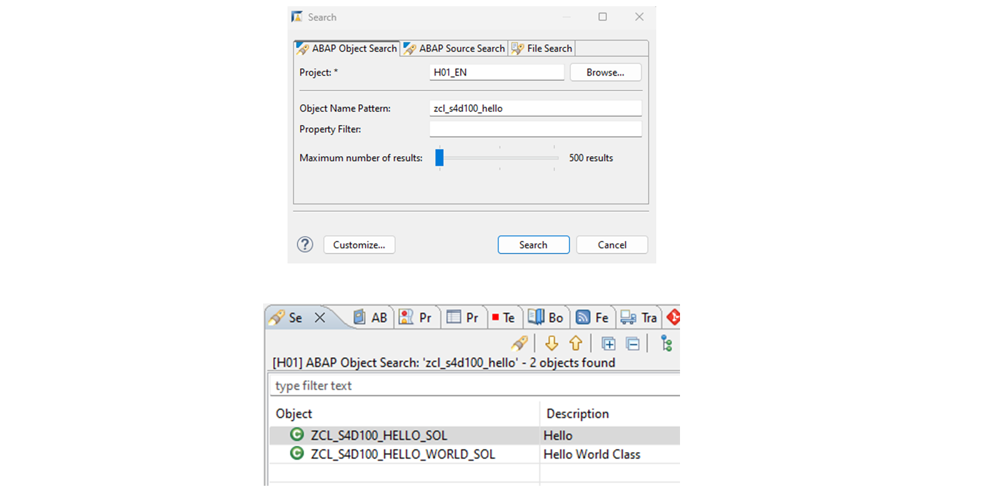
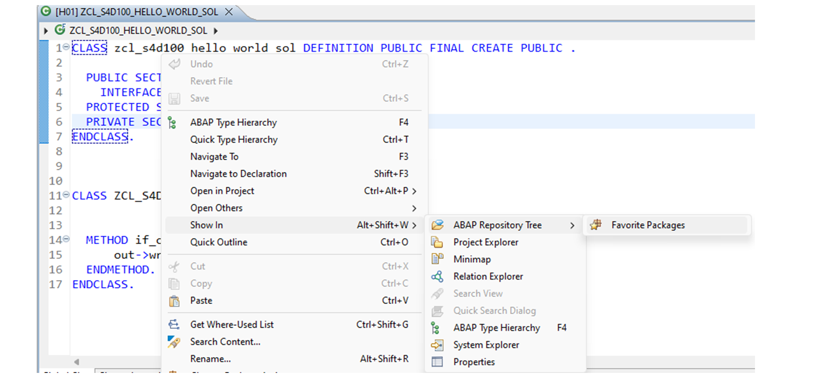

# 🌸 7 [SEARCHING IN ECLIPSE](https://learning.sap.com/learning-journeys/learn-the-basics-of-abap-programming-on-sap-btp/searching-in-eclipse_b9adbc8a-bb51-4c7e-9e23-15abf0099684)

> 🌺 Objectifs
>
> - [ ] Vous pourrez **Search** et parcourir des objets dans les outils de développement ABAP.

## 🌸 TO SEARCH FOR OBJECTS

### STEPS

1. Choisissez **Search** → **Search...**

   Vous pouvez également utiliser [Ctrl] + [H].

2. Dans le champ **Object Name** de l'onglet Recherche d'objet ABAP, saisissez le **Object Name** à rechercher.

3. Vous pouvez limiter la portée de la recherche en sélectionnant le bouton radio **Workspace** ou **ABAP Project**.

4. Vous pouvez également limiter la recherche en cochant la case **Restrict Search to Favorite Packages**.

5. Choisissez **Search**.

   Les **repository objects** correspondant à la portée de la recherche s'affichent dans la **Search view**. Le résultat est regroupé par packages ABAP.

## 🌸 TO SEARCH AND OPEN OBJECTS

### STEPS

1. Choisissez Ouvrir l'objet de développement ABAP (ou appuyez sur Ctrl + Maj + A sur votre clavier).

   

2. Saisissez la chaîne de recherche et/ou les critères de filtrage.

3. Cliquez sur OK.

   

## 🌸 TO FIND OPEN ITEM IN PROJECT EXPLORER

### STEPS

Faites un clic droit dans l'éditeur.

Choisissez **Show In** → **ABAP Repository Tree**.

## 🌸 THE WHERE-USED FEATURE

La **fonctionnalité Where-Used** indique où sont utilisés des objets de développement spécifiques, clarifiant ainsi leurs dépendances. Vous pouvez utiliser la **fonctionnalité Where-Used** avec les entités suivantes :

- Les objets de développement affichés au niveau principal de la **Project Explorer view's** incluent les classes, les interfaces, les tables de base de données, les classes de messages, etc.

- Les sous-objets tels que les composants d'une classe, les champs d'une table, les messages spécifiques, etc.

- Les autres identifiants incluent les variables locales, les paramètres, les macros, etc.

Vous pouvez lancer la **fonctionnalité Where-Used** depuis la **Project Explorer view's**, l'**Outline view** ou le **source code editor** en sélectionnant **Get Where-used List** dans le menu contextuel. Vous pouvez également sélectionner l'icône **ABAP Where-used List** dans la barre d'outils ou utiliser le raccourci clavier [Ctrl] + [Maj] + [G].

## 🌸 NAVIGATE USING THE WHERE-USED FEATURE

Vous pouvez lancer la fonction **Where-used** depuis l'Explorateur de projets, l'**Outline view** ou le **source code editor**. La fonction peut être déclenchée sur des objets principaux tels que des classes ABAP, des interfaces ABAP, des tables de base de données, et sur des sous-objets tels que des méthodes, des attributs et des messages.

Pour ce faire, procédez comme suit :

1. Cliquez sur le bouton **Get Where-used List** dans la barre d'outils.
   Vous pouvez également ouvrir le menu contextuel de l'objet qui vous intéresse et choisir **Get Where-used List**. Vous pouvez également utiliser les touches [Ctrl] + [Maj] + [G].
   La vue Recherche s'affiche et affiche les emplacements où l'objet ou le sous-objet est utilisé.
