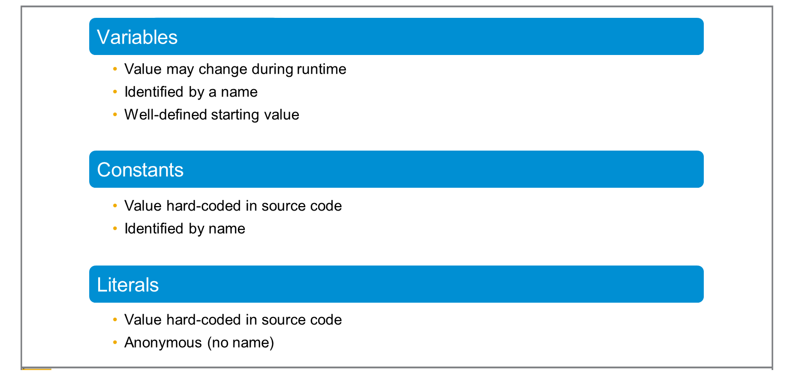
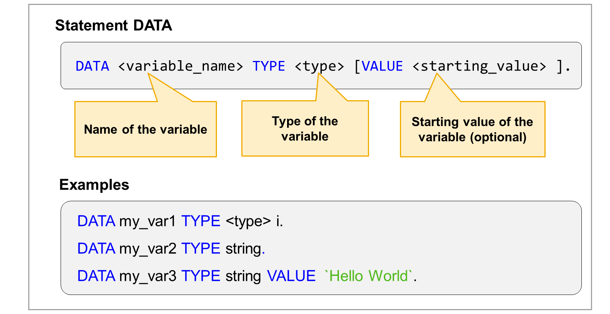
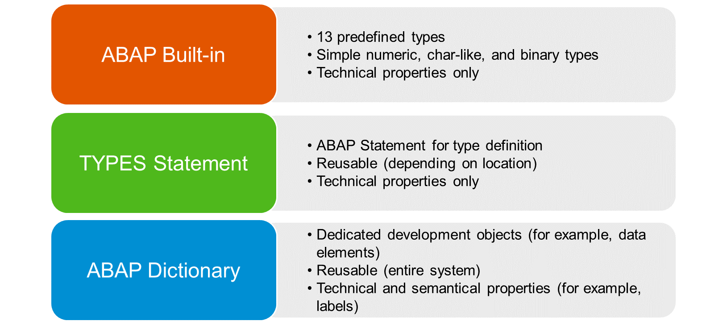
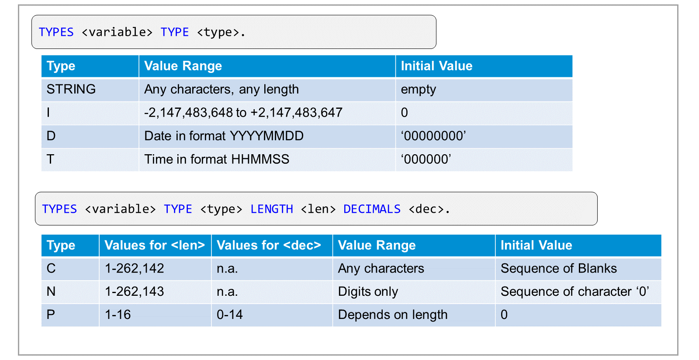
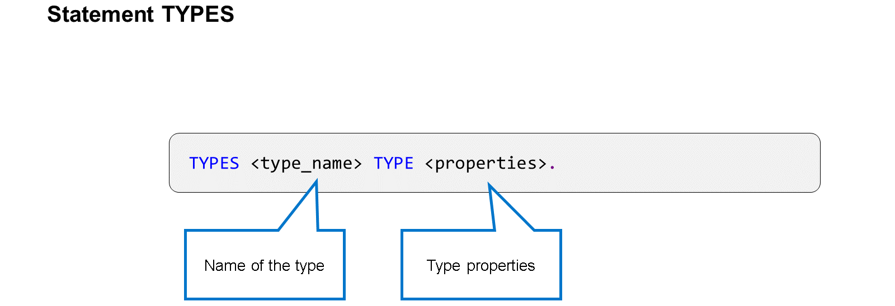
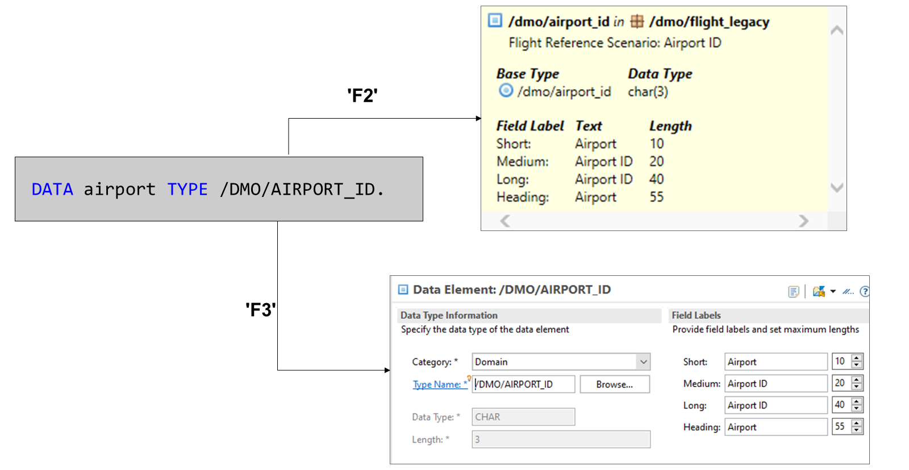
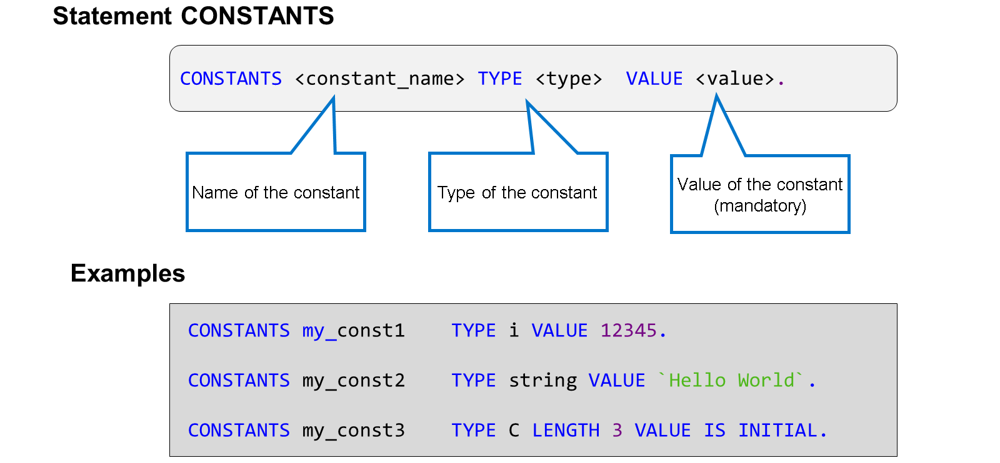
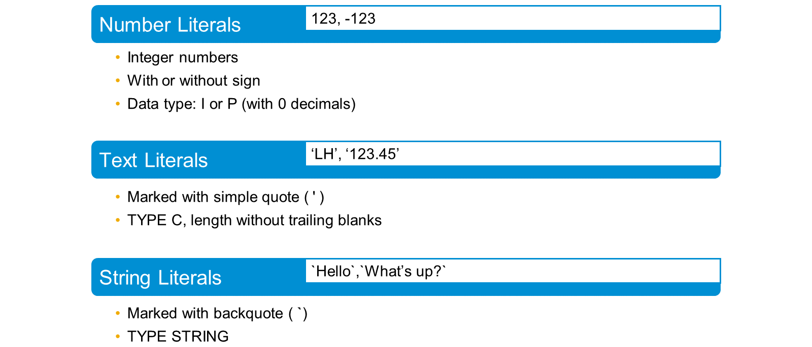
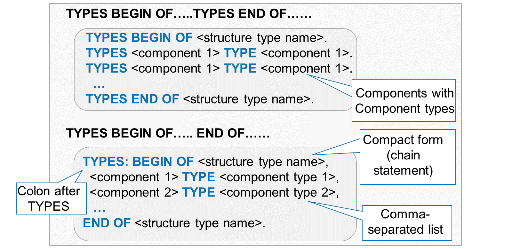
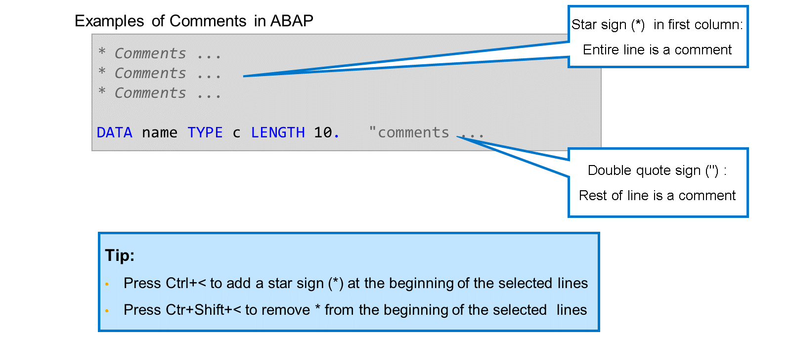

# 🌸 1 [INTRODUCING ABAP SYNTAXE](https://learning.sap.com/learning-journeys/learn-the-basics-of-abap-programming-on-sap-btp/introducing-abap-syntax_b815682e-9a5e-4372-a021-66ea71208746)

> 🌺 Objectifs
>
> - [ ] Expliquer les bases de la syntaxe ABAP.
>
> - [ ] Définir les types de données, les variables, les constantes et les littéraux, ainsi que les instructions chaînées.

## 🌸 THE BASICS OF ABAP SYNTAX

### OVERVIEW

À la fin de ce module, le programmeur débutant travaillera avec les bases de la syntaxe ABAP, telles que les types de données, les variables, les constantes et les littéraux, les **instructions** chaînées, l'ajout de commentaires au code source, effectuer des calculs arithmétiques, utiliser les informations système, déboguer un programme, créer une liste ABAP et traiter des chaînes de caractères à l'aide du langage ABAP.

### BASIC FEATURES OF THE ABAP LANGUAGE

Le langage ABAP est composé de phrases individuelles (**instructions**). Voici les points importants à retenir concernant les **instructions** ABAP :

- Le code ABAP est composé d'**instructions** individuelles.

- Le premier mot d'une instruction est appelé **ABAP keyword**.

- Chaque **instruction** se termine par un `point`.

- Une `espace` doit séparer deux mots.

- Les **instructions** peuvent être `indentées` pour améliorer la lisibilité du code.

- Peut contenir des ajouts et des opérandes (selon le **ABAP keyword** utilisé).

- Peut s'étendre sur plusieurs lignes.

- Les **ABAP keywords**, les ajouts et les opérandes peuvent être en majuscules ou en minuscules.

- Le système d'exécution ABAP ne fait pas de distinction entre les majuscules et les minuscules. Il est courant d'écrire les **ABAP keywords** et leurs ajouts en majuscules et les opérandes en minuscules.

## 🌸 DATA OBJECTS IN ABAP

### VARIABLES, CONSTANTS AND LITERALS



En code ABAP, un objet de données représente une section réservée de la mémoire du programme. ABAP connaît trois types d'objets de données : les variables, les constantes et les littéraux.

#### 💮 **Variables** :

Une variable est un objet de données dont le contenu peut changer pendant l'exécution. Une variable est identifiée par un nom. Ce nom permet également d'accéder à l'objet de données lors de l'exécution. La valeur initiale d'une variable ABAP est bien définie.

#### 💮 **Constantes** :

Les constantes sont comme des variables. Cependant, contrairement aux variables, leur valeur est codée en dur dans le code source et ne doit pas changer pendant l'exécution. Comme les variables, les constantes ont un nom qui permet de les réutiliser.

#### 💮 **Littéraux** :

La valeur des littéraux est également codée en dur dans le code source. Contrairement aux constantes, les littéraux n'ont pas de nom. De ce fait, ils ne peuvent pas être réutilisés. Utilisez les littéraux uniquement pour spécifier les valeurs des constantes et les valeurs initiales des variables.

Les objets de données ABAP sont toujours typés : chaque objet de données est basé sur un type de données qui détermine les informations qu'il peut contenir. Le type de données d'un objet de données ABAP reste le même tout au long de l'exécution du programme.

### DECLARATIONS OF VARIABLES



En code ABAP, une variable est déclarée avec le mot-clé `DATA`.

Une instruction `DATA` se compose des éléments suivants :

#### 💮 **DATA** :

Le mot-clé `DATA` est suivi du nom de la variable. Ce nom peut comporter jusqu'à 30 caractères. Il peut contenir les lettres de A à Z, les chiffres de 0 à 9 et le trait de soulignement. Le nom doit commencer par une lettre ou un trait de soulignement.

#### 💮 **TYPE** :

Le type de la variable est spécifié après l'ajout `TYPE`. Dans l'exemple, les types intégrés I (pour les nombres entiers) et `string` (chaîne de caractères de longueur variable) sont utilisés.

#### 💮 **VALUE** :

L'ajout `VALUE` est facultatif et permet de spécifier une valeur initiale pour la variable. Si `VALUE` est manquant, la variable est créée avec une valeur initiale qui dépend de son type technique.

### USE OF DATA TYPES



ABAP propose les sources de types de données suivantes :

#### 💮 **ABAP intégré (types ABAP prédéfinis)** :

ABAP propose un ensemble de 13 types de données prédéfinis pour les objets de données numériques, alphanumériques et binaires simples.

#### 💮 **Instructions TYPES** :

L'instruction `TYPES` vous permet de définir des types de données prédéfinis et de les réutiliser à différents endroits, selon l'emplacement de la définition.

#### 💮 **Dictionnaire ABAP** :

Le dictionnaire ABAP fait partie du référentiel ABAP. Il gère, entre autres, les types de données globaux disponibles dans tout le système. Les types du dictionnaire ABAP définissent non seulement des propriétés techniques, mais ajoutent également des informations sémantiques, par exemple des étiquettes. Les types du dictionnaire ABAP sont particulièrement utiles pour l'implémentation d'interfaces utilisateur.

### ABAP BUILT-IN (PREDEFINED ABAP TYPES)



Certains types ABAP standards importants (types de données intégrés) sont répertoriés dans la figure. Les types ABAP sont classés en types de données complets et incomplets. Les types de données complets contiennent déjà des spécifications de longueur fixe spécifiques au type. Les types de données incomplets ont une longueur par défaut, mais permettent d'en spécifier une autre. Pour le type P, vous pouvez également spécifier un nombre de décimales.

### COMPLETE ABAP TYPES

#### 💮 **TYPE CHAÎNE** :

Un champ de type chaîne est un champ de type caractère de longueur variable. Le système d'exécution ABAP alloue et libère de la mémoire pour optimiser la gestion des variables de type chaîne. Vous ne pouvez pas influencer directement ce comportement. La longueur maximale d'une chaîne est définie par les paramètres définis par l'administrateur système. Cependant, en pratique, on parle de chaînes de longueur illimitée.

#### 💮 **TYPE I** :

Un champ de type I est un champ numérique contenant un nombre entier. Le système lui alloue 4 octets (32 bits), ce qui autorise des valeurs comprises entre -2^31 et +2^31.

#### 💮 **TYPE D** :

Un champ de type `D` représente une date. En ABAP, la date est toujours au format **AAAAMMJJ** (sans séparateurs). Le système convertit ce format en fonction des paramètres régionaux avant que la valeur ne soit affichée dans l'interface utilisateur. De même, lorsque l'utilisateur saisit une date, le système la convertit au format ABAP avant de commencer son traitement.

#### 💮 **TYPE T** :

Un champ de type `T` représente une heure. En ABAP, le format est **HHMMSS** (sans séparateurs au format 24 heures). Si les paramètres régionaux actuels utilisent un format 12 heures, le système convertit automatiquement les valeurs.

### INCOMPLETE ABAP TYPES

#### 💮 **TYPE C** :

Un champ de type `C` est un champ de type caractère d'une longueur spécifique. Vous spécifiez la longueur en caractères ; le système d'exécution attribue ensuite le double du nombre d'octets pour l'adapter. Ce type est utilisé lorsqu'une longueur fixe est importante.

#### 💮 **TYPE N** :

Un champ de type `N` est un champ de type caractère d'une longueur spécifique qui ne contient que des chiffres. Ce champ doit contenir une séquence de chiffres que vous ne souhaitez pas considérer comme un nombre et avec laquelle effectuer des calculs ; par exemple, il peut s'agir d'un matricule ou d'un centre de coûts.

#### 💮 **TYPE P** :

Un champ de type `P` (`P` pour « packed number ») est un champ qui contient une valeur numérique avec un nombre spécifié de chiffres et une décimale. Utilisez ce type pour les nombres avec décimale ou lorsque la plage de valeurs de type I n'est pas suffisante.

### USE OF LOCAL TYPES



### EXAMPLE

```abap
TYPES my_type TYPE p LENGTH 3 DECIMALS 2.
DATA my_var TYPE my_type.
```

Au lieu d'utiliser directement les types intégrés dans l'instruction `DATA`, vous pouvez d'abord définir le type à l'aide de l'instruction `TYPES`. Vous pourrez ensuite utiliser le type dans une instruction `DATA` après l'ajout de `TYPE`.

### USE OF GLOBAL TYPES - ABAP DICTIONARY



Dans un système SAP, il existe des milliers d'entités métier, telles que les codes pays, les usines, les numéros de matériel, les exercices, les centres de coûts, etc. La définition de ces entités dans chaque programme serait techniquement possible grâce aux types ABAP intégrés que vous venez de voir. Cependant, cette opération serait extrêmement laborieuse et sujette aux erreurs. SAP propose plutôt le dictionnaire ABAP, qui centralise les types de données importants et permet de créer des tables de base de données.

Dans le dictionnaire ABAP, les entités métier sont décrites par des éléments de données. Dans l'exemple de variable, la variable « aéroport » est typée avec l'élément de données /DMO/AIRPORT_ID.

Lorsque vous appuyez sur la touche F2 pour afficher les détails du type de données, vous constatez que ce type est techniquement un caractère de longueur 3. De plus, l'élément de données fournit la description « Scénario de référence de vol : ID d'aéroport » et les quatre libellés de champ de longueur différente.

Lorsque vous appuyez sur la touche F3 pour accéder à la définition du type, une nouvelle vue s'ouvre avec l'éditeur d'éléments de données.

### CONSTANTS & LITERALS

#### 💮 **Declaration of Constants** :



Une constante est un objet de données dont la valeur est codée en dur et ne doit pas être modifiée pendant l'exécution. Tout accès en écriture à une constante entraînera une erreur de syntaxe.

En ABAP, une constante est déclarée à l'aide du mot-clé `CONSTANTS`. Une instruction `CONSTANT` est composée des mêmes éléments qu'une instruction DATA. La seule différence réside dans l'ajout obligatoire de `VALUE`.

Vous pouvez utiliser l'ajout de `VALUE` sous la forme spéciale `VALUE IS INITIAL` si la valeur de la constante doit être la valeur initiale spécifique au type. Les valeurs initiales sont généralement zéro pour les types numériques et un espace pour les types caractères. Il n'existe pas de valeurs nulles en ABAP.

#### 💮 **Declaration of Literals** :



Les littéraux sont des objets de données anonymes dont la valeur est codée en dur. Ils sont souvent utilisés pour définir des valeurs non initiales pour les constantes et des valeurs de départ non initiales pour les variables.

Techniquement, vous pouvez utiliser des littéraux n'importe où dans votre code. Pour des raisons de lisibilité et de maintenabilité, il est recommandé de définir et d'utiliser des constantes.

ABAP propose trois types de littéraux :

- Les littéraux numériques sont des nombres entiers avec ou sans signe. Les littéraux numériques sont généralement de type I. Si la valeur est trop grande pour ce type de données, le type p est utilisé avec une longueur suffisante et sans décimale.

- Les littéraux texte sont des types de caractères entre guillemets simples (').

- Les littéraux de chaîne sont de type STRING et entre guillemets inverses (`). Ils doivent être utilisés pour fournir des valeurs aux objets de données de type chaîne.

### CHAINED STATEMENTS



Vous pouvez également définir des types structurés en code ABAP à l'aide de l'instruction `TYPES`. La définition de la structure commence par l'instruction

```
TYPES BEGIN OF <nom du type de structure>
```

et se termine par

```
TYPES END OF <nom du type de structure>.
```

Entre-temps, vous nommez chaque composant et spécifiez son type dans une instruction `TYPES` supplémentaire.

Une forme compacte utilise le mot-clé `TYPES` une seule fois, suivi de deux points ( : ). L'ajout `BEGIN OF`, l'ajout `END OF` et les définitions de composants intermédiaires sont ensuite séparés par des virgules.

C'est ce qu'on appelle une instruction en chaîne.

> #### 🍧 Note
>
> Par le passé, les instructions en chaîne étaient très utilisées en ABAP. Aujourd'hui, elles ne sont recommandées que pour combiner des instructions étroitement liées.

### COMMENTS IN ABAP



Un commentaire est une explication ajoutée à un programme pour faciliter la compréhension du code. Un commentaire est un fragment de code source ignoré par le compilateur ou l'interpréteur.

En ABAP, il existe deux façons de définir un fragment de code source comme un commentaire :

- Le signe étoile (\*) dans la première colonne identifie la ligne entière comme un commentaire.

- Les guillemets doubles (") identifient le reste de la ligne, c'est-à-dire le code à droite, comme un commentaire.
